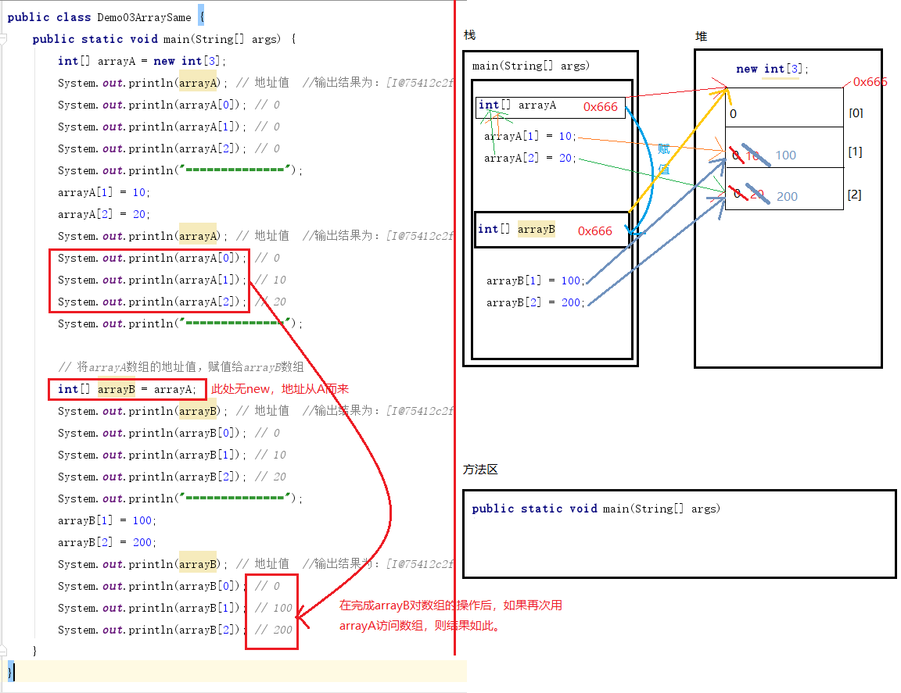
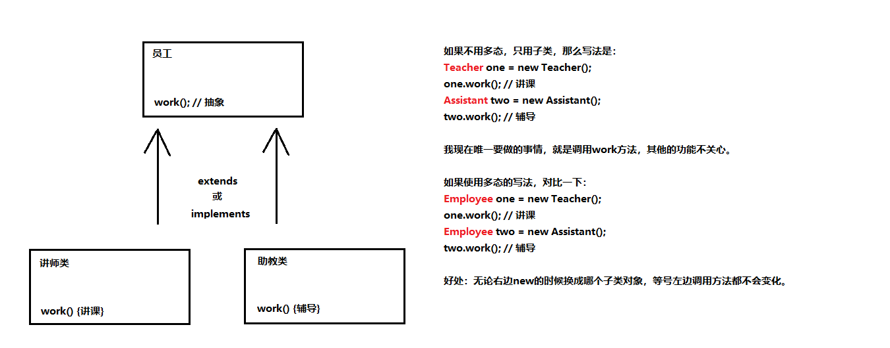
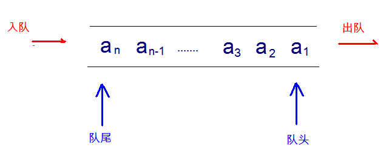
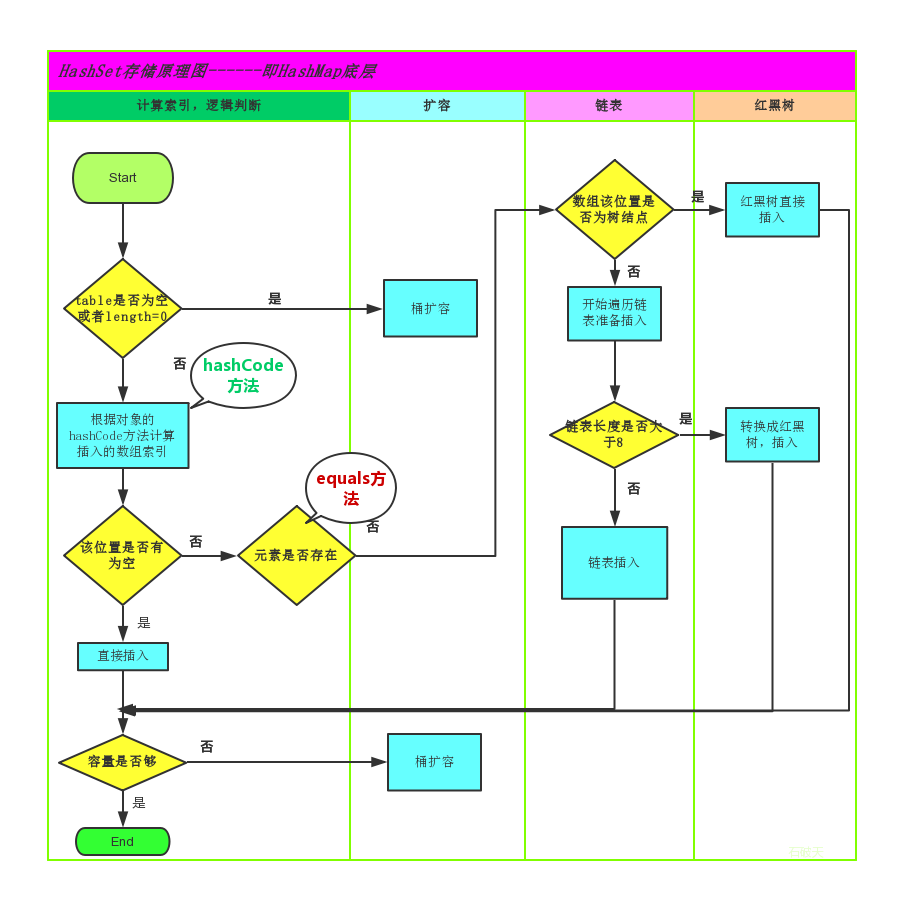
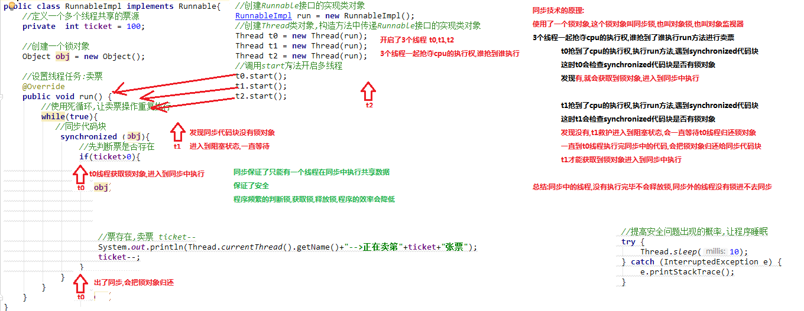
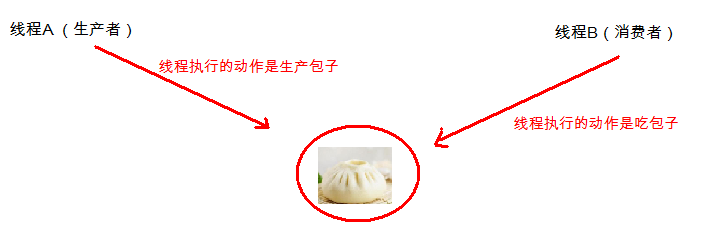
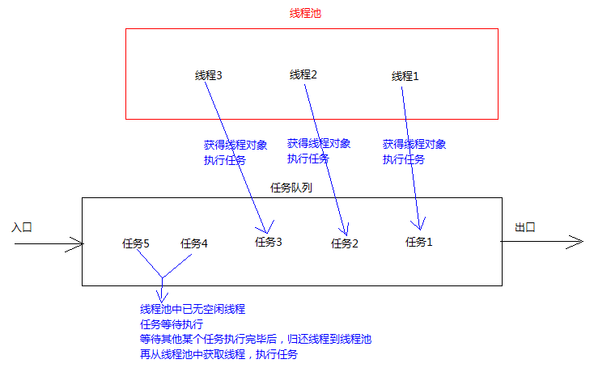
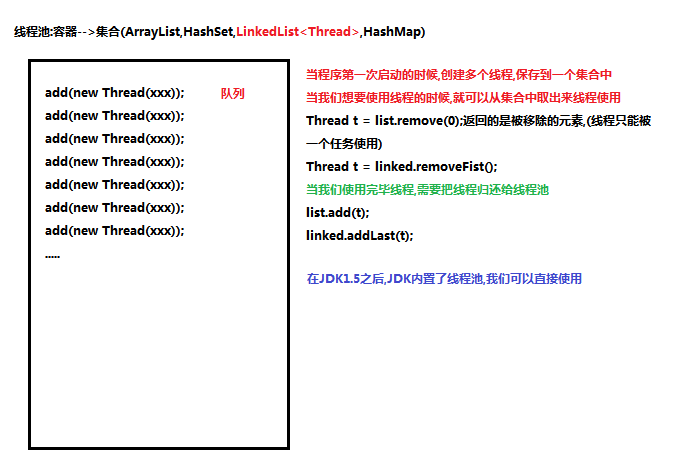
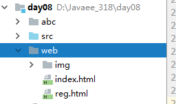

# [Java学习笔记]()  
自20200516始  


**目录**

[TOC]


## Java基础

### 01-Java语言入门

#### 01-Java基础语法

##### day01-前言、入门程序、常量、变量

// 20200516  win10+IDEA+Typora

###### 01-Java语言发展史

1995年Sun公司发布Java1.0版本
1997年发布Java 1.1版本
1998年发布Java 1.2版本
2000年发布Java 1.3版本
2002年发布Java 1.4版本
2004年发布Java 5版本（重大版本）
2006年发布Java 6版本
2009年Oracle甲骨文公司收购Sun公司，并于2011发布Java 7版本
2014年发布Java 8版本（重大版本）
2017年发布Java 9版本
2018年发布Java 10版本

###### 02-计算机进制转换

十进制数据转为二进制数据：除2取余、逆序排列

二进制数据转为十进制数据：使用8421编码的方式

###### 03-计算机存储单元

字节：Byte，计算机中最小的存储单元。计算机存储任何数据都是以字节的形式存储。

8个bit（二进制位）0000-0000表示1个字节，写成1 byte或1 B。

- 8 bit = 1 B
- 1024 B = 1 KB
- 1024 KB = 1 MB
- 1024 MB = 1 GB
- 1024 GB = 1 TB

###### 04-命令提示符-基本结束

MS-DOS(Microsoft Disk Operating System)，集成到win10中叫做命令提示符（cmd）

win+R启动，输入cmd即可

###### 05-命令提示符-常用命令

注：win10下，大小写字母不区分

| 命令             | 操作符号    |
| :----------------: | :-----------: |
| 盘符切换命令     | 盘符名:     |
| 查看当前文件夹   | dir         |
| 进入文件夹命令   | cd 文件夹名(可以多级文件名) |
| 退出文件夹命令   | cd ..       |
| 退出到磁盘跟目录 | cd \        |
| 清屏             | cls         |
| 退出 | exit |

###### 06-Java语言的跨平台性

- JVM(Java Virtual Machine)：Java虚拟机，是java程序的运行环境。
- 跨平台：代码一次编写，处处运行，该特性由JVM实现，程序在JVM上运行，JVM运行在操作系统上。

###### 07-JDK、JRE与JVM

- JRE(Java Runtime Environment)：是Java程序的运行时环境，包含JVM和运行时所需的核心类库。
- JDK(Java Development Kit)：是java程序开发工具包，包含JRE和开发人员使用的工具。
- 三者关系：JDK>JRE>JVM
- JDK=JRE+编译器等开发工具，JRE=运行类库+JVM。

###### 08-JDK的下载与安装

去Oracle观网下载对应系统的JDK，路径最好不要有中文和空格，以免出现乱码和编译错误。

###### 09-环境变量配置

以win10为例，在系统-环境变量中设置，在系统变量中新建JAVA_HOME变量，并将值设为jdk安装位置，然后在Path中添加新的值，以便将java命令添加到路径中。

###### 10-HelloWorld程序的代码编写

Java程序开发三步骤：编写、编译、运行。

- 编写：源程序，文件名.java，例Hello.java

- 编译：编译器编译源程序后生成java字节码文件，及文件名.class

- 运行：java字节码文件在JVM上运行

- javac.exe：编译器，在DOS命令行中 javac Hello.java，则生成Hello.class，即生成类文件。

- java.exe：解释器，在DOS命令行中java Hello，则执行.class文件，输出结果

    ```java
    public class HelloWorld{
    	public static void main(String[] args){
    		System.out.println("Hello,World");
    	}
  }
  ```

###### 11-HelloWorld程序的编译运行

注：文件名HelloWorld，必须和代码中类的名称是完全相同的，注意大小写。

###### 12-HelloWorld的常见问题与Notepad++使用

注意单词拼写的正确性，和代码格式的正确性。

Notepad++：行号，代码高亮，编码格式。

###### 13-程序注释与HelloWorld说明

- 单行注释：//

- 多行注释：/*  */  可跨行，也称作区块注释

```java
  //第一行的第三个单词必须和所在的文件名称完全一样，大小写也要一样
  //public class后面代表定义一个类的名称，类是Java当中所有源代码的基本组织单位
  public class HelloWorld {
  	//下面一行的内容是Java程序万年不变的固定写法，代表main方法
  	//main所在的行是程序执行的起点
  	public static void main(String[] args) {
  		//下面一句代表打印输出语句，即屏幕显示
  		//希望显示什么内容，就应在括号内以对应的格式输入，即可输出。
  		System.out.println("Hello,World!");
  	}
  }
```

  

###### 14-关键字的概念与特征

关键字：keywords，指在程序中，Java已经定义好的单词，具有特殊含义。

如public，class，static，void等，这些单词已经被Java定义好，且全部是小写字母。

关键字较多，不需要死记硬背，学到哪里记到哪里即可。

###### 15-标识符的概念与规则

- 标识符：指在程序中，我们自己定义内容，比如类的名字、方法的名字和变量的名字等。都是标识符。
  - HelloWorld.java程序中，出现的标识符有类名称`HelloWorld`。
- 命名规则：`硬性要求`
  - 标识符可以包含`英文字母26个(区分大小写)`、`0-9数字`、`$(美元符号)`和`_(下划线)`
  - 标识符不能以数字开头
  - 标识符不能是关键字
- 命名规范：`软性建议`
  - 类名规范：首字母大写，后面每个单词首字母大写（大驼峰式）
  - 变量名规范：首字母小写，后面每个单词首字母大写（小驼峰式）
  - 方法名规范：同变量名规范

###### 16-常量的概念与分类（1）

常量：在程序运行期间，固定不变的量。

常量的分类：

1. 字符串常量：凡是用双引号引起来的部分，叫做字符串常量。例如："abc"、"123"等
2. 整型常量：直接写上的数字，没有小数点。例如：100、200、0、-12等
3. 浮点数常量：直接写上的数字，有小数点。例如：2.5、-3.14等
4. 字符常量：凡是用单引号引起来的单个字符，叫做字符常量。例如：'A'、'9'、'中'等
5. 布尔常量：只有两种取值：true、false
6. 空常量：null，代表没有任何数据

###### 17-常量的打印输出

```java
public class Demo01Const {
		public static void main(String[] args) {
				//字符串常量
				System.out.println("ABC");
				System.out.println("");    //字符串两个双引号中间的内容为空
				System.out.println("XY");
				
				//整数常量
				System.out.println("30");
				System.out.println("-9");
				
				//浮点数常量（小数）
				System.out.println("3.14");
				System.out.println("-2.5");
				
				//字符常量
				System.out.println('A');
				System.out.println('6');
				System.out.println('中');
				//System.out.println('');  //两个单引号连着写不行，必须有且只有一个字符，哪怕是空格也行
				
				//布尔常量 
				System.out.println(true);
				System.out.println(false);
				
				//空常量：不能直接打印输出
				//System.out.println(null);   //注意事项：不能直接打印空常量			
			
		}	
}
```


###### 18-基本数据类型

数据类型分类：

基本数据类型：(四类八种)

- 整数型：byte  short  int long

- 浮点型:  float  double

- 字符型:  char

- 布尔型:  boolean

**引用数据类型：`字符串`、`数组`、`类`、`接口`、`lambda`**

|数据类型|关键字|内存占用|取值范围|
|:-:|:-:|:-:|:-:|
|字节型|byte| 1个字节|-128~127|
|短整型|short| 2个字节|-32768~32767|
|整型|int（默认）| 4个字节|-2的31次方~2的31次方-1|
|长整型|long| 8个字节|-2的63次方~2的63次方-1|
|单精度浮点数|float| 4个字节|1.4013E-45~3.4028E+38|
|双精度浮点数|double（默认）| 8个字节|4.9E-324~1.7977E+308|
|字符型|char| 2个字节|0-65535|
|布尔类型|boolean| 1个字节|true，false|

Java中的默认类型：整数类型是`int`、浮点类型是`double`。如果一个浮点数一定要使用float，需要在后面加上一个后缀F，如果一个整数一定要使用long类型，则在后面加上后缀L，F/L大小写都可以，默认大写。

注1：比较float和long可知，表示范围和占用内存大小不一定相关，因为float使用科学计数法。

注2：`字符串`不是基本类型，而是引用类型，基本类型只有四类八种。

注3：浮点数可能只是一个近似值，并非精确的值。

###### 19-变量的概念与定义格式

变量：程序运行期间，可以发送改变的量。

创建一个变量并且使用的格式：
数据类型 变量名称;   //创建了一个变量
变量名称 = 数据值;   //对变量进行赋值，将右边的数据值赋值给左边的变量
或：
数据类型 变量名称 = 数据值;   //创建变量的同时立刻进行赋值

###### 20-变量的基本应用

```java
public class Demo02Variable {
	public static void main(String[] args) {
		// 创建一个变量
		// 格式：数据类型 变量名称;
		int num1;
		// 向变量当中存入一个数据
		// 格式：变量名称 = 数据值;
		num1 = 10;
		// 当打印输出变量名称的时候，显示出来的是变量的内容
		System.out.println(num1); // 10
		
		// 改变变量当中本来的数字，变成新的数字
		num1 = 20;
		System.out.println(num1); // 20
		
		// 使用一步到位的格式来定义变量
		// 格式：数据类型 变量名称 = 数据值;
		int num2 = 25;
		System.out.println(num2); // 25
		
		num2 = 35;
		System.out.println(num2); // 35
		System.out.println("===============");
		
		byte num3 = 30; // 注意：右侧数值的范围不能超过左侧数据类型的取值范围
		System.out.println(num3); // 30
		
		// byte num4 = 400; // 右侧超出了byte数据范围，错误！
		
		short num5 = 50;
		System.out.println(num5); // 50
		
		long num6 = 3000000000L;
		System.out.println(num6); // 3000000000
		
		float num7 = 2.5F;
		System.out.println(num7); // 2.5
		
		double num8 = 1.2;
		System.out.println(num8); // 1.2
		
		char zifu1 = 'A';
		System.out.println(zifu1); // A
		
		zifu1 = '中';
		System.out.println(zifu1); // 中
		
		boolean var1 = true;
		System.out.println(var1); // true
		
		var1 = false;
		System.out.println(var1); // false
		
		// 将一个变量的数据内容，赋值交给另一个变量
		// 右侧的变量名称var1已经存在，里面装的是false布尔值
		// 将右侧变量里面的false值，向左交给var2变量进行存储
		boolean var2 = var1;
		System.out.println(var2); // false
	}
}
```


###### 21-变量的注意事项

使用变量的时候，有一些注意事项：

1. 如果创建多个变量，那么变量之间的名称不可以重复。

2. 对于float和long类型来说，字母后缀F和L不要丢掉。

3. 如果使用byte或者short类型的变量，那么右侧的数据值不能超过左侧类型的范围。

4. 没有进行赋值的变量，不能直接使用；一定要赋值之后，才能使用。

5. 变量使用不能超过作用域的范围。
    【作用域】：从定义变量的一行开始，一直到直接所属的大括号结束为止。

6. 可以通过一个语句来创建多个变量，但是一般情况不推荐这么写。

   ```java
   public class Demo03VariableNotice {
   	public static void main(String[] args) {
   		int num1 = 10; // 创建了一个新的变量，名叫num1
   		// int num1 = 20; // 又创建了另一个新的变量，名字也叫num1，错误！
   		
   		int num2 = 20;
   		
   		int num3;
   		num3 = 30;
   		
   		int num4; // 定义了一个变量，但是没有进行赋值
   		// System.out.println(num4); // 直接使用打印输出就是错误的！
   		
   		// System.out.println(num5); // 在创建变量之前，不能使用这个变量
   		
   		int num5 = 500;
   		System.out.println(num5); // 500
   		
   		{
   			int num6 = 60;
   			System.out.println(num6); // 60
   		}
   		// int num6;
   		// System.out.println(num6); // 已经超出了大括号的范围，超出了作用域，变量不能再使用了
   		
   		// 同时创建了三个全都是int类型的变量
   		int a, b, c;
   		// 各自分别赋值
   		a = 10;
   		b = 20;
   		c = 30;
   		System.out.println(a); // 10
   		System.out.println(b); // 20
   		System.out.println(c); // 30
   		
   		// 同时创建三个int变量，并且同时各自赋值
   		int x = 100, y = 200, z = 300;
   		System.out.println(x); // 100
   		System.out.println(y); // 200
   		System.out.println(z); // 300
   	}
   }
   ```

   

##### day02-数据结构转换、运算符、方法入门

//20200606 win10+IDEA+Typora

###### 01-数据类型转换-自动转换

Java程序中要求参与计算的数据，必须要保证数据类型的一致性，如果数据类型不一致将发生类型的转换。

类型转换分为两种方式：自动类型转换和强制类型转换

自动类型转换（隐式）：

>   1.特点：代码不需要进行特殊处理，自动完成
>   2.规则：数据范围从小到大
>   注：数据范围从小到大与它所占的字节数不一定相关。比如float占4B，long占8B，但前者表示范围更大。
>   注：byte、short、char   -->  int  -->  long  -->  float  -->  double

```java
public class Demo01DataTye {
    public static void main(String[] args) {
           System.out.println(1024);   //这是一个整数常量，默认是int类型
		   System.out.println(3.14);   //这是一个浮点数常量，默认是double类型
		   
		  //long num1 = 100L;   //定义一个long类型变量，在100后默认使用L
		  long num1 = 100;   //左边是long类型，右边是默认的int类型，左右不一样，但不会报错，因为类型转换
		  //一个等号代表赋值，将右侧的int常量，交给左侧的long变量进行存储
		  //int --> long，符合了数据范围从小到大的要求，这一行代码发生了自动类型转换
		   System.out.println(num1);
		   
		   //左侧是double类型，右边是float类型，左右不一样
		   //float --> double，符合从小到大的规则，也发生了自动类型转换。
		   double num2 = 2.5F;
		   System.out.println(num2);
		   
		   //左边是float类型，右边是long类型，左右不一样
		   //尽管long占8字节，float占4字节，但float表示的范围比Long更大
		   //long --> float，范围从小到大，也发生了自动类型转换
		   float num3 = 30L;
		   System.out.println(num3);  //结果：30.0
	}		
}
```

强制类型转换（显式）

###### 02-数据类型转换-强制转换

> 强制类型转换：将取值范围大的类型强制转换为取值范围小的类型，需要显示的手动执行，而不能像自动转换那样由Java自动执行。
>    1.特点：代码需要进行特殊的格式处理，不能自动完成。
>    2.格式：范围小的类型 范围小的变量名 = （范围小的类型）原本范围大的数据；

```java
public class Demo02DataTye {
	public static void main(String[] args) {
		//左边是int类型，右边是long类型，不一样
		//long --> int，范围不是从小到大
		//不能发生自动类型转换
		//int num = 100L;
		int num = (int)100L;
		System.out.println(num);
	}
}
```

###### 03-数据类型转换-注意事项

1.强制类型转换一般不推荐使用，因为有可能发生精度损失(小数：float强制转成int：不是四舍五入，而是直接截断)，数据溢出(整数)。比如int能表示的最大范围大概是21个亿。

2.byte、short、char这三种类型都可以发生数学运算，例如加法"+"

3.byte、short、char这三种类型在运算时，都会被首先提升为int类型，然后再计算。对应规则：ASCII表

4.布尔类型boolean不能发生数据类型转换（Java中的严格规定，只能false或true）

```java
public class Demo02DataTye {
	public static void main(String[] args) {
		//左边是int类型，右边是long类型，不一样
		//long --> int，范围不是从小到大
		//不能发生自动类型转换
		//int num = 100L;
		int num = (int)100L;
		System.out.println(num);
		
		//long强制转换成为int类型
		int num2 = (int)6000000000L;
		System.out.println(num2);  //结果为1705032704
		
		//double强制转换成为int
		int num3 = (int)3.99;
		System.out.println(num3);  //结果为3，这不是四舍五入，所有小数位会被舍弃
		
		char ch1 = 'A';  //这是一个字符型变量，里面是大写字母A
		System.out.println(ch1+1);   //结果为66,因为A是65，这是ASCII表
		//计算机的底层会用一个数字（二进制）来代表字符A，就是65
		//一旦char类型进行了数学运算，那么字符就会按照一定的规则翻译成为一个数字
		
		byte num4 = 40;   //注：右侧的数值大小不能超过左侧的类型范围
		byte num5 = 50;
		//byte result1 = num4 + num5;   //有错误，因为两个byte相加，会先提升为两个int相加，而不能完成int到byte的自动转换
		byte result1 = (byte)(num4 + num5);   //或者 int result1 = num4 + num5; 
		System.out.println(result1);  //90
		
		
		short num 6 = 60;
		int result2 = num4 + num6;   //byte + short --> int + int --> int
		System.out.println(result2); 
		
		//int强制转换成short，注：必须保证逻辑上真实大小本来就没有超过short范围，否则会发生数据溢出
		//short result2 = (short) (num4 + num6);	
	}
}
```

###### 04-ASCII编码表

编码表：数字和字符的对照关系表。计算机内部都是0，1的二进制数据，将人类的文字和一个十进制数字进行一一对应的编码表格。

ASCII表：American Standard Code for Inforation Interchange，美国信息交换标准代码，分别用0到127来表示常用数字，字母，符号等。

Unicode码表：万国码，也是数字和符号对照关系表，开头0-127和ASCII完全一样，但从128开始包含有更多字符，甚至包括Emoji表情符号。例如用数字20013代表中文字符'中'

注：不需要背诵全表，只在需要的时候查表就行了。

三个特别需要记住的数字及对应值：

ASCII表中数字48代表十进制中的‘0’，即49代表‘1’，如此类推，数字65代表大写字母‘A’，即66代表‘B’，如此类推，数字97代表小写字母‘a’，98代表‘b’，如此类推。

```java
public class Demo03DataTypeChar {
	public static void main(String[] args) {
		char ch1 = '1';
		System.out.println(ch1+0);   //ASCII查表：char-->int，因为char类型做加法时，先提升为int再做加运算，结果也为int类型
		
		char ch2 = 'A';  //其实计算机底层保存的是65的补码
		char ch3 = 'c';
		int num = ch3;  // num为99
		System.out.println(num);
		
		//char 是可以用来保存中文的
		
		char ch4 = '中';  //写法正确
		System.out.println(ch4+0);   //结果为20013,Unicode码表
	}	
}
```

###### 05-算术运算符-四则与取模运算

运算符：进行特定操作的符号，例如+

表达式：用运算符连接起来的式子叫做表达式，例如20+30，又比如a+b

四则运算：首先计算表达式的结果，然后再打印输出这个结果。

加：+    减：-    乘：*    除：/    取余(取模)：%

注：只有对整除的除法来说，取模运算符才有余数的意义

注：一旦运算当中有不同类型的数据，那么结果将会由数据类型范围较大的决定。例如int + double，输出结果为double。

注：byte、short、char这三种类型在运算时，都会被首先提升为int类型，然后再计算。

###### 06-算术运算符-加号的多种用法

四则运算中的加号“+”有常见的三种用法：
1.对于数值来说，那就是算术加法运算。
2.对于字符char类型来说，在计算之前，char会被提升为int，然后再计算，char和int之间的对应关系参考ASCII和Unicode表
3.字符串String是引用类型，而不是基本类型，加号代表字符串连接操作。
注：任何数据类型和字符串进行连接操作时，结果都会变成字符串。

```java
public class Demo05Plus {
	public static void main(String[] args) {
	     //字符串类型的变量基本使用
         //数据类型 变量名称 = 数据值;
         String str1 = "Hello";		
         System.out.println(str1);   //Hello		 
		 
		 System.out.println("Hello" + "World");   //HelloWorld
		 
		 String str2 = "Java";
		 System.out.println(str2 + 20);   //Java20
		 
		 //优先级问题  String + int + int  --> String + int  --> String
		 System.out.println(str2+20+30);//Java2030，而不是Java50，因为两个加号，从左到右一次运算。 
		 System.out.println(str2+(20+30));  //Java50
	}	
}
```

###### 07-算术运算符-自增自减运算符

自增运算符：++
自减运算符：--

基本含义：让一个变量涨一个数字1，或者让一个变量降一个数字1.
使用格式：写在变量名称之前，或者写在变量名称之后，例如：++num，也可以num++
使用方式：
   1.单独使用：不和其他操作混合，自减独立成为一个步骤。
   2.混合使用：和其他操作混合，例如与赋值混合，或者与打印操作混合等等。
使用区别：
   1.在单独使用的时候，前++和后++没有任何区别，即++num和num++效果完全一样。
   2.在混合使用的时候，有重大区别：
       A：如果是前++，则该变量立刻马上加1，然后拿着加1后的结果进行使用，即【先加后用】。
       B：如果是后++，那么首先使用变量本来的数值，然后再让变量+1，即【先用后加】。
注意：只有变量才能使用自增、自减运算符，常量不可使用，因为常量不能发生改变。

```java
public class Demo06Operator {
	public static void main(String[] args) {
		int num1 = 20;
		System.out.println(++num1);   //21
		System.out.println(num1);   //21
		
		int num2 = 30;
		System.out.println(num2++);  //30
		System.out.println(num2);   //31
		
		int num3 = 40;
		int result1 = --num3;  
		System.out.println(num3); //39
		System.out.println(result1); //39
		
		int num4 = 40;
		int result2 = num4--; 
		System.out.println(num4);   //39
		System.out.println(result2);    //40
		
		int x = 10;
		int y = 20;
		int result3 = ++x + y--;
		System.out.println(result3); //31
		System.out.println(x); //11
		System.out.println(y); //19
	}
}
```

###### 08-赋值运算符

赋值运算符分为：
基本赋值运算符：就是一个等号“=”，代表将右侧的数据交给左侧的变量，例int a = 1;

符合赋值运算符：
加等   +=     例如 a+=3    相当于 a=a+3
减等   -=
乘等   *=
除等   /=
模等   %=
注：只有变量才能够使用赋值运算符，常量不能赋值操作。
注：复合赋值运算符其中隐含了一个强制类型转换，由编译器实现。例如，byte num = 13; num +=5;此时5为int类型，等价于byte = byte + int，所有先将右侧的byte提升为int类型进行相加运算，再将得到的int型结果强制转换为byte。

###### 09-比较运算符

比较运算符，是两个数据之间进行比较的计算，运算结果都是布尔值true或者false。

注：如果进行多次判断，不能连着写。例：1<x<3，这种数学上的写法，不允许出现在程序中。

大于：		>
小于：		<
大于等于：	>=
小于等于：	<=
相等：		==	【两个等号连写才是相等，一个等号代表的是赋值】
不相等：	!=

###### 10-逻辑运算符

逻辑运算符：三种，是用来连接两个布尔值的。
与(并且)   &&   全都是true，结果为true，否则就是flase
或(或者)   ||      至少有一个true，就是true，全部是false，结果才能是false
非(取反)    !       本来是ture，变成false，本来是false，变成true

注：短路：“与&&”和“或||”具有短路效果，如果根据左边已经可以判断得到最终结果，那么右边的代码将不再执行，从而节省一定的性能。
注意事项：

1. 逻辑运算符只能用于boolean

2. 与、或需要左右各自有一个boolean值，但是取反只要有唯一的一个boolean值即可。

3. 与、或两种运算符，如果有多个条件，可以连续写。
     两个条件：条件A && 条件B
     多个条件：条件A && 条件B && 条件C

TIPS：
对于1 < x < 3的情况，应该拆成两个部分，然后使用与运算符连接起来：
int x = 2;
1 < x && x < 3

###### 11-三元运算符

一元运算符：只需要一个数据就可以进行操作的运算符。例如：取反!、自增++、自减--
二元运算符：需要两个数据才可以进行操作的运算符。例如：加法+、赋值=
三元运算符：需要三个数据才可以进行操作的运算符。

格式：
数据类型 变量名称 = 条件判断 ? 表达式A : 表达式B;

流程：
首先判断条件是否成立：
	如果成立为true，那么将表达式A的值赋值给左侧的变量；
	如果不成立为false，那么将表达式B的值赋值给左侧的变量；
二者选其一。

注意事项：
1.  必须同时保证表达式A和表达式B都【符合左侧数据类型】的要求。

2. 三元运算符的结果必须被使用。

   ```java
   public class Demo10Operator {
   	public static void main(String[] args) {
   		int a = 10;
   		int b = 20;
   		
   		// 数据类型 变量名称 = 条件判断 ? 表达式A : 表达式B;
   		// 判断a > b是否成立，如果成立将a的值赋值给max；如果不成立将b的值赋值给max。二者选其一
   		int max = a > b ? a : b; // 最大值的变量
   		System.out.println("最大值：" + max); // 20
   		
   		// int result = 3 > 4 ? 2.5 : 10; // 错误写法！因为2.5和左边int类型不匹配
   		
   		System.out.println(a > b ? a : b); // 正确写法！
   		
   		// a > b ? a : b; // 错误写法！
   	}
   }
   ```

   

###### 12-方法入门-概念引入

为了避免重复代码，需要用方法来实现。

> **方法**：就是将一个功能抽取出来，把代码单独定义在一个大括号中，形成一个单独的功能。

当我们需要这个功能的时候，就可以去调用，这样既实现了代码的复用性，也解决了代码冗余的现象。

###### 13-方法入门-方法的定义

定义格式：

```java
修饰符 返回值类型 方法名 (参数列表) {
    代码....
    return;
}
```

定义格式解释：

- 修饰符：目前固定写法是public static

- 返回值类型：目前固定写法是void，其他返回值类型在后面的课程讲解

- 方法名：为我们定义的方法起名，满足标识符的规范，用来调用方法

- 参数列表：目前无参数，带有参数的方法在后面的课程讲解

- return：方法结束。因为返回值是void，方法大括号内的return可以不写

- 示例：

  - ```java
    public static void methodName() {
      System.out.println("this is a method in java!");
    }
    ```

注：

- 方法名称的命名规则和变量一样，使用小驼峰式
- 方法定义的顺序无所谓；
- 方法的定义不能产生嵌套包含关系；即一个方法不能定义在另一个方法内部，在方法内部只能通过方法名进行调用其他方法，而不能直接在本方法内部定义。
- 方法定义好了之后，不会执行的，如果要想执行，一定要进行方法调用。

###### 14-方法入门-方法的调用

如何调用方法，格式：

方法名称();

###### 15-JDK9的JShell简单实用

JShell脚本工具是JDK9的新特性

什么时候会用到 JShell 工具？当我们编写的代码非常少，而又不愿意编写类，main方法，也不愿意编译和运行，这个时候可以使用 JShell 工具

启用 JShell 工具，在DOS命令行直接输入jshell，前提，jdk已安装并进行环境配置。

说明，JShell 只能做个类似于小便笺的小工具使用，仅此而已，而不能完全替代创建.java文件使用。

/Day02/JShell%20example.JPG)

###### 16-编译器的两点优化

1. 编译器的**自动补全强制转换**
   1. 对于byte/short/char三种类型来说，如果右侧赋值的数值没有超过范围，那么javac编译器将会自动隐含地为我们补上一个(byte)(short)(char)。默认情况下，右侧的一个整数值默认是int类型。
   2. 如果没有超过左侧的范围，编译器补上强转。
   3. 如果右侧超过了左侧范围，那么直接编译器报错。例如，byte num = 128;就会出错，因为byte范围为-128--127
2. 编译器的**常量优化**：

```java
/*
在给变量进行赋值的时候，如果右侧的表达式当中全都是常量，没有任何变量，
那么编译器javac将会直接将若干个常量表达式计算得到结果。
short result = 5 + 8; // 等号右边全都是常量，没有任何变量参与运算
编译之后，得到的.class字节码文件当中相当于【直接就是】：
short result = 13;
右侧的常量结果数值，没有超过左侧范围，所以正确。

这称为“编译器的常量优化”。

但是注意：一旦表达式当中有变量参与，那么就不能进行这种优化了。
*/
public class Demo13Notice {
	public static void main(String[] args) {
		short num1 = 10; // 正确写法，右侧没有超过左侧的范围，
		
		short a = 5;
		short b = 8;
		// short + short --> int + int --> int
		// short result = a + b; // 错误写法！左侧需要是int类型
		
		// 右侧不用变量，而是采用常量，而且只有两个常量，没有别人
		short result = 5 + 8;
		System.out.println(result);
		
		//short result2 = 5 + a + 8; // 错误
	}
}
```

##### day03-流程控制语句

//20200607  win10+IDEA+Typora

###### 01-流程概述与顺序结构

在一个程序执行过程中，各条语句的执行顺序对程序的结果是有直接影响的，很多时候，我们需要通过控制语句的执行顺序来实现我们要完成的功能。

顺序执行，根据编写顺序，从上到下运行

###### 02-选择结构-单if语句

if语句的第一种格式 

```
if(关系表达式) {
    语句体；
}
```

执行流程：

首先判断关系表达式，看其结果是true还是false，如果是true，就执行语句体，如果是false就不执行语句体。

###### 03-选择结构-标准if-else语句

if语句的第二种格式-标准if-else语句

```
if(关系表达式) {
    语句体1；
}else {
    语句体2；
}
```

执行流程：

首先判断关系表达式，看其结果是true还是false，如果是true，就执行语句体1，如果是false就执行语句体2。

###### 04-选择结构-扩展if-else语句

if语句的第三种格式-if...else if...else

```
if (判断条件1){
   执行语句1;
}else if(判断条件2) {
   执行语句2;
}
...
}else if (判断条件n){
   执行语句n;
}else {
   执行语句n+1;
}
```

执行流程：

首先判断关系表达式1看其结果是true还是false   如果是true就执行语句体1   如果是false就继续判断关系表达式2看其结果是true还是false   如果是true就执行语句体2    如果是false就继续判断关系表达式…看其结果是true还是false   …   如果没有任何关系表达式为true，就执行语句体n+1。

###### 05-练习-用if语句实现考试成绩划分

题目：指定考试成绩，判断学生等级: 90-100 优秀  80-89 好  70-79 良   60-69 及格   60以下 不及格

###### 06-练习-用if语句替换三元运算符

```java
// 题目：使用三元运算符和标准的if-else语句分别实现：取两个数字当中的最大值
public class Demo06Max {
	public static void main(String[] args) {
		int a = 105;
		int b = 20;
		
		// 首先使用三元运算符
		// int max = a > b ? a : b;
		
		// 使用今天的if语句
		int max;
		if (a > b) {
			max = a;
		} else {
			max = b;
		}
		
		System.out.println("最大值：" + max);
	}
}
```


###### 07-选择结构-标准switch语句

switch语句格式

```java
switch(表达式) {
   case 常量值1:
   语句体1;
   break;
   case 常量值2:
   语句体2;
   break;
   ...
   default:
   语句体n+1;
   break;
}
```

执行流程：

首先计算出表达式的值，其次，和case依次比较，一旦有对应的值，就会执行相应的语句，在执行的过程中，遇到break就会结束。最后，如果所有的case都和表达式的值不匹配，就会执行default语句体部分，然后程序结束掉。

###### 08-选择结构-穿透的switch语句

switch语句使用的注意事项：

1. 多个case后面的数值不可以重复。

2. switch后面小括号当中只能是下列数据类型：（四基本两引用）

- 基本数据类型：byte/short/char/int
- 引用数据类型：String字符串，enum枚举

3. switch语句格式可以很灵活：前后顺序可以颠倒，而且break语句还可以省略

​       “匹配哪个case就从哪个位置向下执行，直到遇到了break或者整体结束为止”

###### 09-循环结构-循环概述与基本组成部分

循环语句可以在满足循环条件的情况下，反复执行某一段代码，这段被重复执行的代码被称为循环体语句，但反复执行这个循环体时，需要在合适的时候把循环判断条件修改为false，从而结束循环，否则将一直循环下去，形成死循环。

有三种循环语句，分别是for循环，while循环和do...while循环

一般循环可以分为四个部分：

1. 初始化语句：在循环开始最初执行，而且只做唯一一次。

2. 条件判断：如果成立则循环继续，如果不成立，则循环退出。

3. 循环体：重复要做的事情，若干行语句。

4. 步进语句：每次循环之后都要进行的扫尾工作。

###### 10-循环结构-for循环

```
for(初始化表达式1;布尔表达式2；步进表达式3) {
      循环体4;
}
```

执行流程：

执行顺序：1234>234>234....   直到2不满足为止

###### 11-循环结构-while循环

while循环有一个标准格式，和一个扩展格式。

标准格式

```
while(条件判断) {
    循环体;
}
```

扩展格式

```
初始化语句;
while(条件判断) {
    循环体;
    步进语句;
}
```

注：while和for循环基本无区别，可以直接替换使用。

###### 12-循环结构-do-while循环

do-while循环的标准格式：

```
do {
	循环体
} while (条件判断);   //最后的分号必不可少
```

扩展格式：

```
初始化语句;
do {
	循环体;
	步进语句;
} while (条件判断);   //最后的分号必不可少
```

注：do...while循环的特点：无条件执行第一次循环体，即使我们将循环条件直接写成false，也依然会循环一次。这样的循环具有一定的风险性，因此初学者不建议使用do...while循环。

###### 13-练习-用循环求出1-100之间的偶数和

```java
public class Demo12HundredSum {
	public static void main(String[] args) {
		int sum = 0; // 用来累加的存钱罐
		
		for (int i = 1; i <= 100; i++) {
			if (i % 2 == 0) { // 如果是偶数
				sum += i;
			}
		}
		System.out.println("结果是：" + sum);
	}
}
```


###### 14-三种循环的区别

1. for和while的小区别：
   1. 控制条件语句所控制的那个变量，在for循环结束后，就不能再被访问到了，而while循环结束还可以继续使用，如果你想继续使用，就用while，否则推荐使用for。原因是for循环结束，该变量就从内存中消失，能够提高内存的使用效率。
   2. 在已知循环次数的时候使用推荐使用for，循环次数未知的时推荐使用while。

2. 三种循环的区别。
   1. 如果条件判断从来没有满足过，那么for循环和while循环将会执行0次，但是do-while循环会执行至少一次。
   2. for循环的变量在小括号当中定义，只有循环内部才可以使用。while循环和do-while循环初始化语句本来就在外面，所以出来循环之后还可以继续使用。

###### 15-循环控制-break语句

break关键字的用法有常见的两种：

1. 可以用在switch语句当中，一旦执行，整个switch语句立刻结束。
2. 还可以用在循环语句当中，一旦执行，整个循环语句立刻结束。打断循环。

关于循环的选择，有一个小建议：

凡是次数确定的场景多用for循环；否则多用while循环。

示例代码：

```java
public class Demo14Break {
	public static void main(String[] args) {
		for (int i = 1; i <= 10; i++) {
			// 如果希望从第4次开始，后续全都不要了，就要打断循环
			if (i == 4) { // 如果当前是第4次
				break; // 那么就打断整个循环
			}
			System.out.println("Hello" + i);
		}
	}
}
```

###### 16-循环控制-continue语句

一旦执行，立刻跳过当前次循环剩余内容，马上开始下一次循环。

示例代码：

```java
public class Demo15Continue {
	public static void main(String[] args) {
		for (int i = 1; i <= 10; i++) {
			if (i == 4) { // 如果当前是第4层
				continue; // 那么跳过当前次循环，马上开始下一次（第5层）
			}
			System.out.println(i + "层到了。");
		}
	}
}
```

###### 17-死循环

循环中的条件永远为true，即永远无法自己结束的循环，叫做死循环。

死循环标准格式：

```
while(true) {
   循环体;
}
```

###### 18-循环嵌套

嵌套循环：是指一个循环的循环体是另一个循环。例如for循环里面还有一个for循环，就是嵌套循环。总共的循环次数=外循环次数*内循环次数。

嵌套循环格式

```java
for(初始化表达式1;循环条件2;步进表达式7) {
   for(初始化表达式3;循环条件4;不仅表达式6) {
       执行语句5；
   }
}
```

##### day04-IDEA、方法

//20200607  win10+IDEA+Typora

###### 01-集成开发环境IDE的概述

IDE:Integrated Development Environment，集成开发环境

Intellj IDEA:是一个专门针对Java的集成开发工具，由java语言编写，所以，需要有JRE运行环境并配置好环境变量。它可以极大地提升我们的开发效率，可以自动编译，检查错误。在当今职场开发中使用尤为普遍。

注：我是用校园邮箱注册的账号，以便于免费使用IDEA旗舰版。它本身是收费的。建议，有富裕财力的应多多支持正版软件。除此外，最大的免费的Java的IDE，是Eclipse。

###### 02-Intellj IDEA的安装

###### 03-IDEA的项目结构

**项目Project** 包含 **模块Module** 包含 **包Package**，然后下面有包/目录/文件等等。

###### 04-IDEA的HelloWorld

1.建立空项目 basic-code，建立新模块dayo4-code，在src包下，新建包cn.itcast.day04.demo01，在该包下，新建java class文件，取名为HelloWorld。所谓包，就是文件夹，用来对类文件进行管理。

2.技巧：直接输入psvm，按回车键，可自动生成主函数代码。输入sout按回车键，可以直接生成System.out.println();语句。

3.写完代码，运行后，在最下边会出现运行结果栏，该栏右上角有最小化按钮，点击后可将结果栏隐藏，如果想要再次显示，可以重新运行一次，也可以按alt+4。

###### 05-IDEA的基本配置

字体设置：**File->Settings->Editor->Font**，修改字体。

###### 06-IDEA的常用快捷键

修改快捷键，因为win10下中英文切换为win+空格，这与IDEA中的自动补全相冲突，所以在File->Settings->Keymap->Main menu->Code->Completion->Basic中先移除原来的，再新添即可。即将ctrl+空格，先删除，然后添加，修改为alt+正斜杠，注：键盘上正斜杠按键上面有个问号。

下表为IDEA中常用快捷键：

| 快捷键             | 功能                                   |
| ------------------ | :------------------------------------- |
| Alt+Enter          | 导入包，自动修正代码                   |
| Ctrl+Y             | 删除光标所在行                         |
| Ctrl+D             | 复制光标所在行的内容，插入光标位置下面 |
| Ctrl+Alt+L         | 格式化代码                             |
| Ctrl+/             | 单行注释，再按取消注释                 |
| Ctrl+Shift+/       | 选中代码注释，多行注释，再按取消注释   |
| Alt+Ins            | 自动生成代码，toString，get，set等方法 |
| Alt+Shift+上下箭头 | 移动当前代码行                         |


###### 07-IDEA的项目关闭打开与模块导入

项目的关闭：File-Close Project。

项目导入：open或import，然后选中项目的文件夹地址即可导入。

在当前项目下新建模块，点击File->New->Module...->next->Module name->finish。

关闭当前模块：在选中的模块上右键，选择"Remove Module"，就可以将选中模块从当前项目中删除，但该模块内容在本地文件夹中仍然存在。

模块导入：将模块文件夹复制到当前项目所在文件夹下，点击File->Project Structure->Modules->+(加号)->import modules，选中想导入的模块文件夹，一路next或OK，导入后，设置SDK，选择当前的JDK即可。

###### 08-复习简单方法的使用

IDEA中写循环的技巧：例如：5.fori按回车键，自动生成for(int i=0;i<5;i++){}

###### 09-方法的定义格式

```
方法其实就是若干语句的功能集合。
参数：就是进入方法的数据。
返回值：就是从方法中出来的数据。

定义方法的完整格式
修饰符 返回值类型 方法名称(参数类型 参数名称,...) {
     方法体;
     return 返回值;   //如果返回值类型为void时，此处返回值可以不写
}

现阶段：
修饰符的固定写法时：public static
返回值类型：也就是方法最终产生的数据结果是社么类型
方法名称：方法的名字，规则和变量一样，小驼峰式命名法则（即首字母小写，从第二个单词开始首字母大写）
参数类型：进入方法的数据是什么类型
参数名称：进入方法的数据对应的变量名称
PS.
参数如果有多个，需要使用逗号进行分隔

方法体：方法需要做的事情，若干行代码
return：两个作用：1.停止当前方法；2.将后面的结果数据（即返回值）还给调用处。
返回值：方法执行后最终产生的数据结果。

注意事项：
1.return后面的返回值，必须和方法名称前面的返回值类型保持对应
2.方法定义的先后顺序无所谓。
3.方法定义必须是挨着的，不能在一个方法的内部定义另一个方法。
4.方法定义之后是不会自己执行的，如果希望执行，一定要进行方法的调用。
```

###### 10-方法的三种调用格式

```
方法的三种调用方式：
1.单独调用：方法名称(参数);
2.打印调用：System.out.println(方法名称(参数));
3.赋值调用：返回值类型 变量名称 = 方法名称(参数);

注：凡是返回值为void类型的方法，只能单独调用，不能进行打印调用或者赋值调用。
```

###### 11-方法的调用流程图解

首先，程序一定是从main函数开始执行的。

方法调用的四个步骤：1.方法调用；2.传递实际参数；3.执行方法体；4.将执行结果返回到调用处。

###### 12-对比有参数和无参数

```
有参数：小括号当中有内容，当一个方法需要一些数据条件，才能完成任务的时候，就是有参数。
例如两个数字相加，必须知道两个数字是各自多少，才能相加。

无参数：小括号当中留空。一个方法不需要任何数据条件，自己就能独立完成任务，就是无参数。
```

###### 13-对比有返回值和无返回值

有返回值的方法调用：调用方法->找到方法->传递参数->执行方法体->将返回值交还给调用处->带着返回值返回到调用方法处进行赋值或处理。

无返回值的方法调用：调用方法->找到方法->传递参数->执行方法体->直接结束->什么都不带的直接返回调用处。

注意事项：

对于有返回值的方法，可以使用单独调用、打印调用或赋值调用。

对于无返回值的方法，只能使用单独调用，不能使用打印调用。

###### 14-方法练习1-比较两个数字是否相同

```java
/*
题目要求：
定义一个方法，用来判断两个数字是否相同。
注：编程学会捕捉关键字，”是否“就说明要使用boolean。
 */
public class Demo01MethodSame {

    public static void main(String[] args) {
        System.out.println(isSame(10, 20)); // false
        System.out.println(isSame(20, 20)); // true
    }

    /*
    三要素：
    返回值类型：boolean
    方法名称：isSame
    参数列表：int a, int b
     */
    public static boolean isSame(int a, int b) {
        /*boolean same;
        if (a == b) {
            same = true;
        } else {
            same = false;
        }*/

        // boolean same = a == b ? true : false;

        // boolean same = a == b;

        return a == b;   //return后面可以直接跟布尔值，而运算符==的结果就是一个布尔值。
    }
}
```

###### 15-方法练习2-求出1到100的累加和

```java
/*
题目要求：
定义一个方法，用来求出1-100之间所有数字的和值。
注：编程学会捕捉关键字，”求出“或”得到“就说明要有返回值。
 */
public class Demo02MethodSum {

    public static void main(String[] args) {
        System.out.println("结果是：" + getSum());
    }

    /*
    三要素
    返回值：有返回值，计算结果是一个int数字
    方法名称：getSum
    参数列表：数据范围已经确定，是固定的，所以不需要告诉我任何条件，不需要参数
     */
    public static int getSum() {
        int sum = 0;
        for (int i = 1; i <= 100; i++) {
            sum += i;
        }
        return sum;
    }
}
```

###### 16-方法练习3-打印指定次数的HelloWorld

```java
/*
题目要求：
定义一个方法，用来打印指定次数的HelloWorld。
 */
public class Demo03MethodPrint {

    public static void main(String[] args) {
        printCount(10);
    }

    /*
    三要素
    返回值类型：只是进行一大堆打印操作而已，没有计算，也没有结果要告诉调用处
    方法名称：printCount
    参数列表：到底要打印多少次？必须告诉我，否则我不知道多少次，没法打印。次数：int
     */
    public static void printCount(int num) {
        for (int i = 0; i < num; i++) {
            System.out.println("Hello, World!" + (i + 1));
        }
    }

}
```

###### 17-方法的注意事项

```
使用方法的时候，注意事项：

1. 方法应该定义在类当中，但是不能在方法当中再定义方法。不能嵌套。
2. 方法定义的前后顺序无所谓。
3. 方法定义之后不会执行，如果希望执行，一定要调用：单独调用、打印调用、赋值调用。
4. 如果方法有返回值，那么必须写上“return 返回值;”，不能没有。
5. return后面的返回值数据，必须和方法的返回值类型，对应起来。（或许涉及到强制类型转换）
6. 对于一个void没有返回值的方法，不能写return后面的返回值，只能写return自己。
7. 对于void方法当中最后一行的return可以省略不写。
8. 一个方法当中可以有多个return语句，但是必须保证同时只有一个会被执行到，两个return不能连写。
```


###### 18-方法重载的基本使用

方法重载(overload)：指在同一个类中，允许存在一个以上的同名方法，只要它们的参数列表不同即可，与修饰符和返回值类型无关。

方法重载的好处：只需要记住唯一一个方法名称，就可以实现类似的多个功能。


###### 19-方法重载的注意事项

方法重载与以下因素相关：

1.参数个数不同；2.参数类型不同；3.参数的多类型顺序不同。

重载方法调用：JVM通过方法的参数列表，调用不同的方法。

方法重载与下列因素无关：

1.与参数的名称无关；2.与方法的返回值类型无关（这一条尤为重要，见示例代码）。

注：与方法名称前面的修饰符也是无关的。


###### 20-重载练习1-四种不同参数类型的方法
```java
public class Demo01MethodOverload {

    public static void main(String[] args) {
        /*System.out.println(sumTwo(10, 20)); // 30
        System.out.println(sumThree(10, 20, 30)); // 60
        System.out.println(sumFour(10, 20, 30, 40)); // 100*/

        System.out.println(sum(10, 20)); // 两个参数的方法
        System.out.println(sum(10, 20, 30)); // 三个参数的方法
        System.out.println(sum(10, 20, 30, 40)); // 四个参数的方法
//        System.out.println(sum(10, 20, 30, 40, 50)); // 找不到任何方法来匹配，所以错误！

        sum(10, 20);    //调用的是24行正确代码，而非29行的错误写法。原因：方法调用与参数类型相关，与返回值类型无关。
    }

    public static int sum(int a, double b) {
        return (int) (a + b);
    }

    public static int sum(double a, int b) {
        return (int) (a + b);
    }

    public static int sum(int a, int b) {
        System.out.println("有2个参数的方法执行！");
        return a + b;
    }

    // 错误写法！与方法的返回值类型无关                                       //本写法的错误之处必须搞清楚！
//    public static double sum(int a, int b) {
//        return a + b + 0.0;
//    }

    // 错误写法！与参数的名称无关
//    public static int sum(int x, int y) {
//        return x + y;
//    }

    public static int sum(double a, double b) {
        return (int) (a + b);
    }

    public static int sum(int a, int b, int c) {
        System.out.println("有3个参数的方法执行！");
        return a + b + c;
    }

    public static int sum(int a, int b, int c, int d) {
        System.out.println("有4个参数的方法执行！");
        return a + b + c + d;
    }

}
```


###### 21-重载练习2-判断方法的正确重载

```java
public static void open(){}    //正确重载
public static void open(int a){}   //正确重载
static void open(int a,int b){}   //代码错误，与第8行重复。说明：重载与修饰符无关。
public static void open(double a,int b){}  //正确重载
public static void open(int a,double b){}   //代码错误，与第6行冲突。说明：重载与参数名称无关
public void open(int i,double d){}   //代码错误，与第5行冲突。说明：重载与参数名称无关
public static void OPEN(){}    //代码正确不会报错，但不是有效重载。说明：win下不区分大小写
public static void open(int i,int j){}   //代码错误，与第3行重复。说明：重载与修饰符无关。
```


###### 22-重载练习3-实现重载的println方法

```java
// byte short int long float double char boolean
// String
// 在调用输出语句的时候，println方法其实就是进行了多种数据类型的重载形式。
public class Demo04OverloadPrint {

    public static void main(String[] args) {
        myPrint(100); // int
        myPrint("Hello"); // String
    }

    public static void myPrint(byte num) {
        System.out.println(num);
    }

    public static void myPrint(short num) {
        System.out.println(num);
    }

    public static void myPrint(int num) {
        System.out.println(num);
    }

    public static void myPrint(long num) {
        System.out.println(num);
    }

    public static void myPrint(float num) {
        System.out.println(num);
    }

    public static void myPrint(double num) {
        System.out.println(num);
    }

    public static void myPrint(char zifu) {
        System.out.println(zifu);
    }

    public static void myPrint(boolean is) {
        System.out.println(is);
    }

    public static void myPrint(String str) {
        System.out.println(str);
    }

}
```

注：在IDEA中，选中println，然后按住ctrl键，并点击鼠标左键，就可以看到JDK中printStream.java中对于println方法的各种重载。

##### day05-数组

//20200905  win10+IDEA+Typora

###### 01-数组的概念

数组的概念：数组是一种容器，可以同时存放多个相同数据类型的数据值。

数组的特点：

1.数组是一种引用数据类型。

2.数组中的多个数据，其数据类型必须统一。

3.数组的长度在程序运行期间不可改变。


创建数组：也称作数组的初始化，即在内存当中创建一个数组，并且向其中赋予一些默认值。

有两种常见的初始化方式：

1.动态初始化（指定长度）：在创建数组的时候，直接指定数组当中的数据元素个数。

2.静态初始化（指定内容）：在创建数组的时候，不直接指定数据个数多少，而是直接将具体的数据内容进行指定。


###### 02-数组的定义格式1-动态初始化

动态初始化数组的格式：

数组类型[] 数组名称 = new 数据类型[数组长度];


含义解释：

左侧数据类型：也就是数组当中保存的数据，全都是统一的什么类型
左侧的中括号：代表我是一个数组
左侧数组名称：给数组取一个名字
右侧的new：代表创建数组的动作
右侧数据类型：必须和左边的数据类型保持一致
右侧中括号的长度：也就是数组当中，到底可以保存多少个数据，是一个int数字

```java
public class Demo01Array {

    public static void main(String[] args) {
        // 创建一个数组，里面可以存放300个int数据
        // 格式：数据类型[] 数组名称 = new 数据类型[数组长度];
        int[] arrayA = new int[300];

        // 创建一个数组，能存放10个double类型的数据
        double[] arrayB = new double[10];

        // 创建一个数组，能存放5个字符串
        String[] arrayC = new String[5];
    }
}
```


###### 03-数组的定义格式2-静态初始化

静态初始化基本格式：（标准格式）

数据类型[] 数组名称 = new 数据类型[] {元素1, 元素2, 元素3, ...};

注意事项：

1.虽然静态初始化没有直接告诉数组长度，但根据大括号里面的元素具体内容，也可以自动推算出长度。

2.静态初始化标准格式可以拆分为两个步骤，即对于任何”=“右边有"new"的都可以拆分，动态初始化也可以拆分为两个步骤。

3.**静态初始化，右边大括号内，既可以用常量，也可以用变量。**见day05-18的数组做返回值中示例代码。

关于动态和静态的使用建议：

如果不确定数组当中的具体内容，用动态初始化，否则，对于已经确定了具体的内容的数组，则使用静态初始化。

```java
public class Demo02Array {

    public static void main(String[] args) {
        // 直接创建一个数组，里面装的全都是int数字，具体为：5、15、25
        int[] arrayA = new int[] { 5, 15, 25, 40 };  //标准格式

        int[] arrayC = {3,4,5};  //省略格式，注：省略格式不能拆分为两个步骤

        int[] arrayD;   //拆分步骤定义
        arrayD = new int[] {11,22,33,44};

        // 创建一个数组，用来装字符串："Hello"、"World"、"Java"
        String[] arrayB = new String[] { "Hello", "World", "Java" };
    }

}
```

###### 04-数组的定义格式3-省略的静态初始化

省略格式：

数据类型[] 数组名称 = {元素1，元素2，...};

注：静态初始化一旦使用省略格式，就不能拆分为两个步骤了。


###### 05-访问数组元素进行获取

索引：每一个存储到数组的元素，都会自动的拥有一个编号，从0开始，这个自动编号称为数组索引(index)，可以通过数组的索引访问到数组中的元素。

格式：

数组名[索引]

数组的长度属性：每个数组都具有长度，而且是固定的，Java中赋予了数组的一个属性，可以获取到数组的长度，语句为： `数组名.length` ，属性length的执行结果是数组的长度，int类型结果。由次可以推断出，数组的最大索引值为`数组名.length-1` 。

```java
/*
直接打印数组名称，得到的是数组对应的：内存地址哈希值。
二进制：01
十进制：0123456789
16进制：0123456789abcdef

访问数组元素的格式：数组名称[索引值]
索引值：就是一个int数字，代表数组当中元素的编号。
【注意】索引值从0开始，一直到“数组的长度-1”为止。
 */
public class Demo04ArrayUse {

    public static void main(String[] args) {
        // 静态初始化的省略格式
        int[] array = { 10, 20, 30 };

        System.out.println(array); // [I@75412c2f   :数组的内存地址值，中括号代表这是数组类型，大写字母I代表里面数据类型为int，75412c2f代表16进制

        // 直接打印数组当中的元素
        System.out.println(array[0]); // 10
        System.out.println(array[1]); // 20
        System.out.println(array[2]); // 30
        System.out.println("=============");

        // 也可以将数组当中的某一个单个元素，赋值交给变量
        int num = array[1];
        System.out.println(num); // 20
    }

}
```


###### 06-访问数组元素进行赋值

索引访问数组中的元素：

- 数组名[索引] = 数组，意思是为数组中的元素赋值
- 变量 = 数组名[索引]，意思是获取出数组中的元素

```java
/*
使用动态初始化数组的时候，其中的元素将会自动拥有一个默认值。规则如下：
如果是整数类型，那么默认为0；
如果是浮点类型，那么默认为0.0；
如果是字符类型，那么默认为'\u0000'；   (单引号，\u表示为unicode，0000表示十六进制，为不可见字符，而不是空格，但打印出来看不见)
如果是布尔类型，那么默认为false；
如果是引用类型，那么默认为null。（null即空常量）

注意事项：
静态初始化其实也有默认值的过程，只不过系统自动马上将默认值替换成为了大括号当中的具体数值。
 */
public class Demo05ArrayUse {

    public static void main(String[] args) {
        // 动态初始化一个数组
        int[] array = new int[3];

        System.out.println(array); // 内存地址值
        System.out.println(array[0]); // 0
        System.out.println(array[1]); // 0
        System.out.println(array[2]); // 0
        System.out.println("=================");

        // 将数据123赋值交给数组array当中的1号元素
        array[1] = 123;
        System.out.println(array[0]); // 0
        System.out.println(array[1]); // 123
        System.out.println(array[2]); // 0
    }

}
```


###### 07-Java中的内存划分

Java的内存需要划分为5个部分：

（JVM为了提高运算效率，对空间进行了不同区域的划分，因为每一篇区域都有特定的处理数据方式和内存管理方式）

（内存是计算机中的重要原件，临时存储区域，作用是运行程序。我们编写的程序是存放在硬盘中的，在硬盘中的程序是不会运行的，必须放进内存中才能运行，运行完毕后会清空内存。）

1.**栈（Stack）**：存放的都是方法中的局部变量。**方法的运行一定要在栈当中**。

- 局部变量：方法的参数，或者是方法{ }内部的变量。
- 作用域：一旦超出作用域，立刻从栈内存当中消失。

2.**堆（Heap）**：**凡是new出来的东西，都在堆当中。**

- 堆内存里面的东西都有一个地址值：16进制
- 堆内存里面的数据都有默认值。规则：
  - 如果是整数，默认为0
  - 如果是浮点数，默认为0.0
  - 如果是字符，默认为'\u0000'
  - 如果是布尔，默认为false
  - 如果是引用类型，默认为null

3.**方法区（Method Area）**：存储.class相关信息，包含方法的信息。注：.java文件不能直接运行，只有.class文件可以运行，而在.class文件中，一定有一个main函数。

4.本地方法栈（Native Method Stack）：与操作系统相关，与当前学习的开发无关，后续用到再学。

5.寄存器（pc Register）：与CPU相关。（性能非常高）


###### 08-一个数组的内存图


###### 09-两个数组的内存图


###### 10-两个引用指向同一个数组的内存图



###### 11-常见问题-数组索引越界异常

数组的索引编号从0开始，一直到“数组的长度-1”为止。

如果访问数组元素的时候，索引编号并不存在，那么将会发生
数组索引越界异常
ArrayIndexOutOfBoundsException

原因：索引编号写错了。
解决：修改成为存在的正确索引编号。

###### 12-常见问题-空指针异常

所有的引用类型变量，都可以赋值为一个null值。但是代表其中什么都没有。

数组必须进行new初始化才能使用其中的元素。
如果只是赋值了一个null，没有进行new创建，
那么将会发生：
空指针异常 NullPointerException

```java
public class Demo02ArrayNull {
    public static void main(String[] args) {
        int[] array = null ;
 //      array = new int[3];
        System.out.println(array[0]);
    }
}
```

###### 13-获取数组的长度

如何获取数组的长度，格式：
数组名称.length

这将会得到一个int数字，代表数组的长度。

数组一旦创建，程序运行期间，长度不可改变。


###### 14-数组的遍历输出

遍历数组，说的就是对数组当中的每一个元素进行逐一、挨个儿处理。默认的处理方式就是打印输出。

```java
public class Demo04Array {

    public static void main(String[] args) {
        int[] array = { 15, 25, 30, 40, 50, 60, 75 };  //7个

        // 首先使用原始方式  //数组修改时，输出就要多一行
        System.out.println(array[0]); // 15
        System.out.println(array[1]); // 25
        System.out.println(array[2]); // 30
        System.out.println(array[3]); // 40
        System.out.println(array[4]); // 50
        System.out.println(array[5]); // 50
        System.out.println("=================");

        // 使用循环，次数其实就是数组的长度。  //数组修改时，i的范围就要调整一次
        for (int i = 0; i < 6; i++) {
            System.out.println(array[i]);
        }
        System.out.println("=================");

//        int len = array.length; // 长度
        for (int i = 0; i < array.length; i++) {
            System.out.println(array[i]);
        }
        //此处在IDEA中，直接输入array.fori按回车直接生成for循环代码
    }

}
```

###### 15-求出数组中的最值

遍历整个数组，分别求最大值，或最小值。

```java
public class Demo05ArrayMax {

    public static void main(String[] args) {
        int[] array = { 5, 15, 30, 20, 10000, 30, 35 };

        int max = array[0]; 
        for (int i = 1; i < array.length; i++) {
            // 如果当前元素，比max更大，则换
            if (array[i] > max) {
                max = array[i];
            }
        }
        System.out.println("最大值：" + max);
    }

}
```


###### 16-数组元素反转

数组元素的反转：
本来的样子：[1, 2, 3, 4]
之后的样子：[4, 3, 2, 1]

要求不能使用新数组，就用原来的唯一一个数组。

```java
public class Demo07ArrayReverse {

    public static void main(String[] args) {
        int[] array = { 10, 20, 30, 40, 50 };

        // 遍历打印数组本来的样子
        for (int i = 0; i < array.length; i++) {
            System.out.println(array[i]);
        }
        System.out.println("============");

        /*
        初始化语句：int min = 0, max = array.length - 1
        条件判断：min < max
        步进表达式：min++, max--
        循环体：用第三个变量倒手
         */
        for (int min = 0, max = array.length - 1; min < max; min++, max--) {
            int temp = array[min];
            array[min] = array[max];
            array[max] = temp;
        }

        // 再次打印遍历输出数组后来的样子
        for (int i = 0; i < array.length; i++) {
            System.out.println(array[i]);
        }
    }

}
```


###### 17-数组作为方法参数-传递地址

任何数据类型都能作为方法的参数，包括引用数据类型，所以数组也可以作为方法的参数。
**使用数组作为方法参数时**，即当调用方法的时候，向方法的小括号进行传参，传递进去的其实是**数组的地址值**。

```java
public class Demo01ArrayParam {
    public static void main(String[] args) {
        int[] array = { 10, 20, 30, 40, 50 };

        System.out.println(array); // 地址值

        printArray(array); // 传递进去的就是array当中保存的地址值
        System.out.println("==========AAA==========");
        printArray(array);
        System.out.println("==========BBB==========");
        printArray(array);
    }
    /*
    三要素
    返回值类型：只是进行打印而已，不需要进行计算，也没有结果，用void
    方法名称：printArray
    参数列表：必须给我数组，我才能打印其中的元素。int[] array
     */
    public static void printArray(int[] array) {
        System.out.println("printArray方法收到的参数是：");
        System.out.println(array); // 地址值
        for (int i = 0; i < array.length; i++) {
            System.out.println(array[i]);
        }
    }
}
```

###### 18-数组作为方法返回值-返回地址 **（难点）**

（注：类比数组和int的相似性，进而体会基本数据类型和引用数据类型的相似性，经过本章的学习，可以感受到，数组既可以用来通过`数组名[索引值]`来做变量，也可以作为方法参数或方法返回值来使用，但有一点是肯定的，那就是数组的定义，即数组中保存的是一组相同数据类型的数据。同时注意，数组作为方法参数或方法返回值使用时，传递或返回的实际上是数组的地址，而这种地址，通过`数组名[索引]`方式可以访问存放于数组中的数据，`数组名[索引]`构成了变量。）

一个方法可以有0、1、多个参数；但是只能有0或者1个返回值，不能有多个返回值。
如果希望一个方法当中产生了多个结果数据进行返回，怎么办？
解决方案：使用一个数组作为返回值类型即可。

任何数据类型都能作为方法的参数类型，或者返回值类型。

数组作为方法的参数，传递进去的其实是数组的地址值。
数组作为方法的返回值，返回的其实也是数组的地址值。

```java
public class Demo02ArrayReturn {

    public static void main(String[] args) {
        int[] result = calculate(10, 20, 30);

        System.out.println("main方法接收到的返回值数组是：");
        System.out.println(result); // 地址值

        System.out.println("总和：" + result[0]);
        System.out.println("平均数：" + result[1]);
    }

    public static int[] calculate(int a, int b, int c) {
        int sum = a + b + c; // 总和
        int avg = sum / 3; // 平均数
        // 两个结果都希望进行返回

        // 需要一个数组，也就是一个塑料兜，数组可以保存多个结果
        /*
        int[] array = new int[2];
        array[0] = sum; // 总和
        array[1] = avg; // 平均数
        */

        int[] array = { sum, avg };   //静态初始化，右边大括号内，既可以用常量，也可以用变量。
        System.out.println("calculate方法内部数组是：");
        System.out.println(array); // 地址值
        return array;
    }

}
```


#### 02-面向对象与常用类

##### day06-类与对象、封装、构造方法

//20200908  win10+IDEA+Typora

###### 01-面向对象思想的概述

Java语言是一种面向对象的程序设计语言，而面向对象思想是一种程序设计思想，我们在面向对象思想的指引下，使用Java语言去设计、开发计算机程序。 这里的`对象`泛指现实中一切事物，每种事物都具备自己的`属性和行为`。面向对象思想就是在计算机程序设计过程中，参照现实中事物，将事物的属性特征、行为特征抽象出来，描述成计算机事件的设计思想。 它区别于面向过程思想，强调的是通过调用对象的行为来实现功能，而不是自己一步一步的去操作实现。

```java
import java.util.Arrays;

/*
面向过程：当需要实现一个功能的时候，每一个具体的步骤都要亲力亲为，详细处理每一个细节。
面向对象：当需要实现一个功能的时候，不关心具体的步骤，而是找一个已经具有该功能的人，来帮我做事儿。
 */
public class Demo01PrintArray {

    public static void main(String[] args) {
        int[] array = { 10, 20, 30, 40, 50, 60 };

        // 要求打印格式为：[10, 20, 30, 40, 50]
        // 使用面向过程，每一个步骤细节都要亲力亲为。
        System.out.print("[");
        for (int i = 0; i < array.length; i++) {
            if (i == array.length - 1) { // 如果是最后一个元素
                System.out.println(array[i] + "]");
            } else { // 如果不是最后一个元素
                System.out.print(array[i] + ", ");
            }
        }
        System.out.println("==============");

        // 使用面向对象
        // 找一个JDK给我们提供好的Arrays类，
        // 其中有一个toString方法，直接就能把数组变成想要的格式的字符串
        System.out.println(Arrays.toString(array));
    }

}
```


###### 02-面向对象思想的举例

洗衣服:

- 面向过程：把衣服脱下来-->找一个盆-->放点洗衣粉-->加点水-->浸泡10分钟-->揉一揉-->清洗衣服-->拧干-->晾起来
- 面向对象：把衣服脱下来-->打开全自动洗衣机-->扔衣服-->按钮-->晾起来

区别:

- 面向过程：强调步骤。
- 面向对象：强调对象，这里的对象就是洗衣机。

特点

面向对象思想是一种更符合我们思考习惯的思想，它可以将复杂的事情简单化，并将我们从执行者变成了指挥者。面向对象的语言中，包含了三大基本特征，即`封装、继承和多态`。

###### 03-类和对象的关系

**什么是类**

- **类**：是一组相关属性和行为的集合。可以看成是一类事物的模板，使用事物的属性特征和行为特征来描述该类事物。

现实中，描述一类事物：

- **属性**：就是该事物的状态信息。

- **行为**：就是该事物能够做什么。

举例：小猫。

属性：名字、体重、年龄、颜色。 行为：走、跑、叫。

**什么是对象**

- **对象**：是一类事物的具体体现。对象是类的一个实例（对象并不是找个女朋友），必然具备该类事物的属性和行为。

现实中，一类事物的一个实例：一只小猫。

举例：一只小猫。

属性：tom、5kg、2 years、yellow。 行为：溜墙根走、蹦跶的跑、喵喵叫。

**类与对象的关系**

- 类是对一类事物的描述，是抽象的。
- 对象是一类事物的实例，是具体的。
- 类是对象的模板，对象是类的实体。
- 总之：类是对象的抽象，对象是类的实现

###### 04-类的定义

事物与类的对比

现实世界的一类事物：

**属性**：事物的状态信息。 **行为**：事物能够做什么。

Java中用**class**描述事物也是如此：

**成员变量**：对应事物的属性 **成员方法**：对应事物的行为

类的定义格式

```java
public class ClassName {
     //成员变量
     //成员方法
}
```

- 定义类：就是定义类的成员，包括成员变量和成员方法。
- 成员变量：和以前定义变量几乎是一样的。只不过位置发生了改变。在类中，方法外。
- 成员方法：和以前定义方法几乎是一样的。**只不过把static去掉**，static的作用在面向对象后面课程中再详细讲解。

注：成员变量，是直接写在类中的，而局部变量则是写在方法中的。类中的是成员。

```java
/*
定义一个类，用来模拟“学生”事物。其中就有两个组成部分：

属性（是什么）：
    姓名
    年龄
行为（能做什么）：
    吃饭
    睡觉
    学习

对应到Java的类当中：

成员变量（属性）：
    String name; // 姓名
    int age; // 年龄
成员方法（行为）：
    public void eat() {} // 吃饭
    public void sleep() {} // 睡觉
    public void study() {} // 学习

注意事项：
1. 成员变量是直接定义在类当中的，在方法外边。
2. 成员方法不要写static关键字。
 */
public class Student {

    // 成员变量
    String name; // 姓名
    int age; // 姓名

    // 成员方法
    public void eat() {
        System.out.println("吃饭饭！");
    }

    public void sleep() {
        System.out.println("睡觉觉！");
    }

    public void study() {
        System.out.println("学习！");
    }

}
```


###### 05-对象的创建及其使用

```java
通常情况下，一个类并不能直接使用，需要根据类创建一个对象，才能使用。

1. 导包：也就是指出需要使用的类，在什么位置。
import 包名称.类名称;
import cn.itcast.day06.demo01.Student;
对于和当前类属于同一个包的情况，可以省略导包语句不写。

2. 创建（对象），格式：
类名称 对象名 = new 类名称();
Student stu = new Student();

3. 使用，分为两种情况：
使用成员变量：对象名.成员变量名
使用成员方法：对象名.成员方法名(参数)
（也就是，想用谁，就用对象名点儿谁。）

注意事项：
如果成员变量没有进行赋值，那么将会有一个默认值，规则和数组一样。
```

注：

1.对象可以直接打印输出，输出结果为 **包名@对象地址**（16进制）

2.创建对象时，会进行成员变量的默认赋值。

```java
public class Demo02Student {

    public static void main(String[] args) {
        // 1. 导包。
        // 我需要使用的Student类，和我自己Demo02Student位于同一个包下，所以省略导包语句不写

        // 2. 创建，格式：
        // 类名称 对象名 = new 类名称();
        // 根据Student类，创建了一个名为stu的对象
        Student stu = new Student();
        System.out.println("stu: " + stu);  //stu: cn.itcast.day06.demo01.Student@49e4cb85

        // 3. 使用其中的成员变量，格式：
        // 对象名.成员变量名
        System.out.println(stu.name); // null
        System.out.println(stu.age); // 0
        System.out.println("=============");

        // 改变对象当中的成员变量数值内容
        // 将右侧的字符串，赋值交给stu对象当中的name成员变量
        stu.name = "赵丽颖";
        stu.age = 18;
        System.out.println(stu.name); // 赵丽颖
        System.out.println(stu.age); // 18
        System.out.println("=============");

        // 4. 使用对象的成员方法，格式：
        // 对象名.成员方法名()
        stu.eat();
        stu.sleep();
        stu.study();
    }

}
```


###### 06-手机类练习

1.首先定义一个名为Iphone的类

```java
/*
定义一个类，用来模拟“手机”事物。
属性：品牌、价格、颜色
行为：打电话、发短信

对应到类当中：
成员变量（属性）：
    String brand; // 品牌
    double price; // 价格
    String color; // 颜色
成员方法（行为）：
    public void call(String who) {} // 打电话
    public void sendMessage() {} // 群发短信
 */
public class Phone {

    // 成员变量
    String brand; // 品牌
    double price; // 价格
    String color; // 颜色

    // 成员方法
    public void call(String who) {
        System.out.println("给" + who + "打电话");
    }

    public void sendMessage() {
        System.out.println("群发短信");
    }
}
```

2.新建一个类，在新类中导入Iphone类，并创建对象使用。

```java
//注：这个类和上面的Iphone类是在同一个包中的，故导包操作可以省略
//包也可以明确导入，写法为 import 包名.类名;
public class Demo01PhoneOne {

    public static void main(String[] args) {
        // 根据Phone类，创建一个名为one的对象
        // 格式：类名称 对象名 = new 类名称();
        Phone one = new Phone();
        System.out.println(one.brand); // null
        System.out.println(one.price); // 0.0
        System.out.println(one.color); // null
        System.out.println("=========");

        one.brand = "苹果";
        one.price = 8388.0;
        one.color = "黑色";
        System.out.println(one.brand); // 苹果
        System.out.println(one.price); // 8388.0
        System.out.println(one.color); // 黑色
        System.out.println("=========");

        one.call("乔布斯"); // 给乔布斯打电话
        one.sendMessage(); // 群发短信
    }
}
```

注：如果两个类不在同一个包下面，那么Iphone类中的成员变量和成员方法必须声明为public类型，否则不能在新类中被使用，如果两个类在同一个包下面，那么成员变量定义是不需要显式声明为public，不生命也可以被使用。

###### 07-一个对象的内存图


注1：此时方法区内有两个.class的信息

注2：看上图 **堆** 中的内容，对于一个对象(new 类名)来说，它的成员变量会被初始化赋值，但它的**成员方法中保存的是一个地址值**。

注3：在栈中，main方法当使用 **对象名.成员方法** 时，会两步走，通过**两次地址**，然后将在方法区中找到的成员方法压入栈，方法想要运行就必须先入栈。然后才是执行成员方法。（栈的特点：先进后出，后进先出。main方法先来就要在栈内存相对的底部，而成员方法后入栈，则在栈内存相对顶部，上图中栈内的黑色叉号代表出栈或弹栈的意思，表示方法执行结束后离开栈内存）。

> 通过上图，我们可以理解，在栈内存中运行的方法，遵循"先进后出，后进先出"的原则。变量p指向堆内存中的空间，寻找方法信息，去执行该方法。
>
> 但是，这里依然有问题存在。创建多个对象时，如果每个对象内部都保存一份方法信息，这就非常浪费内存了，因为所有对象的方法信息都是一样的。那么如何解决这个问题呢？请看如下图解。

###### 08-两个对象使用同一个方法的内存图


注：对象的成员变量在堆中进行初始化赋值，而成员方法则是在方法区中的，被调用是压入栈，调用结束则出栈，成员方法是由其地址被栈确定位置和调入栈引用的

> 对象调用方法时，根据对象中方法标记（地址值），去类中寻找方法信息。这样哪怕是多个对象，方法信息只保存一份，节约内存空间。

###### 09-两个引用指向同一个对象的内存图


###### 10-使用对象类型作为方法的参数

**重点：向方法中传递的是对象的地址**

即当一个对象作为参数，传递到方法中时，实际上传递进去的是对象的地址值，而对象是由new ClassName()在堆中创建的，方法则是在栈中执行的。

```java
public class Demo04PhoneParam {

    public static void main(String[] args) {
        Phone one = new Phone();
        one.brand = "苹果";
        one.price = 8388.0;
        one.color = "土豪金";

        method(one); // 传递进去的参数其实就是地址值
    }

    public static void method(Phone param) {
        System.out.println(param.brand); // 苹果
        System.out.println(param.price); // 8388.0
        System.out.println(param.color); // 土豪金
    }

}
```

<u>注：带有**static**的方法是普通方法，不需要创建对象直接就能调用。</u>任何数据类型都能作为方法的参数，而类是一种引用数据类型。

> 注：引用数据类型：字符串，数组，类，接口，lambda。


**注：仔细思考和理解栈中对象调用成员方法时传递的是地址。**


###### 11-使用对象类型作为方法的返回值

见代码的注释

```java
public class Demo05PhoneReturn {

    public static void main(String[] args) {
        //下面不可写作Phone two = new Phone(); two.getPhone();
        
        Phone two = getPhone();  
        //getPhone()是当前类中的方法，可以直接调用，或者用类名.方法名()调用
        System.out.println(two.brand); // 苹果
        System.out.println(two.price); // 8388.0
        System.out.println(two.color); // 玫瑰金
    }

    public static Phone getPhone() {   //对象的类型做返回值，因为对象的类型是类，而类是引用数据类型
        Phone one = new Phone();
        one.brand = "苹果";
        one.price = 8388.0;
        one.color = "玫瑰金";
        return one;
    }

}
```

注：对象类型做方法返回值，即用类这样引用数据类型做返回值。


> 注1：仔细思考上图中栈内 = getPhone()和return one;这两步的含义。
>
> 注2：栈中getPhone()方法体内return one;表示返回的是地址0x666，因为这个方法是在main中调用的，所以地址0x666被当作是=getPhone();的返回值，并返回给Phone two。

###### 12-成员变量和局部变量的区别

局部变量和成员变量

1. 定义的位置不一样【重点】
局部变量：在方法的内部
成员变量：在方法的外部，直接写在类当中
2. 作用范围不一样【重点】
局部变量：只有方法当中才可以使用，出了方法就不能再用
成员变量：整个类全都可以通用。
3. 默认值不一样【重点】
局部变量：没有默认值，如果要想使用，必须手动进行赋值（方法参数也是局部变量，在方法被调用时被赋值）
成员变量：如果没有赋值，会有默认值，规则和数组一样
4. 内存的位置不一样（了解）
局部变量：位于栈内存
成员变量：位于堆内存
5. 生命周期不一样（了解）
局部变量：随着方法进栈而诞生，随着方法出栈而消失
成员变量：随着对象创建而诞生，随着对象被垃圾回收而消失，垃圾回收由JVM自动控制。
6. 方法的参数，是局部变量，可以不赋值而直接使用，因为它在方法调用时必然会被复制的，而方法在定义之后必须调用才能执行。而方法的方法体中的局部变量，则必须赋值，然后才能使用。

```java
public class Demo01VariableDifference {

    String name; // 成员变量

    public void methodA() {
        int num = 20; // 局部变量
        System.out.println(num);
        System.out.println(name);
    }

    public void methodB(int param) { // 方法的参数就是局部变量
        // 参数在方法调用的时候，必然会被赋值的。
        System.out.println(param);

        int age; // 局部变量
//        System.out.println(age); // 没赋值不能用

//        System.out.println(num); // 错误写法！
        System.out.println(name);
    }

}
```


###### 13-面向对象三大特征之封装性

概述

面向对象编程语言是对客观世界的模拟，客观世界里成员变量都是隐藏在对象内部的，外界无法直接操作和修改。

封装可以被认为是一个保护屏障，防止该类的代码和数据被其他类随意访问。要访问该类的数据，必须通过指定的方式。适当的封装可以让代码更容易理解与维护，也加强了代码的安全性。

原则

将**属性隐藏**起来，若需要访问某个`属性`，`提供公共方法`对其访问。

```java
/*
面向对象三大特征：封装、继承、多态。

封装性在Java当中的体现：
1. 方法就是一种封装
2. 关键字private也是一种封装

封装就是将一些细节信息隐藏起来，对于外界不可见。
 */
public class Demo02Method {

    public static void main(String[] args) {
        int[] array = {5, 15, 25, 20, 100};

        int max = getMax(array);
        System.out.println("最大值：" + max);
    }

    // 给我一个数组，我还给你一个最大值
    public static int getMax(int[] array) {
        int max = array[0];
        for (int i = 1; i < array.length; i++) {
            if (array[i] > max) {
                max = array[i];
            }
        }
        return max;
    }

}
```

封装的步骤：

1.使用`private`关键字来修饰成员变量。

2.对需要访问的成员变量，提供对应的一对`getXxx`方法、`setXxx`方法。


###### 14-private关键字的作用及使用

1.private的含义

- private是一个权限修饰符，代表最小权限。
- 可以修饰成员变量和成员方法。
- 被private修饰后的成员变量和成员方法，只在本类中才能访问。

2.private的使用格式

```java
private 数据类型 变量名 ；
```

- 使用 private 修饰成员变量。
- 提供 getXxx 方法 / setXxx 方法，可以访问成员变量。

3.下面示例代码中Person类和Demo03Person类在同一个包下面：

```java
/*
问题描述：定义Person的年龄时，无法阻止不合理的数值被设置进来。
解决方案：用private关键字将需要保护的成员变量进行修饰。

一旦使用了private进行修饰，那么本类当中仍然可以随意访问。
但是！超出了本类范围之外就不能再直接访问了。

间接访问private成员变量，就是定义一对儿Getter/Setter方法

必须叫setXxx或者是getXxx命名规则。
对于Getter来说，不能有参数，返回值类型和成员变量对应；
对于Setter来说，不能有返回值，参数类型和成员变量对应。
 */
public class Person {

    String name; // 姓名
    private int age; // 年龄

    public void show() {
        System.out.println("我叫：" + name + "，年龄：" + age);
    }

    // 这个成员方法，专门用于向age设置数据
    public void setAge(int num) {
        if (num < 100 && num >= 9) { // 如果是合理情况
            age = num;
        } else {
            System.out.println("数据不合理！");
        }
    }

    // 这个成员方法，专门用于获取age的数据
    public int getAge() {
        return age;
    }

}
```

```java
public class Demo03Person {

    public static void main(String[] args) {
        Person person = new Person();
        person.show();

        person.name = "赵丽颖";
//        person.age = -20; // 直接访问private内容，错误写法！
        person.setAge(20);
        person.show();
    }

}
```

注：当用private实现封装性时，在类中，成员变量设置为private，而提供可以设置和或许成员变量的方法为public。


###### 15-练习使用private关键字定义学生类

重点：基本数据类型叫getXxx/setXxx，而**布尔数据类型**叫做isXxx/setXxx。

```java
/*
对于基本类型当中的boolean值，Getter方法一定要写成isXxx的形式，而setXxx规则不变。
 */
public class Student {

    private String name; // 姓名
    private int age; // 年龄
    private boolean male; // 是不是爷们儿

    public void setMale(boolean b) {
        male = b;
    }

    public boolean isMale() {
        return male;
    }

    public void setName(String str) {
        name = str;
    }

    public String getName() {
        return name;
    }

    public void setAge(int num) {
        age = num;
    }

    public int getAge() {
        return age;
    }
}
```


###### 16-this关键字的作用

问题背景：当类的成员变量和成员方法的局部变量（含方法参数）重名时，按照“就近原则”，方法中优先使用局部变量。此时如果需要使用本类当中的成员变量时，需要使用this关键字。

**this**关键字的含义

**this代表所在类的当前对象的引用（地址值）**，即对象自己的引用。

> 记住 ：方法被哪个对象调用，方法中的this就代表那个对象。即谁在调用，this就代表谁。

this使用格式

```java
this.成员变量名;
```

使用this修饰方法中的变量，解决成员变量被隐藏的问题。

> 即在类的成员方法中，成员变量前面需要加this. ，而局部变量（形参）前面不需要写this. 。

```java
/*
当方法的局部变量和类的成员变量重名的时候，根据“就近原则”，优先使用局部变量。
如果需要访问本类当中的成员变量，需要使用格式：
this.成员变量名

“通过谁调用的方法，谁就是this。”
 */
public class Person {

    String name; // 我自己的名字

    // 参数name是对方的名字
    // 成员变量name是自己的名字
    public void sayHello(String name) {
        System.out.println(name + "，你好。我是" + this.name);
        System.out.println(this);  //打印this地址值
    }

}
```

验证this是Person对象的方法：通过验证地址值是同一个来证明，上面代码第16行打印地址值，和下面测试代码第9行打印的地址值相同。

```java
public class Demo01Person {

    public static void main(String[] args) {
        Person person = new Person();
        // 设置我自己的名字
        person.name = "王健林";
        person.sayHello("王思聪");

        System.out.println(person); // 打印person对象的地址值
    }

}

/*
王思聪，你好。我是王健林
cn.itcast.day06.demo04.Person@7a79be86
cn.itcast.day06.demo04.Person@7a79be86
 */
```

注：方法中只有一个变量名时，默认也是使用this修饰，可以省略不写。


###### 17-构造方法

**构造方法**是专门用来创建对象的方法，当我们通过关键字new来创建对象时，其实就是在调用构造方法。
格式：（类名称就是构造方法名）

```java
public 类名称(参数类型 参数名称) {
    方法体
}
```

即构造方法的调用格式：

```java
new 类名称(参数类型 参数名称);
```

即通过new创建对象，就是在调用构造方法。

即通过new创建对象，就是在调用构造方法。

注意事项：
1. 构造方法的名称必须和所在的类名称完全一样，就连大小写也要一样，即构造方法名称不需要符合普通方法名称的命名规则
2. 构造方法不要写返回值类型，连void都不写
3. 构造方法不能return一个具体的返回值
4. 如果没有编写任何构造方法，那么编译器将会默认赠送一个构造方法，没有参数、方法体什么事情都不做。
public Student() {}
5. 一旦编写了至少一个构造方法，那么编译器将不再赠送。
6. 构造方法也是可以进行重载的。
重载：方法名称相同，参数列表不同。

```java
public class Student {

    // 成员变量
    private String name;
    private int age;

    // 无参数的构造方法
    public Student() {
        System.out.println("无参构造方法执行啦！");
    }

    // 全参数的构造方法
    public Student(String name, int age) {
        System.out.println("全参构造方法执行啦！");
        this.name = name;
        this.age = age;
    }

    // Getter Setter
    public void setName(String name) {
        this.name = name;
    }

    public String getName() {
        return name;
    }

    public void setAge(int age) {
        this.age = age;
    }

    public int getAge() {
        return age;
    }

}
```

测试代码如下：

```java
public class Demo02Student {

    public static void main(String[] args) {
        Student stu1 = new Student(); // 无参构造
        System.out.println("============");

        Student stu2 = new Student("赵丽颖", 20); // 全参构造
        System.out.println("姓名：" + stu2.getName() + "，年龄：" + stu2.getAge());
        // 如果需要改变对象当中的成员变量数据内容，仍然还需要使用setXxx方法
        stu2.setAge(21); // 改变年龄
        System.out.println("姓名：" + stu2.getName() + "，年龄：" + stu2.getAge());

    }

}
```


###### 18-定义一个标准的类

**Java Bean**：一个拥有以下四个组成部分的标准类

1. 所有的成员变量都要使用private关键字修饰
2. 为每一个成员变量编写一对儿Getter/Setter方法
3. 编写一个无参数的构造方法
4. 编写一个全参数的构造方法

JavaBean 是 Java语言编写类的一种标准规范。符合JavaBean 的类，要求类必须是具体的和公共的，并且具有无参数的构造方法，提供用来操作成员变量的set 和get 方法。

```java
public class ClassName{
   //成员变量
   //构造方法
   //无参构造方法【必须】
   //有参构造方法【建议】
   //成员方法
   //getXxx()
   //setXxx()
}
```

编写符合JavaBean规范的类叫做编写标准类。

注1：关于生成Getter/Setter，可以在IDE中自动生成，比如IDEA中，按快捷键alt+insert，或者菜单栏Code--Generate--Getter/Setter

注2：关于生成构造方法，IDEA中，菜单栏Code--Generate--Constructor，再选择是生成无参还是带参的构造函数

```java
public class Student {

    private String name; // 姓名
    private int age; // 年龄

    public Student() {

    }

    public Student(String name, int age) {
        this.name = name;
        this.age = age;
    }

    public String getName() {
        return name;
    }

    public void setName(String name) {
        this.name = name;
    }

    public int getAge() {
        return age;
    }

    public void setAge(int age) {
        this.age = age;
    }
}
```

测试代码为：

```java
public class Demo01Student {

    public static void main(String[] args) {
        Student stu1 = new Student();
        stu1.setName("迪丽热巴");
        stu1.setAge(20);
        System.out.println("姓名：" + stu1.getName() + "，年龄：" + stu1.getAge());
        System.out.println("=================");

        Student stu2 = new Student("古力娜扎", 21);
        System.out.println("姓名：" + stu2.getName() + "，年龄：" + stu2.getAge());
        stu2.setAge(22);
        System.out.println("姓名：" + stu2.getName() + "，年龄：" + stu2.getAge());
    }

}
```


##### day07-Scanner类、Random类、ArrayList类

//20200909  win10+IDEA+Typora

###### 01-API概述和使用步骤

//由JDK提供的封装起来的类和方法就叫API

**API**(Application Programming Interface)，应用程序编程接口。Java API是一本程序员的`字典` ，是JDK中提供给我们使用的类的`说明文档`。这些类将底层的代码实现封装了起来，我们不需要关心这些类是如何实现的，只需要学习这些类如何使用即可。所以我们可以通过查询API的方式，来学习Java提供的类，并得知如何使用它们。

API使用步骤

1. 打开帮助文档。
2. 点击显示，找到索引，看到输入框。
3. 你要找谁？在输入框里输入，然后回车。
4. 看包。java.lang下的类不需要导包，其他需要。
5. 看类的解释和说明。
6. 学习构造方法。
7. 使用成员方法。


注：这个JDK API v1.6中文版是SUN公司官方推出的中文版，再之后的JDK API便只有英文版，而不再具有中文版了。


###### 02-Scanner概述及其API文档的使用

1.Scanner类：一个可以解析基本类型和字符串的简单文本扫描器。 例如，以下代码使用户能够从 System.in 中读取一个数：

```java
Scanner sc = new Scanner(System.in);
int i = sc.nextInt();
```

> 备注：System.in 系统输入指的是通过键盘录入数据。

2.引用类型的一般使用步骤

1. 导包：使用import关键字导包，在类的所有代码之前导包，引入要使用的类型，注：java.lang包下的所有类无需导入。 导包格式：import 包名.类名;
2. 创建（对象）：使用该类的构造方法，创建一个该类的对象，格式：数据类型 变量名 = new 数据类型(参数列表);
3. 使用（调用方法）：调用该类的成员方法，完成指定功能。 格式：变量名.成员方法名();

注：如果需要使用的目标类，和当前类位于同一个包下，则可以省略导包语句不写。


###### 03-Scanner的使用步骤

1.导包：首先查找JDK API文档，发现Scanner类在java.util下面，所以需要导包，导包语句必须写在代码中包下面，类代码上面。

2.创建：注查找API文档可知：Scanner类的构造方法中没有不带参数的，目前学习阶段默认为：Scanner sc = new Scanner(System.in);  注：sc为对象名。

3.使用方法：对象名.成员方法名();

获取键盘输入的一个int数字：int num = sc.nextInt();

获取键盘输入的一个字符串：String str = sc.next();

```java
package cn.itcast.day07.demo01;

import java.util.Scanner; // 1. 导包

 */
public class Demo01Scanner {

    public static void main(String[] args) {
        // 2. 创建
        // 备注：System.in代表从键盘进行输入
        Scanner sc = new Scanner(System.in);

        // 3. 获取键盘输入的int数字
        int num = sc.nextInt();
        System.out.println("输入的int数字是：" + num);

        // 4. 获取键盘输入的字符串
        String str = sc.next();
        System.out.println("输入的字符串是：" + str);
    }

}

```


###### 04-Scanner练习一-键盘输入两个数字求和

```java
import java.util.Scanner;

/*
题目：
键盘输入两个int数字，并且求出和值。

思路：
1. 既然需要键盘输入，那么就用Scanner
2. Scanner的三个步骤：导包、创建、使用
3. 需要的是两个数字，所以要调用两次nextInt方法
4. 得到了两个数字，就需要加在一起。
5. 将结果打印输出。
 */
public class Demo02ScannerSum {

    public static void main(String[] args) {
        Scanner sc = new Scanner(System.in);

        System.out.println("请输入第一个数字：");
        int a = sc.nextInt();
        System.out.println("请输入第二个数字：");
        int b = sc.nextInt();

        int result = a + b;
        System.out.println("结果是：" + result);
    }

}
```


###### 05-Scanner练习二-键盘输入三个数字求最大值


```java
import java.util.Scanner;

/*
题目：
键盘输入三个int数字，然后求出其中的最大值。

思路：
1. 既然是键盘输入，肯定需要用到Scanner
2. Scanner三个步骤：导包、创建、使用nextInt()方法
3. 既然是三个数字，那么调用三次nextInt()方法，得到三个int变量
4. 无法同时判断三个数字谁最大，应该转换成为两个步骤：
    4.1 首先判断前两个当中谁最大，拿到前两个的最大值
    4.2 拿着前两个中的最大值，再和第三个数字比较，得到三个数字当中的最大值
5. 打印最终结果
 */
public class Demo03ScannerMax {

    public static void main(String[] args) {
        Scanner sc = new Scanner(System.in);

        System.out.println("请输入第一个数字：");
        int a = sc.nextInt();
        System.out.println("请输入第二个数字：");
        int b = sc.nextInt();
        System.out.println("请输入第三个数字：");
        int c = sc.nextInt();

        // 首先得到前两个数字当中的最大值
        int temp = a > b ? a : b;
        int max = temp > c ? temp : c;
        System.out.println("最大值是：" + max);
    }

}
```


###### 06-匿名对象的说明（了解）

匿名对象 ：没有变量名的对象。创建对象时，只有创建对象的语句，却没有把对象地址值赋值给某个变量。虽然是创建对象的简化写法，但是应用场景非常有限。

格式：

```java
new 类名(参数列表);
//示例代码：
//new Scanner(System.in);
```

应用场景：

1.创建匿名对象直接调用方法，没有变量名。

```java
new Scanner(System.in).nextInt();
```

2.一旦调用两次方法，就是创建了两个对象，造成浪费。注：每new一次就创建一个对象（该对象的成员变量将含有初始化默认值）

```java
new Scanner(System.in).nextInt();
new Scanner(System.in).nextInt();
```

> 注：一个匿名变量，只能使用一次。


###### 07-匿名对象作为方法的参数和返回值

作为参数：

```java
class Test {
     public static void main(String[] args) {
            // 普通方式
            Scanner sc = new Scanner(System.in);
            input(sc);
            //匿名对象作为方法接收的参数
            input(new Scanner(System.in));  //使用匿名对象进行传参
     }
     public static void input(Scanner sc){
            System.out.println(sc);
     }
}
```

作为返回值：

```java
class Test2 {
    public static void main(String[] args) {
        // 普通方式
        Scanner sc = getScanner();
    }
    public static Scanner getScanner(){
        //普通方式
        //Scanner sc = new Scanner(System.in);
        //return sc;
        //匿名对象作为方法返回值
        return new Scanner(System.in);
    }
}
```


###### 08-Random概述和基本使用

Random类，此类的实例用于生成伪随机数。此类使用前需导入包java.util.Random

其构造方法为public Random()：创建一个新的随机数生成器。

基本使用：

```java
Random r = new Random();
int i = r.nextInt();
```


```java
import java.util.Random;

/*
Random类用来生成随机数字。使用起来也是三个步骤：

1. 导包
import java.util.Random;

2. 创建
Random r = new Random(); // 小括号当中留空即可

3. 使用
获取一个随机的int数字（范围是int所有范围，有正负两种）：int num = r.nextInt()
注：int类型数值的范围（-21亿，21亿）
获取一个随机的int数字（参数代表了范围，左闭右开区间）：int num = r.nextInt(10)
实际上代表的含义是：[0,10)，也就是0~9之间的整数
 */
public class Demo01Random {

    public static void main(String[] args) {
        Random r = new Random();

        int num = r.nextInt();
        System.out.println("随机数是：" + num);  //本程序多运行几次，产生结果每次不同
    }

}
```

###### 09-Random生成指定范围的随机数

```java
import java.util.Random;

public class Demo02Random {

    public static void main(String[] args) {
        Random r = new Random();
        int count = 0;  //用来控制输出时的格式，每输出20个数就换行

        for (int i = 0; i < 100; i++) {
            int num = r.nextInt(10); // 范围实际上是0~9
            count++;

            if(count%20 != 0) {
                System.out.print(num + "  ");
            }
            else {
                System.out.print(num);
                System.out.println();
            }
        }
    }
}
```


###### 10-Random练习一-生成1-n之间的随机数

```java
import java.util.Random;

/*
题目要求：
根据int变量n的值，来获取随机数字，范围是[1,n]，可以取到1也可以取到n。

思路：
1. 定义一个int变量n，随意赋值
2. 要使用Random：三个步骤，导包、创建、使用
3. 如果写10，那么就是0~9，然而想要的是1~10，可以发现：整体+1即可。
4. 打印随机数字
 */
public class Demo03Random {

    public static void main(String[] args) {
        int n = 5;
        Random r = new Random();

        for (int i = 0; i < 100; i++) {
            // 本来范围是[0,n)，整体+1之后变成了[1,n+1)，也就是[1,n]
            int result = r.nextInt(n) + 1;
            System.out.println(result);
        }

    }

}
```


###### 11-Random练习二-猜数字小游戏

```java
import java.util.Random;
import java.util.Scanner;

/*
题目：
用代码模拟猜数字的小游戏。

思路：
1. 首先需要产生一个随机数字，并且一旦产生不再变化。用Random的nextInt方法
2. 需要键盘输入，所以用到了Scanner
3. 获取键盘输入的数字，用Scanner当中的nextInt方法
4. 已经得到了两个数字，判断（if）一下：
    如果太大了，提示太大，并且重试；
    如果太小了，提示太小，并且重试；
    如果猜中了，游戏结束。
5. 重试就是再来一次，循环次数不确定，用while(true)。
 */
public class GuessNumGame {
    public static void main(String[] args) {
        Random r = new Random();
        int num = r.nextInt(100) + 1; // [1,100]
        //System.out.println("the num is: " + num);
        Scanner sc = new Scanner(System.in);

        do{
            System.out.print("please input your guessnum: ");
            int guessnum = sc.nextInt();

            if(guessnum < num) {
                System.out.println("your guessnum is smaller! try again!");
            }else if(guessnum > num) {
                System.out.println("your guessnum is bigger! try again!");
            }else {
                System.out.println("you're right! congurations!");
                break;
            }
        }while(true);
    }
}
```


###### 12-对象数组

到目前为止，我们想存储对象数据，选择的容器，只有对象数组。而数组的长度是固定的，无法适应数据变化的需求。为了解决这个问题，Java提供了另一个容器java.util.ArrayList 集合类,让我们可以更便捷的存储和操作对象数据。

```java
public class Person {

    private String name;
    private int age;

    public Person() {
    }

    public Person(String name, int age) {
        this.name = name;
        this.age = age;
    }

    public String getName() {
        return name;
    }

    public void setName(String name) {
        this.name = name;
    }

    public int getAge() {
        return age;
    }

    public void setAge(int age) {
        this.age = age;
    }
}
```

测试类：

```java
/*
题目：
定义一个数组，用来存储3个Person对象。

数组有一个缺点：一旦创建，程序运行期间长度不可以发生改变。
 */
public class Demo01Array {

    public static void main(String[] args) {
        // 首先创建一个长度为3的数组，里面用来存放Person类型的对象
        Person[] array = new Person[3];

        Person one = new Person("迪丽热巴", 18);
        Person two = new Person("古力娜扎", 28);
        Person three = new Person("玛尔扎哈", 38);

        // 将one当中的地址值赋值到数组的0号元素位置
        array[0] = one;
        array[1] = two;
        array[2] = three;

        System.out.println(array[0]); // 地址值
        System.out.println(array[1]); // 地址值
        System.out.println(array[2]); // 地址值

        System.out.println(array[1].getName()); // 古力娜扎
    }

}
```


###### 13-ArrayList集合概述和基本使用

//这是开始学Java中**集合**知识的第一个集合。

1.`java.util.ArrayList` 是大小可变的数组的实现，存储在内的数据称为元素。此类提供一些方法来操作内部存储的元素。 ArrayList 中可不断添加元素，其大小也自动增长。

2.使用步骤：

- 查看类（JDK API）：

  java.util.ArrayList <E> ：该类需要 import导入使后使用。<E> ，表示一种指定的数据类型，叫做泛型。E ，取自Element（元素）的首字母。在出现E 的地方，我们使用一种引用数据类型将其替换即可，表示我们将存储哪种引用类型的元素。代码如下：

  ```
  new ArrayList<String>
  ```

- 查看构造方法

  - public ArrayList()：构造一个内容为空的集合。

  基本格式：

  ```java
  ArrayList<String> list = new ArrayList<String>();
  //这句话的意思是：创建了一个名称为list的ArrayList集合，该集合内所有数据的类型是String的。
  //在JDK7之后，右侧泛型的尖括号之内可以留空，但<>仍然要写，简化格式如下：
  ArrayList<String> list = new ArrayList<>();
  ```

- 查看成员方法
  - public boolean add(E e)：将指定的元素添加到此集合的尾部。
  - 参数`E e`，在构造ArrayList对象时，<E>指定了什么数据类型，那么`add(E e)`方法中，就只能添加什么数据类型的对象。

```java
import java.util.ArrayList;

/*
数组的长度不可以发生改变。
但是ArrayList集合的长度是可以随意变化的。

对于ArrayList来说，有一个尖括号<E>代表泛型。
泛型：也就是装在集合当中的所有元素，全都是统一的什么类型。
注：泛型只能是引用类型，不能是基本类型。
注：引用类型：字符串，数组，类，接口，lambda

注意事项：
对于ArrayList集合来说，直接打印得到的不是地址值，而是内容。
如果内容是空，得到的是空的中括号：[]
 */
public class Demo02ArrayList {

    public static void main(String[] args) {
        // 创建了一个ArrayList集合，集合的名称是list，里面装的全都是String字符串类型的数据
        // 备注：从JDK 1.7+开始，右侧的尖括号内部可以不写内容，但是<>本身还是要写的。
        ArrayList<String> list = new ArrayList<>();
        System.out.println(list); // []

        // 向集合当中添加一些数据，需要用到add方法。
        list.add("赵丽颖");
        System.out.println(list); // [赵丽颖]

        list.add("迪丽热巴");
        list.add("古力娜扎");
        list.add("玛尔扎哈");
        System.out.println(list); // [赵丽颖, 迪丽热巴, 古力娜扎, 玛尔扎哈]

//        list.add(100); // 错误写法！因为创建的时候尖括号泛型已经说了是字符串，添加进去的元素就必须都是字符串才行
    }

}
```


###### 14-ArrayList集合的常用方法和遍历

注：常用的方法一定要背会。

ArrayList当中的常用方法有：

对于元素的操作，基本体现在--增删查，常用方法有：

- public boolean add(E e) ：将指定的元素添加到此集合的尾部。
  - 备注：对于ArrayList集合来说，add添加动作一定是成功的，所以返回值可用可不用。
  - 但是对于其他集合（今后学习）来说，add添加动作不一定成功。
- public E remove(int index) ：移除此集合中指定位置上的元素。返回被删除的元素。
- public E get(int index) ：返回此集合中指定位置上的元素。返回获取的元素。
- public int size() ：返回此集合中的元素数。遍历集合时，可以控制索引范围，防止越界。

```java
public class Demo03ArrayListMethod {

    public static void main(String[] args) {
        ArrayList<String> list = new ArrayList<>();
        System.out.println(list); // []

        // 向集合中添加元素：add
        boolean success = list.add("柳岩");
        System.out.println(list); // [柳岩]
        System.out.println("添加的动作是否成功：" + success); // true

        list.add("高圆圆");
        list.add("赵又廷");
        list.add("李小璐");
        list.add("贾乃亮");
        System.out.println(list); // [柳岩, 高圆圆, 赵又廷, 李小璐, 贾乃亮]

        // 从集合中获取元素：get。索引值从0开始
        String name = list.get(2);
        System.out.println("第2号索引位置：" + name); // 赵又廷

        // 从集合中删除元素：remove。索引值从0开始。
        String whoRemoved = list.remove(3);
        System.out.println("被删除的人是：" + whoRemoved); // 李小璐
        System.out.println(list); // [柳岩, 高圆圆, 赵又廷, 贾乃亮]

        // 获取集合的长度尺寸，也就是其中元素的个数
        int size = list.size();
        System.out.println("集合的长度是：" + size);
    }

}
```

注：集合的长度尺寸是size，而数组用的是length。

```
//集合的长度尺寸：以ArrayList为例
ArrayList<String> list = new ArrayList<>();
int len = list.size();  //获取集合的长度
//数组的长度尺寸：
int[] array = new int[10];
int len = array.length; //无小括号，
```

集合的遍历：for循环+get(索引)方法。

```java
//遍历输出
for(int i = 0; i < list.size(); i++){
     System.out.println(list.get(i));
}
```

注：IDEA中快捷键为list.fori，按回车键


###### 15-ArrayList集合存储基本数据类型

ArrayList对象只能存储引用类型的数据，不能存储基本类型。因为集合中保存的都是地址值，而基本数据类型没有地址值。

类似<int> 不能写，但是存储基本数据类型对应的包装类型是可以的。所以，想要存储基本类型数据， <> 中的数据类型，必须转换后才能编写，转换写法如下：

注：包装类型，此处学习也可以看做是引用类型，尽管二者有区别。

**注：包装类创建的是对象，存放在堆中，基本数据类型创建的是变量，存放在栈中，前者功能强大，但后者执行更高效，所以在有包装类的情况下，JAVA依然保存了基本数据类型。**

注：引用类型，包装类都位于java.lang包下，不需要显式导入包。

注：只有`Integer` 和`Character` 需要特殊记忆，其他基本类型只是首字母大写即可。

| 基本数据类型 |    对应包装类     |
| :----------: | :---------------: |
|     byte     |       Byte        |
|    short     |       Short       |
|     int      |  Integer【特殊】  |
|     long     |       Long        |
|    float     |       Float       |
|    double    |      Double       |
|     char     | Character【特殊】 |
|   boolean    |      Boolean      |

注：从 JDK 1.5+开始，支持自动装箱、自动拆箱。包装类型也可以粗略看作是引用类型，尽管二者有区别。

自动装箱：基本类型   -->   包装类型

自动拆箱：包装类型   -->   基本类型

```java
public class Demo05ArrayListBasic {

    public static void main(String[] args) {
        ArrayList<String> listA = new ArrayList<>();
        // 错误写法！泛型只能是引用类型，不能是基本类型
//        ArrayList<int> listB = new ArrayList<>();

        ArrayList<Integer> listC = new ArrayList<>();
        listC.add(100);
        listC.add(200);
        System.out.println(listC); // [100, 200]

        int num = listC.get(1);   //此处等于号左边直接用int接收右边方法返回的数据。
        System.out.println("第1号元素是：" + num);   //200
    }

}
```


###### 16-ArrayList练习一-存储随机数字

```java
import java.util.ArrayList;
import java.util.Random;

/*
题目：
生成6个1~33之间的随机整数，添加到集合，并遍历集合。

思路：
1. 需要存储6个数字，创建一个集合，<Integer>
2. 产生随机数，需要用到Random
3. 用循环6次，来产生6个随机数字：for循环
4. 循环内调用r.nextInt(int n)，参数是33，0~32，整体+1才是1~33
5. 把数字添加到集合中：add
6. 遍历集合：for、size、get
 */
public class Demo01ArrayListRandom {

    public static void main(String[] args) {
        ArrayList<Integer> list = new ArrayList<>();
        Random r = new Random();
        for (int i = 0; i < 6; i++) {
            int num = r.nextInt(33) + 1;
            list.add(num);
        }
        // 遍历集合
        for (int i = 0; i < list.size(); i++) {
            System.out.println(list.get(i));
        }
    }

}
```

###### 17-ArrayList练习二-存储自定义对象

Student类：

```java
public class Student {

    private String name;
    private int age;

    public Student() {
    }

    public Student(String name, int age) {
        this.name = name;
        this.age = age;
    }

    public String getName() {
        return name;
    }

    public void setName(String name) {
        this.name = name;
    }

    public int getAge() {
        return age;
    }

    public void setAge(int age) {
        this.age = age;
    }
}
```

存储类：

```java
import java.util.ArrayList;

/*
题目：
自定义4个学生对象，添加到集合，并遍历。

思路：
1. 自定义Student学生类，四个部分。
2. 创建一个集合，用来存储学生对象。泛型：<Student>
3. 根据类，创建4个学生对象。
4. 将4个学生对象添加到集合中：add
5. 遍历集合：for、size、get
 */
public class Demo02ArrayListStudent {

    public static void main(String[] args) {
        ArrayList<Student> list = new ArrayList<>();

        Student one = new Student("洪七公", 20);
        Student two = new Student("欧阳锋", 21);
        Student three = new Student("黄药师", 22);
        Student four = new Student("段智兴", 23);

        list.add(one);
        list.add(two);
        list.add(three);
        list.add(four);

        // 遍历集合
        for (int i = 0; i < list.size(); i++) {
            Student stu = list.get(i);
            System.out.println("姓名：" + stu.getName() + "，年龄" + stu.getAge());
        }
    }

}
```

###### 18-ArrayList练习三-按指定格式遍历集合字符串

注：练习将集合做参数

```java
import java.util.ArrayList;

/*
题目：
定义以指定格式打印集合的方法(ArrayList类型作为参数)，使用{}扩起集合，使用@分隔每个元素。
格式参照 {元素@元素@元素}。

System.out.println(list);       [10, 20, 30]
printArrayList(list);           {10@20@30}
 */
public class Demo03ArrayListPrint {

    public static void main(String[] args) {
        ArrayList<String> list = new ArrayList<>();
        list.add("张三丰");
        list.add("宋远桥");
        list.add("张无忌");
        list.add("张翠山");
        System.out.println(list); // [张三丰, 宋远桥, 张无忌, 张翠山]

        printArrayList(list);
    }

    /*
    定义方法的三要素
    返回值类型：只是进行打印而已，没有运算，没有结果；所以用void
    方法名称：printArrayList
    参数列表：ArrayList
     */
    public static void printArrayList(ArrayList<String> list) {
        // {10@20@30}
        System.out.print("{");
        for (int i = 0; i < list.size(); i++) {
            String name = list.get(i);
            if (i == list.size() - 1) {
                System.out.println(name + "}");
            } else {
                System.out.print(name + "@");
            }
        }
    }

}
```

###### 19-ArrayList练习四-筛选集合中的随机数

```java
import java.util.ArrayList;
import java.util.Random;

/*
题目：
用一个大集合存入20个随机数字，然后筛选其中的偶数元素，放到小集合当中。
要求使用自定义的方法来实现筛选。

分析：
1. 需要创建一个大集合，用来存储int数字：<Integer>
2. 随机数字就用Random nextInt
3. 循环20次，把随机数字放入大集合：for循环、add方法
4. 定义一个方法，用来进行筛选。
筛选：根据大集合，筛选符合要求的元素，得到小集合。
三要素
返回值类型：ArrayList小集合（里面元素个数不确定）
方法名称：getSmallList
参数列表：ArrayList大集合（装着20个随机数字）
5. 判断（if）是偶数：num % 2 == 0
6. 如果是偶数，就放到小集合当中，否则不放。
 */
public class Demo04ArrayListReturn {

    public static void main(String[] args) {
        ArrayList<Integer> bigList = new ArrayList<>();
        Random r = new Random();
        for (int i = 0; i < 20; i++) {
            int num = r.nextInt(100) + 1; // 1~100
            bigList.add(num);
        }

        ArrayList<Integer> smallList = getSmallList(bigList);

        System.out.println("偶数总共有多少个：" + smallList.size());
        for (int i = 0; i < smallList.size(); i++) {
            System.out.println(smallList.get(i));
        }
    }

    // 这个方法，接收大集合参数，返回小集合结果
    public static ArrayList<Integer> getSmallList(ArrayList<Integer> bigList) {
        // 创建一个小集合，用来装偶数结果
        ArrayList<Integer> smallList = new ArrayList<>();
        for (int i = 0; i < bigList.size(); i++) {
            int num = bigList.get(i);
            if (num % 2 == 0) {
                smallList.add(num);
            }
        }
        return smallList;
    }

}
```

##### day08-String类、static、Arrays类、Math类

//202009011  win10+IDEA+Typora

###### 01-字符串概述和特点

//关于字符串的内容，最重要的是不可改变，是常量。结合字符串的底层保存原理和内存中堆的知识理解。

查询JDK API v1.6中文版，搜索String类，查找得知：

String 类代表字符串。Java 程序中的所有字符串字面值（如 "abc" ）都作为此类的实例实现。 

且字符串是常量。

解释如下：

java.lang.String类代表字符串。所以使用时不用导包。
API当中说：Java 程序中的所有字符串字面值（如 "abc" ）都作为此类的实例实现。
其实就是说：程序当中所有的双引号字符串，都是String类的对象。（就算没有new，也照样是。）

字符串的特点：
1. 字符串的内容永不可变。【重点】，即创建时双引号内写的是什么那就是什么。
2. 正是因为字符串不可改变，所以字符串是可以共享使用的。共享以节省内存。
3. 字符串效果上相当于是char[]字符数组，但是底层原理是byte[]字节数组。

注：再IDEA中，按住ctrl，鼠标左键单击String，可以看到其在JDK中使用的byte[]实现的


###### 02-字符串的构造方法和直接创建

1. 创建字符串的常见3+1种方式。
   三种构造方法：
   public String()：创建一个空白字符串(即初始化一个新的String对象)，不含有任何内容。
   public String(char[] array)：根据字符数组的内容，来创建对应的字符串。
   public String(byte[] array)：根据字节数组的内容，来创建对应的字符串。
   一种直接创建：
   String str = "Hello"; // 右边直接用双引号

注意：直接写上双引号，就是字符串对象，即使没有new。

```java
public class Demo01String {

    public static void main(String[] args) {
        // 使用空参构造
        String str1 = new String(); // 小括号留空，说明字符串什么内容都没有。
        System.out.println("第1个字符串：" + str1); //输出结果：第1个字符串：

        // 根据字符数组创建字符串
        char[] charArray = { 'A', 'B', 'C' };
        String str2 = new String(charArray);
        System.out.println("第2个字符串：" + str2); //第2个字符串：ABC

        // 根据字节数组创建字符串
        byte[] byteArray = { 97, 98, 99 };  //byte范围：-128-127
        String str3 = new String(byteArray);
        System.out.println("第3个字符串：" + str3); //第3个字符串：abc

        // 直接创建
        String str4 = "Hello";
        System.out.println("第4个字符串：" + str4); //第4个字符串：Hello
    }

}
```


###### 03-字符串的常量池

在JDK1.7开始，字符串常量池在内存的**堆**当中。当直接使用双引号创建字符串时，尽管没有new关键字，但这个字符串依然存在在堆中，并且是在堆内部的字符串常量池中。

字符串常量池：程序当中直接写上的双引号字符串，就在字符串常量池中。
注：即只有直接双引号写的字符串，才能在常量池中，而并非所有字符串都在常量池中，配合String类的3种构造方法理解。

注：字符串底层原理是byte[]字节数组，如字符a对应97，b对应98。

注：数组（字符数组char[] )是在堆中的，但不在堆中的字符串常量池中，也是保存地址。

注：new说明在堆里，但new不是双引号，所以和池没关系。

对于基本类型来说，==是进行数值的比较。
对于引用类型来说，==是进行【地址值】的比较。
注：因为字符串不可改变，所以字符串是可以共享使用的。共享以节省内存。
注：==的结果是布尔值，true/false。

```java
public class Demo02StringPool {

    public static void main(String[] args) {
        String str1 = "abc";
        String str2 = "abc";

        char[] charArray = {'a', 'b', 'c'};
        String str3 = new String(charArray);

        System.out.println(str1 == str2); // true
        System.out.println(str1 == str3); // false
        System.out.println(str2 == str3); // false
    }

}
```

//一定要搞懂下图：


###### 04-字符串的比较相关方法（内容比较与地址比较方法不同）

//关于字符串的方法非常多，但常见的String类中的方法，必须背。这些成员方法，需要由String类的对象来调用。这个对象既可以是通过3中构造方法创建的，也可以通过”双引号+内容“直接调用String类中的成员方法。

==是进行对象的**地址值**比较，如果确实需要字符串的**内容**比较，可以使用两个成员方法：

public boolean equals(Object obj)：将此字符串与指定对象进行比较。参数可以是任何对象，只有参数是一个字符串并且内容相同的才会给true；否则返回false。
注意事项：

1. 任何对象都能用Object进行接收。Object 是” 对象”的意思，也是一种引用类型。作为参数类型，表示任意对象都可以传递到方法中。
2. equals方法具有对称性，也就是a.equals(b)和b.equals(a)效果一样。
3. **如果比较双方一个常量一个变量，推荐把常量字符串写在前面。以防止空指针异常。**
推荐："abc".equals(str)    不推荐：str.equals("abc")。**因为变量是引用类型，而所有的引用类型里面都可以放null，代表空。**

public boolean equalsIgnoreCase(String str)：忽略大小写，进行内容比较。

```java
public class Demo01StringEquals {

    public static void main(String[] args) {
        String str1 = "Hello";
        String str2 = "Hello";
        char[] charArray = {'H', 'e', 'l', 'l', 'o'};
        String str3 = new String(charArray);

        System.out.println(str1.equals(str2)); // true
        System.out.println(str2.equals(str3)); // true
        System.out.println(str3.equals("Hello")); // true
        System.out.println("Hello".equals(str1)); // true

        String str4 = "hello";
        System.out.println(str1.equals(str4)); // false
        System.out.println("=================");

        String str5 = null;
        System.out.println("abc".equals(str5)); // 推荐：false
//        System.out.println(str5.equals("abc")); // 不推荐：报错，空指针异常NullPointerException
        System.out.println("=================");

        String strA = "Java";
        String strB = "java";
        System.out.println(strA.equals(strB)); // false，严格区分大小写
        System.out.println(strA.equalsIgnoreCase(strB)); // true，忽略大小写

        // 注意，只有英文字母区分大小写，其他都不区分大小写
        System.out.println("abc一123".equalsIgnoreCase("abc壹123")); // false
    }

}
```


###### 05-字符串的获取相关方法

String当中与获取相关的常用方法有：

- public int length()：获取字符串当中含有的字符个数，拿到字符串长度。
- public String concat(String str)：将当前字符串和参数字符串拼接，返回值是新的字符串。当然有时候用加号“+”也可以。此处需要理解字符串是常量，不会变动，只有返回值是个新字符串。 例：String str3 = str1.concat(str2);执行结束后，str1和str2一定不会改变。
- public char charAt(int index)：获取指定索引位置的单个字符。（索引从0开始。）
- public int indexOf(String str)：查找参数字符串在本字符串当中首次出现的索引位置，如果没有返回-1值。

注：字符串是常量，不会变化，一旦感觉到字符串发生了变化，那一定是创建了新的。

```java
public class Demo02StringGet {

    public static void main(String[] args) {
        // 获取字符串的长度
        int length = "asdasfeutrvauevbueyvb".length();
        System.out.println("字符串的长度是：" + length);

        // 拼接字符串
        String str1 = "Hello";
        String str2 = "World";
        String str3 = str1.concat(str2);
        System.out.println(str1); // Hello，原封不动
        System.out.println(str2); // World，原封不动
        System.out.println(str3); // HelloWorld，新的字符串
        System.out.println("==============");

        // 获取指定索引位置的单个字符
        char ch = "Hello".charAt(1);
        System.out.println("在1号索引位置的字符是：" + ch);
        System.out.println("==============");

        // 查找参数字符串在本来字符串当中出现的第一次索引位置
        // 如果根本没有，返回-1值
        String original = "HelloWorldHelloWorld";
        int index = original.indexOf("llo");
        System.out.println("第一次索引值是：" + index); // 2

        System.out.println("HelloWorld".indexOf("abc")); // -1
    }

}
```


###### 06-字符串的截取方法

字符串的截取方法：  //注意方法名全小写，这是一个单词，表示子字符串。

- public String substring(int index)：截取从参数位置一直到字符串末尾，返回新字符串。
- public String substring(int begin, int end)：截取从begin开始，一直到end结束，中间的字符串。
  备注：[begin,end)，左闭右开，只包含左边，不包含右边。

注：字符串是常量，调用方法后不变。例：String str2 = str1.substring(2);执行结束后str1仍不变。

注：**下面代码，一定要理解字符串是常量不会变的意思，指的是String对象可以经过赋值操作后指向新的地址，而原来地址中的字符串内容依然不变，变得只是变量指向的地址而已，即栈中存储的地址值改变了，新的地址值指向堆中新的内容，而堆中原来地址值中的内容没有变。引用类型，存储的都是地址，基本数据类型存储的则是常量。**

```java
public class Demo03Substring {

    public static void main(String[] args) {
        String str1 = "HelloWorld";
        String str2 = str1.substring(5);
        System.out.println(str1); // HelloWorld，原封不动
        System.out.println(str2); // World，新字符串
        System.out.println("================");

        String str3 = str1.substring(4, 7);
        System.out.println(str3); // oWo
        System.out.println("================");

        // 下面这种写法，字符串的内容仍然是没有改变的
        // 下面有两个字符串："Hello"，"Java"
        // strA当中保存的是地址值。
        // 本来地址值是Hello的0x666，
        // 后来地址值变成了Java的0x999
        String strA = "Hello";
        System.out.println(strA); // Hello
        strA = "Java";
        System.out.println(strA); // Java
    }

}
```


###### 07-字符串的转换相关方法

String当中与转换相关的常用方法有：

- public char[] toCharArray()：将当前字符串拆分成为字符数组作为返回值。
- public byte[] getBytes()：获得当前字符串底层的字节数组。
- public String replace(CharSequence oldString, CharSequence newString)：
  将所有出现的老字符串替换成为新的字符串，返回替换之后的结果新字符串。

备注：CharSequence其实是个接口，此处意思就是说可以接受字符串类型。

> 注：在IDEA中，除了ctrl + 鼠标左键点击类名，可以打开一个类，也可以通过这样的方式打开一个类，同时按 ctrl + n，在出现的搜索框中输入类名，比如string，然后再按ctrl + n，就可以看到String在java.lang下，直接按Enter就可以打开String类了，可以看到JDK中这个类在定义时实现的接口。

```java
public class Demo04StringConvert {

    public static void main(String[] args) {
        // 转换成为字符数组
        char[] chars = "Hello".toCharArray();
        System.out.println(chars[0]); // H
        System.out.println(chars.length); // 5
        System.out.println("==============");

        // 转换成为字节数组
        byte[] bytes = "abc".getBytes();
        for (int i = 0; i < bytes.length; i++) {
            System.out.print(bytes[i] + "    ");   //97    98    99
        }
        System.out.println();
        System.out.println("==============");

        // 字符串的内容替换
        String str1 = "How do you do?";
        String str2 = str1.replace("o", "*");
        System.out.println(str1); // How do you do?
        System.out.println(str2); // H*w d* y*u d*?
        System.out.println("==============");

        String lang1 = "会不会玩儿呀！你大爷的！你大爷的！你大爷的！！！";
        String lang2 = lang1.replace("你大爷的", "****");
        System.out.println(lang2); // 会不会玩儿呀！****！****！****！！！
    }

}
```


###### 08-字符串的分割方法

分割字符串的方法：
public String[] split(String regex)：按照参数的规则，将字符串切分成为若干部分。

注：返回的是一个数组，是字符串数组。

注：split方法的参数其实是一个“**正则表达式**”，今后学习。

今天要注意：如果按照英文句点“.”进行切分，必须写"\\."（两个反斜杠）

```java
public class Demo05StringSplit {

    public static void main(String[] args) {
        String str1 = "aaa,bbb,ccc";
        String[] array1 = str1.split(",");
        for (int i = 0; i < array1.length; i++) {
            System.out.println(array1[i]);
        }
        System.out.println("===============");

        String str2 = "aaa bbb ccc";
        String[] array2 = str2.split(" ");
        for (int i = 0; i < array2.length; i++) {
            System.out.println(array2[i]);
        }
        System.out.println("===============");

        String str3 = "XXX.YYY.ZZZ";
        String[] array3 = str3.split("\\.");   //split参数是正则表达式转义
        System.out.println(array3.length); // 0
        for (int i = 0; i < array3.length; i++) {
            System.out.println(array3[i]);
        }
    }

}
```


###### 09-练习：按指定格式拼接字符串

```java
/*
题目：
定义一个方法，把数组{1,2,3}按照指定格式拼接成一个字符串。格式参照如下：[word1#word2#word3]。

分析：
1. 首先准备一个int[]数组，内容是：1、2、3
2. 定义一个方法，用来将数组变成字符串
三要素
返回值类型：String
方法名称：fromArrayToString
参数列表：int[]
3. 格式：[word1#word2#word3]
用到：for循环、字符串拼接、每个数组元素之前都有一个word字样、分隔使用的是#、区分一下是不是最后一个
4. 调用方法，得到返回值，并打印结果字符串
 */
public class Demo06StringPractise {

    public static void main(String[] args) {
        int[] array = {1, 2, 3, 4};

        String result = fromArrayToString(array);
        System.out.println(result);
    }

    public static String fromArrayToString(int[] array) {
        String str = "[";
        for (int i = 0; i < array.length; i++) {
            if (i == array.length - 1) {
                str += "word" + array[i] + "]";
            } else {
                str += "word" + array[i] + "#";
            }
        }
        return str;
    }

}
```

###### 10-练习：统计输入的字符串中各种字符的个数

```java
import java.util.Scanner;

/*
题目：
键盘输入一个字符串，并且统计其中各种字符出现的次数。
种类有：大写字母、小写字母、数字、其他

思路：
1. 既然用到键盘输入，肯定是Scanner
2. 键盘输入的是字符串，那么：String str = sc.next();
3. 定义四个变量，分别代表四种字符各自的出现次数。
4. 需要对字符串一个字、一个字检查，String-->char[]，方法就是toCharArray()
5. 遍历char[]字符数组，对当前字符的种类进行判断，并且用四个变量进行++动作。
6. 打印输出四个变量，分别代表四种字符出现次数。
 */
public class Demo07StringCount {

    public static void main(String[] args) {
        Scanner sc = new Scanner(System.in);
        System.out.println("请输入一个字符串：");
        String input = sc.next(); // 获取键盘输入的一个字符串

        int countUpper = 0; // 大写字母
        int countLower = 0; // 小写字母
        int countNumber = 0; // 数字
        int countOther = 0; // 其他字符

        char[] charArray = input.toCharArray();
        for (int i = 0; i < charArray.length; i++) {
            char ch = charArray[i]; // 当前单个字符
            if ('A' <= ch && ch <= 'Z') {
                countUpper++;
            } else if ('a' <= ch && ch <= 'z') {
                countLower++;
            } else if ('0' <= ch && ch <= '9') {
                countNumber++;
            } else {
                countOther++;
            }
        }

        System.out.println("大写字母有：" + countUpper);
        System.out.println("小写字母有：" + countLower);
        System.out.println("数字有：" + countNumber);
        System.out.println("其他字符有：" + countOther);
    }

}
```


###### 11-静态static关键字概述

概述：关于 `static` 关键字的使用，它可以用来修饰的成员变量和成员方法，被修饰的成员是属于类的，而不是单单是属于某个对象的。也就是说，既然属于类，就可以不靠创建对象来调用了。


###### 12-静态static关键字修饰成员变量

//如果一个成员变量使用了static关键字，那么这个变量不再属于对象自己，而是属于所在的类。多个对象共享同一份数据。

类变量：当 static 修饰成员变量时，该变量称为类变量。该类的每个对象都共享同一个类变量的值。任何对象都可以更改该类变量的值，但也可以在不创建该类的对象的情况下对类变量进行操作。

类变量：使用 static关键字修饰的成员变量。

定义格式：

```java
static 数据类型 变量名;
```

Student类：

```java
public class Student {

    private int id; // 学号
    private String name; // 姓名
    private int age; // 年龄
    static String room; // 所在教室
    private static int idCounter = 0; // 学号计数器，每当new了一个新对象的时候，计数器++

    public Student() {
        this.id = ++idCounter;
    }

    public Student(String name, int age) {
        this.name = name;
        this.age = age;
        this.id = ++idCounter;
    }

    public int getId() {
        return id;
    }

    public void setId(int id) {
        this.id = id;
    }

    public String getName() {
        return name;
    }

    public void setName(String name) {
        this.name = name;
    }

    public int getAge() {
        return age;
    }

    public void setAge(int age) {
        this.age = age;
    }
}
```

测试类

```java
public class Demo01StaticField {

    public static void main(String[] args) {

        Student two = new Student("黄蓉", 16);
        two.room = "101教室";
        System.out.println("姓名：" + two.getName()
                + "，年龄：" + two.getAge() + "，教室：" + two.room
                + "，学号：" + two.getId());

        Student one = new Student("郭靖", 19);
        System.out.println("姓名：" + one.getName()
                + "，年龄：" + one.getAge() + "，教室：" + one.room
                + "，学号：" + one.getId());
    }

}
```


###### 13-静态static关键字修饰成员方法

当static 修饰成员方法时，该方法称为类方法 。静态方法在声明中有static ，建议使用类名来调用，而不需要创建类的对象。调用方式非常简单。

类方法：使用 static关键字修饰的成员方法，习惯称为静态方法。

定义格式：

```java
修饰符 static 返回值类型 方法名(参数列表) {
     //执行语句
}
```

静态方法调用的注意事项：

- 在一个类中成员方法可以访问成员变量，也可以访问静态变量。
- 静态方法可以直接访问静态变量和静态方法。
- 静态方法不能直接访问非静态变量。因为在内存当中是【先】有的静态内容，【后】有的非静态内容。“先人不知道后人，但是后人知道先人。”
- 静态方法中，不能使用this关键字。原因：this代表当前对象，通过谁调用的方法，谁就是当前对象。

> 小贴士：静态方法只能访问静态成员变量。

调用格式：
被static修饰的成员变量可以并且建议通过类名直接访问。虽然也可以通过对象名访问静态成员，原因即多个对象均属于一个类，共享使用同一个静态成员，但是不建议，会出现警告信息。
格式：

```java
// 访问类变量
类名.类变量名；
// 调用静态方法
类名.静态方法名(参数)；
```

MyClass类：

```java
public class MyClass {

    int num; // 成员变量
    static int numStatic; // 静态变量

    // 成员方法
    public void method() {
        System.out.println("这是一个成员方法。");
        // 成员方法可以访问成员变量
        System.out.println(num);
        // 成员方法可以访问静态变量
        System.out.println(numStatic);
    }

    // 静态方法
    public static void methodStatic() {
        System.out.println("这是一个静态方法。");
        // 静态方法可以访问静态变量
        System.out.println(numStatic);
        // 静态不能直接访问非静态【重点】
//        System.out.println(num); // 错误写法！

        // 静态方法中不能使用this关键字。
//        System.out.println(this); // 错误写法！
    }

}
```

测试类：

```java
/*
一旦使用static修饰成员方法，那么这就成为了静态方法。静态方法不属于对象，而是属于类的。

如果没有static关键字，那么必须首先创建对象，然后通过对象才能使用它。
如果有了static关键字，那么不需要创建对象，直接就能通过类名称来使用它。

无论是成员变量，还是成员方法。如果有了static，都推荐使用类名称进行调用。
静态变量：类名称.静态变量
静态方法：类名称.静态方法()

注意事项：
1. 静态不能直接访问非静态。
原因：因为在内存当中是【先】有的静态内容，【后】有的非静态内容。
“先人不知道后人，但是后人知道先人。”
2. 静态方法当中不能用this。
原因：this代表当前对象，通过谁调用的方法，谁就是当前对象。
 */
public class Demo02StaticMethod {

    public static void main(String[] args) {
        MyClass obj = new MyClass(); // 首先创建对象
        // 然后才能使用没有static关键字的内容
        obj.method();

        // 对于静态方法来说，可以通过对象名进行调用，也可以直接通过类名称来调用。
        obj.methodStatic(); // 正确，不推荐，这种写法在编译之后也会被javac翻译成为“类名称.静态方法名”
        MyClass.methodStatic(); // 正确，推荐

        // 对于本来当中的静态方法，可以省略类名称
        myMethod();
        Demo02StaticMethod.myMethod(); // 完全等效
    }

    public static void myMethod() {
        System.out.println("自己的方法！");
    }

}
```


###### 14-静态static的内存图

```java
public class Demo03StaticStudent {

    public static void main(String[] args) {
        // 首先设置一下教室，这是静态的东西，应该通过类名称进行调用
        Student.room = "101教室";

        Student one = new Student("郭靖", 20);
        System.out.println("one的姓名：" + one.getName());
        System.out.println("one的年龄：" + one.getAge());
        System.out.println("one的教室：" + Student.room);
        System.out.println("============");

        Student two = new Student("黄蓉", 18);
        System.out.println("two的姓名：" + two.getName());
        System.out.println("two的年龄：" + two.getAge());
        System.out.println("two的教室：" + Student.room);
    }

}
```

代码内存图如下：


注：static 修饰的内容：

- 是随着类的加载而加载的，且只加载一次。
- 存储于一块固定的内存区域（静态区），所以，可以直接被类名调用。
- 它优先于对象存在，所以，可以被所有对象共享。

###### 15-静态代码块

静态代码块：定义在成员位置，使用static修饰的代码块{ }。

位置：类中方法外。

执行：随着类的加载而执行且执行一次，优先于main方法和构造方法的执行。

格式：

```java
public class ClassName {
   static {
      //执行语句
   }
}
```

作用：给类变量进行初始化赋值。

Person类：

```java
public class Person {

    static {
        System.out.println("静态代码块执行！");
    }

    public Person() {
        System.out.println("构造方法执行！");
    }

}
```

测试类：

```java
/*
静态代码块的格式是：

public class 类名称 {
    static {
        // 静态代码块的内容
    }
}

特点：当第一次用到本类时，静态代码块执行唯一的一次。
静态内容总是优先于非静态，所以静态代码块比构造方法先执行。

静态代码块的典型用途：
用来一次性地对静态成员变量进行赋值。
 */
public class Demo04Static {

    public static void main(String[] args) {
        Person one = new Person();
        Person two = new Person();
    }

}
```

> 小贴士：
>
> static 关键字，可以修饰变量、方法和代码块。在使用的过程中，其主要目的还是想在不创建对象的情况下，去调用方法。


###### 16-数组工具类Arrays

java.util.Arrays是一个与数组相关的工具类，里面提供了大量静态方法，用来实现数组常见的操作。比如排序和搜索等。其所有方法均为静态方法，调用起来非常简单。

- public static String toString(数组)：将参数数组变成字符串（按照默认格式：[元素1, 元素2, 元素3...]）
- public static void sort(数组)：按照默认升序（从小到大）对数组的元素进行排序。(此处数组可以是byte、short、int、long、float、double、char、String、Object等类型)

备注：
1. 如果是数值，sort默认按照升序从小到大
2. 如果是字符串，sort默认按照字母升序
3. 如果是自定义的类型，那么这个自定义的类需要有Comparable或者Comparator接口的支持。（今后学习）

```java
public class Demo01Arrays {

    public static void main(String[] args) {
        int[] intArray = {10, 20, 30};
        // 将int[]数组按照默认格式变成字符串
        String intStr = Arrays.toString(intArray);
        System.out.println(intStr); // [10, 20, 30]

        int[] array1 = {2, 1, 3, 10, 6};
        Arrays.sort(array1);
        System.out.println(Arrays.toString(array1)); // [1, 2, 3, 6, 10]

        String[] array2 = {"bbb", "aaa", "ccc"};
        Arrays.sort(array2);
        System.out.println(Arrays.toString(array2)); // [aaa, bbb, ccc]
    }

}
```


###### 17-Arrays练习：字符串倒序排列

```java
import java.util.Arrays;

/*
题目：
请使用Arrays相关的API，将一个随机字符串中的所有字符升序排列，并倒序打印。
 */
public class Demo02ArraysPractise {

    public static void main(String[] args) {
        String str = "asv76agfqwdfvasdfvjh";

        // 如何进行升序排列：sort
        // 必须是一个数组，才能用Arrays.sort方法
        // String --> 数组，用toCharArray
        char[] chars = str.toCharArray();
        Arrays.sort(chars); // 对字符数组进行升序排列

        // 需要倒序遍历
        for (int i = chars.length - 1; i >= 0; i--) {
            System.out.println(chars[i]);
        }
    }

}
```

> 编程技巧：关于for循环代码的自动生成
>
> 例如在IDEA中，5.fori，可以生成for(int i = 0;i<5;i++){}的循环，而5.forr，可以生成for(int i = 5;i>0;i--){}的代码。如果是有一个int型数组array，那么array.fori可以自动生成for(int i = 0;i<array.length;i++)，array.forr可以自动生成for(int i = array.length-1;i>=0;i--) {}的代码。


###### 18-数学工具类Math

java.util.Math类是数学相关的工具类，里面提供了大量的静态方法，完成与数学运算相关的操作，如初等指数、对数、平方根和三角函数。类似这样的工具类，其所有方法均为静态方法，并且不会创建对象，调用起来非常简单。

基本运算的方法：

- public static double abs(double num)：获取绝对值。有多种重载。
- public static double ceil(double num)：向上取整。
- public static double floor(double num)：向下取整。
- public static long round(double num)：四舍五入。
- Math.PI代表近似的圆周率常量（double）。

```java
public class Demo03Math {

    public static void main(String[] args) {
        // 获取绝对值
        System.out.println(Math.abs(3.14)); // 3.14
        System.out.println(Math.abs(0)); // 0
        System.out.println(Math.abs(-2.5)); // 2.5
        System.out.println("================");

        // 向上取整
        System.out.println(Math.ceil(3.9)); // 4.0
        System.out.println(Math.ceil(3.1)); // 4.0
        System.out.println(Math.ceil(3.0)); // 3.0
        System.out.println("================");

        // 向下取整，抹零
        System.out.println(Math.floor(30.1)); // 30.0
        System.out.println(Math.floor(30.9)); // 30.0
        System.out.println(Math.floor(31.0)); // 31.0
        System.out.println("================");

        System.out.println(Math.round(20.4)); // 20
        System.out.println(Math.round(10.5)); // 11
    }

}
```


###### 19-Math练习：小学数学真题

```java
/*
题目：
计算在-10.8到5.9之间，绝对值大于6或者小于2.1的整数有多少个？

分析：
1. 既然已经确定了范围，for循环
2. 起点位置-10.8应该转换成为-10，两种办法：
    2.1 可以使用Math.ceil方法，向上（向正方向）取整
    2.2 强转成为int，自动舍弃所有小数位
3. 每一个数字都是整数，所以步进表达式应该是num++，这样每次都是+1的。
4. 如何拿到绝对值：Math.abs方法。
5. 一旦发现了一个数字，需要让计数器++进行统计。

备注：如果使用Math.ceil方法，-10.8可以变成-10.0。注意double也是可以进行++的。
 */
public class Demo04MathPractise {

    public static void main(String[] args) {
        int count = 0; // 符合要求的数量

        double min = -10.8;
        double max = 5.9;
        // 这样处理，变量i就是区间之内所有的整数
        for (int i = (int) min; i < max; i++) {
            int abs = Math.abs(i); // 绝对值
            if (abs > 6 || abs < 2.1) {
                System.out.println(i);
                count++;
            }
        }

        System.out.println("总共有：" + count); // 9
    }

}
```


##### day09-继承、super、this、抽象类

//202009012  win10+IDEA+Typora

###### 01-继承的概述

由来：

多个类中存在相同属性和行为时，将这些内容抽取到单独一个类中，那么多个类无需再定义这些属性和行为，只要继承那一个类即可。其中，多个类可以称为子类，单独那一个类称为父类、超类（superclass）或者基类。

继承描述的是事物之间的所属关系，这种关系是： is-a 的关系。可见，父类更通用，子类更具体。我们通过继承，可以使多种事物之间形成一种关系体系。

**定义**

- 继承：就是子类继承父类的属性和行为，使得子类对象具有与父类相同的属性、相同的行为。子类可以直接访问父类中的非私有的属性和行为。

好处

1. 提高代码的复用性。
2. 类与类之间产生了关系，是多态的前提。


###### 02-继承的格式

在继承的关系中，“子类就是一个父类”。也就是说，子类可以被当做父类看待。

例如父类是员工，子类是讲师，那么“讲师就是一个员工”。关系：is-a。

```java
//定义父类的格式：（一个普通的类定义）
public class 父类名称 {
    // ...
}

//定义子类的格式：
public class 子类名称 extends 父类名称 {
    // ...
}
```


###### 03-继承中成员变量的访问特点

成员变量不重名

如果子类父类中出现不重名的成员变量，这时的访问是没有影响的。

成员变量重名

如果子类父类中出现重名的成员变量，这时的访问是有影响的。

在父子类的继承关系当中，如果成员变量重名，则创建子类对象时，访问有两种方式：

直接通过子类对象访问成员变量：

​    等号左边是谁，就优先用谁，没有则向上找。
间接通过成员方法访问成员变量：

​    该方法属于谁，就优先用谁，没有则向上找。

```java
//父类
public class Fu {

    int numFu = 10;

    int num = 100;

    public void methodFu() {
        // 使用的是本类当中的，不会向下找子类的
        System.out.println(num);
    }

}
//子类
public class Zi extends Fu {

    int numZi = 20;

    int num = 200;

    public void methodZi() {
        // 因为本类当中有num，所以这里用的是本类的num
        System.out.println(num);
    }

}
//测试类
public class Demo01ExtendsField {

    public static void main(String[] args) {
        Fu fu = new Fu(); // 创建父类对象
        System.out.println(fu.numFu); // 只能使用父类的东西，没有任何子类内容
        System.out.println("===========");

        Zi zi = new Zi();

        System.out.println(zi.numFu); // 10
        System.out.println(zi.numZi); // 20
        System.out.println("===========");

        // 等号左边是谁，就优先用谁
        System.out.println(zi.num); // 优先子类，200
//        System.out.println(zi.abc); // 到处都没有，编译报错！
        System.out.println("===========");

        // 这个方法是子类的，优先用子类的，没有再向上找
        zi.methodZi(); // 200
        // 这个方法是在父类当中定义的，
        zi.methodFu(); // 100  //重点理解
    }

}
```


###### 04-区分子类方法中重名的三种变量

子父类中出现了同名的成员变量时，在子类中需要访问父类中非私有成员变量时，需要使用super 关键字，修饰父类成员变量，类似于之前学过的 this 。

super关键字：

使用格式：

```java
super.父类成员变量名
```

测试类如下：

```java
//父类
public class Fu {

    int num = 10;

}
//子类
public class Zi extends Fu {

    int num = 20;

    public void method() {
        int num = 30;
        System.out.println(num); // 30，局部变量
        System.out.println(this.num); // 20，本类的成员变量
        System.out.println(super.num); // 10，父类的成员变量
    }

}
//测试类
/*
局部变量：         直接写成员变量名
本类的成员变量：    this.成员变量名
父类的成员变量：    super.成员变量名
*/
public class Demo01ExtendsField {

    public static void main(String[] args) {
        Zi zi = new Zi();

        zi.method();
    }

}
```

> 小贴士：Fu 类中的成员变量是非私有的，子类中可以直接访问。若Fu 类中的成员变量私有了，子类是不能直接访问的。通常编码时，我们遵循封装的原则，使用private修饰成员变量，那么如何访问父类的私有成员变量呢？对！可以在父类中提供公共的getXxx方法和setXxx方法。


###### 05-继承中成员方法的访问特点--重写与重载

在父子类的继承关系当中，创建子类对象，访问成员方法的规则：

​    创建的对象是谁，就优先用谁，如果没有则向上找。

注：无论是成员方法还是成员变量，如果没有都是向上找父类，绝对不会向下找子类的。

**重写**（Override）

概念：在继承关系当中，方法的名称一样，参数列表也一样。

重写（Override）：方法的名称一样，参数列表【也一样】。覆盖、覆写。

重载（Overload）：方法的名称一样，参数列表【不一样】。

方法的覆盖重写特点：创建的是子类对象，则优先用子类方法。

```java
//父类
public class Fu {

    public void methodFu() {
        System.out.println("父类方法执行！");
    }

    public void method() {
        System.out.println("父类重名方法执行！");
    }

}
//子类
public class Zi extends Fu {

    public void methodZi() {
        System.out.println("子类方法执行！");
    }

    public void method() {
        System.out.println("子类重名方法执行！");
    }

}
//测试类
public class Demo01ExtendsMethod {

    public static void main(String[] args) {
        Zi zi = new Zi();

        zi.methodFu();
        zi.methodZi();

        // 创建的是new了子类对象，所以优先用子类方法
        zi.method();
    }

}
```


###### 06-继承中方法的覆盖重写-概念与特点

成员方法重名——重写(Override)

如果子类父类中出现重名的成员方法，这时的访问是一种特殊情况，叫做方法重写 (Override)。

- 方法重写 ：子类中出现与父类一模一样的方法时（返回值类型，方法名和参数列表都相同），会出现覆盖效果，也称为重写或者复写。声明不变，重新实现。


###### 07-继承中方法的覆盖重写-注意事项

方法**覆盖重写**的注意事项：

1. 必须保证父子类之间方法的名称相同，参数列表也相同。

  - @Override：写在方法前面，可以起到安全检查的作用，以免在覆盖重写方法名称或参数写错，用来检测是不是有效的正确覆盖重写。（@：annotation，注解的意思，注释则是comment，即双斜杠行注释，/**/块注释）
  - 这个注解就算不写，只要满足要求，也是正确的方法覆盖重写。

2. 子类方法的返回值必须【**小于等于**】父类方法的返回值范围。

  小扩展提示：java.lang.Object类是所有类的公共最高父类（祖宗类），java.lang.String就是Object的子类。

3. 子类方法的权限必须【**大于等于**】父类方法的权限修饰符。

  - 小扩展提示：public > protected > (default) > private
  - 备注：(default)不是关键字default，而是什么都不写，留空。


###### 08-继承中方法的覆盖重写-应用场景

注：技巧：在IDEA中，在子类中直接写父类方法名称，然后按回车键，既可以自动补全其他的方法覆盖重写代码。


```java
//父类：Phone
public class Phone {

    public void call() {
        System.out.println("打电话");
    }

    public void send() {
        System.out.println("发短信");
    }

    public void show() {
        System.out.println("显示号码");
    }

}
//子类：NewPhone
public class NewPhone extends Phone {

    @Override
    public void show() {
        super.show(); // 把父类的show方法拿过来重复利用
        // 自己子类再来添加更多内容
        System.out.println("显示姓名");
        System.out.println("显示头像");
    }
}
//测试类
public class Demo01Phone {

    public static void main(String[] args) {
        Phone phone = new Phone();
        phone.call();
        phone.send();
        phone.show();
        System.out.println("==========");

        NewPhone newPhone = new NewPhone();
        newPhone.call();
        newPhone.send();
        newPhone.show();
    }

}
```


###### 09-继承中构造方法的访问特点

继承关系中，父子类构造方法的访问特点：

1. 子类构造方法当中有一个默认隐含的“super()”调用，所以一定是先调用的父类构造，后执行的子类构造。
2. 子类构造可以通过super关键字来调用父类重载构造。
3. super的父类构造调用，必须是子类构造方法的第一个语句。不能一个子类构造调用多次super构造。

总结：

**子类必须调用父类构造方法，不写则赠送super()；写了则用写的指定的super调用，super只能有一个，还必须是第一个。**

```java
//父类
public class Fu {

    public Fu() {
        System.out.println("父类无参构造");
    }

    public Fu(int num) {
        System.out.println("父类有参构造！");
    }

}
//子类
public class Zi extends Fu {

    public Zi() {
        super(); // 在调用父类无参构造方法
//        super(20); // 在调用父类重载的构造方法
        System.out.println("子类构造方法！");
    }

    public void method() {
//        super(); // 错误写法！只有子类构造方法，才能调用父类构造方法。
    }

}
//测试类
public class Demo01Constructor {

    public static void main(String[] args) {
        Zi zi = new Zi();
    }

}
```


###### 10-super关键字的三种用法

super关键字的用法有三种：
1. 在子类的成员方法中，访问父类的成员变量。
2. 在子类的成员方法中，访问父类的成员方法。
3. 在子类的构造方法中，访问父类的构造方法。

注：**子类必须调用父类构造方法，不写则赠送super()；写了则用写的指定的super调用，super只能有一个，还必须是第一个。**


###### 11-this关键字的三种用法

super关键字用来访问父类内容，而**this**关键字用来访问本类内容。用法也有三种：

1. 在本类的成员方法中，访问本类的**成员变量**(而非局部变量)。

2. 在**本类的成员方法中，访问本类的另一个成员方法**。

3. 在**本类的构造方法中，访问本类的另一个构造方法。**

   在第三种用法当中要注意：

   A. this(...)调用也必须是**构造方法的第一个语句，唯一一个。**换句话讲，由于super在构造方法中也是第一个，所以，在构造方法中一旦使用了this，就不再出现那种默认赠送super构造方法的情况了。

   B. super和this两种**构造调用**，不能同时使用。

```java
//父类：
public class Fu {

    int num = 30;

}
//子类（本类）：
public class Zi extends Fu {

    int num = 20;

    public Zi() {
//        super(); // 这一行不再赠送，因为无论super还是this都必须是第一个，不能同时出现在构造方法中。
        this(123); // 本类的无参构造，调用本类的有参构造
//        this(1, 2); // 错误写法！
    }

    public Zi(int n) {
        this(1, 2);
    }

    public Zi(int n, int m) {
    }

    public void showNum() {
        int num = 10;
        System.out.println(num); // 局部变量
        System.out.println(this.num); // 本类中的成员变量
        System.out.println(super.num); // 父类中的成员变量
    }

    public void methodA() {
        System.out.println("AAA");
    }

    public void methodB() {
        this.methodA();
        System.out.println("BBB");
    }

}
```


###### 12-super与this关键字图解

```java
//父类
public class Fu {

    int num = 10;

    public void method() {
        System.out.println("父类方法");
    }

}
//子类
public class Zi extends Fu {

    int num = 20;

    @Override
    public void method() {
        super.method(); // 调用了父类方法
        System.out.println("子类方法");
    }

    public void show() {
        int num = 30;
        System.out.println(num); // 30
        System.out.println(this.num); // 20
        System.out.println(super.num); // 10
    }

}
//测试类
public class Demo {

    public static void main(String[] args) {
        Zi zi = new Zi();

        zi.show();
        zi.method();
    }

}

/*输出结果
30
20
10
父类方法
子类方法
 */
```

内存图如下：


注：子类对象中一定包含一个完整父类结构。所以一定是先把父类构造执行完了，然后才执行子类内容。


###### 13-Java继承的三个特点

1. Java只支持单继承，不支持多继承。
2. Java支持多层继承(继承体系)。

> 顶层父类是Object类。

1. 所有的类默认继承Object，作为父类。子类和父类是一种相对的概念。


###### 14-抽象的概念 -- abstract

由来：父类中的方法，被它的子类们重写，子类各自的实现都不尽相同。那么父类的方法声明和方法主体，只有声明还有意义，而方法主体则没有存在的意义了。我们把没有方法主体的方法称为抽象方法。Java语法规定，包含抽象方法的类就是抽象类。

定义

- 抽象方法 ： 没有方法体的方法。
- 抽象类：包含抽象方法的类。


###### 15-抽象方法和抽象类的格式

抽象方法：就是加上abstract关键字，然后去掉大括号，直接分号结束，即抽象方法只包含一个方法名，而没有方法体。

```java
//抽象方法定义格式：
修饰符 abstract 返回值类型 方法名 (参数列表);
```

抽象类：抽象方法所在的类，必须是抽象类才行。在class之前写上abstract即可。

```java
//抽象类的定义格式：
abstract class 类名字 {

}
```

如何使用抽象类和抽象方法：
1. 不能直接创建new抽象类对象。
2. 必须用一个子类来继承抽象父类。
3. 子类必须覆盖重写抽象父类当中所有的抽象方法。
覆盖重写（实现）：子类去掉抽象方法的abstract关键字，然后补上方法体大括号。
4. 创建子类对象进行使用。


###### 16-抽象方法和抽象类的使用

```java
//抽象类Animal类
public abstract class Animal {

    // 这是一个抽象方法，代表吃东西，但是具体吃什么（大括号的内容）不确定。
    public abstract void eat();

    // 这是普通的成员方法
//    public void normalMethod() {
//
//    }

}

//子类Cat类：
public class Cat extends Animal {

    @Override
    public void eat() {
        System.out.println("猫吃鱼");
    }

}

//测试类
public class DemoMain {

    public static void main(String[] args) {
//        Animal animal = new Animal(); // 错误写法！不能直接创建抽象类对象

        Cat cat = new Cat();
        cat.eat();
    }

}
```


###### 17-抽象方法和抽象类的注意事项

关于抽象类的使用，以下为语法上要注意的细节，虽然条目较多，但若理解了抽象的本质，无需死记硬背。

1. 抽象类不能创建对象，如果创建，编译无法通过而报错。只能创建其非抽象子类的对象。

   > 理解：假设创建了抽象类的对象，调用抽象的方法，而抽象方法没有具体的方法体，没有意义。

2. 抽象类中，可以有构造方法，是供子类创建对象时，初始化父类成员使用的。

   > 理解：子类的构造方法中，有默认的super()，需要访问父类构造方法。

3. 抽象类中，不一定包含抽象方法，但是有抽象方法的类必定是抽象类。

   > 理解：未包含抽象方法的抽象类，目的就是不想让调用者创建该类对象，通常用于某些特殊的类结构设计。

4. 抽象类的子类，必须重写抽象父类中所有的抽象方法，否则，编译无法通过而报错。除非该子类也是抽象类。(因为抽象父类中未定义的抽象方法会被子类继承，如果子类不事先，那么子类中就有了抽象方法，此时子类就变成了抽象子类。所以抽象类的子类，必须重写抽象父类的全部抽象方法。)

   > 理解：假设不重写所有抽象方法，则类中可能包含抽象方法。那么创建对象后，调用抽象的方法，没有意义。

关于第2条构造方法的说明，见下面代码：

```java
//父类
public abstract class Fu {

    public Fu() {
        System.out.println("抽象父类构造方法执行！");
    }

    public abstract void eat();

}
//子类
public class Zi extends Fu {

    public Zi() {
        // super();
        System.out.println("子类构造方法执行");
    }

    @Override
    public void eat() {
        System.out.println("吃饭饭");
    }
}
//测试类
public class DemoMain {

    public static void main(String[] args) {
        Zi zi = new Zi();
        zi.eat();
    }

}
```


###### 18-发红包案例-分析

案例描述：

群主发普通红包。某群有多名成员，群主给成员发普通红包。普通红包的规则：
1. 群主的一笔金额，从群主余额中扣除，平均分成n等份，让成员领取。
2. 成员领取红包后，保存到成员余额中。

请根据描述，完成案例中所有类的定义以及指定类之间的继承关系，并完成发红包的操作。

案例分析：


###### 19-发红包案例-实现

```java
//成员类：User
public class User {

    private String name; // 姓名
    private int money; // 余额，也就是当前用户拥有的钱数

    public User() {
    }

    public User(String name, int money) {
        this.name = name;
        this.money = money;
    }

    // 展示一下当前用户有多少钱
    public void show() {
        System.out.println("我叫：" + name + "，我有多少钱：" + money);
    }

    public String getName() {
        return name;
    }

    public void setName(String name) {
        this.name = name;
    }

    public int getMoney() {
        return money;
    }

    public void setMoney(int money) {
        this.money = money;
    }
}


//群主类：Manager
import java.util.ArrayList;

// 群主的类
public class Manager extends User {

    public Manager() {
    }

    public Manager(String name, int money) {
        super(name, money);
    }

    public ArrayList<Integer> send(int totalMoney, int count) {
        // 首先需要一个集合，用来存储若干个红包的金额
        ArrayList<Integer> redList = new ArrayList<>();

        // 首先看一下群主自己有多少钱
        int leftMoney = super.getMoney(); // 群主当前余额  //此处使用super仔细思考
        if (totalMoney > leftMoney) {
            System.out.println("余额不足");
            return redList; // 返回空集合
        }

        // 扣钱，其实就是重新设置余额
        super.setMoney(leftMoney - totalMoney);

        // 发红包需要平均拆分成为count份
        int avg = totalMoney / count;
        int mod = totalMoney % count; // 余数，也就是甩下的零头

        // 除不开的零头，包在最后一个红包当中
        // 下面把红包一个一个放到集合当中
        for (int i = 0; i < count - 1; i++) {
            redList.add(avg);
        }

        // 最后一个红包
        int last = avg + mod;
        redList.add(last);

        return redList;
    }
}

//普通用户类：Member
import java.util.ArrayList;
import java.util.Random;

// 普通成员
public class Member extends User {

    public Member() {
    }

    public Member(String name, int money) {
        super(name, money);
    }

    public void receive(ArrayList<Integer> list) {
        // 从多个红包当中随便抽取一个，给我自己。
        // 随机获取一个集合当中的索引编号
        int index = new Random().nextInt(list.size());
        // 根据索引，从集合当中删除，并且得到被删除的红包，给我自己
        int delta = list.remove(index);
        // 当前成员自己本来有多少钱：
        int money = super.getMoney();
        // 加法，并且重新设置回去
        super.setMoney(money + delta);
    }
}

//测试类
import java.util.ArrayList;

public class MainRedPacket {

    public static void main(String[] args) {
        Manager manager = new Manager("群主", 100);

        Member one = new Member("成员A", 0);
        Member two = new Member("成员B", 0);
        Member three = new Member("成员C", 0);

        manager.show(); // 100
        one.show(); // 0
        two.show(); // 0
        three.show(); // 0
        System.out.println("===============");

        // 群主总共发20块钱，分成3个红包
        ArrayList<Integer> redList = manager.send(20, 3);
        // 三个普通成员收红包
        one.receive(redList);
        two.receive(redList);
        three.receive(redList);

        manager.show(); // 100-20=80
        // 6、6、8，随机分给三个人
        one.show();
        two.show();
        three.show();
    }

}
```


##### day10-接口、多态

//20200914 win10+IDEA+Typora

###### 01-接口概述与生活举例

概述：

**接口，是Java语言中一种引用类型，是方法的集合，如果说类的内部封装了成员变量、构造方法和成员方法，那么接口的内部主要就是封装了方法**，包含抽象方法（JDK 7及以前），默认方法和静态方法（JDK 8），私有方法（JDK 9）。

接口的定义，它与定义类方式相似，但是使用 interface 关键字。它也会被编译成.class文件，但一定要明确它并不是类，而是另外一种引用数据类型。

引用数据类型：数组，类，接口，String，lambda。

接口的使用，它不能创建对象，但是可以被实现（ implements ，类似于被继承）。**一个实现接口的类（可以看做是接口的子类），需要实现接口中所有的抽象方法，创建该类对象，就可以调用方法了，否则它必须是一个抽象类。**


###### 02-接口的定义基本格式

接口就是多个类的公共规范。

接口是一种引用数据类型，最重要的内容就是其中的：抽象方法。

备注：换成了关键字interface之后，编译生成的字节码文件仍然是：.java --> .class。

如果是Java 7，那么接口中可以包含的内容有：
1. 常量
2. 抽象方法

如果是Java 8，还可以额外包含有：
3. 默认方法
4. 静态方法

如果是Java 9，还可以额外包含有：

5. 私有方法

定义格式：

```java
public interface 接口名称 {
    //抽象方法
    //默认方法
    //静态方法
    //私有方法
}
```


###### 03-接口的抽象方法定义

在任何版本的Java中，接口都能定义抽象方法。

格式：

```java
public abstract 返回值类型 方法名称(参数列表);
```

注意事项：
1. 接口当中的抽象方法，修饰符必须是两个固定的关键字：public abstract
2. 这两个关键字修饰符，可以选择性地省略。（今天刚学，所以不推荐。）
3. 方法的三要素，可以随意定义。

```java
public interface MyInterfaceAbstract {

    // 这是一个抽象方法
    public abstract void methodAbs1();

    // 这也是抽象方法
    abstract void methodAbs2();

    // 这也是抽象方法
    public void methodAbs3();

    // 这也是抽象方法
    void methodAbs4();

}
```


###### 04-接口的抽象方法使用

接口使用步骤：

1. 接口不能直接使用，必须有一个“实现类”来“实现”该接口。
   格式：

   ```java
   public class 实现类名称 implements 接口名称 {
    // ...
   }
   ```

   

2. 接口的实现类必须**覆盖重写（实现）接口中所有的抽象方法。**

   实现：去掉abstract关键字，加上方法体大括号。

3. 创建实现类的对象，进行使用。

注：

如果实现类并没有覆盖重写接口中所有的抽象方法，那么这个实现类自己就必须是抽象类。

```java
//接上面的接口代码，实现类如下：
public class MyInterfaceAbstractImpl implements MyInterfaceAbstract {
    @Override
    public void methodAbs1() {
        System.out.println("这是第一个方法！");
    }

    @Override
    public void methodAbs2() {
        System.out.println("这是第二个方法！");
    }

    @Override
    public void methodAbs3() {
        System.out.println("这是第三个方法！");
    }

    @Override
    public void methodAbs4() {
        System.out.println("这是第四个方法！");
    }
}

```

编程技巧：

在IDEA中，当用一个类实现接口时，比如写完public class MyInterfaceAbstractImpl implements MyInterfaceAbstract{ }之后，鼠标直接放在接口名称之后，大括号之前，中间不要有空格，按住“alt + enter”，选择“Implement methods”，选中要覆盖重写的方法，即可自动生成。


###### 05-接口的默认方法定义

从Java 8开始，接口里允许定义默认方法。

格式：

```java
public default 返回值类型 方法名称(参数列表) {
    方法体
}
```

注：接口当中的默认方法，可以解决接口升级的问题。

注：接口中抽象方法不能有方法体，并且一个类在实现接口时必须覆盖重写接口中的全部抽象方法，否则这个类就只能是抽象类而无法创建对象使用。而接口中的默认方法却是可以带有方法体的。

注：**接口升级**的意思：假设有一个接口，其中定义了一个抽象方法，有一个类实现了这个接口，并覆盖重写了这个抽象方法，此时这个类正在正常使用中。但这时候，想向接口中再添加一个抽象方法，如果这样做，就要在所有实现这个接口的类中都重新覆盖重写一遍这个新添加的方法，这样太麻烦了，于是用到默认方法。向一个已经被其他类实现了的接口中添加一个新的默认方法，方法中还可以有方法体，那么其他实现了这个接口的类不受影响。


###### 06-接口的默认方法使用

1. 接口的默认方法，可以通过接口实现类对象，直接调用，即默认方法可以被实现接口的类继承，并由类的对象直接调用。
2. 接口的默认方法，也可以被接口实现类进行覆盖重写。

###### 07-接口的静态方法定义

从Java 8开始，接口当中允许定义静态方法。

格式：

```java
public static 返回值类型 方法名称(参数列表) {
    方法体
}
```

提示：就是将abstract或者default换成static即可，带上方法体。

注：在IDEA中，灰色代表着可以省略，比如接口中定义静态方法时用的修饰符public，但在初学阶段最好不要省略。


###### 08-接口的静态方法使用

//注：在一般的类中定义的静态方法，都是直接通过 `类名称.方法名();` 直接使用的。

//之前的学习多次强调，静态和对象没有关系，静态和类有关系。接口中静态方法的使用也同样类似。

注意事项：不能通过接口实现类的对象来调用接口当中的静态方法。

正确用法：通过接口名称，直接调用其中的静态方法。

格式：接口名称.静态方法名(参数);

注：所有使用时，在接口中定义了静态方法，那么不需要先创建一个实现接口的类，也不用先根据实现类创建对象，而直接在其他类中，使用接口名称调用静态方法名即可。


###### 09-接口的私有方法定义

//如果有方法体的两个方法之间重复的太多了，那就需要抽取一些重复部分。

如果一个接口中有多个默认方法，并且方法中有重复的内容，那么可以抽取出来，封装到私有方法中，供默认方法去调用。从设计的角度讲，私有的方法是对默认方法和静态方法的辅助。

问题描述：

我们需要抽取一个共有方法，用来解决两个默认方法之间重复代码的问题。但是这个共有方法不应该让实现类使用，应该是私有化的。

注：默认方法一定是public的，如果抽取多个默认方法体中公共部分写在一个方法内，那这个方法不能是public的，否则接口的实现类中也能访问这个公共方法。所以需要将这个公共（或公有方法）私有化，以使得它不能为实现类使用它。

解决方案：

从Java 9开始，接口当中允许定义私有方法。

1. 普通私有方法，解决多个默认方法之间重复代码问题

  ```java
  //格式：
  private 返回值类型 方法名称(参数列表) {
   方法体
  }
  ```

  

2. 静态私有方法，解决多个静态方法之间重复代码问题

  ```java
  //格式：
  private static 返回值类型 方法名称(参数列表) {
   方法体
  }
  ```


###### 10-接口的私有方法使用

- 私有方法：只有默认方法可以调用。

```java
public interface MyInterfacePrivateA {

    public default void methodDefault1() {
        System.out.println("默认方法1");
        methodCommon();
    }

    public default void methodDefault2() {
        System.out.println("默认方法2");
        methodCommon();
    }

    private void methodCommon() {
        System.out.println("AAA");
        System.out.println("BBB");
        System.out.println("CCC");
    }

}
```


- 私有静态方法：默认方法和静态方法可以调用。

```java
public interface MyInterfacePrivateB {

    public static void methodStatic1() {
        System.out.println("静态方法1");
        methodStaticCommon();
    }

    public static void methodStatic2() {
        System.out.println("静态方法2");
        methodStaticCommon();
    }

    private static void methodStaticCommon() {
        System.out.println("AAA");
        System.out.println("BBB");
        System.out.println("CCC");
    }

}
```


###### 11-接口的常量定义和使用

接口当中也可以定义“成员变量”，但是必须使用public static final三个关键字进行修饰。
从效果上看，这其实就是接口的【常量】。

格式：

public static final 数据类型 常量名称 = 数据值;

备注：

一旦使用final关键字进行修饰，说明不可改变。

注意事项：
1. 接口当中的常量，可以**省略public static final**，注意：不写也照样是这样。
2. 接口当中的常量，**必须进行赋值**；不能不赋值，而且一旦赋值就不能再更改。
3. 接口中常量的**名称，使用完全大写的字母，用下划线进行分隔。**（推荐命名规则）

```java
public interface MyInterfaceConst {

    // 这其实就是一个常量，一旦赋值，不可以修改
    public static final int NUM_OF_MY_CLASS = 12;

}
```

访问接口中常量的方法：(此时类与接口在同一个包下)

```java
public class Demo05Interface {

    public static void main(String[] args) {
        // 访问接口当中的常量
        System.out.println(MyInterfaceConst.NUM_OF_MY_CLASS);
    }

}
```


###### 12-接口的内容小结

在Java 9+版本中，接口的内容可以有：

1. 成员变量其实是常量，格式：
[public] [static] [final] 数据类型 常量名称 = 数据值;
注意：
	常量必须进行赋值，而且一旦赋值不能改变。
	常量名称完全大写，用下划线进行分隔。

2. 接口中最重要的就是抽象方法，格式：
[public] [abstract] 返回值类型 方法名称(参数列表);
注意：实现类必须覆盖重写接口所有的抽象方法，除非实现类是抽象类。

3. 从Java 8开始，为了解决接口升级问题，接口里允许定义默认方法，格式：
[public] default 返回值类型 方法名称(参数列表) { 方法体 }
注意：默认方法可以被覆盖重写，也可以被直接继承使用。

4. 从Java 8开始，接口里允许定义静态方法，格式：
[public] static 返回值类型 方法名称(参数列表) { 方法体 }
注意：应该通过接口名称进行调用，不能通过实现类对象调用接口静态方法

5. 从Java 9开始，接口里允许定义私有很乏，格式：
普通私有方法：private 返回值类型 方法名称(参数列表) { 方法体 }
静态私有方法：private static 返回值类型 方法名称(参数列表) { 方法体 }
注意：private的方法只有接口自己才能调用，不能被实现类或别人使用。

###### 13-继承父类并实现多个接口

使用接口的时候，需要注意：

1. 接口是没有静态代码块或者构造方法的，没有构造方法就不能new。

2. 一个类的直接父类是唯一的，但是一个类可以同时实现多个接口。
    格式：

  ```java
  public class MyInterfaceImpl implements MyInterfaceA, MyInterfaceB {
   // 覆盖重写所有抽象方法
  }
  
  //注：对于接口A,B中都有的同名抽象方法，则实现类中只需要覆盖重写一次即可。
  ```

  

3. 如果实现类所实现的多个接口当中，**存在重复的抽象方法**，那么只需要覆盖重写一次即可。

4. 如果实现类没有覆盖重写所有接口当中的所有抽象方法，那么实现类就必须是一个抽象类。

5. 如果实现类锁实现的多个接口当中，**存在重复的默认方法**，那么实现类一定要对冲突的默认方法进行覆盖重写。

6. **如果一个类继承一个父类并同时实现一个接口，若它的直接父类当中的方法，和接口当中的默认方法产生了冲突，优先用父类当中的方法。**

**注：在Java中，父类继承是要优先于接口实现的。**

```java
//继承和接口:当父类和接口中有相同的方法名时。

//Fu类：
public class Fu {

    public void method() {
        System.out.println("父类方法");
    }

}
//接口：
public interface MyInterface {

    public default void method() {
        System.out.println("接口的默认方法");
    }

}
//子类：
public class Zi extends Fu implements MyInterface {
}
//测试类：
public class Demo01Interface {

    public static void main(String[] args) {
        Zi zi = new Zi();
        zi.method();   //打印输出：父类方法
    }

}
```


###### 14-接口之间的多继承

类的继承和接口的实现对比：

1. 类与类之间是单继承的。直接父类只有一个。
2. 类与接口之间是多实现的。一个类可以实现多个接口。
3. 接口与接口之间是多继承的。

注：接口之间的多继承

```java
//接口A
public interface MyInterfaceA {

    public abstract void methodA();

    public abstract void methodCommon();

    public default void methodDefault() {
        System.out.println("AAA");
    }

}

//接口B
public interface MyInterfaceB {

    public abstract void methodB();

    public abstract void methodCommon();

    public default void methodDefault() {
        System.out.println("BBB");
    }

}
//新接口同时继承接口A，接口B
/*
这个子接口当中有几个方法？答：5个。
methodA 来源于接口A
methodB 来源于接口B
methodCommon 同时来源于接口A和B
method 来源于我自己
methodDefault 同时来源于接口A和B，并被覆盖重写
注：检测有5个方法的技巧，在IDEA中新建一个类，实现MyInterface接口，然后鼠标放在接口名称后面，同时按“alt + enter”，选择implement method，即可看到共有五个方法，已经其中每个方法的来源。
 */
public interface MyInterface extends MyInterfaceA, MyInterfaceB {

    public abstract void method();

    @Override
    public default void methodDefault() {

    }
}
```

注：

1. **多个父接口当中的抽象方法**如果重复，没关系。
2. **多个父接口当中的默认方法**如果重复，那么子接口必须进行默认方法的覆盖重写，【而且带着default关键字】。


###### 15-多态的概述

面向对象三大特性：封装性，继承性，多态性。其中继承性是多态性的前提。

在Java中，继承性由类的继承extends和接口的实现implements来实现。

多态(Polymorghism或Multi)：说的是对象的多态性，而非类的多态性。

Java中什么叫多态：**左父右子** （类似于一只猫被当作动物看待，一个学生被当作人看待）


###### 16-多态的格式与使用

代码当中体现多态性，其实就是一句话：父类引用指向子类对象。

格式：

父类名称 对象名 = new 子类名称();

或者：

接口名称 对象名 = new 实现类名称();

```java
//Fu类
public class Fu {

    public void method() {
        System.out.println("父类方法");
    }

    public void methodFu() {
        System.out.println("父类特有方法");
    }

}
//Zi类
public class Zi extends Fu {

    @Override
    public void method() {
        System.out.println("子类方法");
    }
}
//测试对象的多态性
public class Demo01Multi {

    public static void main(String[] args) {
        // 使用多态的写法
        // 左侧父类的引用，指向了右侧子类的对象
        Fu obj = new Zi();

        obj.method();   //输出：子类方法
        obj.methodFu();  //输出：父类方法
    }
}

```


###### 17-多态中成员变量的使用特点

访问成员变量的两种方式：

1. 直接通过对象名称访问成员变量：看等号**左边**是谁，优先用谁，**没有则向上找，绝不会向下找。**
2. 间接通过成员方法访问成员变量：看该方法属于谁，优先用谁，没有则向上找，如果有，则之间用子类的，因为该方法被子类覆盖重写了。

> 注：关于如何查看一个方法属于谁的技巧：在IDEA中，按住ctrl，然后鼠标左键点击方法名，就会跳转到方法所属的位置。

```java
//Fu类
public class Fu /*extends Object*/ {

    int num = 10;

    public void showNum() {
        System.out.println(num);
    }

    public void method() {
        System.out.println("父类方法");
    }

    public void methodFu() {
        System.out.println("父类特有方法");
    }

}
//Zi类
public class Zi extends Fu {

    int num = 20;

    int age = 16;

    @Override
    public void showNum() {
        System.out.println(num);
    }

    @Override
    public void method() {
        System.out.println("子类方法");
    }

    public void methodZi() {
        System.out.println("子类特有方法");
    }
}
//测试类
public class Demo01MultiField {

    public static void main(String[] args) {
        // 使用多态的写法，父类引用指向子类对象
        Fu obj = new Zi();
        System.out.println(obj.num); // 父：10
//        System.out.println(obj.age); // 错误写法！因为不会向下找，只会向上找。
        System.out.println("=============");

        // 子类没有覆盖重写，就是父：10
        // 子类如果覆盖重写，就是子：20
        obj.showNum();   //20
    }

}
```

注：只有方法才能覆盖重写，成员变量不能覆盖重写


###### 18-多态中成员方法的使用特点

在多态的代码当中，成员方法的访问规则是：看new的是谁，就优先用谁，没有则向上找。但需要先通过编译。

口诀：编译看左边，运行看右边。

> 意思是，要先编译没错误，然后才能运行，所以父类中必须先有这个方法，才能使编译通过。然后执行，如果该方法被子类覆盖重写了，则执行子类中的，如果子类没有覆盖重写，则向上找，还是执行父类中的。
>
> 在IDEA中，编译是自动进行的，如果出现红色的线或者字，就说明编译没通过。编译：将.java转换成.class。

对比一下：

**成员变量：编译看左边，运行还看左边。**

**成员方法：编译看左边，运行看右边。**

```java
public class Demo02MultiMethod {

    public static void main(String[] args) {
        Fu obj = new Zi(); // 多态

        obj.method(); // 父子都有，优先用子
        obj.methodFu(); // 子类没有，父类有，向上找到父类

        // 编译看左边，左边是Fu，Fu当中没有methodZi方法，所以编译报错。
//        obj.methodZi(); // 错误写法！会出现编译错误
    }

}
```


###### 19-使用多态的好处




###### 20-对象的向上转型

//在面向对象的多态性当中，最为常见的就是对象的向上/向下转型。

对象的向上转型：就是多态写法：（父类引用，指向子类对象）

格式：父类名称 对象名 = new 子类名称();  示例：Animal animal = new Cat();即创建了一只猫，当作动物看待。

含义：右侧创建一个子类对象，把它当作父类来看待使用。

注：**向上转型永远是安全的。**（有点像自动类型转换，如double num = 100; int-->double，从小范围到大范围的转换。

注：向上转型有个弊端，因为对象使用成员方法时编译看左（即看父类），所以子类中原本特有的内容无法调用。解决方案：用对象的向下转型（即还原）

```java
//父类Animal
public abstract class Animal {

    public abstract void eat();

}
//子类Cat
public class Cat extends Animal {
    @Override
    public void eat() {
        System.out.println("猫吃鱼");
    }

    // 子类特有方法
    public void catchMouse() {
        System.out.println("猫抓老鼠");
    }
}
//测试类
public class Demo01Main {

    public static void main(String[] args) {
        // 对象的向上转型，就是：父类引用指向之类对象。
        Animal animal = new Cat(); // 本来创建的时候是一只猫
        animal.eat(); // 猫吃鱼

//        animal.catchMouse(); // 错误写法！

        // 向下转型，进行“还原”动作
        Cat cat = (Cat) animal;
        cat.catchMouse(); // 猫抓老鼠

        // 下面是错误的向下转型
        // 本来new的时候是一只猫，现在非要当做狗
        // 错误写法！编译不会报错，但是运行会出现异常：
        // java.lang.ClassCastException，类转换异常
        Dog dog = (Dog) animal;
    }

}
```


###### 21-对象的向下转型--[还原动作]

格式：子类名称 对象名 = (子类名称)父类对象；  //可以理解为引用对象类型当中的强制类型转换

含义：将父类对象还原成为本来的子类对象。这样就可以使用子类中特有的内容了。

Animal animal = new Cat();  //本来是猫，向上转型成为动物

Cat cat = (Cat)animal;  //本来是猫，已经被当作动物了，还原回来成为原来的猫

注：1.必须保证对象本来创建的时候，就是猫，才能向下转型成为猫。

2.如果对象创建的时候本来不是猫，现在非要向下转型成为猫，就会报错。

3.类似于int num = (int)10.0;这是可以的,但int num = (int)10.5;是不可以的，因为有精度损失。对于引用类型而言，则可能会产生各种异常，比如出现类转换异常java.lang.ClassCastException


###### 22-用instanceof关键字进行类型判断

//引申思考：如何才能知道一个父类引用的对象，本来是什么子类？

格式：

对象 instanceof 类名称

这将会得到一个boolean值，也就是判断前面的对象能不能当作后面类型的实例。

注：instanceof是Java中的一个二元操作符，也是一个关键字。

```java
public class Demo02Instanceof {

    public static void main(String[] args) {
        Animal animal = new Dog(); // 本来是一只狗
        animal.eat(); // 狗吃SHIT

        // 如果希望掉用子类特有方法，需要向下转型
        // 判断一下父类引用animal本来是不是Dog
        if (animal instanceof Dog) {
            Dog dog = (Dog) animal;
            dog.watchHouse();
        }
        // 判断一下animal本来是不是Cat
        if (animal instanceof Cat) {
            Cat cat = (Cat) animal;
            cat.catchMouse();
        }

        giveMeAPet(new Dog());
    }

    public static void giveMeAPet(Animal animal) {
        if (animal instanceof Dog) {
            Dog dog = (Dog) animal;
            dog.watchHouse();
        }
        if (animal instanceof Cat) {
            Cat cat = (Cat) animal;
            cat.catchMouse();
        }
    }

}
```


###### 23-笔记本USB接口案例-分析

笔记本电脑（laptop）通常具备使用USB设备的功能。在生产时，笔记本都预留了可以插入USB设备的USB接口，但具体是什么USB设备，笔记本厂商并不关心，只要符合USB规格的设备都可以。
定义USB接口，具备最基本的开启功能和关闭功能。鼠标和键盘要想能在电脑上使用，那么鼠标和键盘也必须遵守USB规范，实现USB接口，否则鼠标和键盘的生产出来也无法使用。

案例分析

- 进行描述笔记本类，实现笔记本使用USB鼠标、USB键盘
- USB接口，包含开启功能、关闭功能
- 笔记本类，包含运行功能、关机功能、使用USB设备功能
- 鼠标类，要实现USB接口，并具备点击的方法
- 键盘类，要实现USB接口，具备敲击的方法


###### 24-笔记本USB接口案例-实现

```java
//USB接口
public interface USB {

    public abstract void open(); // 打开设备

    public abstract void close(); // 关闭设备

}
//Mouse类
// 鼠标就是一个USB设备
public class Mouse implements USB {
    @Override
    public void open() {
        System.out.println("打开鼠标");
    }

    @Override
    public void close() {
        System.out.println("关闭鼠标");
    }

    public void click() {
        System.out.println("鼠标点击");
    }
}
//Keyboard类
// 键盘就是一个USB设备
public class Keyboard implements USB {
    @Override
    public void open() {
        System.out.println("打开键盘");
    }

    @Override
    public void close() {
        System.out.println("关闭键盘");
    }

    public void type() {
        System.out.println("键盘输入");
    }
}
//Computer类
public class Computer {

    public void powerOn() {
        System.out.println("笔记本电脑开机");
    }

    public void powerOff() {
        System.out.println("笔记本电脑关机");
    }

    // 使用USB设备的方法，使用接口作为方法的参数
    public void useDevice(USB usb) {
        usb.open(); // 打开设备
        if (usb instanceof Mouse) { // 一定要先判断
            Mouse mouse = (Mouse) usb; // 向下转型
            mouse.click();
        } else if (usb instanceof Keyboard) { // 先判断
            Keyboard keyboard = (Keyboard) usb; // 向下转型
            keyboard.type();
        }
        usb.close(); // 关闭设备
    }

}
//测试代码
public class DemoMain {

    public static void main(String[] args) {
        // 首先创建一个笔记本电脑
        Computer computer = new Computer();
        computer.powerOn();

        // 准备一个鼠标，供电脑使用
//        Mouse mouse = new Mouse();
        // 首先进行向上转型
        USB usbMouse = new Mouse(); // 多态写法
        // 参数是USB类型，我正好传递进去的就是USB鼠标
        computer.useDevice(usbMouse);

        // 创建一个USB键盘
        Keyboard keyboard = new Keyboard(); // 没有使用多态写法
        // 方法参数是USB类型，传递进去的是实现类对象
        computer.useDevice(keyboard); // 正确写法！也发生了向上转型
        // 使用子类对象，匿名对象，也可以
//        computer.useDevice(new Keyboard()); // 也是正确写法

        computer.powerOff();
        System.out.println("==================");

        method(10.0); // 正确写法，double --> double
        method(20); // 正确写法，int --> double
        int a = 30;
        method(a); // 正确写法，int --> double
    }

    public static void method(double num) {
        System.out.println(num);
    }

}
```


##### day11-final、权限、内部类

//20200915  win10+IDEA+Typora

###### 01-final关键字概念与四种用法

final关键字代表最终、不可改变的。

常见四种用法：
1. 可以用来修饰一个类
2. 可以用来修饰一个方法
3. 还可以用来修饰一个局部变量
4. 还可以用来修饰一个成员变量


###### 02-final关键字用于修饰类

当final关键字用来修饰一个类的时候，格式：

```java
public final class 类名称 {
    // ...
}
```

含义：当前这个类不能有任何的子类。（太监类），但一定是有父类的，比如Object类
注意：**一个类如果是final的，那么其中所有的成员方法都无法进行覆盖重写**（因为没儿子。）

```java
public final class MyClass /*extends Object*/ {

    public void method() {
        System.out.println("方法执行！");
    }

}
```

注：不能使用final类来作为一个父类，即任何类都不能继承final类。

注：一个final类，可以对他继承的父类中的方法覆盖重写。


###### 03-final关键字用于修饰成员方法

如果一个类中有final修饰的成员方法，那么他的子类中，不能覆盖重写这个父类当中的final的方法。

当final关键字用来修饰一个方法的时候，这个方法就是最终方法，也就是不能被覆盖重写。

格式：

```java
修饰符 final 返回值类型 方法名称(参数列表) {
    // 方法体
}
```

注：对于类、方法来说，**abstract关键字和final关键字不能同时使用**，因为矛盾。

（解释：抽象方法是没有方法体的，抽象方法所在的类必须是抽象类，子类中必须覆盖重写父类中的全部抽象方法，除非子类也是抽象类。而final方法则是不能覆盖重写。）


###### 04-final关键字用于修饰局部变量

一旦使用final用来修饰局部变量，那么这个变量就不能修改，即“一次赋值，终身不变”。

注：用final修改的局部变量，只要保证有唯一一次赋值即可。

注：局部变量：写在方法中的变量，比如主方法main中的变量。

格式：示例1：final int num = 20;   示例2：final 类名称 变量名 = new 类名称(); 

> 对于基本类型来说，不可变说的是变量当中的数据不可改变；
>
> 对于引用类型来说，不可变说的是变量当中的地址值不可改变，但此时该地址值中的内容可以改变，比如通过setter方法。

```java
//关于final修饰局部变量，对于引用类型而言不可改变变量中的地址值。
//Student类
public class Student {

    private String name;

    public Student() {
    }

    public Student(String name) {
        this.name = name;
    }

    public String getName() {
        return name;
    }

    public void setName(String name) {
        this.name = name;
    }
}

//测试类
public class Demo01Final {

    public static void main(String[] args) {
        int num1 = 10;
        System.out.println(num1); // 10
        num1 = 20;
        System.out.println(num1); // 20

        // 一旦使用final用来修饰局部变量，那么这个变量就不能进行更改。
        // “一次赋值，终生不变”
        final int num2 = 200;
        System.out.println(num2); // 200

//        num2 = 250; // 错误写法！不能改变！
//        num2 = 200; // 错误写法！

        // 正确写法！只要保证有唯一一次赋值即可
        final int num3;
        num3 = 30;

        // 对于基本类型来说，不可变说的是变量当中的数据不可改变
        // 对于引用类型来说，不可变说的是变量当中的地址值不可改变
        Student stu1 = new Student("赵丽颖");
        System.out.println(stu1);   //地址值
        System.out.println(stu1.getName()); // 赵丽颖
        stu1 = new Student("霍建华");
        System.out.println(stu1);   //地址值，和上面不同
        System.out.println(stu1.getName()); // 霍建华
        System.out.println("===============");

        final Student stu2 = new Student("高圆圆");
        // 错误写法！final的引用类型变量，其中的地址不可改变，但地址中的内容可以变。
//        stu2 = new Student("赵又廷");
        System.out.println(stu2.getName()); // 高圆圆
        stu2.setName("高圆圆圆圆圆圆");
        System.out.println(stu2.getName()); // 高圆圆圆圆圆圆
    }

}
```


###### 05-final关键字用于修饰成员变量

对于成员变量来说，如果使用final关键字修饰，那么这个变量也照样是不可变。

（与final修饰局部变量的区别：）

1. 由于成员变量具有默认值，所以用了final之后必须手动赋值，不会再给默认值了。（原因：不赋值则会给默认值，比如String类型修饰的成员变量默认给null，而如果此时再用final修饰成员变量，则这个赋值就不能再更改了，即永远都是默认值null。）
2. **对于final的成员变量，要么使用直接赋值，要么通过构造方法赋值。二者只能选其一。**（比如用了直接赋值，就不能再用构造赋值。关于直接赋值，如果在定义成员变量时直接赋值了，那么诸如构造方法中的this.成员变量名 = 构造方法参数名;或setter方法中的this.成员变量名 = 构造方法参数名;等方法就会报错。又比如用了构造方法赋值，那么就不能再通过setter方法赋值了。）
3. 如果不用直接赋值，那必须保证类当中**所有**重载的构造方法，都最终会对final的成员变量进行赋值。


###### 06-四种权限修饰符

Java中有四种权限修饰符：public  >   protected   >   (default)   >   private

|                        | public | protected | (default) | private |
| :--------------------: | :----: | :-------: | :-------: | :-----: |
|   同一个类（我自己）   |  YES   |    YES    |    YES    |   YES   |
|   同一个包（我邻居）   |  YES   |    YES    |    YES    |   NO    |
|  不同包子类（我儿子）  |  YES   |    YES    |    NO     |   NO    |
| 不同包非子类（陌生人） |  YES   |    NO     |    NO     |   NO    |

注意事项：(default)并不是关键字“default”，而是根本不写。protected是保护的意思，表示将变量或方法专门给子类用的，给自己和邻居用，而不给陌生人用。

注：关于同一个包，假设有个包A，它有一个类文件，又有一个子包B，B中另一个类文件，那此时，这两个类不是在同一个包内，相互继承或使用时，需要先导包。


###### 07-内部类的概念与分类

如果一个事物的内部包含另一个事物，那么这就是一个类内部包含另一个类。(注：类是用来模拟事物的，而其中的变量则描述属性，用类创建的变量成为对象。)

例如：身体和心脏的关系。又如：汽车和发动机的关系。

分类：
1. 成员内部类
2. 局部内部类（包含匿名内部类）


###### 08-成员内部类的定义

//注：在给类起名称的时候，尽量不要使用美元符号$，容易让人以为这是内部类。

//创建一个内部类，并编译一次，之后见项目中out文件夹对应的位置，会看到诸如 外部类名$内部类名.class 的文件。

成员内部类的定义格式：

```java
修饰符 class 外部类名称 {
    修饰符 class 内部类名称 {
        // ...
    }
    // ...
}
```

注意：**内用外，随意访问；外用内，需要内部类对象。**


###### 09-成员内部类的使用

如何使用成员内部类？有两种方式：

1. 间接方式：在外部类的方法当中，使用内部类；然后main只是调用外部类的方法。
2. 直接方式，公式：类名称 对象名 = new 类名称();

【**外部类名称.内部类名称 对象名 = new 外部类名称().new 内部类名称();**】

```java
//外部类内部类
public class Body { // 外部类

    public class Heart { // 成员内部类

        // 内部类的方法
        public void beat() {
            System.out.println("心脏跳动：蹦蹦蹦！");
            System.out.println("我叫：" + name); // 正确写法！
        }

    }

    // 外部类的成员变量
    private String name;

    // 外部类的方法
    public void methodBody() {
        System.out.println("外部类的方法");
        new Heart().beat();   //匿名对象
    }

    public String getName() {
        return name;
    }

    public void setName(String name) {
        this.name = name;
    }
}
//测试类
public class Demo01InnerClass {

    public static void main(String[] args) {
        Body body = new Body(); // 外部类的对象
        // 通过外部类的对象，调用外部类的方法，里面间接在使用内部类Heart
        body.methodBody();
        System.out.println("=====================");

        // 按照公式写：
        Body.Heart heart = new Body().new Heart();
        heart.beat();
    }

}
//测试类结果
/*
外部类的方法
心脏跳动：蹦蹦蹦！
我叫：null
=====================
心脏跳动：蹦蹦蹦！
我叫：null
*/
```


###### 10-内部类的同名变量访问

如果出现了重名现象，那么格式是：外部类名称.this.外部类成员变量名

```java
public class Outer {

    int num = 10; // 外部类的成员变量

    public class Inner /*extends Object*/ {

        int num = 20; // 内部类的成员变量

        public void methodInner() {
            int num = 30; // 内部类方法的局部变量
            System.out.println(num); // 局部变量，就近原则
            System.out.println(this.num); // 内部类的成员变量
            System.out.println(Outer.this.num); // 外部类的成员变量
        }

    }

}
```


###### 11-局部内部类定义

如果一个类是定义在一个方法内部的，那么这就是一个局部内部类。

**“局部”：只有当前所属的方法才能使用它，出了这个方法外面就不能用了。**

定义格式：

```java
修饰符 class 外部类名称 {
    修饰符 返回值类型 外部类方法名称(参数列表) {
        class 局部内部类名称 {
            // ...
        }
        //只能在方法内使用局部内部类。
    }
}
```

小节一下类的权限修饰符：public > protected > (default) > private

定义一个类的时候，权限修饰符规则：

1. 外部类：public / (default)
2. 成员内部类（写在类中，但不在方法中）：public / protected / (default) / private
3. 局部内部类（写在方法中）：什么都不能写

```java
class Outer {

    public void methodOuter() {
        class Inner { // 局部内部类
            int num = 10;
            public void methodInner() {
                System.out.println(num); // 10
            }
        }

        Inner inner = new Inner();
        inner.methodInner();
    }

}
```


###### 12-局部内部类的final问题

局部内部类，如果希望访问所在方法的局部变量，那么这个局部变量必须是【有效final的】。

备注：从Java 8+开始，只要局部变量事实不变，那么final关键字可以省略。

原因：
1. **new出来的对象在堆内存当中。**
2. **局部变量是跟着方法走的，在栈内存当中。**
3. **方法运行结束之后，立刻出栈，局部变量就会立刻消失。**
4. **但是new出来的对象会在堆当中持续存在，直到垃圾回收消失。**

```java
public class MyOuter {

    public void methodOuter() {
        final int num = 10; // 所在方法的局部变量
        //也可以不写final，int num = 10;因为默认为有效final。
        //num = 20; //num值改变，将会产生错误。

        class MyInner {
            public void methodInner() {
                System.out.println(num);
            }
        }
    }

}
```


###### 13-匿名内部类（重点掌握）--不创建接口实现类而直接使用接口（或父类）

//引入：以前想用接口，就必须先新建一个接口的实现类，通过接口实现类来使用接口，现在直接就可以用匿名内部类使用接口了。如果不想用匿名内部类，当然还可以用原来的接口实现类或子类继承父类的方法。

//接口的两种使用方法：一种通过创建实现类的方法，另一种是通过匿名内部类的方法。

//目前关于内部类已经学了成员内部类，局部内部类，局部内部类其中的匿名内部类，这个匿名内部类是使用最多的，也是Java8中lambda知识的前提。

//如果想重复使用，就不要用任何匿名的东西

如果有这样一个类，它实现了一个接口或继承了其他类，【即它是接口的实现类（或者是父类的子类）】，而这个类只需要使用唯一的一次，那么这种情况下就可以省略掉该类的定义，而改为使用【匿名内部类】。

匿名内部类的定义格式：（注：是后面的大括号及其中的内容才是真正的类，前面接口相关内容说明这个类是个匿名内部类）

```java
//第一种方法：先创建对象，再由对象调用匿名内部类中的方法。
接口名称 对象名 = new 接口名称() {   //注：右边必须有大括号和分号
    // 覆盖重写所有抽象方法
};
然后通过 对象名.重写方法名();  来使用
    
//第二种方法：直接匿名对象.方法名()；
new 接口名称() {
    //覆盖重写所有抽象方法
}.方法名();
```

对格式“new 接口名称() {...}”进行**解析**：
1. new代表创建对象的动作
2. 接口名称就是匿名内部类需要实现哪个接口
3. {...}这才是匿名内部类的内容

示例代码：

```java
//接口
public interface MyInterface {

    void method1(); // 抽象方法

    void method2();

}
//测试类
public class DemoMain {

    public static void main(String[] args) {
//        MyInterface obj = new MyInterfaceImpl(); 
//        obj.method();  //错误写法

//        MyInterface some = new MyInterface(); // 错误写法！

        // 使用匿名内部类，但不是匿名对象，对象名称就叫objA
        MyInterface objA = new MyInterface() {
            @Override
            public void method1() {
                System.out.println("匿名内部类实现了方法！111-A");
            }

            @Override
            public void method2() {
                System.out.println("匿名内部类实现了方法！222-A");
            }
        };
        objA.method1();
        objA.method2();
        System.out.println("=================");

        // 使用了匿名内部类，而且省略了对象名称，也是匿名对象
        new MyInterface() {
            @Override
            public void method1() {
                System.out.println("匿名内部类实现了方法！111-B");
            }

            @Override
            public void method2() {
                System.out.println("匿名内部类实现了方法！222-B");
            }
        }.method1();
        // 因为匿名对象无法调用第二次方法，所以需要再创建一个匿名内部类的匿名对象
        new MyInterface() {
            @Override
            public void method1() {
                System.out.println("匿名内部类实现了方法！111-B");
            }

            @Override
            public void method2() {
                System.out.println("匿名内部类实现了方法！222-B");
            }
        }.method2();
    }

}
```


###### 14-匿名内部类的注意事项

1. 匿名内部类，在【创建对象】的时候，只能使用唯一一次。
如果希望多次创建对象，而且类的内容一样的话，那么就需要使用单独定义的实现类了。
2. 匿名对象，在【调用方法】的时候，只能调用唯一一次。
如果希望同一个对象，调用多次方法，那么必须给对象起个名字。
3. 匿名内部类是省略了【实现类/子类名称】，但是匿名对象是省略了【对象名称】
强调：匿名内部类和匿名对象不是一回事！！！


###### 15-类作为成员变量类型

//成员变量或局部变量(方法参数)的定义格式：数据类型 变量名；其中数据类型既可以是基本数据类型中的四种八个，也可以是引用类型中的String，数组，接口，类，lambda。

//注：String是java.lang包中的一个类。查看方法，在IDEA中有代码private String name;按住ctrl，鼠标左键点击String即可跳转到jdk中定义String类的位置。

//注：代码private String name;说明类可以作为成员变量类型。

```java
//Weapon类
public class Weapon {

    private String code; // 武器的代号

    public Weapon() {
    }

    public Weapon(String code) {
        this.code = code;
    }

    public String getCode() {
        return code;
    }

    public void setCode(String code) {
        this.code = code;
    }
}
//Hero类
public class Hero {

    private String name; // 英雄的名字
    private int age; // 英雄的年龄
    private Weapon weapon; // 英雄的武器

    public Hero() {
    }

    public Hero(String name, int age, Weapon weapon) {
        this.name = name;
        this.age = age;
        this.weapon = weapon;
    }

    //方法内的输出语句中，此处String类型的变量可以直接使用 + 拼在一起，而weapon则是一个对象，需要通过方法来调用，获取的结果才能拼进输出语句中。
    public void attack() {
        System.out.println("年龄为" + age + "的" + name + "用" + weapon.getCode() + "攻击敌方。");
    }

    public String getName() {
        return name;
    }

    public void setName(String name) {
        this.name = name;
    }

    public int getAge() {
        return age;
    }

    public void setAge(int age) {
        this.age = age;
    }

    public Weapon getWeapon() {
        return weapon;
    }

    public void setWeapon(Weapon weapon) {
        this.weapon = weapon;
    }
}
//测试类
public class DemoMain {

    public static void main(String[] args) {
        // 创建一个英雄角色
        Hero hero = new Hero();
        // 为英雄起一个名字，并且设置年龄
        hero.setName("盖伦");
        hero.setAge(20);

        // 创建一个武器对象
        Weapon weapon = new Weapon("AK-47");
        // 为英雄配备武器
        hero.setWeapon(weapon);

        // 年龄为20的盖伦用多兰剑攻击敌方。
        hero.attack();
    }

}
```


###### 16-接口作为成员变量类型（注意与前面接口知识的结合，比如匿名内部类）

//对于int num = 5;而言，int是基本数据类型，对于String name = "zhangsan";而言，String是引用数据类型，而接口和类同样也是引用数据类型，所有如果有一个接口名为A，那么可以用来定义一个成员变量或局部变量(方法参数)，比如A a;即可，想要使用在接口中定义的方法，可以先定义一个接口实现类，并覆盖重写方法，然后通过接口实现类创建对象来使用接口中的方法。也可以不用创建接口实现类，直接通过匿名内部类的方法来实现接口中方法的覆盖重写和调用。

```java
//接口Skill
public interface Skill {

    void use(); // 释放技能的抽象方法

}
//接口实现类SkillImpl
public class SkillImpl implements Skill {
    @Override
    public void use() {
        System.out.println("Biu~biu~biu~");
    }
}
//英雄类Hero
public class Hero {

    private String name; // 英雄的名称
    private Skill skill; // 英雄的技能

    public Hero() {
    }

    public Hero(String name, Skill skill) {
        this.name = name;
        this.skill = skill;
    }

    public void attack() {
        System.out.println("我叫" + name + "，开始施放技能：");
        skill.use(); // 调用接口中的抽象方法
        System.out.println("施放技能完成。");
    }

    public String getName() {
        return name;
    }

    public void setName(String name) {
        this.name = name;
    }

    public Skill getSkill() {
        return skill;
    }

    public void setSkill(Skill skill) {
        this.skill = skill;
    }
}
//测试方法
public class DemoGame {

    public static void main(String[] args) {
        Hero hero = new Hero();
        hero.setName("艾希"); // 设置英雄的名称

        // 设置英雄技能
//        hero.setSkill(new SkillImpl()); // 使用单独定义的实现类

        // 还可以改成使用匿名内部类
//        Skill skill = new Skill() {
//            @Override
//            public void use() {
//                System.out.println("Pia~pia~pia~");
//            }
//        };
//        hero.setSkill(skill);

        // 进一步简化，同时使用匿名内部类和匿名对象
        hero.setSkill(new Skill() {
            @Override
            public void use() {
                System.out.println("Biu~Pia~Biu~Pia~");
            }
        });

        hero.attack();
    }

}
```


###### 17-接口作为方法的参数和或返回值

以ArrayList类为例，IDEA中ctrl+左键 打开其在JDK中的定义，看到实现的是List接口，再ctrl+左键，打开List接口的定义。

```java
import java.util.ArrayList;
import java.util.List;

/*
java.util.List正是ArrayList所实现的接口。
 */
public class DemoInterface {

    public static void main(String[] args) {
        // 左边是接口名称，右边是实现类名称，这就是多态写法
        List<String> list = new ArrayList<>();

        List<String> result = addNames(list);
        for (int i = 0; i < result.size(); i++) {
            System.out.println(result.get(i));
        }
    }

    public static List<String> addNames(List<String> list) {
        list.add("迪丽热巴");
        list.add("古力娜扎");
        list.add("玛尔扎哈");
        list.add("沙扬娜拉");
        return list;
    }

}
```


###### 18-发红包案例-分析
###### 19-发红包案例-普通红包平均分发
###### 20-发红包案例-手气红包随机分发


### 02-Java语言进阶

##### day01-Object类、常用API

//20201001  win10+IDEA+Typora

###### 01-Object类概述

`java.lang.Object`类是Java语言中的根类，即所有类的父类。它中描述的所有方法子类都可以使用。在对象实例化的时候，最终找的父类就是Object。

如果一个类没有特别指定父类，	那么默认则继承自Object类。例如：

```java
public class MyClass /*extends Object*/ {
  	// ...
}
```

根据JDK源代码及Object类的API文档，Object类当中包含的方法有11个。今天我们主要学习其中的2个：

* `public String toString()`：返回该对象的字符串表示。
* `public boolean equals(Object obj)`：指示其他某个对象是否与此对象“相等”。


###### 02-Object类的toString方法：

* public String toString()`：返回该对象的字符串表示。

toString方法返回该对象的字符串表示，其实该字符串内容就是对象的类型+@+内存地址值。

由于toString方法返回的结果是内存地址，而在开发中，经常需要按照对象的属性得到相应的字符串表现形式，因此也需要重写它。

覆盖重写：

如果不希望使用toString方法的默认行为，则可以对它进行覆盖重写。例如自定义的Person类：

```java
public class Person {  
    private String name;
    private int age;

    @Override
    public String toString() {
        return "Person{" + "name='" + name + '\'' + ", age=" + age + '}';
    }

    // 省略构造器与Getter Setter
}
```

在IntelliJ IDEA中，可以点击`Code`菜单中的`Generate...`，也可以使用快捷键`alt+insert`，点击`toString()`选项。选择需要包含的成员变量并确定。如下图所示：


> 小贴士： 在我们直接使用输出语句输出对象名的时候,其实通过该对象调用了其toString()方法。
>

示例代码：

```java
//Person类
import java.util.Objects;

public class Person {
    private String name;
    private int age;

    public Person() {
    }

    public Person(String name, int age) {
        this.name = name;
        this.age = age;
    }

    /*
        直接打印对象的地址值没有意义,需要重写Object类中的toString方法
        打印对象的属性(name,age)
     */
    /*@Override   //自己写的重写方法
    public String toString() {
       //return "abc";
       return "Person{name="+name+" ,age="+age+"}";
    }*/
    
    /*@Override     //在IDEA中利用Alt + Insert快捷键自动生成toString()方法的代码
    public String toString() {
        return "Person{" +
                "name='" + name + '\'' +
                ", age=" + age +
                '}';
    }*/

    public String getName() {
        return name;
    }

    public void setName(String name) {
        this.name = name;
    }

    public int getAge() {
        return age;
    }

    public void setAge(int age) {
        this.age = age;
    }
}

//toString方法测试类
import java.util.ArrayList;
import java.util.Random;
import java.util.Scanner;

/*
    java.lang.Object
    类 Object 是类层次结构的根(父)类。
    每个类(Person,Student...)都使用 Object 作为超(父)类。
    所有对象（包括数组）都实现这个类的方法。
 */
public class Demo01ToString{
    public static void main(String[] args) {
        /*
            Person类默认继承了Object类,所以可以使用Object类中的toString方法
            String toString() 返回该对象的字符串表示。
         */
        Person p = new Person("张三",18);
        String s = p.toString();   //直接打印的是对象的地址值
        System.out.println(s);//com.itheima.demo01.Object.Person@75412c2f | abc | Person{name=张三 ,age=18}

        //直接打印对象的名字,其实就是调用对象的toString  p=p.toString();
        System.out.println(p);//com.itheima.demo01.Object.Person@5f150435 | abc | Person{name=张三 ,age=18}

        //看一个类是否重写了toString,直接打印这个类的对象即可,如果没有重写toString方法那么打印的是对象的地址值
        Random r = new Random();
        System.out.println(r);//java.util.Random@3f3afe78  没有重写toString方法

        Scanner sc = new Scanner(System.in);
        System.out.println(sc);//java.util.Scanner[delimiters=\p{javaWhitespace}+..  重写toString方法

        ArrayList<Integer> list = new ArrayList<>();
        list.add(1);
        list.add(2);
        list.add(3);
        System.out.println(list);//[1, 2, 3]  重写toString方法
    }
}
```


###### 03-Object类的equals方法

**方法摘要**

* `public boolean equals(Object obj)`：指示其他某个对象是否与此对象“相等”。

调用成员方法equals并指定参数为另一个对象，则可以判断这两个对象是否是相同的。这里的“相同”有默认和自定义两种方式。

**默认地址比较**

如果没有覆盖重写equals方法，那么Object类中默认进行`==`运算符的对象地址比较，只要不是同一个对象，结果必然为false。


```java
//Person类，见上面示例代码

//测试类
import java.util.ArrayList;

public class Demo02Equals {
    public static void main(String[] args) {
        /*
            Person类默认继承了Object类,所以可以使用Object类的equals方法
            boolean equals(Object obj) 指示其他某个对象是否与此对象“相等”。
            equals方法源码:
                public boolean equals(Object obj) {
                    return (this == obj);
                }
                参数:
                    Object obj:可以传递任意的对象
                    == 比较运算符,返回的是一个布尔值 true false
                    基本数据类型:比较的是值
                    引用数据类型:比价的是两个对象的地址值
               this是谁?  哪个对象调用的方法,方法中的this就是哪个对象;p1调用的equals方法所以this就是p1
               obj是谁?  传递过来的参数p2
               this==obj -->p1==p2
         */
        Person p1 = new Person("迪丽热巴",18);
        //Person p2 = new Person("古力娜扎",19);
        Person p2 = new Person("迪丽热巴",18);
        System.out.println("p1:"+p1);//p1:com.itheima.demo01.Object.Person@58ceff1
        System.out.println("p2:"+p2);//p2:com.itheima.demo01.Object.Person@7c30a502

        //p1=p2;//把p2的地址值赋值给p1

        boolean b = p1.equals(p2);
        System.out.println(b);   //true
    }
}
```


###### 04-重写Object类的equals方法

**对象内容比较**

如果希望进行对象的内容比较，即所有或指定的部分成员变量相同就判定两个对象相同，则可以覆盖重写equals方法。

注：由于多态的特征，这里涉及到强制类型转换，以及转换过程中不出现类型错误。

```java
//Person类
import java.util.Objects;

public class Person {
    private String name;
    private int age;

    public Person() {
    }

    public Person(String name, int age) {
        this.name = name;
        this.age = age;
    }

    /*@Override
    public boolean equals(Object obj) {
        //增加一个判断,传递的参数obj如果是this本身,直接返回true,提高程序的效率
        if(obj==this){
            return true;
        }

        //增加一个判断,传递的参数obj如果是null,直接返回false,提高程序的效率
        if(obj==null){
            return false;
        }

        //增加一个判断,防止类型转换一次ClassCastException
        if(obj instanceof Person){
            //使用向下转型,把obj转换为Person类型
            Person p = (Person)obj;
            //比较两个对象的属性,一个对象是this(p1),一个对象是p(obj->p2)
            boolean b = this.name.equals(p.name) && this.age==p.age;
            return b;
        }
        //不是Person类型直接返回false
        return false;
    }*/
    @Override
    public boolean equals(Object o) {
        if (this == o) return true;
        //getClass() != o.getClass() 使用反射技术,判断o是否是Person类型  等效于 obj instanceof Person
        if (o == null || getClass() != o.getClass()) return false;
        Person person = (Person) o;
        return age == person.age &&
                Objects.equals(name, person.name);
        //注：Object类和Objects类不同
    }

    @Override
    public int hashCode() {

        return Objects.hash(name, age);
    }

    public String getName() {
        return name;
    }

    public void setName(String name) {
        this.name = name;
    }

    public int getAge() {
        return age;
    }

    public void setAge(int age) {
        this.age = age;
    }
}

//测试类
import java.util.ArrayList;

public class Demo02Equals {
    public static void main(String[] args) {
        
        Person p1 = new Person("迪丽热巴",18);
        //Person p2 = new Person("古力娜扎",19);
        Person p2 = new Person("迪丽热巴",18);
        System.out.println("p1:"+p1);//p1:com.itheima.demo01.Object.Person@58ceff1
        System.out.println("p2:"+p2);//p2:com.itheima.demo01.Object.Person@7c30a502

        //p1=p2;//把p2的地址值赋值给p1
        ArrayList<String> list = new ArrayList<>();

        //boolean b = p1.equals(list);
        //boolean b = p1.equals(p1);
        //boolean b = p1.equals(null);
        boolean b = p1.equals(p2);
        System.out.println(b);   //true
    }
}
```

这段代码充分考虑了对象为空、类型一致等问题，但方法内容并不唯一。大多数IDE都可以自动生成equals方法的代码内容。在IntelliJ IDEA中，可以使用`Code`菜单中的`Generate…`选项，也可以使用快捷键`alt+insert`，并选择`equals() and hashCode()`进行自动代码生成。如下图：


> 注：Object类当中的hashCode等方法，以后学习集合时会提到。


###### 05-Objects类的equals方法

在上面IDEA自动重写equals代码中，使用到了`java.util.Objects`类，那么这个类是什么呢？

在**JDK7**添加了一个Objects工具类，它提供了一些方法来操作对象，它由一些静态的实用方法组成，这些方法是null-save（空指针安全的）或null-tolerant（容忍空指针的），用于计算对象的hashcode、返回对象的字符串表示形式、比较两个对象。

在比较两个对象的时候，**Object类**的equals方法容易抛出空指针异常，而**Objects类**中的equals方法就优化了这个问题。方法如下：

* `public static boolean equals(Object a, Object b)`:判断两个对象是否相等。

我们可以查看一下源码，学习一下：

~~~java
public static boolean equals(Object a, Object b) {  
    return (a == b) || (a != null && a.equals(b));  
}
~~~


**Objects类的equals方法:对两个对象进行比较,防止空指针异常。**

```java
import java.util.Objects;

public class Demo03Objects {
    public static void main(String[] args) {
        String s1 = "abc";
        //String s1 = null;
        //String s2 = "aBc";
        String s2 = "abc";
        //boolean b = s1.equals(s2); // NullPointerException    null是不能调用方法的,会抛出空指针异常
        //System.out.println(b);
        /*
            Objects类的equals方法:对两个对象进行比较,防止空指针异常
            public static boolean equals(Object a, Object b) {
                return (a == b) || (a != null && a.equals(b));
            }
         */

        boolean b2 = Objects.equals(s1, s2);
        System.out.println(b2);

    }
}
```


> IDEA中的编程技巧：当不确定方法的返回值类型时：

```java
public class Test {
    public static void main(String[] args) {
        String s1 = "1111abc";
        String s2 = "2222abc";

        //在IDEA中，输入s1.equals(s2).var，按回车键
        boolean b = s1.equals(s2);        
    }
}
```


###### 06-Object类&Objects类总结

1. Object类

   1. Object类介绍

      Object类是所有类的父类。一个类都会直接或间接的继承自该类。该类中提供了一些非常常用的方法。

      java.lang.Object包在lang下面，故使用时不需要导入。

   2. toString()方法

      1. 作用：打印对象信息
      2. 重写前：打印的是包名类名@哈希地址值
      3. 重写后：打印的是对象中的属性值

   3. equals()方法

      1. 作用：比较两个对象
      2. 重写前：比较的是两个对象的地址值
      3. 重写后：比较的是对象中的属性值

2. Objects类

   1. 介绍

      使用时需要导包：java.util.Objects

   2. equals()方法

      比较两个对象是否相同，但是加了一些健壮性的判断，比如是否为null。


###### 06-毫秒值的概念和作用

` java.util.Date`类 表示特定的瞬间，精确到毫秒。

继续查阅Date类的描述，发现Date拥有多个构造函数，只是部分已经过时，但是其中有未过时的构造函数可以把毫秒值转成日期对象。

- `public Date()`：分配Date对象并初始化此对象，以表示分配它的时间（精确到毫秒）。
- `public Date(long date)`：分配Date对象并初始化此对象，以表示自从标准基准时间（称为“历元（epoch）”，即1970年1月1日00:00:00 GMT）以来的指定毫秒数。

> tips: 由于我们处于东八区，所以我们的基准时间为1970年1月1日8时0分0秒。

简单来说：使用无参构造，可以自动设置当前系统时间的毫秒时刻；指定long类型的构造参数，可以自定义毫秒时刻。例如：

```java
import java.util.Date;

public class Demo01Date {
    public static void main(String[] args) {
        // 创建日期对象，把当前的时间
        System.out.println(new Date()); // Tue Jan 16 14:37:35 CST 2018
        // 创建日期对象，把当前的毫秒值转成日期对象
        System.out.println(new Date(0L)); // Thu Jan 01 08:00:00 CST 1970
    }
}
```

> tips:在使用println方法时，会自动调用Date类中的toString方法。Date类对Object类中的toString方法进行了覆盖重写，所以结果为指定格式的字符串。
>

关于毫秒：

```java
/*
    java.util.Date:表示日期和时间的类
    类 Date 表示特定的瞬间，精确到毫秒。
    毫秒:千分之一秒 1000毫秒=1秒
    特定的瞬间:一个时间点,一刹那时间
    2088-08-08 09:55:33:333 瞬间
    2088-08-08 09:55:33:334 瞬间
    2088-08-08 09:55:33:334 瞬间
    ...
    毫秒值的作用:可以对时间和日期进行计算
    2099-01-03 到 2088-01-01 中间一共有多少天
    可以日期转换为毫秒进行计算,计算完毕,在把毫秒转换为日期

    把日期转换为毫秒:
        当前的日期:2088-01-01
        时间原点(0毫秒):1970 年 1 月 1 日 00:00:00(英国格林威治)
        就是计算当前日期到时间原点之间一共经历了多少毫秒 (3742767540068L)
    注意:
        中国属于东八区,会把时间增加8个小时
        1970 年 1 月 1 日 08:00:00

    把毫秒转换为日期:
        1 天 = 24 × 60 × 60 = 86400 秒  = 86400 x 1000 = 86400000毫秒
 */
public class Demo01Date {
    public static void main(String[] args) {
        System.out.println(System.currentTimeMillis());//获取当前系统时间到1970 年 1 月 1 日 00:00:00经历了多少毫秒
    }
}
```


###### 07-Date类的构造方法和成员方法

Date类中的多数方法已经过时，常用的方法有：

* `public long getTime()` 把日期对象转换成对应的时间毫秒值。

```java
import java.util.Date;

public class Demo02Date {
    public static void main(String[] args) {
        demo01();
        System.out.println("================================");
        demo02();
        System.out.println("================================");
        demo03();
    }

    /*
        long getTime() 把日期转换为毫秒值(相当于System.currentTimeMillis()方法)
          返回自 1970 年 1 月 1 日 00:00:00 GMT 以来此 Date 对象表示的毫秒数。
     */
    private static void demo03() {
        Date date = new Date();
        long time = date.getTime();
        System.out.println(time);//3742777636267
    }

    /*
        Date类的带参数构造方法
        Date(long date) :传递毫秒值,把毫秒值转换为Date日期
     */
    private static void demo02() {
        Date date = new Date(0L);
        System.out.println(date);// Thu Jan 01 08:00:00 CST 1970

        date = new Date(3742767540068L);
        //date = new Date(1601561685410L);
        System.out.println(date);// Sun Aug 08 09:39:00 CST 2088
    }

    /*
        Date类的空参数构造方法
        Date() 获取当前系统的日期和时间
     */
    private static void demo01() {
        Date date = new Date();
        System.out.println(date);//Sun Aug 08 12:23:03 CST 2088
    }
}
```


###### 08-DateFormat类&SimpleDateFormat类介绍

`java.text.DateFormat` 是日期/时间格式化子类的抽象类，我们通过这个类可以帮我们完成日期和文本之间的转换,也就是可以在Date对象与String对象之间进行来回转换。

* **格式化**：按照指定的格式，从Date对象转换为String对象。
* **解析**：按照指定的格式，从String对象转换为Date对象。


由于DateFormat为抽象类，不能直接使用，所以需要常用的子类。

`java.text.SimpleDateFormat类`，这个类需要一个模式（格式）来指定格式化或解析的标准。构造方法为：

* `public SimpleDateFormat(String pattern)`：用给定的模式和默认语言环境的日期格式符号构造SimpleDateFormat。

参数pattern是一个字符串，代表日期时间的自定义格式。

常用的格式规则为：

| 标识字母（区分大小写） | 含义   |
| ----------- | ---- |
| y           | 年    |
| M           | 月    |
| d           | 日    |
| H           | 时    |
| m           | 分    |
| s           | 秒    |

> 备注：更详细的格式规则，可以参考SimpleDateFormat类的API文档0。

创建SimpleDateFormat对象的代码如：

```java
import java.text.DateFormat;
import java.text.SimpleDateFormat;

public class Demo02SimpleDateFormat {
    public static void main(String[] args) {
        // 对应的日期格式如：2018-01-16 15:06:38
        DateFormat format = new SimpleDateFormat("yyyy-MM-dd HH:mm:ss");
    }    
}
```

###### 09-DateFormat类的format方法和parse方法

DateFormat类的常用方法有：

- `public String format(Date date)`：将Date对象格式化为字符串。
- `public Date parse(String source)`：将字符串解析为Date对象。

使用format方法的代码为：

```java
import java.text.DateFormat;
import java.text.SimpleDateFormat;
import java.util.Date;
/*
 把Date对象转换成String
*/
public class Demo03DateFormatMethod {
    public static void main(String[] args) {
        Date date = new Date();
        // 创建日期格式化对象,在获取格式化对象时可以指定风格
        DateFormat df = new SimpleDateFormat("yyyy年MM月dd日");
        String str = df.format(date);
        System.out.println(str); // 2008年1月23日
    }
}
```

使用parse方法的代码为：

```java
import java.text.DateFormat;
import java.text.ParseException;
import java.text.SimpleDateFormat;
import java.util.Date;
/*
 把String转换成Date对象
*/
public class Demo04DateFormatMethod {
    public static void main(String[] args) throws ParseException {
        DateFormat df = new SimpleDateFormat("yyyy年MM月dd日");
        String str = "2018年12月11日";
        Date date = df.parse(str);
        System.out.println(date); // Tue Dec 11 00:00:00 CST 2018
    }
}
```

综合示例：

```java
import java.text.ParseException;
import java.text.SimpleDateFormat;
import java.util.Date;

/*
    java.text.DateFormat:是日期/时间格式化子类的抽象类
    注：DateFormat类是Format的子类，Format类是Object的子类
    作用:
        格式化（也就是日期 -> 文本）、解析（文本-> 日期）
    成员方法:
        String format(Date date)  按照指定的模式,把Date日期,格式化为符合模式的字符串
        Date parse(String source)  把符合模式的字符串,解析为Date日期
    DateFormat类是一个抽象类,无法直接创建对象使用,可以使用DateFormat类的子类即SimpleDateFormat类

    java.text.SimpleDateFormat extends DateFormat

    构造方法:
        SimpleDateFormat(String pattern)
          用给定的模式和默认语言环境的日期格式符号构造 SimpleDateFormat。
        参数:
             String pattern:传递指定的模式
        模式:区分大小写的
            y   年
            M   年中的月
            d   日
            H   时
            m   分
            s   秒
        写对应的模式,会把模式替换为对应的日期和时间
            "yyyy-MM-dd HH:mm:ss"
        注意:
            模式中的字母不能更改,连接模式的符号可以改变
             "yyyy年MM月dd日 HH时mm分ss秒"

 */
public class Demo01DateFormat {
    public static void main(String[] args) throws ParseException {  //由于demo02会抛出异常，所以方法名后面要抛出异常
        demo01();
        System.out.println("============================");
        demo02();
    }

    /*
         使用DateFormat类中的方法parse,把文本解析为日期
         使用步骤:
            1.创建SimpleDateFormat对象,构造方法中传递指定的模式
            2.调用SimpleDateFormat对象中的方法parse,把符合构造方法中模式的字符串,解析为Date日期
            注意:
                public Date parse(String source) throws ParseException
                parse方法声明了一个异常叫ParseException
                如果字符串和构造方法的模式不一样,那么程序就会抛出此异常
                调用一个抛出了异常的方法,就必须的处理这个异常,要么throws继续抛出这个异常,要么try catch自己处理
     */
    private static void demo02() throws ParseException {
        //1.创建SimpleDateFormat对象,构造方法中传递指定的模式
        SimpleDateFormat sdf = new SimpleDateFormat("yyyy年MM月dd日 HH时mm分ss秒");
        //2.调用SimpleDateFormat对象中的方法parse,把符合构造方法中模式的字符串,解析为Date日期
        //Date parse(String source)  把符合模式的字符串,解析为Date日期
        Date date = sdf.parse("2088年08月08日 15时51分54秒");   //出现红线，选择alt + Enter键，添加一个抛出异常到方法名后面 //可以删除字符串中"秒"字，然后再运行就会出现异常。
        System.out.println(date);
    }

    /*
        使用DateFormat类中的方法format,把日期格式化为文本
        使用步骤:
            1.创建SimpleDateFormat对象,构造方法中传递指定的模式
            2.调用SimpleDateFormat对象中的方法format,按照构造方法中指定的模式,把Date日期格式化为符合模式的字符串(文本)
     */
    private static void demo01() {
        //1.创建SimpleDateFormat对象,构造方法中传递指定的模式
        SimpleDateFormat sdf = new SimpleDateFormat("yyyy年MM月dd日 HH时mm分ss秒");
        //2.调用SimpleDateFormat对象中的方法format,按照构造方法中指定的模式,把Date日期格式化为符合模式的字符串(文本)
        //String format(Date date)  按照指定的模式,把Date日期,格式化为符合模式的字符串
        Date date = new Date();
        String d = sdf.format(date);
        System.out.println(date);//Thu Oct 01 23:12:48 CST 2020
        System.out.println(d);//2020年10月01日 23时12分48秒
    }
}
```


###### 10-练习-请使用日期时间相关的API，计算出一个人已经出生了多少天

请使用日期时间相关的API，计算出一个人已经出生了多少天。

**思路：**

1.获取当前时间对应的毫秒值

2.获取自己出生日期对应的毫秒值

3.两个时间相减（当前时间– 出生日期）

**代码实现：**

```java
import java.text.ParseException;
import java.text.SimpleDateFormat;
import java.util.Date;
import java.util.Scanner;

/*
    练习:
        请使用日期时间相关的API，计算出一个人已经出生了多少天。
    分析:
        1.使用Scanner类中的方法next,获取出生日期
        2.使用DateFormat类中的方法parse,把字符串的出生日期,解析为Date格式的出生日期
        3.把Date格式的出生日期转换为毫秒值
        4.获取当前的日期,转换为毫秒值
        5.使用当前日期的毫秒值-出生日期的毫秒值
        6.把毫秒差值转换为天(s/1000/60/60/24)
 */
public class Demo02Test {
    public static void main(String[] args) throws ParseException {
        //1.使用Scanner类中的方法next,获取出生日期
        Scanner sc = new Scanner(System.in);
        System.out.println("请输入您的出生日期,格式:yyyy-MM-dd");
        String birthdayDateString = sc.next();
        //2.使用DateFormat类中的方法parse,把字符串的出生日期,解析为Date格式的出生日期
        SimpleDateFormat sdf = new SimpleDateFormat("yyyy-MM-dd");
        Date birthdayDate = sdf.parse(birthdayDateString);
        //3.把Date格式的出生日期转换为毫秒值
        long birthdayDateTime = birthdayDate.getTime();
        //4.获取当前的日期,转换为毫秒值
        long todayTime = new Date().getTime();
        //5.使用当前日期的毫秒值-出生日期的毫秒值
        long time = todayTime-birthdayDateTime;
        //6.把毫秒差值转换为天(s/1000/60/60/24)
        System.out.println(time/1000/60/60/24);
    }
}
```


###### 11-Calendar类介绍-获取对象的方式

`java.util.Calendar`是日历类，在Date后出现，替换掉了许多Date的方法。该类将所有可能用到的时间信息封装为静态成员变量，方便获取。日历类就是方便获取各个时间属性的。

Calendar类为抽象类，由于语言敏感性，Calendar类在创建对象时并非直接创建，而是通过静态方法创建，返回子类对象，如下：

Calendar静态方法 （建议此处先查看JDK文档）

* `public static Calendar getInstance()`：使用默认时区和语言环境获得一个日历对象。

```java
import java.util.Calendar;

/*
    java.util.Calendar类:日历类
    Calendar类是一个抽象类,里边提供了很多操作日历字段的方法(YEAR、MONTH、DAY_OF_MONTH、HOUR )
    Calendar类无法直接创建对象使用,里边有一个静态方法叫getInstance(),该方法返回了Calendar类的子类对象
    static Calendar getInstance() 使用默认时区和语言环境获得一个日历。
 */
public class Demo01Calendar {
    public static void main(String[] args) {
        Calendar c = Calendar.getInstance();//多态
        System.out.println(c);
        //输出结果为：java.util.GregorianCalendar[time=1601566521180,areFieldsSet=true,areAllFieldsSet=true,lenient=true,zone=sun.util.calendar.ZoneInfo[id="Asia/Shanghai",offset=28800000,dstSavings=0,useDaylight=false,transitions=19,lastRule=null],firstDayOfWeek=1,minimalDaysInFirstWeek=1,ERA=1,YEAR=2020,MONTH=9,WEEK_OF_YEAR=40,WEEK_OF_MONTH=1,DAY_OF_MONTH=1,DAY_OF_YEAR=275,DAY_OF_WEEK=5,DAY_OF_WEEK_IN_MONTH=1,AM_PM=1,HOUR=11,HOUR_OF_DAY=23,MINUTE=35,SECOND=21,MILLISECOND=180,ZONE_OFFSET=28800000,DST_OFFSET=0]
    }

}
```


###### 12-Calendar类的常用成员方法

根据Calendar类的API文档，常用方法有：

- `public int get(int field)`：返回给定日历字段的值。
- `public void set(int field, int value)`：将给定的日历字段设置为给定值。
- `public abstract void add(int field, int amount)`：根据日历的规则，为给定的日历字段添加或减去指定的时间量。
- `public Date getTime()`：返回一个表示此Calendar时间值（从历元到现在的毫秒偏移量）的Date对象。

Calendar类中提供很多成员常量，代表给定的日历字段：

| 字段值          | 含义                   |
| ------------ | -------------------- |
| YEAR         | 年                    |
| MONTH        | 月（从0开始，可以+1使用）       |
| DAY_OF_MONTH | 月中的天（几号）             |
| HOUR         | 时（12小时制）             |
| HOUR_OF_DAY  | 时（24小时制）             |
| MINUTE       | 分                    |
| SECOND       | 秒                    |
| DAY_OF_WEEK  | 周中的天（周几，周日为1，可以-1使用） |


**get/set方法**

get方法用来获取指定字段的值，set方法用来设置指定字段的值，代码使用演示：

```java
import java.util.Calendar;

public class CalendarUtil {
    public static void main(String[] args) {
        // 创建Calendar对象
        Calendar cal = Calendar.getInstance();
        // 设置年 
        int year = cal.get(Calendar.YEAR);
        // 设置月
        int month = cal.get(Calendar.MONTH) + 1;
        // 设置日
        int dayOfMonth = cal.get(Calendar.DAY_OF_MONTH);
        System.out.print(year + "年" + month + "月" + dayOfMonth + "日");
    }    
}
```

```java
import java.util.Calendar;

public class Demo07CalendarMethod {
    public static void main(String[] args) {
        Calendar cal = Calendar.getInstance();
        cal.set(Calendar.YEAR, 2020);
        System.out.print(year + "年" + month + "月" + dayOfMonth + "日"); // 2020年1月17日
    }
}
```


**add方法**

add方法可以对指定日历字段的值进行加减操作，如果第二个参数为正数则加上偏移量，如果为负数则减去偏移量。代码如：

```java
import java.util.Calendar;

public class Demo08CalendarMethod {
    public static void main(String[] args) {
        Calendar cal = Calendar.getInstance();
        System.out.print(year + "年" + month + "月" + dayOfMonth + "日"); // 2018年1月17日
        // 使用add方法
        cal.add(Calendar.DAY_OF_MONTH, 2); // 加2天
        cal.add(Calendar.YEAR, -3); // 减3年
        System.out.print(year + "年" + month + "月" + dayOfMonth + "日"); // 2015年1月18日; 
    }
}
```


**getTime方法**

Calendar中的getTime方法并不是获取毫秒时刻，而是拿到对应的Date对象。

```java
import java.util.Calendar;
import java.util.Date;

public class Demo09CalendarMethod {
    public static void main(String[] args) {
        Calendar cal = Calendar.getInstance();
        Date date = cal.getTime();
        System.out.println(date); // Tue Jan 16 16:03:09 CST 2018
    }
}
```

> 小贴士：
>
> ​     西方星期的开始为周日，中国为周一。
>
> ​     在Calendar类中，月份的表示是以0-11代表1-12月。
>
> ​     日期是有大小关系的，时间靠后，时间越大。
>


###### 13-时间日期相关类总结

1. Date类
   1. 构造方法：
      1. Date();根据当前系统时间创建日期对象
      2. Date(long time);根据传入的毫秒值时间创建日期对象
   2. 成员方法
      1. long getTime();获取当前日期对象的毫秒值时间
      2. String toLocaleString();根据本地格式转换日期对象
2. DateFormat类&SimpleDateFormat类
   1. 构造方法
      1. SimpleDateFormat(String s);根据指定模板创建日期格式化对象
   2. 成员方法
      1. String format(Date d);根据指定格式格式化日期对象
      2. Date parse(String s);根据指定格式解析字符串
3. Calendar类
   1. 创建对象方式
      1. Calendar c = Calendar.getInstance();获取日历类对象
   2. 成员方法
      - `public int get(int field)`：返回给定日历字段的值。
      - `public void set(int field, int value)`：将给定的日历字段设置为给定值。
      - `public abstract void add(int field, int amount)`：根据日历的规则，为给定的日历字段添加或减去指定的时间量。
      - `public Date getTime()`：返回一个表示此Calendar时间值（从历元到现在的毫秒偏移量）的Date对象。


###### 14-System类的常用方法

`java.lang.System`类中提供了大量的静态方法，可以获取与系统相关的信息或系统级操作，可以直接使用，不需要导包。

在System类的API文档中，常用的方法有：(直接使用类名.方法名调用)

- `public static long currentTimeMillis()`：返回以毫秒为单位的当前时间。
- `public static void arraycopy(Object src, int srcPos, Object dest, int destPos, int length)`：将数组中指定的数据拷贝到另一个数组中。

数组的拷贝动作是系统级的，性能很高。System.arraycopy方法具有5个参数，含义分别为：

| 参数序号 | 参数名称 | 参数类型 | 参数含义             |
| -------- | -------- | -------- | -------------------- |
| 1        | src      | Object   | 源数组               |
| 2        | srcPos   | int      | 源数组索引起始位置   |
| 3        | dest     | Object   | 目标数组             |
| 4        | destPos  | int      | 目标数组索引起始位置 |
| 5        | length   | int      | 复制元素个数         |

示例代码：

```java
import java.util.Arrays;

/*
    java.lang.System类中提供了大量的静态方法，可以获取与系统相关的信息或系统级操作，在System类的API文档中，常用的方法有：
        public static long currentTimeMillis()：返回以毫秒为单位的当前时间。
        public static void arraycopy(Object src, int srcPos, Object dest, int destPos, int length)：将数组中指定的数据拷贝到另一个数组中。
 */
public class Demo01System {
    public static void main(String[] args) {
        //demo01();
        //System.out.println("========================================");
        demo02();
        //StringBuilder sb = new StringBuilder();
    }

    /*
        public static void arraycopy(Object src, int srcPos, Object dest, int destPos, int length)：将数组中指定的数据拷贝到另一个数组中。
        参数:
            src - 源数组。
            srcPos - 源数组中的起始位置(起始索引)。
            dest - 目标数组。
            destPos - 目标数据中的起始位置。
            length - 要复制的数组元素的数量。
        练习:
            将src数组中前3个元素，复制到dest数组的前3个位置上
                复制元素前：
                src数组元素[1,2,3,4,5]，dest数组元素[6,7,8,9,10]
                复制元素后：
                src数组元素[1,2,3,4,5]，dest数组元素[1,2,3,9,10]
     */
    private static void demo02() {
        //定义源数组
        int[] src = {1,2,3,4,5};
        //定义目标数组
        int[] dest = {6,7,8,9,10};
        System.out.println("复制前:"+ Arrays.toString(dest));
        //使用System类中的arraycopy把源数组的前3个元素复制到目标数组的前3个位置上
        System.arraycopy(src,0,dest,0,3);
        System.out.println("复制后:"+ Arrays.toString(dest));
    }

    /*
        public static long currentTimeMillis()：返回以毫秒为单位的当前时间。
        用来程序的效率
        验证for循环打印数字1-9999所需要使用的时间（毫秒）
     */
    private static void demo01() {
        //程序执行前,获取一次毫秒值
        long s = System.currentTimeMillis();
        //执行for循环
        for (int i = 1; i <=999999 ; i++) {
            System.out.println(i);
        }
        //程序执行后,获取一次毫秒值
        long e = System.currentTimeMillis();
        System.out.println("程序共耗时:"+(e-s)+"毫秒");//程序共耗时:106毫秒
    }
}
```


###### 15-StringBuilder的原理

//目的：既要解决字符串拼接，又要解决String对象不可变导致的空间和时间浪费

参考JDK中String类文档说明：

字符串（String）是常量，被final修饰，不可变，效率低。

字符串缓冲器（StringBuilder）是字符串缓冲区，没有被final修饰，支持可变的字符串，默认16个空间，占用空间少，不足时会自动扩容到32个空间，效率高。


StringBuilder拼接字符串示例：


###### 16-StringBuilder的构造方法和append方法

根据StringBuilder的API文档，常用构造方法有2个：

- `public StringBuilder()`：构造一个空的StringBuilder容器。
- `public StringBuilder(String str)`：构造一个StringBuilder容器，并将字符串添加进去。

```java
/*
    java.lang.StringBuilder类:字符串缓冲区,可以提高字符串的效率
    构造方法:
        StringBuilder() 构造一个不带任何字符的字符串生成器，其初始容量为 16 个字符。
        StringBuilder(String str) 构造一个字符串生成器，并初始化为指定的字符串内容。
 */
public class Demo01StringBuilder {
    public static void main(String[] args) {
        //空参数构造方法
        StringBuilder bu1 = new StringBuilder();
        System.out.println("bu1:"+bu1);//bu1:

        //带字符串的构造方法
        StringBuilder bu2 = new StringBuilder("abc");
        System.out.println("bu2:"+bu2);//bu2:abc
    }
}
```


StringBuilder常用的方法有2个：

- `public StringBuilder append(...)`：添加任意类型数据的字符串形式，并返回当前对象自身。(关于添加任意数据类型，可以参见JDK中StringBuilder类说明)
- `public String toString()`：将当前StringBuilder对象转换为String对象。

注：append方法返回的是this，即调用该方法的对象。故使用本方法无需接收返回值，调用方法后的对象自身即是返回值。

> 链式编程：方法的返回值是一个对象，可以继续调用方法。

```java
//链式编程示例代码
System.out.println("abc".toUpperCase().toLowerCase().toUpperCase().toLowerCase());
```

示例代码：

```java
/*
    StringBuilder的常用方法:
        public StringBuilder append(...)：添加任意类型数据的字符串形式，并返回当前对象自身。
 */
public class Demo02StringBuilder {
    public static void main(String[] args) {
        //创建StringBuilder对象
        StringBuilder bu = new StringBuilder();
        //使用append方法往StringBuilder中添加数据
        //append方法返回的是this,调用方法的对象bu,this==bu
        //StringBuilder bu2 = bu.append("abc");//把bu的地址赋值给了bu2
        //System.out.println(bu);//"abc"
        //System.out.println(bu2);//"abc"
        //System.out.println(bu==bu2);//比较的是地址 true

        //使用append方法无需接收返回值
//        bu.append("abc");
//        bu.append(1);
//        bu.append(true);
//        bu.append(8.8);
//        bu.append('中');
//        System.out.println(bu);//abc1true8.8中

        /*
            链式编程:方法返回值是一个对象,可以继续调用方法
         */
        System.out.println("abc".toUpperCase().toLowerCase().toUpperCase().toLowerCase());
        bu.append("abc").append(1).append(true).append(8.8).append('中');
        System.out.println(bu);//abc1true8.8中

    }
}
```


###### 17-System类&StringBuilder类

1. System类

   1. currentTimeMills()方法：静态方法，获取当前系统毫秒值时间

      注：可以做时间戳或文件名使用，以保证不重复。

   2. arraycopy()方法：静态方法，复制数组

2. StringBuilder类

   1. 构造方法：

      1. 无参：StringBuilder();创建一个空的字符串缓冲区对象
      2. 带参：StringBuilder(String s);根据传入的内容创建一个字符串缓冲区对象

   2. 成员方法：

      1. StringBuilder append(Object obj);添加内容
      2. StringBuilder reverse();反转内容
      3. String to String();将缓冲区转为字符串

      

###### 18-StringBuilder的toString方法

//StringBuilder已经覆盖重写了Object当中的toString方法。

```java
/*
    StringBuilder和String可以相互转换:
        String->StringBuilder:可以使用StringBuilder的构造方法
            StringBuilder(String str) 构造一个字符串生成器，并初始化为指定的字符串内容。
        StringBuilder->String:可以使用StringBuilder中的toString方法
            public String toString()：将当前StringBuilder对象转换为String对象。
 */
public class Demo03StringBuilder {
    public static void main(String[] args) {
        //String->StringBuilder
        String str = "hello";
        System.out.println("str:"+str);
        StringBuilder bu = new StringBuilder(str);
        //往StringBuilder中添加数据
        bu.append("world");
        System.out.println("bu:"+bu);

        //StringBuilder->String
        String s = bu.toString();
        System.out.println("s:"+s);
    }
}
```


###### 19-包装类的概念

//之所以学习包装类，是因为后面要学到集合，集合中只能存储引用数据类型，就必须将基本数据类型转为是引用数据类型的包装类。

Java提供了两个类型系统，基本类型与引用类型，使用基本类型在于效率，然而很多情况，会创建对象使用，因为对象可以做更多的功能，如果想要我们的基本类型像对象一样操作，就可以使用基本类型对应的包装类，如下：

| 基本类型 | 对应的包装类（位于java.lang包中） |
| -------- | --------------------------------- |
| byte     | Byte                              |
| short    | Short                             |
| int      | **Integer**                       |
| long     | Long                              |
| float    | Float                             |
| double   | Double                            |
| char     | **Character**                     |
| boolean  | Boolean                           |


###### 20-包装类-装箱与拆箱

基本类型与对应的包装类对象之间，来回转换的过程称为”装箱“与”拆箱“：

* **装箱**：从基本类型转换为对应的包装类对象。

* **拆箱**：从包装类对象转换为对应的基本类型。

用Integer与 int为例：（看懂代码即可）

基本数值---->包装对象

~~~java
Integer i = new Integer(4);//使用构造函数函数
Integer iii = Integer.valueOf(4);//使用包装类中的valueOf方法
~~~

包装对象---->基本数值

~~~java
int num = i.intValue();
~~~


示例代码：

```java
/*
    装箱:把基本类型的数据,包装到包装类中(基本类型的数据->包装类)
        构造方法:
            Integer(int value) 构造一个新分配的 Integer 对象，它表示指定的 int 值。
            Integer(String s) 构造一个新分配的 Integer 对象，它表示 String 参数所指示的 int 值。
                传递的字符串,必须是基本类型的字符串,否则会抛出异常 "100" 正确  "a" 抛异常
        静态方法:
            static Integer valueOf(int i) 返回一个表示指定的 int 值的 Integer 实例。
            static Integer valueOf(String s) 返回保存指定的 String 的值的 Integer 对象。
    拆箱:在包装类中取出基本类型的数据(包装类->基本类型的数据)
        成员方法:
            int intValue() 以 int 类型返回该 Integer 的值。
 */
public class Demo01Integer {
    public static void main(String[] args) {
        //装箱:把基本类型的数据,包装到包装类中(基本类型的数据->包装类)
        //构造方法
        Integer in1 = new Integer(1);//方法上有横线,说明方法过时了
        System.out.println(in1);//1 重写了toString方法

        Integer in2 = new Integer("1");
        System.out.println(in2);//1

        //静态方法
        Integer in3 = Integer.valueOf(1);
        System.out.println(in3);

        //Integer in4 = Integer.valueOf("a");//NumberFormatException数字格式化异常
        Integer in4 = Integer.valueOf("1");
        System.out.println(in4);

        //拆箱:在包装类中取出基本类型的数据(包装类->基本类型的数据)
        int i = in3.intValue();
        System.out.println(i);
    }
}
```


###### 21-包装类-自动装箱与自动拆箱

由于我们经常要做基本类型与包装类之间的转换，从Java 5（JDK 1.5）开始，基本类型与包装类的装箱、拆箱动作可以自动完成。例如：

```java
Integer i = 4;//自动装箱。相当于Integer i = Integer.valueOf(4);
i = i + 5;//等号右边：将i对象转成基本数值(自动拆箱) i.intValue() + 5;
//加法运算完成后，再次装箱，把基本数值转成对象。
```

示例代码：

```java
import java.util.ArrayList;

/*
    自动装箱与自动拆箱:基本类型的数据和包装类之间可以自动的相互转换
    JDK1.5之后出现的新特性
 */
public class Demo02Integer {
    public static void main(String[] args) {
        /*
            自动装箱:直接把int类型的整数赋值包装类
            Integer in = 1; 就相当于 Integer in = new Integer(1);
         */
        Integer in = 1;

        /*
            自动拆箱:in是包装类,无法直接参与运算,可以自动转换为基本数据类型,在进行计算
            in + 2;就相当于 in.intValue() + 2 = 3
            in = in.intValue() + 2 = 3 又是一个自动装箱
         */
        in = in + 2;

        ArrayList<Integer> list = new ArrayList<>();
        /*
            ArrayList集合无法直接存储整数,可以存储Integer包装类
         */
        list.add(1); //-->自动装箱 list.add(new Integer(1));

        int a = list.get(0); //-->自动拆箱  list.get(0).intValue();
    }
}
```


###### 22-包装类-基本类型与字符串类型之间的相互转换

**基本类型转换为String**

基本类型转换String总共有三种方式，查看课后资料可以得知，这里只讲最简单的一种方式： 

~~~java
基本类型直接与""相连接即可；如：34+""
~~~


**String转换为对应的基本类型**

除了Character类之外，其他所有包装类都具有parseXxx静态方法可以将字符串参数转换为对应的基本类型：

- `public static byte parseByte(String s)`：将字符串参数转换为对应的byte基本类型。
- `public static short parseShort(String s)`：将字符串参数转换为对应的short基本类型。
- `public static int parseInt(String s)`：将字符串参数转换为对应的int基本类型。
- `public static long parseLong(String s)`：将字符串参数转换为对应的long基本类型。
- `public static float parseFloat(String s)`：将字符串参数转换为对应的float基本类型。
- `public static double parseDouble(String s)`：将字符串参数转换为对应的double基本类型。
- `public static boolean parseBoolean(String s)`：将字符串参数转换为对应的boolean基本类型。


```java
/*
    基本类型与字符串类型之间的相互转换
    基本类型->字符串(String)
        1.基本类型的值+""  最简单的方法(工作中常用)
        2.包装类的静态方法toString(参数),不是Object类的toString() 重载
            static String toString(int i) 返回一个表示指定整数的 String 对象。
        3.String类的静态方法valueOf(参数)
            static String valueOf(int i) 返回 int 参数的字符串表示形式。
    字符串(String)->基本类型
        使用包装类的静态方法parseXXX("字符串");
            Integer类: static int parseInt(String s)
            Double类: static double parseDouble(String s)
 */
public class Demo03Integer {
    public static void main(String[] args) {
        //基本类型->字符串(String)
        int i1 = 100;
        String s1 = i1+"";
        System.out.println(s1+200);//100200

        String s2 = Integer.toString(100);
        System.out.println(s2+200);//100200

        String s3 = String.valueOf(100);
        System.out.println(s3+200);//100200

        //字符串(String)->基本类型
        int i = Integer.parseInt(s1);
        System.out.println(i-10);

        int a = Integer.parseInt("a");//NumberFormatException
        System.out.println(a);
    }
}

```


###### 23-包装类总结


##### day02-Collection、泛型

//20201002  win10+IDEA+Typora


###### 01-Collection集合概述

//在Java.util包内，Collection是一个接口

在前面基础班已经学习过并使用过集合ArrayList<E> ,那么集合到底是什么呢?

* **集合**：集合是java中提供的一种容器，可以用来存储多个数据。

集合和数组既然都是容器，它们有啥区别呢？

* 数组的长度是固定的。集合的长度是可变的。
* 数组中存储的是同一类型的元素，可以存储基本数据类型值。集合存储的都是对象。而且对象的类型可以不一致。在开发中一般当对象多的时候，使用集合进行存储。


###### 02-集合框架介绍


JAVA SE提供了满足各种需求的API，在使用这些API前，先了解其继承与接口操作架构，才能了解何时采用哪个类，以及类之间如何彼此合作，从而达到灵活应用。

集合按照其存储结构可以分为两大类，分别是单列集合`java.util.Collection`和双列集合`java.util.Map`，今天我们主要学习`Collection`集合，在day04时讲解`Map`集合。

* **Collection**：单列集合类的根接口，用于存储一系列符合某种规则的元素，它有两个重要的子接口，分别是`java.util.List`和`java.util.Set`。其中，`List`的特点是元素有序、元素可重复。`Set`的特点是元素无序，而且不可重复。`List`接口的主要实现类有`java.util.ArrayList`和`java.util.LinkedList`，`Set`接口的主要实现类有`java.util.HashSet`和`java.util.TreeSet`。

从上面的描述可以看出JDK中提供了丰富的集合类库，为了便于初学者进行系统地学习，通过上面一张图来描述整个集合类的继承体系。

> 集合本身是一个工具，它存放在java.util包中。在`Collection`接口定义着单列集合框架中最最共性的内容。


###### 03-Collection集合常用功能

Collection是所有单列集合的父接口，因此在Collection中定义了单列集合(List和Set)通用的一些方法，这些方法可用于操作所有的单列集合。方法如下：

* `public boolean add(E e)`：  把给定的对象添加到当前集合中 。
* `public void clear()` :清空集合中所有的元素。
* `public boolean remove(E e)`: 把给定的对象在当前集合中删除。
* `public boolean contains(E e)`: 判断当前集合中是否包含给定的对象。
* `public boolean isEmpty()`: 判断当前集合是否为空。
* `public int size()`: 返回集合中元素的个数。
* `public Object[] toArray()`: 把集合中的元素，存储到数组中。

示例代码

```java
import java.util.ArrayList;
import java.util.Collection;
import java.util.HashSet;

/*
    java.util.Collection接口
        所有单列集合的最顶层的接口,里边定义了所有单列集合共性的方法
        任意的单列集合都可以使用Collection接口中的方法


    共性的方法:
      public boolean add(E e)：  把给定的对象添加到当前集合中 。
      public void clear() :清空集合中所有的元素。
      public boolean remove(E e): 把给定的对象在当前集合中删除。
      public boolean contains(E e): 判断当前集合中是否包含给定的对象。
      public boolean isEmpty(): 判断当前集合是否为空。
      public int size(): 返回集合中元素的个数。
      public Object[] toArray(): 把集合中的元素，存储到数组中。
 */
public class Demo01Collection {
    public static void main(String[] args) {
        //创建集合对象,可以使用多态:接口指向实现类，就是多态。
        Collection<String> coll = new ArrayList<>();
        //Collection<String> coll = new HashSet<>();  //本行代码用来说明集合的好处，当从ArrayList改为HashSet后，大部分方法类代码都不需要做出变动，而仅仅是两者的特性不同导致结果有区别，从而体现出共性和抽象。
        System.out.println(coll);//输出结果为：[]   说明重写了toString方法

        /*
            public boolean add(E e)：  把给定的对象添加到当前集合中 。
            返回值是一个boolean值,一般都返回true,所以可以不用接收
         */
        boolean b1 = coll.add("张三");
        System.out.println("b1:"+b1);//b1:true   一般返回都是true，所以不用接收，没有意义
        System.out.println(coll);//[张三]
        coll.add("李四");
        //coll.add("李四");  //搭配HashSet，因为HashSet中不允许使用重复元素。
        coll.add("赵六");
        coll.add("田七");
        System.out.println(coll);//[张三, 李四, 赵六, 田七]

        /*
            public boolean remove(E e): 把给定的对象在当前集合中删除。
            返回值是一个boolean值,集合中存在元素,删除元素,返回true
                                集合中不存在元素,删除失败,返回false
         */
        boolean b2 = coll.remove("赵六");
        System.out.println("b2:"+b2);//b2:true

        boolean b3 = coll.remove("赵四");
        System.out.println("b3:"+b3);//b3:false
        System.out.println(coll);//[张三, 李四, 田七]

        /*
            public boolean contains(E e): 判断当前集合中是否包含给定的对象。
            包含返回true
            不包含返回false
         */
        boolean b4 = coll.contains("李四");
        System.out.println("b4:"+b4);//b4:true

        boolean b5 = coll.contains("赵四");
        System.out.println("b5:"+b5);//b5:false

        //public boolean isEmpty(): 判断当前集合是否为空。 集合为空返回true,集合不为空返回false
        boolean b6 = coll.isEmpty();
        System.out.println("b6:"+b6);//b6:false

        //public int size(): 返回集合中元素的个数。
        int size = coll.size();
        System.out.println("size:"+size);//size:3

        //public Object[] toArray(): 把集合中的元素，存储到数组中。
        Object[] arr = coll.toArray();
        for (int i = 0; i < arr.length; i++) {
            System.out.println(arr[i]);
        }

        //public void clear() :清空集合中所有的元素。但是不删除集合,集合还存在
        coll.clear();
        System.out.println(coll);//[]
        System.out.println(coll.isEmpty());//true
    }
}
```


> tips: 有关Collection中的方法可不止上面这些，其他方法可以自行查看API学习。


###### 04-Collection集合


###### 05-Iterator接口介绍

//Iterator 也被称为迭代器，对集合进行迭代的迭代器

在程序开发中，经常需要遍历集合中的所有元素。针对这种需求，JDK专门提供了一个接口`java.util.Iterator`。`Iterator`接口也是Java集合中的一员，但它与`Collection`、`Map`接口有所不同，`Collection`接口与`Map`接口主要用于存储元素，而`Iterator`主要用于迭代访问（即遍历）`Collection`中的元素，因此`Iterator`对象也被称为迭代器。

想要遍历Collection集合，那么就要获取该集合迭代器完成迭代操作，下面介绍一下获取迭代器的方法：

* `public Iterator iterator()`: 获取集合对应的迭代器，用来遍历集合中的元素的。

下面介绍一下迭代的概念：

* **迭代**：即Collection集合元素的通用获取方式。在取元素之前先要判断集合中有没有元素，如果有，就把这个元素取出来，继续在判断，如果还有就再取出出来。一直把集合中的所有元素全部取出。这种取出方式专业术语称为迭代。


###### 06-迭代器的代码实现

Iterator接口的常用方法如下：

* `public E next()`:返回迭代的下一个元素。
* `public boolean hasNext()`:如果仍有元素可以迭代，则返回 true。
* `void remove():`从迭代器指向的collection中移除迭代器返回的最后一个元素（可选操作）

**获取Iterator实现类的方法比较特殊：**

Iterator迭代器,是一个接口,我们无法直接使用,需要使用Iterator接口的实现类对象,获取实现类的方式比较特殊    Collection接口中有一个方法,叫iterator(),这个方法返回的就是迭代器的实现类对象，即  Iterator<E> iterator(); 返回在此 collection 的元素上进行迭代的迭代器。

迭代器的使用步骤(重点):

1. 使用集合中的方法iterator()获取迭代器的实现类对象,使用Iterator接口接收(多态)
2. 使用Iterator接口中的方法hasNext判断还有没有下一个元素
3. 使用Iterator接口中的方法next取出集合中的下一个元素

示例代码：

```java
public class IteratorDemo {
  	public static void main(String[] args) {
        // 使用多态方式 创建对象
        Collection<String> coll = new ArrayList<String>();

        // 添加元素到集合
        coll.add("串串星人");
        coll.add("吐槽星人");
        coll.add("汪星人");
        //遍历
        //使用迭代器 遍历   每个集合对象都有自己的迭代器
        
        /*
            1.使用集合中的方法iterator()获取迭代器的实现类对象,使用Iterator接口接收(多态)
            注意:
                Iterator<E>接口也是有泛型的,迭代器的泛型跟着集合走,集合是什么泛型,迭代器就是什么泛型
         */
        //多态  接口            实现类对象
        Iterator<String> it = coll.iterator();
        //  泛型指的是 迭代出 元素的数据类型
        
        /*
            发现使用迭代器取出集合中元素的代码,是一个重复的过程
            所以我们可以使用循环优化
            不知道集合中有多少元素,使用while循环
            循环结束的条件,hasNext方法返回false
         */
        
        //用while循环实现
        while(it.hasNext()){ //判断是否有迭代元素
            String s = it.next();//获取迭代出的元素
            System.out.println(s);
        }
        
        //用for循环实现
        System.out.println("----------------------");
        for(Iterator<String> it2 = coll.iterator();it2.hasNext();){
            String e = it2.next();
            System.out.println(e);
        }
  	}
}
```


###### 07-迭代器的实现原理

.bmp)

当遍历集合时，首先通过调用t集合的iterator()方法获得迭代器对象，然后使用hashNext()方法判断集合中是否存在下一个元素，如果存在，则调用next()方法将元素取出，否则说明已到达了集合末尾，停止遍历元素。

Iterator迭代器对象在遍历集合时，内部采用指针的方式来跟踪集合中的元素。在调用Iterator的next方法之前，迭代器的索引位于第一个元素之前，不指向任何元素，当第一次调用迭代器的next方法后，迭代器的索引会向后移动一位，指向第一个元素并将该元素返回，当再次调用next方法时，迭代器的索引会指向第二个元素并将该元素返回，依此类推，直到hasNext方法返回false，表示到达了集合的末尾，终止对元素的遍历。


###### 08-增强for循环

//又叫foreach循环，底层使用迭代器，但只能遍历，不能增删操作。

//IDEA中使用增强for循环的快捷方法：`集合对象.iter按回车键` 或者 `集合对象.for按回车键`

增强for循环(也称for each循环)是**JDK1.5**以后出来的一个高级for循环，专门用来遍历数组和集合的。它的内部原理其实是个Iterator迭代器，所以在遍历的过程中，不能对集合中的元素进行增删操作。

格式：

~~~java
for(元素的数据类型  变量 : Collection集合or数组){ 
  	//写操作代码
}
~~~

它用于遍历Collection和数组。通常只进行遍历元素，不要在遍历的过程中对集合元素进行增删操作。

```java
import java.util.ArrayList;

/*
    增强for循环:底层使用的也是迭代器,使用for循环的格式,简化了迭代器的书写
    是JDK1.5之后出现的新特性
    Collection<E>extends Iterable<E>:所有的单列集合都可以使用增强for
    public interface Iterable<T>中，实现这个接口允许对象成为 "foreach" 语句的目标。
    //在接口Iterable中，for each的实现是是以iterator()方法为底层原理的

    增强for循环:用来遍历集合和数组

    格式:
        for(集合/数组的数据类型 变量名: 集合名/数组名){
            sout(变量名);
        }
 */

public class Demo02Foreach {
    public static void main(String[] args) {
        demo01();
        System.out.println("==========================");
        demo02();
    }

    //使用增强for循环遍历集合
    private static void demo02() {
        ArrayList<String> list = new ArrayList<>();
        list.add("aaa");
        list.add("bbb");
        list.add("ccc");
        list.add("ddd");
        for(String s : list){
            System.out.println(s);
        }
    }

    //使用增强for循环遍历数组
    private static void demo01() {
        int[] arr = {1,2,3,4,5};
        for(int i:arr){
            System.out.println(i);
        }
    }
}
```

> tips: 新for循环必须有被遍历的目标。目标只能是Collection或者是数组。新式for仅仅作为遍历操作出现。


> IDEA中编程技巧：快速创建方法，在IDEA主方法中，输入一个方法名，例如demo01(); 这时候方法名会出现红色，把鼠标光标移上去，按Alt + Enter键，会出现“create method demo01()”的选项，按Enter键，即可在本类中主方法后面快速创建方法。


###### 09-集合的两种遍历方式--迭代器&增强for总结

//原因：随着集合越学越多，需要加以区分，例如List类集合是有索引的，而Set类集合是没有索引的。所以需要通用的遍历方式。

1. 迭代器：

   1. 通过集合对象获取迭代器对象
   2. 使用循环遍历迭代器
   3. 判断迭代器对象中是否还有元素
   4. 有元素则获取

2. 增强for

   for(数据类型 变量名 : 容器对象) {

   ​       //循环体语句;

   }


###### 10-泛型的概念

Collection虽然可以存储各种对象，但实际上通常Collection只存储同一类型对象。例如都是存储字符串对象。因此在JDK5之后，新增了**泛型**(**Generic**)语法，让你在设计API时可以指定类或方法支持泛型，这样我们使用API的时候也变得更为简洁，并得到了编译时期的语法检查。

* **泛型**：可以在类或方法中预支地使用未知的类型。

> tips:一般在创建对象时，将未知的类型确定具体的类型。当没有指定泛型时，默认类型为Object类型。


###### 11-使用泛型的好处

泛型带来的好处：

* 将运行时期的ClassCastException，转移到了编译时期变成了编译失败。
* 避免了类型强转的麻烦。

```java
import java.util.ArrayList;
import java.util.Iterator;

public class Demo01Generic {
    public static void main(String[] args) {
        show01();   //会报错

        show02();
    }

    /*
        创建集合对象,使用泛型
        好处:
            1.避免了类型转换的麻烦,存储的是什么类型,取出的就是什么类型
            2.把运行期异常(代码运行之后会抛出的异常),提升到了编译期(写代码的时候会报错)
         弊端:
            泛型是什么类型,只能存储什么类型的数据
     */
    private static void show02() {
        ArrayList<String> list = new ArrayList<>();
        list.add("abc");
        //list.add(1);//写代码编译时就会报错：add(java.lang.String)in ArrayList cannot be applied to (int)

        //使用迭代器遍历list集合
        Iterator<String> it = list.iterator();
        while(it.hasNext()){
            String s = it.next();
            System.out.println(s+"->"+s.length());
        }
    }

    /*
        创建集合对象,不使用泛型
        好处:
            集合不使用泛型,默认的类型就是Object类型,可以存储任意类型的数据
        弊端:
            不安全,会引发异常
     */
    private static void show01() {
        ArrayList list = new ArrayList();   //没有尖括号说明数据类型，则默认为Object类型
        list.add("abc");
        list.add(1);

        //使用迭代器遍历list集合
        //获取迭代器
        Iterator it = list.iterator();   //迭代器类型跟着泛型走，当默认是Object类型时，迭代器也不写尖括号，并默认是Object类型。
        //使用迭代器中的方法hasNext和next遍历集合
        while(it.hasNext()){
            //取出元素也是Object类型
            Object obj = it.next();
            System.out.println(obj);   //程序至此仍然是正常运行的，并能输出正确结果。

            //下面为弊端。主要有多态引用，因为多态的弊端是不能使用子类特有的方法。
            //想要使用String类特有的方法,length获取字符串的长度;不能使用  多态 Object obj = "abc";
            //需要向下转型
            //会抛出ClassCastException类型转换异常,不能把Integer类型转换为String类型
            String s = (String)obj;
            System.out.println(s.length());
        }
    }
}
```

> tips:泛型是数据类型的一部分，我们将类名与泛型合并一起看做数据类型。


**在集合中会大量使用到泛型，这里来完整地学习泛型知识。泛型，用来灵活地将数据类型应用到不同的类、方法、接口当中。将数据类型作为参数进行传递。**


###### 12-定义和使用含有泛型的类

定义格式：

~~~
修饰符 class 类名<代表泛型的变量> {  }
~~~

例如，API中的ArrayList集合：

~~~java
class ArrayList<E>{ 
    public boolean add(E e){ }

    public E get(int index){ }
   	....
}
~~~

使用泛型： 即什么时候确定泛型。

**在创建对象的时候确定泛型**

 例如，`ArrayList<String> list = new ArrayList<String>();`

此时，变量E的值就是String类型,那么我们的类型就可以理解为：

~~~java 
class ArrayList<String>{ 
     public boolean add(String e){ }

     public String get(int index){  }
     ...
}
~~~

再例如，`ArrayList<Integer> list = new ArrayList<Integer>();`

此时，变量E的值就是Integer类型,那么我们的类型就可以理解为：

~~~java
class ArrayList<Integer> { 
     public boolean add(Integer e) { }

     public Integer get(int index) {  }
     ...
}
~~~

示例代码：

```java
//泛型类
/*
    定义一个含有泛型的类,模拟ArrayList集合
    泛型是一个未知的数据类型,当我们不确定什么什么数据类型的时候,可以使用泛型
    泛型可以接收任意的数据类型,可以使用Integer,String,Student...
    创建对象的时候确定泛型的数据类型
 */
public class GenericClass<E> {
    private E name;

    public E getName() {
        return name;
    }

    public void setName(E name) {
        this.name = name;
    }
}
//测试代码
public class Demo02GenericClass {
    public static void main(String[] args) {
        //不写泛型默认为Object类型
        GenericClass gc = new GenericClass();
        gc.setName("只能是字符串");
        Object obj = gc.getName();
        System.out.println(obj);

        //创建GenericClass对象,泛型使用Integer类型
        GenericClass<Integer> gc2 = new GenericClass<>();
        gc2.setName(1);

        Integer name = gc2.getName();
        System.out.println(name);

        //创建GenericClass对象,泛型使用String类型
        GenericClass<String> gc3 = new GenericClass<>();
        gc3.setName("小明");
        String name1 = gc3.getName();
        System.out.println(name1);
    }
}
```


###### 13-定义和使用含有泛型的方法

定义格式：

~~~
修饰符 <代表泛型的变量> 返回值类型 方法名(参数){  }
~~~

例如，

~~~java
public class MyGenericMethod {	  
    public <MVP> void show(MVP mvp) {
    	System.out.println(mvp);
    }
    
    public static <S> void show2(S s) {	
    	System.out.println(s);
    }
}
~~~

使用格式：**调用方法时，确定泛型的类型**

~~~java
public class GenericMethodDemo {
    public static void main(String[] args) {
        // 创建对象
        MyGenericMethod mm = new MyGenericMethod();
        // 演示看方法提示
        mm.show("aaa");
        mm.show(123);
        mm.show(12.45);
        
        //静态方法：
        MyGenericMethod.show2("zhangsan");
    }
}
~~~


###### 14-定义和使用含有泛型的接口

定义格式：

~~~
修饰符 interface接口名<代表泛型的变量> {  }
~~~

//接口中有抽象方法，所以需要实现类，注：接口的实现类命名方法，以“接口名Impl”为类名

例如，

~~~java
public interface MyGenericInterface<E>{
	public abstract void add(E e);
	
	public abstract E getE();  
}
~~~

使用格式：

**1、定义类时确定泛型的类型**

例如

~~~java
/*
    含有泛型的接口,第一种使用方式:定义接口的实现类,实现接口,指定接口的泛型
    public interface Iterator<E> {
        E next();
    }
    Scanner类实现了Iterator接口,并指定接口的泛型为String,所以重写的next方法泛型默认就是String
    public final class Scanner implements Iterator<String>{
        public String next() {}
    }
 */

public class MyImp1 implements MyGenericInterface<String> {
	@Override
    public void add(String e) {
        // 省略...
    }

	@Override
	public String getE() {
		return null;
	}
}
~~~

此时，泛型E的值就是String类型。

 **2、始终不确定泛型的类型，直到创建对象时，确定泛型的类型**

 例如

~~~java
/*
    含有泛型的接口第二种使用方式:接口使用什么泛型,实现类就使用什么泛型,类跟着接口走
    就相当于定义了一个含有泛型的类,创建对象的时候确定泛型的类型
    public interface List<E>{
        boolean add(E e);
        E get(int index);
    }
    public class ArrayList<E> implements List<E>{
        public boolean add(E e) {}
        public E get(int index) {}
    }
 */

public class MyImp2<E> implements MyGenericInterface<E> {
	@Override
	public void add(E e) {
       	 // 省略...
	}

	@Override
	public E getE() {
		return null;
	}
}
~~~

确定泛型：

~~~java
/*
 * 使用
 */
public class GenericInterface {
    public static void main(String[] args) {
        MyImp2<String>  my = new MyImp2<String>();  
        my.add("aa");
    }
}
~~~

上述代码为接口+两种实现类，测试类自己编写。


###### 15-泛型通配符

//通配：就是广泛的意思

当使用泛型类或者接口时，传递的数据中，泛型类型不确定，可以通过通配符<?>表示。但是一旦使用泛型的通配符后，只能使用Object类中的共性方法，集合中元素自身方法无法使用。

**通配符基本使用**

泛型的通配符:**不知道使用什么类型来接收的时候,此时可以使用?,?表示未知通配符。**

**此时只能接收数据,即只能作为方法的参数传递，不能创建对象使用，不能往该集合中存储数据。**

示例代码：

~~~java
import java.util.ArrayList;
import java.util.Iterator;

/*
    泛型的通配符:
        ?:代表任意的数据类型
    使用方式:
        不能创建对象使用
        只能作为方法的参数使用
 */
public class Demo05Generic {
    public static void main(String[] args) {
        ArrayList<Integer> list01 = new ArrayList<>();
        list01.add(1);
        list01.add(2);

        ArrayList<String> list02 = new ArrayList<>();
        list02.add("a");
        list02.add("b");

        printArray(list01);
        printArray(list02);

        //ArrayList<?> list03 = new ArrayList<?>();//此处会报错，因为<?>定义对象的时候不能用，但作为参数传递时可以用
    }

    /*
        定义一个方法,能遍历所有类型的ArrayList集合
        这时候我们不知道ArrayList集合使用什么数据类型,可以泛型的通配符?来接收数据类型
        注意:
            泛型没有继承概念的
     */
    public static void printArray(ArrayList<?> list){
        //使用迭代器遍历集合
        Iterator<?> it = list.iterator();
        while(it.hasNext()){
            //it.next()方法,取出的元素是Object,可以接收任意的数据类型
            Object o = it.next();
            System.out.println(o);
        }
    }
    /*
    public static void printArray(ArrayList<?> list) {
        for(int i = 0;i<list.size();i++) {
             System.out.println(list.get(i));
        }
    }
    */
}
~~~

> tips:泛型不存在继承关系 Collection<Object> list = new ArrayList<String>();这种是错误的。

**通配符高级使用----受限泛型**

//实际工作中使用并不多，但要求看JDK源码时能看懂即可。

之前设置泛型的时候，实际上是可以任意设置的，只要是类就可以设置。但是在JAVA的泛型中可以指定一个泛型的**上限**和**下限**。

**泛型的上限**：

* **格式**： `类型名称 <? extends 类 > 对象名称`
* **意义**： `只能接收该类型及其子类`

**泛型的下限**：

- **格式**： `类型名称 <? super 类 > 对象名称`
- **意义**： `只能接收该类型及其父类型`

比如：现已知Object类，String 类，Number类，Integer类，其中Number是Integer的父类

~~~java
public static void main(String[] args) {
    Collection<Integer> list1 = new ArrayList<Integer>();
    Collection<String> list2 = new ArrayList<String>();
    Collection<Number> list3 = new ArrayList<Number>();
    Collection<Object> list4 = new ArrayList<Object>();
    
    getElement(list1);
    getElement(list2);//报错
    getElement(list3);
    getElement(list4);//报错
  
    getElement2(list1);//报错
    getElement2(list2);//报错
    getElement2(list3);
    getElement2(list4);
  
}
// 泛型的上限：此时的泛型?，必须是Number类型或者Number类型的子类
public static void getElement1(Collection<? extends Number> coll){}
// 泛型的下限：此时的泛型?，必须是Number类型或者Number类型的父类
public static void getElement2(Collection<? super Number> coll){}
~~~


###### 16-泛型的使用总结

//泛型就是用来约束数据类型的，常见于集合当中

泛型类和泛型方法

泛型接口和泛型方法

泛型通配符


###### 17-斗地主案例的需求分析

案例介绍：

按照斗地主的规则，完成洗牌发牌的动作。

具体规则：

使用54张牌打乱顺序,三个玩家参与游戏，三人交替摸牌，每人17张牌，最后三张留作底牌。

案例分析：

* 准备牌：

  牌可以设计为一个ArrayList<String>,每个字符串为一张牌。
  每张牌由花色数字两部分组成，我们可以使用花色集合与数字集合嵌套迭代完成每张牌的组装。
  牌由Collections类的shuffle方法进行随机排序。

* 发牌

  将每个人以及底牌设计为ArrayList<String>,将最后3张牌直接存放于底牌，剩余牌通过对3取模依次发牌。


* 看牌

  直接打印每个集合


###### 18-斗地主案例的代码实现

```java
import java.util.ArrayList;
import java.util.Collections;

/*
    斗地主综合案例:
        1.准备牌
        2.洗牌
        3.发牌
        4.看牌
 */
public class DouDiZhu {
    public static void main(String[] args) {
        //1.准备牌
        //定义一个存储54张牌的ArrayList集合,泛型使用String
        ArrayList<String> poker = new ArrayList<>();
        //定义两个数组,一个数组存储牌的花色,一个数组存储牌的序号
        String[] colors = {"♠","♥","♣","♦"};
        String[] numbers = {"2","A","K","Q","J","10","9","8","7","6","5","4","3"};
        //先把大王和小王存储到poker集合中
        poker.add("大王");
        poker.add("小王");
        //循环嵌套遍历两个数组,组装52张牌
        for(String number : numbers){
            for (String color : colors) {
                //System.out.println(color+number);
                //把组装好的牌存储到poker集合中
                poker.add(color+number);
            }
        }
        //System.out.println(poker);

        /*
            2.洗牌
            使用集合的工具类Collections中的方法
            static void shuffle(List<?> list) 使用默认随机源对指定列表进行置换。
         */
        Collections.shuffle(poker);
        //System.out.println(poker);

        /*
            3.发牌
         */
        //定义4个集合,存储玩家的牌和底牌
        ArrayList<String> player01 = new ArrayList<>();
        ArrayList<String> player02 = new ArrayList<>();
        ArrayList<String> player03 = new ArrayList<>();
        ArrayList<String> diPai = new ArrayList<>();

        /*
            遍历poker集合,获取每一张牌
            使用poker集合的索引%3给3个玩家轮流发牌
            剩余3张牌给底牌
            注意:
                先判断底牌(i>=51),否则牌就发没了
         */
        for (int i = 0; i < poker.size() ; i++) {
            //获取每一张牌
            String p = poker.get(i);
            //轮流发牌
            if(i>=51){
                //给底牌发牌
                diPai.add(p);
            }else if(i%3==0){
                //给玩家1发牌
                player01.add(p);
            }else if(i%3==1){
                //给玩家2发牌
                player02.add(p);
            }else if(i%3==2){
                //给玩家3发牌
                player03.add(p);
            }
        }

        //4.看牌
        System.out.println("刘德华:"+player01);
        System.out.println("周润发:"+player02);
        System.out.println("周星驰:"+player03);
        System.out.println("底牌:"+diPai);

    }
}
```


##### day03-List、Set、数据结构、Collections

//20201006  win10+IDEA+Typora

//现实世界的存储，都依赖我们使用的工具和建模。

//此处学习的数据结构课程均为初步了解性质的难度，想学好数据结构仍然需要专门学习对应课程，并多刷题。

###### 01-数据结构-栈


**栈**

* **栈**：**stack**,又称堆栈，它是运算受限的线性表，其限制是仅允许在一端进行插入和删除操作，不允许在其他任何位置进行添加、查找、删除等操作。

简单的说：采用该结构的集合，对元素的存取有如下的特点

* 先进后出（即，存进去的元素，要在后它后面的元素依次取出后，才能取出该元素）。例如，子弹压进弹夹，先压进去的子弹在下面，后压进去的子弹在上面，当开枪时，先弹出上面的子弹，然后才能弹出下面的子弹。也叫做“**后进先出**”。

* 栈的入口、出口的都是栈的顶端位置。

  

这里两个名词需要注意：

* **压栈**：就是存元素。即，把元素存储到栈的顶端位置，栈中已有元素依次向栈底方向移动一个位置。又称**入栈**。
* **弹栈**：就是取元素。即，把栈的顶端位置元素取出，栈中已有元素依次向栈顶方向移动一个位置。又称**出栈**。


###### 02-数据结构-队列

队列：

* **队列**：**queue**,简称队，它同堆栈一样，也是一种运算受限的线性表，其限制是仅允许在表的一端进行插入，而在表的另一端进行删除。

简单的说，采用该结构的集合，对元素的存取有如下的特点：

* 先进先出（即，存进去的元素，要在后它前面的元素依次取出后，才能取出该元素）。例如，小火车过山洞，车头先进去，车尾后进去；车头先出来，车尾后出来。
* 队列的入口、出口各占一侧。例如，下图中的左侧为入口，右侧为出口。




###### 03-数据结构-数组


**数组：**

* **数组**:**Array**,是有序的元素序列，数组是在内存中开辟一段连续的空间，并在此空间存放元素。就像是一排出租屋，有100个房间，从001到100每个房间都有固定编号，通过编号就可以快速找到租房子的人。

简单的说,采用该结构的集合，对元素的存取有如下的特点：

* 查找元素快：通过索引，可以快速访问指定位置的元素

  

* 增删元素慢

  * **指定索引位置增加元素**：需要创建一个新数组，将指定新元素存储在指定索引位置，再把原数组元素根据索引，复制到新数组对应索引的位置。如下图
  * **指定索引位置删除元素：**需要创建一个新数组，把原数组元素根据索引，复制到新数组对应索引的位置，原数组中指定索引位置元素不复制到新数组中。如下图


###### 04-数据结构-链表


**链表：**（单链表）

//与数组结构正好相反，数组是“查询快，增删慢”，单链表则是“查询慢，增删快”，原因是链表中的地址不是连续的，每次查询都必须从头开始。

* **链表**:**linked list**,由一系列结点node（链表中每一个元素称为结点）组成，结点可以在运行时i动态生成。每个结点包括两个部分：一个是存储数据元素的数据域，另一个是存储下一个结点地址的指针域。我们常说的链表结构有单向链表与双向链表，那么这里给大家介绍的是**单向链表**。

  

简单的说，采用该结构的集合，对元素的存取有如下的特点：

* 多个结点之间，通过地址进行连接。例如，多个人手拉手，每个人使用自己的右手拉住下个人的左手，依次类推，这样多个人就连在一起了。

  

* 查找元素慢：想查找某个元素，需要通过连接的节点，依次向后查找指定元素

* 增删元素快：

  * 增加元素：只需要修改连接下个元素的地址即可。

    

  * 删除元素：只需要修改连接下个元素的地址即可。

    


###### 05-数据结构-红黑树


**红黑树：**（此处为简略概述，需要专门找数据结构课程深度学习）

* **二叉树**：**binary tree** ,是每个结点不超过2的有序**树（tree）** 。

简单的理解，就是一种类似于我们生活中树的结构，只不过每个结点上都最多只能有两个子结点。

二叉树是每个节点最多有两个子树的树结构。顶上的叫根结点，两边被称作“左子树”和“右子树”。

如图：


我们要说的是二叉树的一种比较有意思的叫做**红黑树**，红黑树本身就是一颗二叉查找树，将节点插入后，该树仍然是一颗二叉查找树。也就意味着，树的键值仍然是有序的。

红黑树的约束:

1. 节点可以是红色的或者黑色的


2. 根节点是黑色的


3. 叶子节点(特指空节点)是黑色的
4. 每个红色节点的子节点都是黑色的
5. 任何一个节点到其每一个叶子节点的所有路径上黑色节点数相同

红黑树的特点:

​	速度特别快,趋近平衡树,查找叶子元素最少和最多次数不多于二倍


###### 06-0 名词介绍

根据英文字母的大小写，这三个单词意思如下：collection：名词，叫做集合；Collection：接口，读作英文名+接口；Collections：类，读作英文名+类；


###### 06-List集合-介绍&常用方法

//Collection接口有很多子类接口，重点学习常用几个子类（`java.util.List`集合、`java.util.Set`集合）。

//注：List是接口，继承自Collection接口。List中有四个带索引的方法，分别为add，set，get，remove方法，为此处重点学习的。


**List接口介绍：**

`java.util.List`接口继承自`Collection`接口，是单列集合的一个重要分支，习惯性地会将实现了`List`接口的对象称为**List集合**。在List集合中允许出现重复的元素，所有的元素是以一种线性方式进行存储的，在程序中可以通过索引来访问集合中的指定元素。另外，List集合还有一个特点就是元素有序，即元素的存入顺序和取出顺序一致。

看完API，我们总结一下：

List接口特点：

1. 它是一个元素存取有序的集合，即数据的存储和取出顺序一致。例如，存元素的顺序是11、22、33。那么集合中，元素的存储就是按照11、22、33的顺序完成的）。
2. 它是一个带有索引的集合，通过索引就可以精确的操作集合中的元素（与数组的索引是一个道理）。注：操作索引时一定要防止索引越界异常。
3. 集合中可以有重复的元素，通过元素的equals方法，来比较是否为重复的元素。

> tips:我们在基础班的时候已经学习过List接口的子类java.util.ArrayList类，该类中的方法都是来自List中定义。


**List接口中常用方法**

List作为Collection集合的子接口，不但继承了Collection接口中的全部方法，而且还增加了一些根据元素索引来操作集合的特有方法，如下：

- `public void add(int index, E element)`: 将指定的元素，添加到该集合中的指定位置上。
- `public E get(int index)`:返回集合中指定位置的元素。
- `public E remove(int index)`: 移除列表中指定位置的元素, 返回的是被移除的元素。
- `public E set(int index, E element)`:用指定元素替换集合中指定位置的元素,返回值的更新前的元素。

> List集合特有的方法都是跟索引相关。

示例代码：

```java
import java.util.ArrayList;
import java.util.Iterator;
import java.util.List;

/*
    java.util.List接口 extends Collection接口
    List接口的特点:
        1.有序的集合,存储元素和取出元素的顺序是一致的(存储123 取出123)
        2.有索引,包含了一些带索引的方法
        3.允许存储重复的元素

    List接口中带索引的方法(特有)
        - public void add(int index, E element): 将指定的元素，添加到该集合中的指定位置上。
        - public E get(int index):返回集合中指定位置的元素。
        - public E remove(int index): 移除列表中指定位置的元素, 返回的是被移除的元素。
        - public E set(int index, E element):用指定元素替换集合中指定位置的元素,返回值的更新前的元素。
    注意:
        操作索引的时候,一定要防止索引越界异常
        IndexOutOfBoundsException:索引越界异常,集合会报
        ArrayIndexOutOfBoundsException:数组索引越界异常
        StringIndexOutOfBoundsException:字符串索引越界异常
 */
public class Demo01List {
    public static void main(String[] args) {
        //创建一个List集合对象,多态
        List<String> list = new ArrayList<>();
        //使用add方法往集合中添加元素
        list.add("a");
        list.add("b");
        list.add("c");
        list.add("d");
        list.add("a");
        //打印集合
        System.out.println(list);//[a, b, c, d, a]  不是地址重写了toString

        //public void add(int index, E element): 将指定的元素，添加到该集合中的指定位置上。
        //在c和d之间添加一个itheima
        list.add(3,"itheima");//[a, b, c, itheima, d, a]
        System.out.println(list);

        //public E remove(int index): 移除列表中指定位置的元素, 返回的是被移除的元素。
        //移除元素
        String removeE = list.remove(2);
        System.out.println("被移除的元素:"+removeE);//被移除的元素:c
        System.out.println(list);//[a, b, itheima, d, a]

        //public E set(int index, E element):用指定元素替换集合中指定位置的元素,返回值的更新前的元素。
        //把最后一个a,替换为A
        String setE = list.set(4, "A");
        System.out.println("被替换的元素:"+setE);//被替换的元素:a
        System.out.println(list);//[a, b, itheima, d, A]

        //List集合遍历有3种方式
        //使用普通的for循环
        for(int i=0; i<list.size(); i++){
            //public E get(int index):返回集合中指定位置的元素。
            String s = list.get(i);
            System.out.println(s);
        }
        System.out.println("-----------------");
        //使用迭代器
        Iterator<String> it = list.iterator();
        while(it.hasNext()){
            String s = it.next();
            System.out.println(s);
        }
        System.out.println("-----------------");
        //使用增强for
        for (String s : list) {
            System.out.println(s);
        }

        String r = list.get(5);//IndexOutOfBoundsException: Index 5 out-of-bounds for length 5
        System.out.println(r);

    }
}
```


###### 07-Arraylist集合 

//基础阶段以详细学过

//List接口的实现类主要学习两个：ArrayList集合类、LinkedList集合类。

`java.util.ArrayList`集合数据存储的结构是数组结构。元素增删慢，查找快，由于日常开发中使用最多的功能为查询数据、遍历数据，所以`ArrayList`是最常用的集合。

//注：在IDEA中查询JDK中关于此类的源码，可以看到add方法最终使用的是数组的复制功能。

许多程序员开发时非常随意地使用ArrayList完成任何需求，并不严谨，这种用法是不提倡的。

查询JDK文档ArrayList类说明：

1.public class ArrayList<E>extends AbstractList<E>implements List<E>, RandomAccess, Cloneable, Serializable

2.`List` 接口的大小可变数组的实现。即ArrayList类的底层实现是一个数组，数组的特点“查询快，增删慢”。

3.此实现不是同步的。即是多线程，意味着此集合效率高、速度快。


###### 08-LinkedList集合

//public class LinkedList<E>extends AbstractSequentialList<E>implements List<E>, Deque<E>, Cloneable, Serializable

`java.util.LinkedList`集合数据存储的结构是链表结构。方便元素添加、删除的集合。

LinkedList集合的特点:

1. 底层是一个链表结构:查询慢，增删快。
2. 里边包含了大量操作首尾元素的方法。

注意:使用LinkedList集合特有的方法，不能使用多态。（注：多态的弊端是看不到子类特有的方法）


> LinkedList是一个双向链表，那么双向链表是什么样子的呢，我们用个图了解下


实际开发中对一个集合元素的添加与删除经常涉及到首尾操作，而LinkedList提供了大量首尾操作的方法。这些方法我们作为了解即可：

* `public void addFirst(E e)`:将指定元素插入此列表的开头。
* `public void addLast(E e)`:将指定元素添加到此列表的结尾。
* `public E getFirst()`:返回此列表的第一个元素。
* `public E getLast()`:返回此列表的最后一个元素。
* `public E removeFirst()`:移除并返回此列表的第一个元素。
* `public E removeLast()`:移除并返回此列表的最后一个元素。
* `public E pop()`:从此列表所表示的堆栈处弹出一个元素。见JDK说明，等效于removeFirst方法。
* `public void push(E e)`:将元素推入此列表所表示的堆栈。入栈则满足先入在下，后入再上的规则，push等效于addFirst。
* `public boolean isEmpty()`：如果列表不包含元素，则返回true。

LinkedList是List的子类，List中的方法LinkedList都是可以使用，这里就不做详细介绍，我们只需要了解LinkedList的特有方法即可。在开发时，LinkedList集合也可以作为堆栈，队列的结构使用。（了解即可）

示例代码：

```java
import java.util.LinkedList;

/*
    java.util.LinkedList集合 implements List接口
    LinkedList集合的特点:
        1.底层是一个链表结构:查询慢,增删快
        2.里边包含了大量操作首尾元素的方法
        注意:使用LinkedList集合特有的方法,不能使用多态

        - public void addFirst(E e):将指定元素插入此列表的开头。
        - public void addLast(E e):将指定元素添加到此列表的结尾。
        - public void push(E e):将元素推入此列表所表示的堆栈，入栈则满足先入在下，后入再上的规则，push相当于addFirst。

        - public E getFirst():返回此列表的第一个元素。
        - public E getLast():返回此列表的最后一个元素。

        - public E removeFirst():移除并返回此列表的第一个元素。
        - public E removeLast():移除并返回此列表的最后一个元素。
        - public E pop():从此列表所表示的堆栈处弹出一个元素。pop等效于removeFirst

        - public boolean isEmpty()：如果列表不包含元素，则返回true。

 */
public class Demo02LinkedList {
    public static void main(String[] args) {
        //show01();
        //show02();
        show03();
    }

    /*
        - public E removeFirst():移除并返回此列表的第一个元素。
        - public E removeLast():移除并返回此列表的最后一个元素。
        - public E pop():从此列表所表示的堆栈处弹出一个元素。此方法相当于 removeFirst
     */
    private static void show03() {
        //创建LinkedList集合对象
        LinkedList<String> linked = new LinkedList<>();
        //使用add方法往集合中添加元素
        linked.add("a");
        linked.add("b");
        linked.add("c");
        System.out.println(linked);//[a, b, c]

        //linked.clear();//如果先清空集合中的元素 在移除集合中的元素会抛出NoSuchElementException
        String first = linked.removeFirst();
        //String first = linked.pop();
        System.out.println("被移除的第一个元素:"+first);
        //String last = linked.removeLast();
        //System.out.println("被移除的最后一个元素:"+last);
        System.out.println(linked);//[b]
    }

    /*
        - public E getFirst():返回此列表的第一个元素。
        - public E getLast():返回此列表的最后一个元素。
     */
    private static void show02() {
        //创建LinkedList集合对象
        LinkedList<String> linked = new LinkedList<>();
        //使用add方法往集合中添加元素
        linked.add("a");
        linked.add("b");
        linked.add("c");

        //linked.clear();//如果先清空集合中的元素 在获取集合中的元素会抛出NoSuchElementException
        //所以不能直接使用getFirst/getLast方法，而必须先判断集合中是否有元素，即是否为空。
        //public boolean isEmpty()：如果列表不包含元素，则返回true。
        if(!linked.isEmpty()){
            String first = linked.getFirst();
            System.out.println(first);//a
            String last = linked.getLast();
            System.out.println(last);//c
        }
    }

    /*
        - public void addFirst(E e):将指定元素插入此列表的开头。
        - public void addLast(E e):将指定元素添加到此列表的结尾。
        - public void push(E e):将元素推入此列表所表示的堆栈。此方法等效于 addFirst(E)。
     */
    private static void show01() {
        //创建LinkedList集合对象
        LinkedList<String> linked = new LinkedList<>();
        //使用add方法往集合中添加元素
        linked.add("a");
        linked.add("b");
        linked.add("c");
        System.out.println(linked);//[a, b, c]

        //public void addFirst(E e):将指定元素插入此列表的开头。
        //linked.addFirst("www");//[www, a, b, c]
        linked.push("www");
        System.out.println(linked);//[www, a, b, c]

        //public void addLast(E e):将指定元素添加到此列表的结尾。此方法等效于 add()
        linked.addLast("com");
        System.out.println(linked);//[www, a, b, c, com]
    }
}
```


###### 09-Vector集合

//查看JDK，是Java1.0版本中最早的集合。原理和ArrayList集合类似，了解即可。

1.public class Vector<E>extends AbstractList<E>implements List<E>, RandomAccess, Cloneable, Serializable

2.Vector 类可以实现可增长的对象数组。与数组一样，它包含可以使用整数索引进行访问的组件。但是，Vector 的大小可以根据需要增大或缩小，以适应创建 Vector 后进行添加或移除项的操作。 

3.尽管与ArrayList类一样在底层有数组实现，但不同点在于，“与新 collection 实现不同，`Vector` 是同步的。 ”，同步意味着是单线程，速度慢，所以自java1.2版本之后，被ArrayList取代了。

4.注意Vector集合中的一些特有方法，比如添加元素使用addElement方法，再比如遍历使用elements方法进行枚举，因为迭代器接口Iterator自java1.2版本才开始提供

> 迭代器取代了 Java Collections Framework 中的 Enumeration。迭代器与枚举有两点不同：见JDK中Iterator接口说明 
>
> 1.迭代器允许调用者利用定义良好的语义在迭代期间从迭代器所指向的 collection 移除元素。 
>
> 2.方法名称得到了改进。


###### 10-0 Set集合说明：

java.util.Set接口 extends Collection接口

Set接口的特点:

1. 不允许存储重复的元素
2. 没有索引,没有带索引的方法,也不能使用普通的for循环遍历
3. 由于Set接口继承自Collection接口，所以两者的方法基本上是一样的


###### 10-HashSet集合介绍

查找JDK：

1. public class HashSet<E>extends AbstractSet<E>implements Set<E>, Cloneable, Serializable
2. 此类实现 Set 接口，由哈希表（实际上是一个 HashMap 实例）支持，即速度快。
3. 它是一个无序集合，不保证 set 的迭代顺序；特别是它不保证该顺序恒久不变。此类允许使用 null 元素。
4. 此实现不是同步的。

HashSet集合概述：

java.util.HashSet集合 implements Set接口    

HashSet特点:

- 不允许存储重复的元素
- 没有索引,没有带索引的方法,也不能使用普通的for循环遍历（实现遍历必须使用iterator或foreach方法）
- 是一个无序的集合,存储元素和取出元素的顺序有可能不一致
- 底层是一个哈希表结构(查询的速度非常的快)

示例代码：

```java
import java.util.HashSet;
import java.util.Iterator;
import java.util.Set;

/*
    java.util.Set接口 extends Collection接口
    Set接口的特点:
        1.不允许存储重复的元素
        2.没有索引,没有带索引的方法,也不能使用普通的for循环遍历
    java.util.HashSet集合 implements Set接口
    HashSet特点:
         1.不允许存储重复的元素
         2.没有索引,没有带索引的方法,也不能使用普通的for循环遍历
         3.是一个无序的集合,存储元素和取出元素的顺序有可能不一致
         4.底层是一个哈希表结构(查询的速度非常的快)
 */
public class Demo01Set {
    public static void main(String[] args) {
        Set<Integer> set = new HashSet<>();
        //使用add方法往集合中添加元素
        set.add(1);
        set.add(3);
        set.add(2);
        set.add(1);
        //使用迭代器遍历set集合
        Iterator<Integer> it = set.iterator();
        while (it.hasNext()){
            Integer n = it.next();
            System.out.println(n);//1,2,3
        }
        //使用增强for遍历set集合
        System.out.println("-----------------");
        for (Integer i : set) {
            System.out.println(i);
        }
    }
}
```


###### 11-哈希值

//`HashSet`是根据对象的哈希值来确定元素在集合中的存储位置，因此具有良好的存取和查找性能。保证元素唯一性的方式依赖于：`hashCode`与`equals`方法。

> 在java.lang.Object包中，除了已经学习过的equals方法和toString方法，还有hashCode方法

**哈希值:是一个十进制的整数**，由系统随机给出(就是对象的地址值,是一个**逻辑地址**,是模拟出来得到地址,不是数据实际存储的物理地址)

在Object类有一个方法,可以获取对象的哈希值。int hashCode() 返回该对象的哈希码值。    

查看JDK中Object类中的hashCode方法的源码:        

```java
public native int hashCode();        //没有方法体

native:代表该方法调用的是本地操作系统的方法
```

Object类中另一个方法 toString()方法：

toString方法的源码:

```java
return getClass().getName() + "@" + Integer.toHexString(hashCode());
```

> 注：在Object类中，hashCode方法返回的是对象的逻辑地址的十进制数字，而toString方法返回的是对象的逻辑地址的十六进制数字，两个数字本质上相同。

示例代码：

```java
//Person类
public class Person extends  Object{
    //重写hashCode方法
    /*
    @Override
    public int hashCode() {
        return  1;
    }
    */
}

//测试哈希值类
public class Demo01HashCode {
    public static void main(String[] args) {
        //Person类继承了Object类,所以可以使用Object类的hashCode方法
        Person p1 = new Person();
        int h1 = p1.hashCode();
        System.out.println(h1);//1967205423  | 1

        Person p2 = new Person();
        int h2 = p2.hashCode();
        System.out.println(h2);//42121758   |  1

        /*
            toString方法的源码:
                return getClass().getName() + "@" + Integer.toHexString(hashCode());
         */
        System.out.println(p1);//com.itheima.demo03.hashCode.Person@75412c2f
        System.out.println(p2);//com.itheima.demo03.hashCode.Person@282ba1e
        System.out.println(p1==p2);//false，重写hashCode方法后仍然返回false，因为两个对象的实际物理地址(new对象)并不相同

        /*
            String类的哈希值
                String类重写Obejct类的hashCode方法
         */
        String s1 = new String("abc");
        String s2 = new String("abc");
        System.out.println(s1.hashCode());//96354
        System.out.println(s2.hashCode());//96354

        //以下两个字符串为巧合，尽管字符串内容不同，但二者的哈希值相同
        System.out.println("重地".hashCode());//1179395
        System.out.println("通话".hashCode());//1179395
    }
}
```


###### 12-HashSet集合存储数据的结构（哈希表）


**哈希表特点：查询速度快。**

什么是哈希表呢？

在**JDK1.8**之前，哈希表底层采用数组+链表实现，即使用链表处理冲突，同一hash值的链表都存储在一个链表里。但是当位于一个桶中的元素较多，即hash值相等的元素较多时，通过key值依次查找的效率较低。而JDK1.8种，哈希表存储采用数组+链表+红黑树实现，当链表长度超过阈值（8）时，将链表转换为红黑树，这样大大减少了查找时间。

简单的来说，哈希表是由数组+链表+红黑树（JDK1.8增加了红黑树部分）实现的，如下图所示。

注：哈希表=数组+链表/红黑树，其中数组的初始长度为16.


看到这张图就有人要问了，这个是怎么存储的呢？

为了方便大家的理解我们结合一个存储流程图来说明一下：



总而言之，**JDK1.8**引入红黑树大程度优化了HashMap的性能，那么对于我们来讲保证HashSet集合元素的唯一，其实就是根据对象的hashCode和equals方法来决定的。如果我们往集合中存放自定义的对象，那么保证其唯一，就必须复写hashCode和equals方法建立属于当前对象的比较方式。


###### 13-Set集合存储元素不重复的原理


Set集合在调用add方法的时候，add方法会调用元素的hashCode方法和equals方法，判断元素是否重复。

当Set集合添加对象时：

1. 先调用对象的hashCode方法获取对象的哈希值，如果这个哈希值在集合种没有，则集合将这个对象添加到集合中。
2. 如果这个哈希值已经在集合中了，则出现哈希冲突，此时欲添加的对象会调用equals方法与哈希值相同的元素进行比较
   1. 若返回true，即两个元素哈希值相同，equals方法又返回true，则认定两个元素相同，就不会把欲添加的元素存储的Set集合中。
   2. 若返回false，即两个元素哈希值相同，equals方法返回false，则认定两个元素不同，就会把欲添加的元素存储的Set集合中。


###### 14-HashSet存储自定义类型元素

//Java中已经定义好的类，如Integer类和String类，它们都重写了继承自Object类的hashCode方法和equals方法，以保证元素的唯一，不充分。

给HashSet中存放自定义类型元素时，需要重写对象中的hashCode和equals方法，建立自己的比较方式，才能保证HashSet集合中的对象唯一。所以自定义类型的元素，如果想保证元素的唯一，不重复，也必须重写hashCode和equals方法。

示例代码：

```java
//Person类
//可以先不重写两个方法，输出测试类结果后，然后再重写这两个方法，再次输出结果，查看两次输出结果的不同
import java.util.Objects;

public class Person extends Object{
    private String name;
    private int age;

    public Person() {
    }

    public Person(String name, int age) {
        this.name = name;
        this.age = age;
    }

    @Override
    public boolean equals(Object o) {
        if (this == o) return true;
        if (o == null || getClass() != o.getClass()) return false;
        Person person = (Person) o;
        return age == person.age &&
                Objects.equals(name, person.name);
    }

    @Override
    public int hashCode() {

        return Objects.hash(name, age);
    }

    @Override
    public String toString() {
        return "Person{" +
                "name='" + name + '\'' +
                ", age=" + age +
                '}';
    }

    public String getName() {
        return name;
    }

    public void setName(String name) {
        this.name = name;
    }

    public int getAge() {
        return age;
    }

    public void setAge(int age) {
        this.age = age;
    }
}

//测试类
import java.util.HashSet;

/*
    HashSet存储自定义类型元素

    set集合报错元素唯一:
        存储的元素(元素类型可以是String,Integer,...Student,Person...),必须重写hashCode方法和equals方法

    要求:
        同名同年龄的人,视为同一个人,只能存储一次
 */
public class Demo03HashSetSavePerson {
    public static void main(String[] args) {
        //创建HashSet集合存储Person
        HashSet<Person> set = new HashSet<>();
        Person p1 = new Person("小美女",18);
        Person p2 = new Person("小美女",18);
        Person p3 = new Person("小美女",19);
        System.out.println(p1.hashCode());//哈希值：1967205423
        System.out.println(p2.hashCode());//42121758

        System.out.println(p1==p2);//比较的是地址值：false
        System.out.println(p1.equals(p2));//false，原因equals没有重写，则比较的是地址值，等同于==
        set.add(p1);
        set.add(p2);
        set.add(p3);
        System.out.println(set);
    }

}
```

注：IDEA中编程小技巧：按Alt + Insert键，选择"equals() and hashCode()"即可快速重写这两个方法。

注：什么时候需要添加这两个方法呢？当使用了Set时。


###### 15-LinkedHashSet集合

HashSet保证元素唯一，可是元素存放进去是没有顺序的，如果要保证有序，则使用LinkedHashSet。

在HashSet下面有一个子类`java.util.LinkedHashSet`，它是链表和哈希表组合的一个数据存储结构。

LinkedHashSet集合特点:底层是一个哈希表(数组+链表/红黑树)+链表:多了一条链表(记录元素的存储顺序),保证元素有序

```java
import java.util.HashSet;
import java.util.LinkedHashSet;

/*
    java.util.LinkedHashSet集合 extends HashSet集合
    LinkedHashSet集合特点:
        底层是一个哈希表(数组+链表/红黑树)+链表:多了一条链表(记录元素的存储顺序),保证元素有序
 */
public class Demo04LinkedHashSet {
    public static void main(String[] args) {
        HashSet<String> set = new HashSet<>();
        set.add("www");
        set.add("abc");
        set.add("abc");
        set.add("itcast");
        System.out.println(set);//[abc, www, itcast] 无序,不允许重复

        LinkedHashSet<String> linked = new LinkedHashSet<>();
        linked.add("www");
        linked.add("abc");
        linked.add("abc");
        linked.add("itcast");
        System.out.println(linked);//[www, abc, itcast] 有序,不允许重复
    }
}
```


###### 16-可变参数

在**JDK1.5**之后，如果我们定义一个方法需要接受多个参数，并且多个参数类型一致，我们可以对其简化成如下格式：

```
修饰符 返回值类型 方法名(参数类型... 形参名){  }
```

其实这个书写完全等价与

```
修饰符 返回值类型 方法名(参数类型[] 形参名){  }
```

只是后面这种定义，在调用时必须传递数组，而前者可以直接传递数据即可。

JDK1.5以后。出现了简化操作。**... 用在参数上，称之为可变参数。**

注：1.一个方法的参数列表,只能有一个可变参数。2.如果方法的参数有多个,那么可变参数必须写在参数列表的末尾

查看JDK源码：可变参数的特殊(终极)写法 public static void method(Object...obj){}

同样是代表数组，但是在调用这个带有可变参数的方法时，不用创建数组(这就是简单之处)，直接将数组中的元素作为实际参数进行传递，其实编译成的class文件，将这些元素先封装到一个数组中，在进行传递。这些动作都在编译.class文件时，自动完成了。

```java
/*
    可变参数:是JDK1.5之后出现的新特性
    使用前提:
        当方法的参数列表数据类型已经确定,但是参数的个数不确定,就可以使用可变参数.
    使用格式:定义方法时使用
        修饰符 返回值类型 方法名(数据类型...变量名){}
    可变参数的原理:
        可变参数底层就是一个数组,根据传递参数个数不同,会创建不同长度的数组,来存储这些参数
        传递的参数个数,可以是0个(不传递),1,2...多个

 */
public class Demo01VarArgs {
    public static void main(String[] args) {
        //int i = add();
        //int i = add(10);
        int i = add(10,20);
        //int i = add(10,20,30,40,50,60,70,80,90,100);
        System.out.println(i);

        method("abc",5.5,10,1,2,3,4);
    }

    /*
        可变参数的注意事项
            1.一个方法的参数列表,只能有一个可变参数
            2.如果方法的参数有多个,那么可变参数必须写在参数列表的末尾
     */
    /*public static void method(int...a,String...b){

    }*/

    /*public static void method(String b,double c,int d,int...a){
    }*/

    //可变参数的特殊(终极)写法
    public static void method(Object...obj){

    }

    /*
        定义计算(0-n)整数和的方法
        已知:计算整数的和,数据类型已经确定int
        但是参数的个数不确定,不知道要计算几个整数的和,就可以使用可变参数
        add(); 就会创建一个长度为0的数组, new int[0]
        add(10); 就会创建一个长度为1的数组,存储传递来过的参数 new int[]{10};
        add(10,20); 就会创建一个长度为2的数组,存储传递来过的参数 new int[]{10,20};
        add(10,20,30,40,50,60,70,80,90,100); 就会创建一个长度为2的数组,存储传递来过的参数 new int[]{10,20,30,40,50,60,70,80,90,100};
     */
    public static int add(int...arr){
        //System.out.println(arr);//[I@2ac1fdc4 底层是一个数组
        //System.out.println(arr.length);//0,1,2,10
        //定义一个初始化的变量,记录累加求和
        int sum = 0;
        //遍历数组,获取数组中的每一个元素
        for (int i : arr) {
            //累加求和
            sum += i;
        }
        //把求和结果返回
        return sum;
    }

    //定义一个方法,计算三个int类型整数的和
    /*public static int add(int a,int b,int c){
        return a+b+c;
    }*/

    //定义一个方法,计算两个int类型整数的和
    /*public static int add(int a,int b){
        return a+b;
    }*/
}
```


###### 17-Collections集合工具类的方法-addAll&shuffle

`java.utils.Collections`是集合工具类，用来对集合进行操作。部分**静态方法**如下：

- `public static <T> boolean addAll(Collection<T> c, T... elements)  `:往集合中添加一些元素。
- `public static void shuffle(List<?> list) 打乱顺序`:打乱集合顺序。
- `public static <T> void sort(List<T> list)`:将集合中元素按照默认规则排序。
- `public static <T> void sort(List<T> list，Comparator<? super T> )`:将集合中元素按照指定规则排序。

addAll方法展示&&shuffle方法展示：

```java
import java.util.ArrayList;
import java.util.Collections;

/*
    - java.utils.Collections是集合工具类，用来对集合进行操作。部分方法如下：
        - public static <T> boolean addAll(Collection<T> c, T... elements):往集合中添加一些元素。
        - public static void shuffle(List<?> list) 打乱顺序:打乱集合顺序。
 */
public class Demo01Collections {
    public static void main(String[] args) {
        ArrayList<String> list = new ArrayList<>();
        //往集合中添加多个元素
        /*list.add("a");
        list.add("b");
        list.add("c");
        list.add("d");
        list.add("e");*/

        //public static <T> boolean addAll(Collection<T> c, T... elements):往集合中添加一些元素。
        Collections.addAll(list,"a","b","c","d","e");

        System.out.println(list);//[a, b, c, d, e]

        //public static void shuffle(List<?> list) 打乱顺序:打乱集合顺序。
        Collections.shuffle(list);
        System.out.println(list);//[b, d, c, a, e], [b, d, c, a, e]
    }
}
```


###### 18-0 Comparable接口与compareTo方法

如String类、Integer类都实现了这个接口，并重写了这个方法

Comparable接口的排序规则:自己(this)-参数:升序


###### 18-Collections集合工具类的方法-sort(List)

java.utils.Collections是集合工具类，用来对集合进行操作。部分方法如下：

public static <T> void sort(List<T> list):将集合中元素按照默认规则排序。静态方法。

//注：sort方法只能传List集合，不能传Set集合。    

注：sort(List<T> list)使用前提：被排序的集合里边存储的元素，必须实现Comparable接口，重写接口中的方法compareTo定义排序的规则。

```java
//Person类，实现Comparable接口并重写compareTo方法
public class Person implements Comparable<Person>{
    private String name;
    private int age;

    public Person() {
    }

    public Person(String name, int age) {
        this.name = name;
        this.age = age;
    }

    @Override
    public String toString() {
        return "Person{" +
                "name='" + name + '\'' +
                ", age=" + age +
                '}';
    }

    public String getName() {
        return name;
    }

    public void setName(String name) {
        this.name = name;
    }

    public int getAge() {
        return age;
    }

    public void setAge(int age) {
        this.age = age;
    }

    //重写排序的规则
    /*
    Comparable接口的排序规则:
    自己(this)-参数:升序  //中间是减号
    参数-自己：降序
    */
    @Override
    public int compareTo(Person o) {
        //return 0;//认为元素都是相同的
        //自定义比较的规则,比较两个人的年龄(this,参数Person)
        //this：调用方法的那个对象，即谁调用方法谁就是this。
        //return this.getAge() - o.getAge();//年龄升序排序
        return o.getAge() - this.getAge();//年龄降序排序
    }
}

//测试类
import java.util.ArrayList;
import java.util.Collections;

/*
    - java.utils.Collections是集合工具类，用来对集合进行操作。部分方法如下：
        public static <T> void sort(List<T> list):将集合中元素按照默认规则排序。静态方法。
        //注：sort方法只能传List集合，不能传Set集合。
    注意:
         sort(List<T> list)使用前提
         被排序的集合里边存储的元素,必须实现Comparable,重写接口中的方法compareTo定义排序的规则

    Comparable接口的排序规则:
        自己(this)-参数:升序
 */
public class Demo02Sort {
    public static void main(String[] args) {
        ArrayList<Integer> list01 = new ArrayList<>();
        list01.add(1);
        list01.add(3);
        list01.add(2);
        System.out.println(list01);//[1, 3, 2]

        //public static <T> void sort(List<T> list):将集合中元素按照默认规则排序。
        Collections.sort(list01);//默认是升序

        System.out.println(list01);//[1, 2, 3]

        ArrayList<String> list02 = new ArrayList<>();
        list02.add("a");
        list02.add("c");
        list02.add("b");
        System.out.println(list02);//[a, c, b]

        Collections.sort(list02);
        System.out.println(list02);//[a, b, c]

        ArrayList<Person> list03 = new ArrayList<>();
        list03.add(new Person("张三",18));
        list03.add(new Person("李四",20));
        list03.add(new Person("王五",15));
        System.out.println(list03);//[Person{name='张三', age=18}, Person{name='李四', age=20}, Person{name='王五', age=15}]

        Collections.sort(list03);
        System.out.println(list03);
    }
}
```


###### 19-0 Comparable接口与Comparator接口

**Comparable接口**：java.lang包，public interface Comparable<T>，类型参数：
T - 可以与此对象进行比较的那些对象的类型。

此接口强行对实现它的每个类的对象进行整体排序。这种排序被称为类的自然排序，类的 compareTo 方法被称为它的自然比较方法。

方法摘要：

int compareTo(T o) ：比较此对象与指定对象的顺序。 


**Comparator接口**：java.util包，public interface Comparator<T>，类型参数：
T - 此 Comparator 可以比较的对象类型。

强行对某个对象 collection 进行整体排序的比较函数。可以将 Comparator 传递给 sort 方法（如 Collections.sort 或 Arrays.sort），从而允许在排序顺序上实现精确控制。还可以使用 Comparator 来控制某些数据结构（如有序 set或有序映射）的顺序，或者为那些没有自然顺序的对象 collection 提供排序。

方法摘要： 

- int compare(T o1, T o2) ：比较用来排序的两个参数。
- boolean equals(Object obj) ：指示某个其他对象是否“等于”此 Comparator。 


**Comparator和Comparable的区别**：

1. 比较方法：
   1. Comparable:自己(this)和别人(参数)比较,自己需要实现Comparable接口,重写比较的规则compareTo方法
   2. Comparator:相当于找一个第三方的裁判,比较两个
2. 排序规则：
   1. Comparable接口的排序规则:自己(this)-参数:升序
   2. Comparator的排序规则: o1-o2:升序


###### 19-Collections集合工具类的方法-sort(List,Comparator)

关于Comparator方法见上面

**格式注意**：使用Collections.sort(List,Comparator)方法时一定要看清楚下列代码的格式，按分号出现地方，以及大括号、小括号配对的方式仔细看

```java
//Student类
public class Student {
    private String name;
    private int age;

    public Student() {
    }

    public Student(String name, int age) {
        this.name = name;
        this.age = age;
    }

    @Override
    public String toString() {
        return "Student{" +
                "name='" + name + '\'' +
                ", age=" + age +
                '}';
    }

    public String getName() {
        return name;
    }

    public void setName(String name) {
        this.name = name;
    }

    public int getAge() {
        return age;
    }

    public void setAge(int age) {
        this.age = age;
    }
}

//测试类
import java.util.ArrayList;
import java.util.Collections;
import java.util.Comparator;

/*
    - java.utils.Collections是集合工具类，用来对集合进行操作。部分方法如下：
        public static <T> void sort(List<T> list，Comparator<? super T> ):将集合中元素按照指定规则排序。

     Comparator和Comparable的区别
        Comparable:自己(this)和别人(参数)比较,自己需要实现Comparable接口,重写比较的规则compareTo方法
        Comparator:相当于找一个第三方的裁判,比较两个

    Comparator的排序规则:
        o1-o2:升序
 */
public class Demo03Sort {
    public static void main(String[] args) {
        ArrayList<Integer> list01 = new ArrayList<>();
        list01.add(1);
        list01.add(3);
        list01.add(2);
        System.out.println(list01);//[1, 3, 2]

        Collections.sort(list01, new Comparator<Integer>() {
            //重写比较的规则
            @Override
            public int compare(Integer o1, Integer o2) {
                //return o1-o2;//升序
                return o2-o1;//降序
            }
        });

        System.out.println(list01);

        ArrayList<Student> list02 = new ArrayList<>();
        list02.add(new Student("a迪丽热巴",18));
        list02.add(new Student("古力娜扎",20));
        list02.add(new Student("杨幂",17));
        list02.add(new Student("b杨幂",18));
        System.out.println(list02);

        //注：一定要看清楚下列代码的格式，按分号出现地方，以及大括号、小括号配对的方式仔细看
        /*Collections.sort(list02, new Comparator<Student>() {
            @Override
            public int compare(Student o1, Student o2) {
                //按照年龄升序排序
                return o1.getAge()-o2.getAge();
            }
        });*/

        //扩展:了解,先比较年龄，按年龄升序排序，若年龄相同，则再按姓名首字母升序排序。
        Collections.sort(list02, new Comparator<Student>() {
            @Override
            public int compare(Student o1, Student o2) {
                //按照年龄升序排序
                int result =  o1.getAge()-o2.getAge();
                //如果两个人年龄相同,再使用姓名的第一个字比较
                if(result==0){
                    result =  o1.getName().charAt(0)-o2.getName().charAt(0);
                }
                return  result;
            }

        });

        System.out.println(list02);
    }
}
```


##### day04-Map、斗地主案例

//20201225  win10+IDEA+Typora

###### 01-Map集合概述

现实生活中，我们常会看到这样的一种集合：IP地址与主机名，身份证号与个人，系统用户名与系统用户对象等，这种一一对应的关系，就叫做映射。Java提供了专门的集合类用来存放这种对象关系的对象，即`java.util.Map`接口。

我们通过查看`Map`接口描述，发现`Map`接口下的集合与`Collection`接口下的集合，它们存储数据的形式不同，如下图。


* `Collection`中的集合，元素是孤立存在的（理解为单身），向集合中存储元素采用一个个元素的方式存储。
* `Map`中的集合，元素是成对存在的(理解为夫妻)。每个元素由键与值两部分组成，通过键可以找对所对应的值。
* `Collection`中的集合称为单列集合，`Map`中的集合称为双列集合。
* 需要注意的是，`Map`中的集合不能包含重复的键，值可以重复；每个键只能对应一个值。

> Map<K,V>:双列集合，两个泛型


###### 02-Map常用子类

通过查看Map接口描述，看到Map有多个子类，这里我们主要讲解常用的HashMap集合、LinkedHashMap集合。

* **HashMap<K,V>**：存储数据采用的哈希表结构，元素的存取顺序不能保证一致。由于要保证键的唯一、不重复，需要重写键的hashCode()方法、equals()方法。这个类是不同步的，即多线程，速度快。
* **LinkedHashMap<K,V>**：HashMap下有个子类LinkedHashMap，存储数据采用的哈希表结构+链表结构。通过链表结构可以保证元素的存取顺序一致；通过哈希表结构可以保证的键的唯一、不重复，需要重写键的hashCode()方法、equals()方法。

> tips：Map接口中的集合都有两个泛型变量<K,V>,在使用时，要为两个泛型变量赋予数据类型。两个泛型变量<K,V>的数据类型可以相同，也可以不同。

```
java.util.HashMap<k,v>集合 implements Map<k,v>接口
    HashMap集合的特点:
        1.HashMap集合底层是哈希表:查询的速度特别的快
            JDK1.8之前:数组+单向链表
            JDK1.8之后:数组+单向链表|红黑树(链表的长度超过8):提高查询的速度
        2.HashMap集合是一个无序的集合,存储元素和取出元素的顺序有可能不一致
   java.util.LinkedHashMap<k,v>集合 extends HashMap<k,v>集合
   LinkedHashMap的特点:
        1.LinkedHashMap集合底层是哈希表+链表(保证迭代的顺序)
        2.LinkedHashMap集合是一个有序的集合,存储元素和取出元素的顺序是一致的
```


###### 03-Map接口中的常用方法

Map接口中定义了很多方法，常用的如下：

* `public V put(K key, V value)`:  把指定的键与指定的值添加到Map集合中。
* `public V remove(Object key)`: 把指定的键 所对应的键值对元素 在Map集合中删除，返回被删除元素的值。
* `public V get(Object key)` 根据指定的键，在Map集合中获取对应的值。
* `boolean containsKey(Object key)  ` 判断集合中是否包含指定的键。
* `public Set<K> keySet()`: 获取Map集合中所有的键，存储到Set集合中。
* `public Set<Map.Entry<K,V>> entrySet()`: 获取到Map集合中所有的键值对对象的集合(Set集合)。

```java
import java.util.HashMap;
import java.util.Map;

public class Demo01Map {
    public static void main(String[] args) {
        //show01();   //put方法示例
        //show02();   //remove方法示例
        //show03();   //get方法示例
        show04();   //containsKey方法示例

    }

    /*
    boolean containsKey(Object key) :判断集合中是否包含指定的键
    包含则返回true，否则返回false
     */
    private static void show04() {
        Map<String,Integer> map = new HashMap<>();
        map.put("赵丽颖",168);
        map.put("杨颖",165);
        map.put("林志玲",178);

        boolean b1 = map.containsKey("杨颖");
        System.out.println("v1: " + b1);  //v1: true

        boolean b2 = map.containsKey("刘亦菲");
        System.out.println("v2: " + b2);  //v2: false
    }


    /*
    public V get(Object key) :根据指定的键，在Map集合中获取对应的值
    返回值：V
         如果key存在，则返回对应的value值；
         如果key不存在，则返回null。
     */
    private static void show03() {
        Map<String,Integer> map = new HashMap<>();
        map.put("赵丽颖",168);
        map.put("杨颖",165);
        map.put("林志玲",178);

        Integer v1 = map.get("杨颖");  //v1: 165
        System.out.println("v1: " + v1);

        Integer v2 = map.get("迪丽热巴");
        System.out.println("v2: " + v2);  //v2: null

        System.out.println(map);
    }

    /*
    public V remove(Object key) :把指定的键对应的键值对元素在Map集合中删除，返回被删除元素的值
    返回值：V
         如果key存在，V返回被删除的值；如果key不存在，V返回null。
     */
    private static void show02() {
        Map<String,Integer> map = new HashMap<>();
        map.put("赵丽颖",168);
        map.put("杨颖",165);
        map.put("林志玲",178);

        System.out.println(map);  //{林志玲=178, 赵丽颖=168, 杨颖=165}

        Integer v1 = map.remove("林志玲");
        System.out.println("v1:" + v1);  //v1:178

        Integer v2 = map.remove("林志颖");
        //int v2 = map.remove("林志颖");   //自动拆箱，会报错，空指针异常
        System.out.println("v2:" + v2);   //v2:null

        System.out.println(map);  //{赵丽颖=168, 杨颖=165}
    }

    /*
    public V put(K key,V value):把指定的键值对添加到Map集合中
    返回值：V，存储键值对的时候，如果key不重复，返回值V是null；
    如果重复，会使用新的value替换map中重复的value，返回被替换的value值(即原来的值)
     */
    private static void show01() {
        //创建Map集合对象，多态
        Map<String,String> map = new HashMap<>();

        String v1 = map.put("李晨", "范冰冰1");
        System.out.println(v1);  //null

        String v2 = map.put("李晨", "范冰冰2");
        System.out.println(v2);  //范冰冰1

        System.out.println(map);   //{李晨=范冰冰2} ：打印结果不是地址，说明重写了println方法

        map.put("冷锋","龙小云");
        map.put("杨过","小龙女");
        map.put("尹志平","小龙女");
        System.out.println(map);  //{杨过=小龙女, 尹志平=小龙女, 李晨=范冰冰2, 冷锋=龙小云}
    }


}
```


###### 04-Map集合遍历键找值方式--Map集合遍历的第一种方式

//Set <K>  keySet()方法:返回此映射中包含的键的Set视图

键找值方式：即通过元素中的键，获取键所对应的值

分析步骤：

1. 获取Map中所有的键，由于键是唯一的，所以返回一个Set集合存储所有的键。方法提示:`keySet()`
2. 遍历键的Set集合，得到每一个键。
3. 根据键，获取键所对应的值。方法提示:`get(K key)`


示例代码：

```java
import java.util.HashMap;
import java.util.Iterator;
import java.util.Map;
import java.util.Set;

/*
    Map集合的第一种遍历方式:通过键找值的方式
    Map集合中的方法:
         Set<K> keySet() 返回此映射中包含的键的 Set 视图。
    实现步骤:
        1.使用Map集合中的方法keySet(),把Map集合所有的key取出来,存储到一个Set集合中
        2.遍历set集合,获取Map集合中的每一个key
        3.通过Map集合中的方法get(key),通过key找到value
 */
public class Demo02KeySet {
    public static void main(String[] args) {
        //创建Map集合对象
        Map<String,Integer> map = new HashMap<>();
        map.put("赵丽颖",168);
        map.put("杨颖",165);
        map.put("林志玲",178);

        //1.使用Map集合中的方法keySet(),把Map集合所有的key取出来,存储到一个Set集合中
        Set<String> set = map.keySet();

        //2.遍历set集合,获取Map集合中的每一个key
        //使用迭代器遍历Set集合
        Iterator<String> it = set.iterator();
        while (it.hasNext()){
            String key = it.next();
            //3.通过Map集合中的方法get(key),通过key找到value
            Integer value = map.get(key);
            System.out.println(key+"="+value);
        }
        System.out.println("-------------------");
        //使用增强for遍历Set集合
        for(String key : set){
            //3.通过Map集合中的方法get(key),通过key找到value
            Integer value = map.get(key);
            System.out.println(key+"="+value);
        }
        System.out.println("-------------------");
        //使用增强for遍历Set集合
        for(String key : map.keySet()){
            //3.通过Map集合中的方法get(key),通过key找到value
            Integer value = map.get(key);
            System.out.println(key+"="+value);
        }
    }
}
```


###### 05-Entry键值对对象 (又称为entry对象)

我们已经知道，`Map`中存放的是两种对象，一种称为**key**(键)，一种称为**value**(值)，它们在在`Map`中是一一对应关系，这一对对象又称做`Map`中的一个`Entry(项)`。`Entry`将键值对的对应关系封装成了对象。即键值对对象，这样我们在遍历`Map`集合时，就可以从每一个键值对（`Entry`）对象中获取对应的键与对应的值。

 既然Entry表示了一对键和值，那么也同样提供了获取对应键和对应值得方法：

* `public K getKey()`：获取Entry对象中的键。
* `public V getValue()`：获取Entry对象中的值。

在Map集合中也提供了获取所有Entry对象的方法：

* `public Set<Map.Entry<K,V>> entrySet()`: 获取到Map集合中所有的键值对对象的集合(Set集合)。


> tips：Map集合不能直接使用迭代器或者foreach进行遍历。但是转成Set之后就可以使用了。


###### 06-Map集合遍历键值对方式--Map集合遍历的第二种方式

键值对方式：即通过集合中每个键值对(Entry)对象，获取键值对(Entry)对象中的键与值。

操作步骤与图解：

1.  获取Map集合中，所有的键值对(Entry)对象，以Set集合形式返回。方法提示:`entrySet()`。

2.  遍历包含键值对(Entry)对象的Set集合，得到每一个键值对(Entry)对象。
3.  通过键值对(Entry)对象，获取Entry对象中的键与值。  方法提示:`getkey() getValue()`

```java
import java.util.HashMap;
import java.util.Iterator;
import java.util.Map;
import java.util.Set;

/*
    Map集合遍历的第二种方式:使用Entry对象遍历

    Map集合中的方法:
        Set<Map.Entry<K,V>> entrySet() 返回此映射中包含的映射关系的 Set 视图。

    实现步骤:
        1.使用Map集合中的方法entrySet(),把Map集合中多个Entry对象取出来,存储到一个Set集合中
        2.遍历Set集合,获取每一个Entry对象
        3.使用Entry对象中的方法getKey()和getValue()获取键与值
 */
public class Demo03EntrySet {
    public static void main(String[] args) {
        //创建Map集合对象
        Map<String,Integer> map = new HashMap<>();
        map.put("赵丽颖",168);
        map.put("杨颖",165);
        map.put("林志玲",178);

        //1.使用Map集合中的方法entrySet(),把Map集合中多个Entry对象取出来,存储到一个Set集合中
        Set<Map.Entry<String, Integer>> set = map.entrySet();

        //2.遍历Set集合,获取每一个Entry对象
        //使用迭代器遍历Set集合
        Iterator<Map.Entry<String, Integer>> it = set.iterator();
        while(it.hasNext()){
            Map.Entry<String, Integer> entry = it.next();
            //3.使用Entry对象中的方法getKey()和getValue()获取键与值
            String key = entry.getKey();
            Integer value = entry.getValue();
            System.out.println(key+"="+value);
        }
        System.out.println("-----------------------");
        for(Map.Entry<String,Integer> entry:set){
            //3.使用Entry对象中的方法getKey()和getValue()获取键与值
            String key = entry.getKey();
            Integer value = entry.getValue();
            System.out.println(key+"="+value);
        }
    }
}
```


###### 07-HashMap存储自定义类型键值

练习：每位学生（姓名，年龄）都有自己的家庭住址。那么，既然有对应关系，则将学生对象和家庭住址存储到map集合中。学生作为键, 家庭住址作为值。

> 注意，学生姓名相同并且年龄相同视为同一名学生。

* 当给HashMap中存放自定义对象时，如果自定义对象作为key存在，这时要保证对象唯一，必须复写对象的hashCode和equals方法(如果忘记，请回顾HashSet存放自定义对象)。
* 如果要保证map中存放的key和取出的顺序一致，可以使用`java.util.LinkedHashMap`集合来存放。
* 重写toString()方法

编写学生类：

```java
import java.util.Objects;

public class Person {
    private String name;
    private  int age;

    public Person() {
    }

    public Person(String name, int age) {
        this.name = name;
        this.age = age;
    }

    @Override
    public String toString() {
        return "Person{" +
                "name='" + name + '\'' +
                ", age=" + age +
                '}';
    }

    @Override
    public boolean equals(Object o) {
        if (this == o) return true;
        if (o == null || getClass() != o.getClass()) return false;
        Person person = (Person) o;
        return age == person.age &&
                Objects.equals(name, person.name);
    }

    @Override
    public int hashCode() {

        return Objects.hash(name, age);
    }

    public String getName() {
        return name;
    }

    public void setName(String name) {
        this.name = name;
    }

    public int getAge() {
        return age;
    }

    public void setAge(int age) {
        this.age = age;
    }
}
```

编写测试类：

```java
import java.util.HashMap;
import java.util.Map;
import java.util.Set;

/*
    HashMap存储自定义类型键值
    Map集合保证key是唯一的:
        作为key的元素,必须重写hashCode方法和equals方法,以保证key唯一
 */
public class Demo01HashMapSavePerson {
    public static void main(String[] args) {
        show02();
    }

    /*
        HashMap存储自定义类型键值
        key:Person类型
            Person类就必须重写hashCode方法和equals方法,以保证key唯一
        value:String类型
            可以重复
     */
    private static void show02() {
        //创建HashMap集合
        HashMap<Person,String> map = new HashMap<>();
        //往集合中添加元素
        map.put(new Person("女王",18),"英国");
        map.put(new Person("秦始皇",18),"秦国");
        map.put(new Person("普京",30),"俄罗斯");
        map.put(new Person("女王",18),"毛里求斯");
        //使用entrySet和增强for遍历Map集合
        Set<Map.Entry<Person, String>> set = map.entrySet();
        for (Map.Entry<Person, String> entry : set) {
            Person key = entry.getKey();
            String value = entry.getValue();
            System.out.println(key+"-->"+value);
        }
    }

    /*
        HashMap存储自定义类型键值
        key:String类型
            String类重写hashCode方法和equals方法,可以保证key唯一
        value:Person类型
            value可以重复(同名同年龄的人视为同一个)
     */
    private static void show01() {
        //创建HashMap集合
        HashMap<String,Person> map = new HashMap<>();
        //往集合中添加元素
        map.put("北京",new Person("张三",18));
        map.put("上海",new Person("李四",19));
        map.put("广州",new Person("王五",20));
        map.put("北京",new Person("赵六",18));
        //使用keySet加增强for遍历Map集合
        Set<String> set = map.keySet();
        for (String key : set) {
            Person value = map.get(key);
            System.out.println(key+"-->"+value);
        }
    }
}
```


###### 08-LinkedHashMap集合

//HashMap的特点是：key不允许重复，无序

LinkedHashMap的特点是：key不允许重复，有序

```java
import java.util.HashMap;
import java.util.LinkedHashMap;

/*
    java.util.LinkedHashMap<K,V> entends HashMap<K,V>
    Map 接口的哈希表和链接列表实现，具有可预知的迭代顺序。
    底层原理:
        哈希表+链表(记录元素的顺序)
 */
public class Demo01LinkedHashMap {
    public static void main(String[] args) {
        HashMap<String,String> map = new HashMap<>();
        map.put("a","a");
        map.put("c","c");
        map.put("b","b");
        map.put("a","d");
        System.out.println(map);// key不允许重复,无序 {a=d, b=b, c=c}

        LinkedHashMap<String,String> linked = new LinkedHashMap<>();
        linked.put("a","a");
        linked.put("c","c");
        linked.put("b","b");
        linked.put("a","d");
        System.out.println(linked);// key不允许重复,有序 {a=d, c=c, b=b}
    }
}
```


###### 09-Hashtable集合--哈希表

//是Map接口的一个实现类，HashMap和LinkedHashMap同样也是Map接口的实现类

特点：

1.学过的所有集合都运行存储null，而HashTable不允许存储null，即键和值都不能是空。

2.HashTable是最早期的双列集合，在JDK1.0时就已经有它了。其他的Map集合都是jdk1.2之后出现的。

3.HashTable是线程安全的，即同步的，即单线程，速度慢。

4.Hashtable和Vector集合一样,在jdk1.2版本之后被更先进的集合(HashMap,ArrayList)取代了，Hashtable的子类Properties依然活跃在历史舞台，Properties集合是一个唯一和IO流相结合的集合

```java
import java.util.HashMap;
import java.util.Hashtable;

/*
    java.util.Hashtable<K,V>集合 implements Map<K,V>接口

    Hashtable:底层也是一个哈希表,是一个线程安全的集合,是单线程集合,速度慢
    HashMap:底层是一个哈希表,是一个线程不安全的集合,是多线程的集合,速度快

    HashMap集合(之前学的所有的集合):可以存储null值,null键
    Hashtable集合,不能存储null值,null键

    Hashtable和Vector集合一样,在jdk1.2版本之后被更先进的集合(HashMap,ArrayList)取代了
    Hashtable的子类Properties依然活跃在历史舞台
    Properties集合是一个唯一和IO流相结合的集合
 */
public class Demo02Hashtable {
    public static void main(String[] args) {
        HashMap<String,String> map = new HashMap<>();
        map.put(null,"a");
        map.put("b",null);
        map.put(null,null);
        System.out.println(map);//{null=null, b=null}

        Hashtable<String,String> table = new Hashtable<>();
        //table.put(null,"a");//NullPointerException
        //table.put("b",null);//NullPointerException
        table.put(null,null);//NullPointerException
    }
}
```


###### 10-练习-计算一个字符串中每个字符出现次数

**需求：**

计算一个字符串中每个字符出现次数。

**分析：**

1.  获取一个字符串对象
2.  创建一个Map集合，键代表字符，值代表次数。
3.  遍历字符串得到每个字符。
4.  判断Map中是否有该键。
5.  如果没有，第一次出现，存储次数为1；如果有，则说明已经出现过，获取到对应的值进行++，再次存储。     
6.  打印最终结果


代码实现：

```java
import java.util.HashMap;
import java.util.Scanner;

/*
    练习:
        计算一个字符串中每个字符出现次数

    分析:
        1.使用Scanner获取用户输入的字符串
        2.创建Map集合,key是字符串中的字符,value是字符的个数
        3.遍历字符串,获取每一个字符
        4.使用获取到的字符,去Map集合判断key是否存在
            key存在:
                通过字符(key),获取value(字符个数)
                value++
                put(key,value)把新的value存储到Map集合中
            key不存在:
                put(key,1)
        5.遍历Map集合,输出结果
 */
public class Demo03MapTest {
    public static void main(String[] args) {
        //1.使用Scanner获取用户输入的字符串
        Scanner sc = new Scanner(System.in);
        System.out.println("请输入一个字符串:");
        String str = sc.next();
        //2.创建Map集合,key是字符串中的字符,value是字符的个数
        HashMap<Character,Integer> map = new HashMap<>();
        //3.遍历字符串,获取每一个字符
        for(char c :str.toCharArray()){
            //4.使用获取到的字符,去Map集合判断key是否存在
            if(map.containsKey(c)){
                //key存在
                Integer value = map.get(c);
                value++;
                map.put(c,value);
            }else{
                //key不存在
                map.put(c,1);
            }
        }
        //5.遍历Map集合,输出结果
        for(Character key :map.keySet()){
            Integer value = map.get(key);
            System.out.println(key+"="+value);
        }
    }
}
```


###### 11-JDK9对集合添加的优化-of方法(使用时需注意)

//List集合添加元素使用add方法，一次只能添加一个，Map集合添加元素使用put方法，也是一次只能添加一个。

//Java 9，添加了几种集合工厂方法,更方便创建少量元素的集合、map实例。新的List、Set、Map的静态工厂方法可以更方便地创建集合的不可变实例。

```java
import java.util.List;
import java.util.Map;
import java.util.Set;

/*
    JDK9的新特性:
        List接口,Set接口,Map接口:里边增加了一个静态的方法of,可以给集合一次性添加多个元素
        static <E> List<E> of​(E... elements)
        使用前提:
            当集合中存储的元素的个数已经确定了,不在改变时使用
     注意:
        1.of方法只适用于List接口,Set接口,Map接口,不适用于接接口的实现类
        2.of方法的返回值是一个不能改变的集合,集合不能再使用add,put方法添加元素,会抛出异常
        3.Set接口和Map接口在调用of方法的时候,不能有重复的元素,否则会抛出异常
 */
public class Demo01JDK9 {
    public static void main(String[] args) {
        List<String> list = List.of("a", "b", "a", "c", "d");
        System.out.println(list);//[a, b, a, c, d]
        //list.add("w");//UnsupportedOperationException:不支持操作异常

        //Set<String> set = Set.of("a", "b", "a", "c", "d");//IllegalArgumentException:非法参数异常,有重复的元素
        Set<String> set = Set.of("a", "b", "c", "d");
        System.out.println(set);
        //set.add("w");//UnsupportedOperationException:不支持操作异常

        //Map<String, Integer> map = Map.of("张三", 18, "李四", 19, "王五", 20,"张三",19);////IllegalArgumentException:非法参数异常,有重复的元素
        Map<String, Integer> map = Map.of("张三", 18, "李四", 19, "王五", 20);
        System.out.println(map);//{王五=20, 李四=19, 张三=18}
        //map.put("赵四",30);//UnsupportedOperationException:不支持操作异常
    }
}
```

需要注意以下两点：

> 1:of()方法只是Map，List，Set这三个接口的静态方法，其父类接口和子类实现并没有这类方法，比如    HashSet，HashMap，ArrayList等待；
>
> 2:返回的集合是不可变的；所以使用前需要先知道元素的个数。


###### 12-Debug追踪--断点调试

//bug:程序执行过程中出现的一些小问题，比如异常，错误。debug：调试bug，即找到并解决问题。

```java
/*
    Debug调试程序:
        可以让代码逐行执行,查看代码执行的过程,调试程序中出现的bug
    使用方式:
        在行号的右边,鼠标左键单击,添加断点(初学者每个方法的第一行,熟练者哪里有bug添加到哪里)
        右键,选择Debug执行程序
        程序就会停留在添加的第一个断点处
    执行程序:
        f8:逐行执行程序
        f7:进入到方法中
        shift+f8:跳出方法
        f9:跳到下一个断点,如果没有下一个断点,那么就结束程序，即IDEA中Debug窗口左侧的绿色小三角块。
        ctrl+f2:退出debug模式,停止程序，即IDEA中Debug窗口左侧的红色小方块。
        Console:切换到控制台
 */
public class Demo01Debug {
    public static void main(String[] args) {
        /*int a = 10;
        int b = 20;
        int sum = a + b;
        System.out.println(sum);*/

        /*for (int i = 0; i <3 ; i++) {  //可以在本行设置断点，然后使用f8观看执行过程
            System.out.println(i);
        }*/

        print();   //在本行设置断点，然后进入debug窗口，先使用f7进入方法，然后使用f8一行一行的执行。当到了某行不想再执行，就可以使用shift+f8跳出方法。

    }

    private static void print() {
        System.out.println("HelloWorld1");
        System.out.println("HelloWorld2");
        System.out.println("HelloWorld3");
        System.out.println("HelloWorld4");
        System.out.println("HelloWorld5");
    }
}
```


###### 13-斗地主案例的需求分析

//和《day02-Collection、泛型》中的斗地主案例的区别在于，那个是无序的，而这里的斗地主案例中最后的发到的牌是有大小顺序的。


###### 14-斗地主案例的代码实现

```java
import java.util.ArrayList;
import java.util.Collections;
import java.util.HashMap;
import java.util.List;

/*
    斗地主综合案例:有序版本
    1.准备牌
    2.洗牌
    3.发牌
    4.排序
    5.看牌
 */
public class DouDiZhu {
    public static void main(String[] args) {
        //1.准备牌
        //创建一个Map集合,存储牌的索引和组装好的牌
        HashMap<Integer,String> poker = new HashMap<>();
        //创建一个List集合,存储牌的索引
        ArrayList<Integer> pokerIndex = new ArrayList<>();
        //定义两个集合,存储花色和牌的序号
        List<String> colors = List.of("♠", "♥", "♣", "♦");
        List<String> numbers = List.of("2", "A", "K", "Q", "J", "10", "9", "8", "7", "6", "5", "4", "3");
        //把大王和小王存储到集合中
        //定义一个牌的索引
        int index = 0;
        poker.put(index,"大王");
        pokerIndex.add(index);
        index++;
        poker.put(index,"小王");
        pokerIndex.add(index);
        index++;
        //循环嵌套遍历两个集合,组装52张牌,存储到集合中
        for (String number : numbers) {
            for (String color : colors) {
                poker.put(index,color+number);
                pokerIndex.add(index);
                index++;
            }
        }
        //System.out.println(poker);
        //System.out.println(pokerIndex);

        /*
            2.洗牌
            使用Collections中的方法shuffle(List)
         */
        Collections.shuffle(pokerIndex);
        //System.out.println(pokerIndex);

        /*
            3.发牌
         */
        //定义4个集合,存储玩家牌的索引,和底牌的索引
        ArrayList<Integer> player01 = new ArrayList<>();
        ArrayList<Integer> player02 = new ArrayList<>();
        ArrayList<Integer> player03 = new ArrayList<>();
        ArrayList<Integer> diPai = new ArrayList<>();
        //遍历存储牌索引的List集合,获取每一个牌的索引
        for (int i = 0; i <pokerIndex.size() ; i++) {
            Integer in = pokerIndex.get(i);
            //先判断底牌
            if(i>=51){
                //给底牌发牌
                diPai.add(in);
            }else if(i%3==0){
                //给玩家1发牌
                player01.add(in);
            }else if(i%3==1){
                //给玩家2发牌
                player02.add(in);
            }else if(i%3==2){
                //给玩家3发牌
                player03.add(in);
            }
        }

        /*
            4.排序
            使用Collections中的方法sort(List)
            默认是升序排序
         */
        Collections.sort(player01);
        Collections.sort(player02);
        Collections.sort(player03);
        Collections.sort(diPai);

        /*
            5.看牌
            调用看牌的方法
         */
        lookPoker("刘德华",poker,player01);
        lookPoker("周润发",poker,player02);
        lookPoker("周星驰",poker,player03);
        lookPoker("底牌",poker,diPai);
    }

    /*
        定义一个看牌的方法,提高代码的复用性
        参数:
            String name:玩家名称
            HashMap<Integer,String> poker:存储牌的poker集合
            ArrayList<Integer> list:存储玩家和底牌的List集合
        查表法:
             遍历玩家或者底牌集合,获取牌的索引
             使用牌的索引,去Map集合中,找到对应的牌
     */
    public static void lookPoker(String name,HashMap<Integer,String> poker,ArrayList<Integer> list){
        //输出玩家名称,不换行
        System.out.print(name+":");
        //遍历玩家或者底牌集合,获取牌的索引
        for (Integer key : list) {
            //使用牌的索引,去Map集合中,找到对应的牌
            String value = poker.get(key);
            System.out.print(value+" ");
        }
        System.out.println();//打印完每一个玩家的牌,换行
    }

}
```


##### day05-异常、线程

//20201227  win10+IDEA+Typora

###### 01-异常概念&异常体系

//异常会引发程序跳转

**异常**：就是不正常的意思。在生活中:医生说,你的身体某个部位有异常,该部位和正常相比有点不同,该部位的功能将受影响.在程序中的意思就是：

* **异常** ：指的是程序在执行过程中，出现的非正常的情况，最终会导致JVM的非正常停止。

**异常产生**：在Java等面向对象的编程语言中，异常本身是一个类，产生异常就是创建异常对象并抛出了一个异常对象。Java处理异常的方式是中断处理。

> 异常指的并不是语法错误,语法错了,编译不通过,不会产生字节码文件,根本不能运行.

示例：空指针异常：如果一个程序在执行过程中出现了一个空指针，那么会创建一个空指针异常对象，并且把这个异常对象交给虚拟机处理，虚拟机就会中断这个程序，并在控制台打印这个异常信息。


**异常体系**：

异常机制其实是帮助我们**找到**程序中的问题，异常的根类(最顶层父类)是`java.lang.Throwable`，其下有两个子类：`java.lang.Error`与`java.lang.Exception`，平常所说的异常指`java.lang.Exception`。


**Throwable体系：**

* **Error**:严重错误Error，无法通过处理的错误，只能事先避免，好比绝症。
* **Exception**:表示异常，异常产生后程序员可以通过代码的方式纠正，使程序继续运行，是必须要处理的。好比感冒、阑尾炎。

**Throwable中的常用方法：**

* `public void printStackTrace()`:打印异常的详细信息。

  *包含了异常的类型,异常的原因,还包括异常出现的位置,在开发和调试阶段,都得使用printStackTrace。*

* `public String getMessage()`:获取发生异常的原因。

  *提示给用户的时候,就提示错误原因。*

* `public String toString()`:获取异常的类型和异常描述信息(不用)。

***出现异常,不要紧张,把异常的简单类名,拷贝到API中去查。***


###### 02-异常分类

我们平常说的异常就是指Exception，因为这类异常一旦出现，我们就要对代码进行更正，修复程序。

**异常(Exception)的分类**:根据在编译时期还是运行时期去检查异常?

* **编译时期异常**:checked异常。在编译时期,就会检查,如果没有处理异常,则编译失败。(如日期格式化异常)
* **运行时期异常**:runtime异常。在运行时期,检查异常.在编译时期,运行异常不会编译器检测(不报错)。(如数组访问时索引越界异常)

​    

示例代码：

```java
/*
    java.lang.Throwable:类是 Java 语言中所有错误或异常的超类。
        Exception:编译期异常,进行编译(写代码)java程序出现的问题
            RuntimeException:运行期异常,java程序运行过程中出现的问题
            异常就相当于程序得了一个小毛病(感冒,发烧),把异常处理掉,程序可以继续执行(吃点药,继续革命工作)
        Error:错误
            错误就相当于程序得了一个无法治愈的毛病(非典,艾滋).必须修改源代码,程序才能继续执行
 */
public class Demo01Exception {
    public static void main(String[] args) /*throws ParseException*/ {
        //Exception:编译期异常,进行编译(写代码)java程序出现的问题
        /*SimpleDateFormat sdf = new SimpleDateFormat("yyyy-MM-dd");//用来格式化日期
        Date date = null;
        try {
            date = sdf.parse("1999-0909");//把字符串格式的日期,解析为Date格式的日期
        } catch (ParseException e) {
            e.printStackTrace();
        }
        System.out.println(date);*/

        //RuntimeException:运行期异常,java程序运行过程中出现的问题
        /*int[] arr = {1,2,3};
        //System.out.println(arr[0]);
        try {
            //可能会出现异常的代码
            System.out.println(arr[3]);
        }catch(Exception e){
            //异常的处理逻辑
            System.out.println(e);
        }*/

        /*
            Error:错误
            OutOfMemoryError: Java heap space
            内存溢出的错误,创建的数组太大了,超出了给JVM分配的内存
         */
        //int[] arr = new int[1024*1024*1024];
        //必须修改代码,创建的数组小一点
        int[] arr = new int[1024*1024];
        System.out.println("后续代码");
    }
}
```


###### 03-异常的产生过程解析

示例程序：

```java
/*
    异常的产生过程解析(分析异常的怎么产生的,如何处理异常)
 */
public class Demo02Exception {
    public static void main(String[] args) {
        //创建int类型的数组,并赋值
        int[] arr = {1,2,3};
        int e = getElement(arr,3);
        System.out.println(e);
    }

    /*
        定义一个方法,获取数组指定索引处的元素
        参数:
            int[] arr
            int index
     */
    public static int getElement(int[] arr,int index){
        int ele = arr[index];
        return ele;
    }
}
```

图解分析异常的产生过程：


Java异常处理的五个关键字：**try、catch、finally、throw、throws**

注：throw:使用在方法中，校验传递的参数，出现异常时，将异常传递给调用方法处处理。

throws:声明异常，在方法声明时使用，也是异常处理的第一种方式，即交给别人处理。

throws与throw搭配使用，throw抛出什么异常对象，throws就在方法名称后面声明什么异常。


###### 04-throw关键字

//throw**用在方法内**，比如检验该方法被调用时所传递的参数是否合法，如果不合法，则用throw来抛出一个异常对象，将这个异常对象传递到调用者处，并结束当前方法的执行。

在编写程序时，我们必须要考虑程序出现问题的情况。比如，在定义方法时，方法需要接受参数。那么，当调用方法使用接受到的参数时，首先需要先对参数数据进行合法的判断，数据若不合法，就应该告诉调用者，传递合法的数据进来。这时需要使用抛出异常的方式来告诉调用者。

在java中，提供了一个**throw**关键字，它用来抛出一个指定的异常对象。那么，抛出一个异常具体如何操作呢？

1. 创建一个异常对象。封装一些提示信息(信息可以自己编写)。

2. 需要将这个异常对象告知给调用者。怎么告知呢？怎么将这个异常对象传递到调用者处呢？通过关键字throw就可以完成。throw 异常对象。


**使用格式：**

~~~
throw new 异常类名(参数);
~~~

 示例代码：

```java
/*
    throw关键字
    作用:
        可以使用throw关键字在指定的方法中抛出指定的异常
    使用格式:
        throw new xxxException("异常产生的原因");
    注意:
        1.throw关键字必须写在方法的内部
        2.throw关键字后边new的对象必须是Exception或者Exception的子类对象
        3.throw关键字抛出指定的异常对象,我们就必须处理这个异常对象
            throw关键字后边创建的是RuntimeException或者是 RuntimeException的子类对象,我们可以不处理,默认交给JVM处理(打印异常对象,中断程序)
            throw关键字后边创建的是编译异常(写代码的时候报错),我们就必须处理这个异常,要么throws,要么try...catch
        注意:
            NullPointerException是一个运行期异常,我们不用处理,默认交给JVM处理
            ArrayIndexOutOfBoundsException是一个运行期异常,我们不用处理,默认交给JVM处理
 */
public class Demo03Throw {
    public static void main(String[] args) {
        //int[] arr = null;
        int[] arr = new int[3];
        int e = getElement(arr,3);
        System.out.println(e);
    }
    /*
        定义一个方法,获取数组指定索引处的元素
        参数:
            int[] arr
            int index
        以后(工作中)我们首先必须对方法传递过来的参数进行合法性校验
        如果参数不合法,那么我们就必须使用抛出异常的方式,告知方法的调用者,传递的参数有问题
        注意:
            NullPointerException是一个运行期异常,我们不用处理,默认交给JVM处理
            ArrayIndexOutOfBoundsException是一个运行期异常,我们不用处理,默认交给JVM处理
     */
    public static int getElement(int[] arr,int index){
        /*
            我们可以对传递过来的参数数组,进行合法性校验
            如果数组arr的值是null
            那么我们就抛出空指针异常,告知方法的调用者"传递的数组的值是null"
         */
        if(arr == null){
            throw new NullPointerException("传递的数组的值是null");
        }

        /*
            我们可以对传递过来的参数index进行合法性校验
            如果index的范围不在数组的索引范围内
            那么我们就抛出数组索引越界异常,告知方法的调用者"传递的索引超出了数组的使用范围"
         */
        if(index<0 || index>arr.length-1){
            throw new ArrayIndexOutOfBoundsException("传递的索引超出了数组的使用范围");
        }

        int ele = arr[index];
        return ele;
    }
}

```


###### 05-Objects非空判断-requireNonNull方法

还记得我们学习过一个类Objects吗，曾经提到过它由一些静态的实用方法组成，这些方法是null-save（空指针安全的）或null-tolerant（容忍空指针的），那么在它的源码中，对对象为null的值进行了抛出异常操作。

* `public static <T> T requireNonNull(T obj)`:查看指定引用对象不是null。

查看源码发现这里对为null的进行了抛出异常操作：

~~~java
public static <T> T requireNonNull(T obj) {
    if (obj == null)
      	throw new NullPointerException();
    return obj;
}
/*
重载方法：
public static <T> T requireNonNull(T obj, String message) {
        if (obj == null)
            throw new NullPointerException(message);
        return obj;
}
*/
~~~

示例代码：

```java
import java.util.Objects;

/*
    Obects类中的静态方法
    public static <T> T requireNonNull(T obj):查看指定引用对象不是null。
    源码:
        public static <T> T requireNonNull(T obj) {
            if (obj == null)
                throw new NullPointerException();
            return obj;
        }
 */
public class Demo04Objects {
    public static void main(String[] args) {
        method(null);
    }

    public static void method(Object obj){
        //对传递过来的参数进行合法性判断,判断是否为null
        /*if(obj == null){
            throw new NullPointerException("传递的对象的值是null");
        }*/

        //Objects.requireNonNull(obj);
        Objects.requireNonNull(obj,"传递的对象的值是null");
    }
}
```


###### 06-throws关键字-异常处理的第一种方式,交给别人处理

**声明异常**：将问题标识出来，报告给调用者。如果方法内通过throw抛出了编译时异常，而没有捕获处理（稍后讲解该方式），那么必须通过throws进行声明，让调用者去处理。

关键字**throws**运用于方法声明之上,用于表示当前方法不处理异常,而是提醒该方法的调用者来处理异常(抛出异常).

**声明异常格式：**

~~~
修饰符 返回值类型 方法名(参数) throws 异常类名1,异常类名2…{   }	
~~~

throws用于进行异常类的声明，若该方法可能有多种异常情况产生，那么在throws后面可以写多个异常类，用逗号隔开。

示例代码：

```java
import java.io.FileNotFoundException;
import java.io.IOException;

/*
    throws关键字:异常处理的第一种方式,交给别人处理
    作用:
        当方法内部抛出异常对象的时候,那么我们就必须处理这个异常对象
        可以使用throws关键字处理异常对象,会把异常对象声明抛出给方法的调用者处理(自己不处理,给别人处理),最终交给JVM处理-->中断处理
    使用格式:在方法声明时使用
        修饰符 返回值类型 方法名(参数列表) throws AAAExcepiton,BBBExcepiton...{
            throw new AAAExcepiton("产生原因");
            throw new BBBExcepiton("产生原因");
            ...
        }
     注意:
        1.throws关键字必须写在方法声明处
        2.throws关键字后边声明的异常必须是Exception或者是Exception的子类
        3.方法内部如果抛出了多个异常对象,那么throws后边必须也声明多个异常
            如果抛出的多个异常对象有子父类关系,那么直接声明父类异常即可
        4.调用了一个声明抛出异常的方法,我们就必须的处理声明的异常
            要么继续使用throws声明抛出,交给方法的调用者处理,最终交给JVM
            要么try...catch自己处理异常
 */
public class Demo05Throws {
    /*
        FileNotFoundException extends IOException extends Excepiton
        如果抛出的多个异常对象有子父类关系,那么直接声明父类异常即可
     */
    //public static void main(String[] args) throws FileNotFoundException,IOException {
    //public static void main(String[] args) throws IOException {
    public static void main(String[] args) throws Exception {
        readFile("c:\\a.tx");

        System.out.println("后续代码");
    }

    /*
        定义一个方法,对传递的文件路径进行合法性判断
        如果路径不是"c:\\a.txt",那么我们就抛出文件找不到异常对象,告知方法的调用者
        注意:
            FileNotFoundException是编译异常,抛出了编译异常,就必须处理这个异常
            可以使用throws继续声明抛出FileNotFoundException这个异常对象,让方法的调用者处理
     */
    public static void readFile(String fileName) throws FileNotFoundException,IOException{
        if(!fileName.equals("c:\\a.txt")){
            throw new FileNotFoundException("传递的文件路径不是c:\\a.txt");
        }

        /*
            如果传递的路径,不是.txt结尾
            那么我们就抛出IO异常对象,告知方法的调用者,文件的后缀名不对

         */
        if(!fileName.endsWith(".txt")){
            throw new IOException("文件的后缀名不对");
        }

        System.out.println("路径没有问题,读取文件");
    }
}

```


###### 07-try-catch-异常处理的第二种方式,自己处理异常

//即一个try可以对应多个catch，此时try中抛出的异常对象，会从上到下依次赋值给catch中定义的异常变量。

如果异常出现的话,会立刻终止程序,所以我们得处理异常:

1. 该方法不处理,而是声明抛出,由该方法的调用者来处理(throws)。
2. 在方法中使用try-catch的语句块来处理异常。

**try-catch**的方式就是捕获异常。

* **捕获异常**：Java中对异常有针对性的语句进行捕获，可以对出现的异常进行指定方式的处理。

捕获异常语法如下：

~~~java
try{
     编写可能会出现异常的代码
}catch(异常类型  e){
     处理异常的代码
     //记录日志/打印异常信息/继续抛出异常
}
~~~

**try：**该代码块中编写可能产生异常的代码。

**catch：**用来进行某种异常的捕获，实现对捕获到的异常进行处理。

> 注意:try和catch都不能单独使用,必须连用。

示例代码：

```java
import java.io.IOException;

/*
    try...catch:异常处理的第二种方式,自己处理异常
    格式:
        try{
            可能产生异常的代码
        }catch(定义一个异常的变量,用来接收try中抛出的异常对象){
            异常的处理逻辑,产生异常对象之后,怎么处理异常对象
            一般在工作中,会把异常的信息记录到一个日志中
        }
        ...    // catch可以有多个
        catch(异常类名 变量名){
             异常的处理逻辑
        }
    注意:
        1.try中可能会抛出多个异常对象,那么就可以使用多个catch来处理这些异常对象
        2.如果try中产生了异常,那么就会执行catch中的异常处理逻辑,执行完毕catch中的处理逻辑,继续执行try...catch之后的代码
          如果try中没有产生异常,那么就不会执行catch中异常的处理逻辑,执行完try中的代码,继续执行try...catch之后的代码
 */
public class Demo01TryCatch {
    public static void main(String[] args) {
        try{
            //可能产生异常的代码
            readFile("d:\\a.tx");
            System.out.println("资源释放");
        }catch (IOException e){//try中抛出什么异常对象,catch就定义什么异常变量,用来接收这个异常对象
            //异常的处理逻辑,异常异常对象之后,怎么处理异常对象
            //System.out.println("catch - 传递的文件后缀不是.txt");

            /*
                Throwable类中定义了3个异常处理的方法
                 String getMessage() 返回此 throwable 的简短描述。
                 String toString() 返回此 throwable 的详细消息字符串。
                 void printStackTrace()  JVM打印异常对象,默认此方法,打印的异常信息是最全面的
             */
            //System.out.println(e.getMessage());//文件的后缀名不对
            //System.out.println(e.toString());//重写Object类的toString java.io.IOException: 文件的后缀名不对
            //System.out.println(e);//java.io.IOException: 文件的后缀名不对

            /*
                java.io.IOException: 文件的后缀名不对
                    at com.itheima.demo02.Exception.Demo01TryCatch.readFile(Demo01TryCatch.java:55)
                    at com.itheima.demo02.Exception.Demo01TryCatch.main(Demo01TryCatch.java:27)
             */
            e.printStackTrace();
        }
        System.out.println("后续代码");
    }

    /*
       如果传递的路径,不是.txt结尾
       那么我们就抛出IO异常对象,告知方法的调用者,文件的后缀名不对

    */
    public static void readFile(String fileName) throws IOException {

        if(!fileName.endsWith(".txt")){
            throw new IOException("文件的后缀名不对");
        }

        System.out.println("路径没有问题,读取文件");
    }
}

```


###### 08-Throwable类中3个异常处理的方法


Throwable类中定义了3个异常处理的方法:

- `public String getMessage() ：`返回此 throwable 的简短描述。
- `public String toString()：` 返回此 throwable 的详细消息字符串。重写了Object类中的toString方法，定义一个异常对象e，打印e.toString()和直接打印e的效果是一样的。
- `public void printStackTrace() ：` JVM打印异常对象,默认此方法,打印的异常信息是最全面的。

包含了异常的类型,异常的原因,还包括异常出现的位置,在开发和调试阶段,都得使用printStackTrace。

示例代码见上一节。


###### 09-finally代码块

**finally**：有一些特定的代码无论异常是否发生，都需要执行。另外，因为异常会引发程序跳转，导致有些语句执行不到。而finally就是解决这个问题的，在finally代码块中存放的代码都是一定会被执行的。

什么时候的代码必须最终执行？

当我们在try语句块中打开了一些物理资源(磁盘文件/网络连接/数据库连接等),我们都得在使用完之后,最终关闭打开的资源。

finally的语法:

 try...catch....finally:自身需要处理异常,最终还得关闭资源。

> 注意:finally不能单独使用。

比如在我们之后学习的IO流中，当打开了一个关联文件的资源，最后程序不管结果如何，都需要把这个资源关闭掉。

示例代码：

~~~java
import java.io.IOException;

/*
    finally代码块
     格式:
        try{
            可能产生异常的代码
        }catch(定义一个异常的变量,用来接收try中抛出的异常对象){
            异常的处理逻辑,异常异常对象之后,怎么处理异常对象
            一般在工作中,会把异常的信息记录到一个日志中
        }
        ...
        catch(异常类名 变量名){

        }finally{
            无论是否出现异常都会执行
        }
     注意:
        1.finally不能单独使用,必须和try一起使用
        2.finally一般用于资源释放(资源回收),无论程序是否出现异常,最后都要资源释放(IO)
 */
public class Demo02TryCatchFinally {
    public static void main(String[] args) {
        try {
            //可能会产生异常的代码
            readFile("c:\\a.tx");
        } catch (IOException e) {
            //异常的处理逻辑
            e.printStackTrace();
        } finally {
            //无论是否出现异常,都会执行
            System.out.println("资源释放");
        }
    }

    /*
       如果传递的路径,不是.txt结尾
       那么我们就抛出IO异常对象,告知方法的调用者,文件的后缀名不对

    */
    public static void readFile(String fileName) throws IOException {

        if(!fileName.endsWith(".txt")){
            throw new IOException("文件的后缀名不对");
        }

        System.out.println("路径没有问题,读取文件");
    }
}

~~~

> 当只有在try或者catch中调用退出JVM的相关方法,此时finally才不会执行,否则finally永远会执行。


###### 10-异常注意事项-多异常的捕获处理

* 多个异常使用捕获又该如何处理呢？

  1. 多个异常分别处理。即有一个异常写一个try-catch语句。
  2. 多个异常一次捕获，多次处理。即一个try可以对应多个catch，但有注意事项：catch里边定义的异常变量,如果有子父类关系,那么子类的异常变量必须写在上边,否则就会报错（**多态，导致子类异常的变量没有被使用从而报错**） 例如： ArrayIndexOutOfBoundsException extends IndexOutOfBoundsException。
  3. 多个异常一次捕获一次处理。

  一般我们是使用一次捕获多次处理方式，格式如下：

  ```java
  try{
       编写可能会出现异常的代码
  }catch(异常类型A  e){  当try中出现A类型异常,就用该catch来捕获.
       处理异常的代码
       //记录日志/打印异常信息/继续抛出异常
  }catch(异常类型B  e){  当try中出现B类型异常,就用该catch来捕获.
       处理异常的代码
       //记录日志/打印异常信息/继续抛出异常
  }
  ```

  > 注意:这种异常处理方式，要求多个catch中的异常不能相同，并且若catch中的多个异常之间有子父类异常的关系，那么子类异常要求在上面的catch处理，父类异常在下面的catch处理。

* 运行时异常被抛出可以不处理。即不捕获也不声明抛出。


示例代码：

```java
import java.util.List;

/*
    异常的注意事项
 */
public class Demo01Exception {
    public static void main(String[] args) {
        /*
            多个异常使用捕获又该如何处理呢？
            1. 多个异常分别处理。
            2. 多个异常一次捕获，多次处理。
            3. 多个异常一次捕获一次处理。
         */

        //1. 多个异常分别处理。
       /* try {
            int[] arr = {1,2,3};
            System.out.println(arr[3]);//ArrayIndexOutOfBoundsException: 3
        }catch (ArrayIndexOutOfBoundsException e){
            System.out.println(e);
        }

        try{
            List<Integer> list = List.of(1, 2, 3);
            System.out.println(list.get(3));//IndexOutOfBoundsException: Index 3 out-of-bounds for length 3
        }catch (IndexOutOfBoundsException e){
            System.out.println(e);
        }*/

        //2. 多个异常一次捕获，多次处理。
        /*try {
            int[] arr = {1,2,3};
            //System.out.println(arr[3]);//ArrayIndexOutOfBoundsException: 3
            List<Integer> list = List.of(1, 2, 3);
            System.out.println(list.get(3));//IndexOutOfBoundsException: Index 3 out-of-bounds for length 3
        }catch (ArrayIndexOutOfBoundsException e){
            System.out.println(e);
        }catch (IndexOutOfBoundsException e){
            System.out.println(e);
        }*/

        /*
            一个try多个catch注意事项:
                catch里边定义的异常变量,如果有子父类关系,那么子类的异常变量必须写在上边,否则就会报错
                ArrayIndexOutOfBoundsException extends IndexOutOfBoundsException
         */
        /*try {
            int[] arr = {1,2,3};
            //System.out.println(arr[3]);//ArrayIndexOutOfBoundsException: 3
            List<Integer> list = List.of(1, 2, 3);
            System.out.println(list.get(3));//IndexOutOfBoundsException: Index 3 out-of-bounds for length 3
        }catch (IndexOutOfBoundsException e){
            System.out.println(e);
        }catch (ArrayIndexOutOfBoundsException e){
            System.out.println(e);
        }*/

        //3. 多个异常一次捕获一次处理。
        /*try {
            int[] arr = {1,2,3};
            //System.out.println(arr[3]);//ArrayIndexOutOfBoundsException: 3
            List<Integer> list = List.of(1, 2, 3);
            System.out.println(list.get(3));//IndexOutOfBoundsException: Index 3 out-of-bounds for length 3
        }catch (Exception e){
            System.out.println(e);
        }*/

        //运行时异常被抛出可以不处理。即不捕获也不声明抛出。
        //默认给虚拟机处理,终止程序,什么时候不抛出运行时异常了,在来继续执行程序
        int[] arr = {1,2,3};
        System.out.println(arr[3]);//ArrayIndexOutOfBoundsException: 3
        List<Integer> list = List.of(1, 2, 3);
        System.out.println(list.get(3));//IndexOutOfBoundsException: Index 3 out-of-bounds for length 3

        System.out.println("后续代码!");
    }
}

```


###### 11-异常注意事项-finally有return语句

如果finally有return语句,则永远返回的都是finally中的结果,避免该情况。

示例代码：

```java
/*
    如果finally有return语句,则永远返回的都是finally中的结果,避免该情况.
 */
public class Demo02Exception {
    public static void main(String[] args) {
        int a = getA();
        System.out.println(a);
    }

    //定义一个方法,返回变量a的值
    public static int getA(){
        int a = 10;
        try{
            return a;
        }catch (Exception e){
            System.out.println(e);
        }finally {
            //一定会执行的代码
            a = 100;
            return a;
        }

    }
}
```


###### 12-异常注意事项-子父类异常

* 如果父类抛出了多个异常,子类重写父类方法时,抛出和父类相同的异常或者是父类异常的子类或者不抛出异常。

* 父类方法没有抛出异常，子类重写父类该方法时也不可抛出异常。此时子类产生该异常，只能捕获处理(try-catch)，不能声明抛出

示例代码：

```java
/*
    子父类的异常:
        - 如果父类抛出了多个异常,子类重写父类方法时,抛出和父类相同的异常或者是父类异常的子类或者不抛出异常。
        - 父类方法没有抛出异常，子类重写父类该方法时也不可抛出异常。此时子类产生该异常，只能捕获处理，不能声明抛出
    注意:
        父类异常时什么样,子类异常就什么样
 */
public class Fu {
    public void show01() throws NullPointerException,ClassCastException{}
    public void show02() throws IndexOutOfBoundsException{}
    public void show03() throws IndexOutOfBoundsException{}
    public void show04() {}
    public void show05(){}
}

class Zi extends Fu{
    //子类重写父类方法时,抛出和父类相同的异常
    public void show01() throws NullPointerException,ClassCastException{}
    //子类重写父类方法时,抛出父类异常的子类
    public void show02() throws ArrayIndexOutOfBoundsException{}
    //子类重写父类方法时,不抛出异常
    public void show03() {}
    //父类方法没有抛出异常，子类重写父类该方法时也不可抛出异常。
    public void show04() {}

    //此时子类产生该异常，只能捕获处理，不能声明抛出
    public void show05()  {
        try {
            throw  new Exception("编译期异常");
        } catch (Exception e) {
            e.printStackTrace();
        }
    }
}
```


###### 13-自定义异常类

**为什么需要自定义异常类:**

我们说了Java中不同的异常类,分别表示着某一种具体的异常情况,那么在开发中总是有些异常情况是SUN没有定义好的,此时我们根据自己业务的异常情况来定义异常类。例如年龄负数问题,考试成绩负数问题等等。

在上述代码中，发现这些异常都是JDK内部定义好的，但是实际开发中也会出现很多异常,这些异常很可能在JDK中没有定义过,例如年龄负数问题,考试成绩负数问题.那么能不能自己定义异常呢？

**什么是自定义异常类:**

在开发中根据自己业务的异常情况来定义异常类.

示例代码：

```java
/*
    自定义异常类:
        java提供的异常类,不够我们使用,需要自己定义一些异常类
    格式:
        public class XXXExcepiton extends Exception | RuntimeException{
            添加一个空参数的构造方法
            添加一个带异常信息的构造方法
        }
     注意:
        1.自定义异常类一般都是以Exception结尾,说明该类是一个异常类
        2.自定义异常类,必须的继承Exception或者RuntimeException
            继承Exception:那么自定义的异常类就是一个编译期异常,如果方法内部抛出了编译期异常,就必须处理这个异常,要么throws,要么try...catch
            继承RuntimeException:那么自定义的异常类就是一个运行期异常,无需处理,交给虚拟机处理(中断处理)
 */
public class RegisterException extends Exception {
    //添加一个空参数的构造方法
    public RegisterException() {
        super();
    }

    /*
       添加一个带异常信息的构造方法
       查看源码发现，所有的异常类都会有一个带异常信息的构造方法，方法内部会调用父类带异常信息的构造方法，让父类来处理这个异常信息
     */
    public RegisterException(String message) {
        super(message);
    }
}

```


###### 14-自定义异常类的练习

```java
/*
    要求：我们模拟注册操作，如果用户名已存在，则抛出异常并提示：亲，该用户名已经被注册。

    分析:
        1.使用数组保存已经注册过的用户名(数据库)
        2.使用Scanner获取用户输入的注册的用户名(前端,页面)
        3.定义一个方法,对用户输入的中注册的用户名进行判断
            遍历存储已经注册过用户名的数组,获取每一个用户名
            使用获取到的用户名和用户输入的用户名比较
                true:
                    用户名已经存在,抛出RegisterException异常,告知用户"亲，该用户名已经被注册";
                false:
                    继续遍历比较
            如果循环结束了,还没有找到重复的用户名,提示用户"恭喜您,注册成功!";
 */

import java.util.Scanner;

public class Demo01RegisterException {
    // 1.使用数组保存已经注册过的用户名(数据库)
    static String[] usernames = {"张三","李四","王五"};  //成员函数和成员变量都需要使用static修饰

    public static void main(String[] args) /*throws RegisterException*/ {
        //2.使用Scanner获取用户输入的注册的用户名(前端,页面)
        Scanner sc = new Scanner(System.in);
        System.out.println("请输入您要注册的用户名:");
        String username = sc.next();
        checkUsername(username);

    }

    //3.定义一个方法,对用户输入的中注册的用户名进行判断
    public static void checkUsername(String username) /*throws RegisterException*/ {
        //遍历存储已经注册过用户名的数组,获取每一个用户名
        for (String name : usernames) {
            //使用获取到的用户名和用户输入的用户名比较
            if(name.equals(username)){
                //true:用户名已经存在,抛出RegisterException异常,告知用户"亲，该用户名已经被注册";
                try {
                    throw new RegisterException("亲，该用户名已经被注册");
                } catch (RegisterException e) {
                    e.printStackTrace();
                    return; //结束方法
                }
            }
        }

        //如果循环结束了,还没有找到重复的用户名,提示用户"恭喜您,注册成功!";
        System.out.println("恭喜您,注册成功!");
    }
}

```


//多线程：之前学习的程序在没有跳转语句的前提下，都是由上至下依次执行，那现在如果想要设计一个程序，边打游戏边听歌，该怎么设计？

###### 15-并发与并行

* **并发**：指两个或多个事件在**同一个时间段内**发生，注：某一时刻只有一个事件在执行。
* **并行**：指两个或多个事件在**同一时刻**发生（同时发生），速度相对并发更快。


在操作系统中，安装了多个程序，并发指的是在一段时间内宏观上有多个程序同时运行，这在单 CPU 系统中，每一时刻只能有一道程序执行，即微观上这些程序是分时的交替运行，只不过是给人的感觉是同时运行，那是因为分时交替运行的时间是非常短的。

而在多个 CPU 系统中，则这些可以并发执行的程序便可以分配到多个处理器上（CPU），实现多任务并行执行，即利用每个处理器来处理一个可以并发执行的程序，这样多个程序便可以同时执行。目前电脑市场上说的多核 CPU，便是多核处理器，核 越多，并行处理的程序越多，能大大的提高电脑运行的效率。

> 注意：单核处理器的计算机肯定是不能并行的处理多个任务的，只能是多个任务在单个CPU上并发运行。同理,线程也是一样的，从宏观角度上理解线程是并行运行的，但是从微观角度上分析却是串行运行的，即一个线程一个线程的去运行，当系统只有一个CPU时，线程会以某种顺序执行多个线程，我们把这种情况称之为线程调度。


//**进程与内存有关，线程与CPU有关**。

###### 16-进程概念

**进程**：是指一个内存中运行的应用程序，每个进程都有一个独立的内存空间，一个应用程序可以同时运行多个进程；进程也是程序的一次执行过程，是系统运行程序的基本单位；系统运行一个程序即是一个进程从创建、运行到消亡的过程。


注：所谓进程，简而言之，就是进入到内存中的程序。


###### 17-线程概念

**线程**：线程是进程中的一个执行单元，负责当前进程中程序的执行，一个进程中至少有一个线程。一个进程中是可以有多个线程的，这个应用程序也可以称之为多线程程序。 

简而言之：一个程序运行后至少有一个进程，一个进程中可以包含多个线程 


###### 18-线程调度

**线程调度:**

- 分时调度

  所有线程轮流使用 CPU 的使用权，平均分配每个线程占用 CPU 的时间。

- 抢占式调度

  优先让优先级高的线程使用 CPU，如果线程的优先级相同，那么会随机选择一个(线程随机性)，Java使用的为抢占式调度。

  - 设置线程的优先级

  

  - 抢占式调度详解

    大部分操作系统都支持多进程并发运行，现在的操作系统几乎都支持同时运行多个程序。比如：现在我们上课一边使用编辑器，一边使用录屏软件，同时还开着画图板，dos窗口等软件。此时，这些程序是在同时运行，”感觉这些软件好像在同一时刻运行着“。

    实际上，CPU(中央处理器)使用抢占式调度模式在多个线程间进行着高速的切换。对于CPU的一个核而言，某个时刻，只能执行一个线程，而 CPU的在多个线程间切换速度相对我们的感觉要快，看上去就是在同一时刻运行。
    其实，多线程程序并不能提高程序的运行速度，但能够提高程序运行效率，让CPU的使用率更高。

    


###### 19-主线程

主线程：执行主方法(main)的线程。

单线程程序:java程序中只有一个线程，执行从main方法开始,从上到下依次执行。

JVM执行main方法,main方法会进入到栈内存，JVM会找操作系统开辟一条main方法通向cpu的执行路径，cpu就可以通过这个路径来执行main方法，而这个路径有一个名字,叫main(主)线程。

示例代码：

Person类：

```java
public class Person {
    private String name;

    public void run(){
        //定义循环,执行20次
        for(int i=0; i<20; i++){
            System.out.println(name+"-->"+i);
        }
    }

    public Person() {
    }

    public Person(String name) {
        this.name = name;
    }

    public String getName() {
        return name;
    }

    public void setName(String name) {
        this.name = name;
    }
}
```

主线程测试类：（注意代码注释中主线程是有弊端的）

```java
public class Demo01MainThread {
    public static void main(String[] args) {
        Person p1 = new Person("小强");
        p1.run();
        //System.out.println(0/0); //Exception in thread "main" java.lang.ArithmeticException: / by zero  而且会发现小强打印20次，而旺财没有打印，说明主线程是有弊端的。
        Person p2 = new Person("旺财");
        p2.run();
    }
}
```

图解分析：


###### 20-创建多线程程序的第一种方式-创建Thread类的子类

//先去查看JDK中Thread类中的两种创建多线程的方式

Java使用`java.lang.Thread`类代表**线程**，所有的线程对象都必须是Thread类或其子类的实例。每个线程的作用是完成一定的任务，实际上就是执行一段程序流即一段顺序执行的代码。Java使用线程执行体来代表这段程序流。Java中通过继承Thread类来**创建**并**启动多线程**的步骤如下：

1. 定义Thread类的子类，并重写该类的run()方法，该run()方法的方法体就代表了线程需要完成的任务,因此把run()方法称为线程执行体。
2. 创建Thread子类的实例，即创建了线程对象
3. 调用线程对象的start()方法来启动该线程

创建线程子类：

```java
//1.创建一个Thread类的子类
public class MyThread extends Thread{
    //2.在Thread类的子类中重写Thread类中的run方法,设置线程任务(开启线程要做什么?)
    @Override
    public void run() {
        for (int i = 0; i <20 ; i++) {
            System.out.println("run:"+i);
        }
    }
}
```

测试类：

```java
/*
    创建多线程程序的第一种方式:创建Thread类的子类
    java.lang.Thread类:是描述线程的类,我们想要实现多线程程序,就必须继承Thread类

    实现步骤:
        1.创建一个Thread类的子类
        2.在Thread类的子类中重写Thread类中的run方法,设置线程任务(开启线程要做什么?)
        3.创建Thread类的子类对象
        4.调用Thread类中的方法start方法,以开启新的线程,执行run方法（查看JDK）
             void start() 使该线程开始执行；Java 虚拟机调用该线程的 run 方法。
             结果是两个线程并发地运行；当前线程（main线程）和另一个线程（创建的新线程,执行其 run 方法）。
             多次启动一个线程是非法的。特别是当线程已经结束执行后，不能再重新启动。
    java程序属于抢占式调度,那个线程的优先级高,那个线程优先执行;同一个优先级,随机选择一个执行
 */
public class Demo01Thread {
    public static void main(String[] args) {
        //3.创建Thread类的子类对象
        MyThread mt = new MyThread();
        //4.调用Thread类中的方法start方法,以开启新的线程,执行run方法
        mt.start();

        for (int i = 0; i <20 ; i++) {
            System.out.println("main:"+i);
        }
    }
}
```


##### day06-线程、同步

//20201228  win10+IDEA+Typora

###### 01-多线程原理-随机性打印结果

上节课结束时的代码多线程随机打印结果的原理图示：


###### 02-多线程原理-多线程内存图解（重点）

注：在main方法中使用mt.start()方法来执行线程时，本质是先创建一个新线程，然后使这个新线程和主线程（main线程）并发执行，即多线程执行程序，而如果直接在main方法中使用mt.run()方法，则本程序就是单线程程序，即只有一个main()线程，而没有创建新的线程。这是main中使用两个方法效果的区别。


###### 03-Thread类的常用方法-获取线程名称的方法

获取线程的名称:

​        1.使用Thread类中的方法getName()：String getName() 返回该线程的名称。

​        2.可以先获取到当前正在执行的线程,使用线程中的方法getName()获取线程的名称

​           static Thread currentThread() 返回对当前正在执行的线程对象的引用。

示例代码：线程类：

```java
// 定义一个Thread类的子类
public class MyThread extends Thread{
    //重写Thread类中的run方法,设置线程任务
    @Override
    public void run() {
        //获取线程名称 方法一
        //String name = getName();
        //System.out.println(name);

        //获取线程名称 方法二
        //Thread t = Thread.currentThread();
        //System.out.println(t);//Thread[Thread-0,5,main]
        //String name = t.getName();
        //System.out.println(name);

        //链式编程
        System.out.println(Thread.currentThread().getName());
    }
}
```

测试代码：

```java
/*
    线程的名称:
        主线程: main
        新线程: Thread-0,Thread-1,Thread-2
 */
public class Demo01GetThreadName {
    public static void main(String[] args) {
        //创建Thread类的子类对象
        MyThread mt = new MyThread();
        //调用start方法,开启新线程,执行run方法
        mt.start();

        new MyThread().start();
        new MyThread().start();

        //链式编程
        System.out.println(Thread.currentThread().getName());//因为测试类没有继承MyThread类，所以没有getName()方法，所以必须先获取当前线程
    }
}
```


###### 04-Thread类的常用方法-设置线程名称的方法

设置线程的名称:(了解)        

1.使用Thread类中的方法setName(名字) ：           

void setName(String name)    ：改变线程名称，使之与参数 name 相同。        

2.创建一个带参数的构造方法,参数传递线程的名称;调用父类的带参构造方法,把线程名称传递给父类,让父类(Thread)给子线程起一个名字 ：           

Thread(String name)    ：分配新的 Thread 对象。

示例代码：重写线程类：

```java
public class MyThread extends Thread{

    public MyThread(){}

    public MyThread(String name){
        super(name);//把线程名称传递给父类,让父类(Thread)给子线程起一个名字
    }

    @Override
    public void run() {
        //获取线程的名称
        System.out.println(Thread.currentThread().getName());
    }
}
```

测试代码：

```java
public class Demo01SetThreadName {
    public static void main(String[] args) {
        //开启多线程
        MyThread mt = new MyThread();
        mt.setName("小强");
        mt.start();

        //开启多线程
        new MyThread("旺财").start();

        MyThread mt2 = new MyThread();
        mt2.start();

        System.out.println(Thread.currentThread().getName());  //获取main线程名称
    }
}
/*
输出结果：
main
Thread-1
旺财
小强
 */
```


###### 05-Thread类的常用方法-sleep

public static void sleep(long millis):使当前正在执行的线程以指定的毫秒数暂停（暂时停止执行）。毫秒数结束之后,线程继续执行.1000毫秒等于1秒

```java
public class Demo01Sleep {
    public static void main(String[] args) {
        //模拟秒表
        for (int i = 1; i <=60 ; i++) {
            System.out.println(i);

            //使用Thread类的sleep方法让程序睡眠1秒钟
            try {
                Thread.sleep(1000);
            } catch (InterruptedException e) {
                e.printStackTrace();
            }
        }
    }
}
```


###### 06-创建多线程程序的第二种方式-实现Runnable接口

//查看JDK中Thread类的构造方法，其中有两个构造方法：Thread(Runnable target)：分配新的 Thread 对象。 Thread(Runnable target, String name)：分配新的 Thread 对象。

创建多线程程序的第二种方式:实现Runnable接口    

java.lang.Runnable       

​           Runnable  接口应该由那些打算通过某一线程执行其实例的类来实现。类必须定义一个称为 run 的无参数方法。

 java.lang.Thread类的构造方法

​           Thread(Runnable target) 分配新的 Thread 对象。        

​           Thread(Runnable target, String name) 分配新的 Thread 对象。

实现步骤:        

1. 创建一个Runnable接口的实现类        
2. 在实现类中重写Runnable接口的run方法,设置线程任务        
3. 创建一个Runnable接口的实现类对象        
4. 创建Thread类对象,构造方法中传递Runnable接口的实现类对象        
5. 调用Thread类中的start方法,开启新的线程执行run方法

示例代码：Runnable接口的实现类一 

```java
//1.创建一个Runnable接口的实现类
public class RunnableImpl implements Runnable{
    //2.在实现类中重写Runnable接口的run方法,设置线程任务
    @Override
    public void run() {
        for (int i = 0; i <20 ; i++) {
            System.out.println(Thread.currentThread().getName()+"-->"+i);
        }
    }
}
```

示例代码：Runnable接口的实现类二

```java
//1.创建一个Runnable接口的实现类
public class RunnableImpl2 implements Runnable{
    //2.在实现类中重写Runnable接口的run方法,设置线程任务
    @Override
    public void run() {
        for (int i = 0; i <20 ; i++) {
            System.out.println("HelloWorld"+i);
        }
    }
}
```

测试代码：

```java
public class Demo01Runnable {
    public static void main(String[] args) {
        //3.创建一个Runnable接口的实现类对象
        RunnableImpl run = new RunnableImpl();
        //4.创建Thread类对象,构造方法中传递Runnable接口的实现类对象
        //Thread t = new Thread(run);//打印线程名称
        Thread t = new Thread(new RunnableImpl2());//打印HelloWorld
        //5.调用Thread类中的start方法,开启新的线程执行run方法
        t.start();

        for (int i = 0; i <20 ; i++) {
            System.out.println(Thread.currentThread().getName()+"-->"+i);
        }
    }
}
```


###### 07-Thread和Runnable的区别

实现Runnable接口创建多线程程序的好处:        

1.避免了单继承的局限性            

​       一个类只能继承一个类(一个人只能有一个亲爹),类继承了Thread类就不能继承其他的类 

​       一个类可以实现多个接口， 实现了Runnable接口，还可以继承其他的类，实现其他的接口        

2.增强了程序的扩展性,降低了程序的耦合性(解耦)  即实现接口和使用继承类的区别。          

​      实现Runnable接口的方式,把设置线程任务和开启新线程进行了分离(解耦)  ：传递不同实现类实现不同的任务。          

​      实现类中,重写了run方法:用来设置线程任务           

​      创建Thread类对象,调用start方法:用来开启新线程

结论：今后实现多线程，尽量使用实现Runnable接口的方式。

> 扩充：在java中，每次程序运行至少启动2个线程。一个是main线程，一个是垃圾收集线程。因为每当使用java命令执行一个类的时候，实际上都会启动一个JVM，每一个JVM其实在就是在操作系统中启动了一个进程。


###### 08-匿名内部类方式实现线程的创建 （个人：熟练掌握之前少使用此方法）

匿名:没有名字    

内部类:写在其他类内部的类    

匿名内部类作用:简化代码        

1. ​     把子类继承父类,重写父类的方法,创建子类对象合一步完成       
2. ​     把实现类实现类接口,重写接口中的方法,创建实现类对象合成一步完成    

匿名内部类的最终产物:子类/实现类对象,而这个类没有名字    

格式:        

​     new 父类/接口(){            

​                重复父类/接口中的方法       

​     };

示例代码：

```java
public class Demo01InnerClassThread {
    public static void main(String[] args) {
        //线程的父类是Thread
        // new MyThread().start();
        new Thread(){
            //重写run方法,设置线程任务
            @Override
            public void run() {
                for (int i = 0; i <20 ; i++) {
                    System.out.println(Thread.currentThread().getName()+"-->"+"黑马");
                }
            }
        }.start();

        //线程的接口Runnable
        //Runnable r = new RunnableImpl();//多态
        Runnable r = new Runnable(){
            //重写run方法,设置线程任务
            @Override
            public void run() {
                for (int i = 0; i <20 ; i++) {
                    System.out.println(Thread.currentThread().getName()+"-->"+"程序员");
                }
            }
        };
        new Thread(r).start();

        //简化接口的方式
        new Thread(new Runnable(){
            //重写run方法,设置线程任务
            @Override
            public void run() {
                for (int i = 0; i <20 ; i++) {
                    System.out.println(Thread.currentThread().getName()+"-->"+"传智播客");
                }
            }
        }).start();
    }
}
```


###### 09-线程安全问题的概述

如果有多个线程在同时运行，而这些线程可能会同时运行这段代码。程序每次运行结果和单线程运行的结果是一样的，而且其他的变量的值也和预期的是一样的，就是线程安全的。

> 线程安全问题都是由全局变量及静态变量引起的。若每个线程中对全局变量、静态变量只有读操作，而无写操作，一般来说，这个全局变量是线程安全的；若有多个线程同时执行写操作，一般都需要考虑线程同步，否则的话就可能影响线程安全。


###### 10-线程安全问题的代码实现

接口实现类：

```java
/*
    实现卖票案例
 */
public class RunnableImpl implements Runnable{
    //定义一个多个线程共享的票源
    private  int ticket = 100;


    //设置线程任务:卖票
    @Override
    public void run() {
        //使用死循环,让卖票操作重复执行
        while(true){
            //先判断票是否存在
            if(ticket>0){
                //提高安全问题出现的概率,让程序睡眠
                try {
                    Thread.sleep(10);
                } catch (InterruptedException e) {
                    e.printStackTrace();
                }

                //票存在,卖票 ticket--
                System.out.println(Thread.currentThread().getName()+"-->正在卖第"+ticket+"张票");
                ticket--;
            }
        }
    }
}
```

测试类：

```java
/*
    模拟卖票案例
    创建3个线程,同时开启,对共享的票进行出售
 */
public class Demo01Ticket {
    public static void main(String[] args) {
        //创建Runnable接口的实现类对象
        RunnableImpl run = new RunnableImpl();
        //创建Thread类对象,构造方法中传递Runnable接口的实现类对象
        //之所以用一个实现类对象run来创建三个线程，是为了确保只卖这100张票
        //如果用三个实现类对象来创建三个线程，那么将会卖300张票。
        Thread t0 = new Thread(run);
        Thread t1 = new Thread(run);
        Thread t2 = new Thread(run);
        //调用start方法开启多线程
        t0.start();
        t1.start();
        t2.start();
    }
}
/*
本程序运行结果：
将会出现两个及以上线程卖同一张票的现象，以及卖不存在的票的现象。
 */
```


###### 11-线程安全问题产生的原理


###### 12-解决线程安全问题-同步代码块

当我们使用多个线程访问同一资源的时候，且多个线程中对资源有写的操作，就容易出现线程安全问题。

要解决上述多线程并发访问一个资源的安全性问题:也就是解决重复票与不存在票问题，Java中提供了同步机制(synchronized)来解决。

根据案例简述：

`窗口1线程进入操作的时候，窗口2和窗口3线程只能在外等着，窗口1操作结束，窗口1和窗口2和窗口3才有机会进入代码去执行。也就是说在某个线程修改共享资源的时候，其他线程不能修改该资源，等待修改完毕同步之后，才能去抢夺CPU资源，完成对应的操作，保证了数据的同步性，解决了线程不安全的现象。`

为了保证每个线程都能正常执行原子操作,Java引入了线程同步机制。

那么怎么去使用呢？有三种方式完成同步操作：

1. 同步代码块。
2. 同步方法。
3. 锁机制。

同步代码块： 

synchronized 关键字可以用于方法中的某个区块中，表示只对这个区块的资源实行互斥访问。

格式:

```java
synchronized(同步锁) {
    需要同步操作的代码   //可能会出现线程安全的代码：访问了共享数据的代码
}
```

同步锁:

对象的同步锁只是一个概念,可以想象为在对象上标记了一个锁.

1. 锁对象 可以是任意类型。
2.  多个线程对象 要使用同一把锁。

注意:在任何时候,最多允许一个线程拥有同步锁,谁拿到锁就进入代码块,其他的线程只能在外等着(BLOCKED)。

示例代码实现类：

```java
/*
    卖票案例出现了线程安全问题
    卖出了不存在的票和重复的票

    解决线程安全问题的一种方案:使用同步代码块
    格式:
        synchronized(锁对象){
            可能会出现线程安全问题的代码(访问了共享数据的代码)
        }

    注意:
        1.通过代码块中的锁对象,可以使用任意的对象
        2.但是必须保证多个线程使用的锁对象是同一个
        3.锁对象作用:
            把同步代码块锁住,只让一个线程在同步代码块中执行
 */
public class RunnableImpl implements Runnable{
    //定义一个多个线程共享的票源
    private  int ticket = 100;

    //创建一个锁对象
    Object obj = new Object();//必须创建在run()方法的外面，以保证唯一性。

    //设置线程任务:卖票
    @Override
    public void run() {
        //使用死循环,让卖票操作重复执行
        while(true){
           //同步代码块
            synchronized (obj){
                //先判断票是否存在
                if(ticket>0){
                    //提高安全问题出现的概率,让程序睡眠
                    try {
                        Thread.sleep(10);
                    } catch (InterruptedException e) {
                        e.printStackTrace();
                    }

                    //票存在,卖票 ticket--
                    System.out.println(Thread.currentThread().getName()+"-->正在卖第"+ticket+"张票");
                    ticket--;
                }
            }
        }
    }
}
```

测试代码：

```java
/*
    模拟卖票案例
    创建3个线程,同时开启,对共享的票进行出售
 */
public class Demo01Ticket {
    public static void main(String[] args) {
        //创建Runnable接口的实现类对象
        RunnableImpl run = new RunnableImpl();
        //创建Thread类对象,构造方法中传递Runnable接口的实现类对象
        Thread t0 = new Thread(run);
        Thread t1 = new Thread(run);
        Thread t2 = new Thread(run);
        //调用start方法开启多线程
        t0.start();
        t1.start();
        t2.start();
    }
}
//多打印输出几次，以观察不同的输出结果。
//输出结果将不会载出现两个及以上线程卖同一张票，或某个线程卖出了一张不存在的票的情况
```


###### 13-同步技术的原理

//使用一个锁对象保证了只能有一个线程在同步中执行共享数据，进而保证了不会出现安全问题，但程序频繁的判断锁，获取锁，释放锁，会使程序的效率降低。




###### 14-解决线程安全问题-同步方法

**同步方法**:使用synchronized修饰的方法,就叫做同步方法,保证A线程执行该方法的时候,其他线程只能在方法外等着。

格式：

```java
public synchronized void method(){
    可能会产生线程安全问题的代码
}
```

> 同步锁是谁?
>
> 对于非static方法,同步锁就是this。
>
> 对于static方法,我们使用当前方法所在类的字节码对象(类名.class)。

```java
/*
    卖票案例出现了线程安全问题
    卖出了不存在的票和重复的票

    解决线程安全问题的二种方案:使用同步方法
    使用步骤:
        1.把访问了共享数据的代码抽取出来,放到一个方法中
        2.在方法上添加synchronized修饰符

    格式:定义方法的格式
    修饰符 synchronized 返回值类型 方法名(参数列表){
        可能会出现线程安全问题的代码(访问了共享数据的代码)
    }
 */
public class RunnableImpl implements Runnable{
    //定义一个多个线程共享的票源
    private static int ticket = 100;  


    //设置线程任务:卖票
    @Override
    public void run() {
        System.out.println("this:"+this);//this:com.itheima.demo08.Synchronized.RunnableImpl@58ceff1
        //使用死循环,让卖票操作重复执行
        while(true){
            payTicket();
            //payTicket();
        }
    }

    /*
        定义一个同步方法
        同步方法也会把方法内部的代码锁住
        只让一个线程执行
        同步方法的锁对象是谁?
        就是实现类对象 new RunnableImpl()
        也是就是this
     */
    public synchronized void payTicket(){
            //先判断票是否存在
            if(ticket>0){
                //提高安全问题出现的概率,让程序睡眠
                try {
                    Thread.sleep(100);
                } catch (InterruptedException e) {
                    e.printStackTrace();
                }

                //票存在,卖票 ticket--
                System.out.println(Thread.currentThread().getName()+"-->正在卖第"+ticket+"张票");
                ticket--;
            }

    }
    /* 如何理解下面这段话？观察下面代码和上面代码的区别和运行结果的相同
        同步方法的锁对象是谁?
        就是实现类对象 new RunnableImpl()
        也是就是this
    */

    public /*synchronized*/ void payTicket1(){
        synchronized (this){
            //先判断票是否存在
            if(ticket>0){
                //提高安全问题出现的概率,让程序睡眠
                try {
                    Thread.sleep(100);
                } catch (InterruptedException e) {
                    e.printStackTrace();
                }

                //票存在,卖票 ticket--
                System.out.println(Thread.currentThread().getName()+"-->正在卖第"+ticket+"张票");
                ticket--;
            }
        }

    }

}
```

测试代码：

```java
/*
    模拟卖票案例
    创建3个线程,同时开启,对共享的票进行出售
 */
public class Demo01Ticket {
    public static void main(String[] args) {
        //创建Runnable接口的实现类对象
        RunnableImpl run = new RunnableImpl();
        System.out.println("run:"+run);//run:com.itheima.demo08.Synchronized.RunnableImpl@58ceff1
        //创建Thread类对象,构造方法中传递Runnable接口的实现类对象
        Thread t0 = new Thread(run);
        Thread t1 = new Thread(run);
        Thread t2 = new Thread(run);
        //调用start方法开启多线程
        t0.start();
        t1.start();
        t2.start();
    }
}
```


###### 15-静态同步方法--（了解，后面学反射再学）

实现类：

```java
package com.itheima.demo08.Synchronized;
/*
    卖票案例出现了线程安全问题
    卖出了不存在的票和重复的票

    解决线程安全问题的二种方案:使用同步方法
    使用步骤:
        1.把访问了共享数据的代码抽取出来,放到一个方法中
        2.在方法上添加synchronized修饰符

    格式:定义方法的格式
    修饰符 synchronized 返回值类型 方法名(参数列表){
        可能会出现线程安全问题的代码(访问了共享数据的代码)
    }
 */
public class RunnableImpl implements Runnable{
    //定义一个多个线程共享的票源
    private static int ticket = 100;


    //设置线程任务:卖票
    @Override
    public void run() {
        System.out.println("this:"+this);//this:com.itheima.demo08.Synchronized.RunnableImpl@58ceff1
        //使用死循环,让卖票操作重复执行
        while(true){
            payTicketStatic();
        }
    }

    /*
        静态的同步方法
        锁对象是谁?
        不能是this
        this是创建对象之后产生的,静态方法优先于对象
        静态方法的锁对象是本类的class属性-->class文件对象(反射)
     */
    public static /*synchronized*/ void payTicketStatic(){
        synchronized (RunnableImpl.class){   //此处如果括号内写this就会报错
            //先判断票是否存在
            if(ticket>0){
                //提高安全问题出现的概率,让程序睡眠
                try {
                    Thread.sleep(10);
                } catch (InterruptedException e) {
                    e.printStackTrace();
                }

                //票存在,卖票 ticket--
                System.out.println(Thread.currentThread().getName()+"-->正在卖第"+ticket+"张票");
                ticket--;
            }
        }

    }
    
}
```


###### 16-解决线程安全问题-Lock锁

解决线程安全问题的三种方案:使用Lock锁   

java.util.concurrent.locks.Lock接口    

Lock 实现提供了比使用 synchronized 方法和语句可获得的更广泛的锁定操作。    

Lock接口中的方法:        

void lock()获取锁。        

void unlock()  释放锁。    

java.util.concurrent.locks.ReentrantLock implements Lock接口

使用步骤:

1. 在成员位置创建一个ReentrantLock类的实现对象
2. 在可能会出现安全问题的代码前调用Lock接口中的方法lock获取锁
3. 在可能会出现安全问题的代码后调用Lock接口中的方法unlock释放锁

实现代码：

```java
import java.util.concurrent.locks.Lock;
import java.util.concurrent.locks.ReentrantLock;

/*
    卖票案例出现了线程安全问题
    卖出了不存在的票和重复的票

    解决线程安全问题的三种方案:使用Lock锁
    java.util.concurrent.locks.Lock接口
    Lock 实现提供了比使用 synchronized 方法和语句可获得的更广泛的锁定操作。
    Lock接口中的方法:
        void lock()获取锁。
        void unlock()  释放锁。
    java.util.concurrent.locks.ReentrantLock implements Lock接口


    使用步骤:
        1.在成员位置创建一个ReentrantLock类的实现对象
        2.在可能会出现安全问题的代码前调用Lock接口中的方法lock获取锁
        3.在可能会出现安全问题的代码后调用Lock接口中的方法unlock释放锁
 */
public class RunnableImpl implements Runnable{
    //定义一个多个线程共享的票源
    private  int ticket = 100;

    //1.在成员位置创建一个ReentrantLock对象
    Lock l = new ReentrantLock();

    //设置线程任务:卖票
    @Override
    public void run() {
        //使用死循环,让卖票操作重复执行
        while(true){
            //2.在可能会出现安全问题的代码前调用Lock接口中的方法lock获取锁
            l.lock();

            //先判断票是否存在
            if(ticket>0){
                //提高安全问题出现的概率,让程序睡眠
                try {
                    Thread.sleep(10);
                    //票存在,卖票 ticket--
                    System.out.println(Thread.currentThread().getName()+"-->正在卖第"+ticket+"张票");
                    ticket--;
                } catch (InterruptedException e) {
                    e.printStackTrace();
                }finally {
                    //3.在可能会出现安全问题的代码后调用Lock接口中的方法unlock释放锁
                    l.unlock();//无论程序是否异常,都会把锁释放
                }
            }
        }
    }

    /*//设置线程任务:卖票
    @Override
    public void run() {
        //使用死循环,让卖票操作重复执行
        while(true){
           //2.在可能会出现安全问题的代码前调用Lock接口中的方法lock获取锁
           l.lock();

            //先判断票是否存在
            if(ticket>0){
                //提高安全问题出现的概率,让程序睡眠
                try {
                    Thread.sleep(10);
                } catch (InterruptedException e) {
                    e.printStackTrace();
                }

                //票存在,卖票 ticket--
                System.out.println(Thread.currentThread().getName()+"-->正在卖第"+ticket+"张票");
                ticket--;
            }

            //3.在可能会出现安全问题的代码后调用Lock接口中的方法unlock释放锁
            l.unlock();
        }
    }*/
}
```

测试代码：

```java
/*
    模拟卖票案例
    创建3个线程,同时开启,对共享的票进行出售
 */
public class Demo01Ticket {
    public static void main(String[] args) {
        //创建Runnable接口的实现类对象
        RunnableImpl run = new RunnableImpl();
        //创建Thread类对象,构造方法中传递Runnable接口的实现类对象
        Thread t0 = new Thread(run);
        Thread t1 = new Thread(run);
        Thread t2 = new Thread(run);
        //调用start方法开启多线程
        t0.start();
        t1.start();
        t2.start();
    }
}
```


###### 17-线程状态概述

//wait()和notify()方法都在Object类中

当线程被创建并启动以后，它既不是一启动就进入了执行状态，也不是一直处于执行状态。在线程的生命周期中，有几种状态呢？在API中java.lang.Thread.State 这个枚举中给出了六种线程状态：这里先列出各个线程状态发生的条件，下面将会对每种状态进行详细解析：

| 线程状态               | 导致状态发生条件                                             |
| :--------------------- | ------------------------------------------------------------ |
| NEW(新建)              | 线程刚被创建，但是并未启动。还没调用start方法。              |
| Runnable(可运行)       | 线程可以在java虚拟机中运行的状态，可能正在运行自己代码，也可能没有，这取决于操作系统处理器。 |
| Blocked(锁阻塞)        | 当一个线程试图获取一个对象锁，而该对象锁被其他的线程持有，则该线程进入Blocked状态；当该线程持有锁时，该线程将变成Runnable状态。 |
| Waiting(无限等待)      | 一个线程在等待另一个线程执行一个（唤醒）动作时，该线程进入Waiting状态。进入这个状态后是不能自动唤醒的，必须等待另一个线程调用notify或者notifyAll方法才能够唤醒。 |
| TimedWaiting(计时等待) | 同waiting状态，有几个方法有超时参数，调用他们将进入Timed Waiting状态。这一状态将一直保持到超时期满或者接收到唤醒通知。带有超时参数的常用方法有Thread.sleep 、<br/>Object.wait。 |
| Teminated(被终止)      | 因为run方法正常退出而死亡，或者因为没有捕获的异常终止了run方法而死亡。 |

图示：


> 一条有意思的tips:
> 我们在翻阅API的时候会发现Timed Waiting（计时等待） 与 Waiting（无限等待） 状态联系还是很紧密的，比如Waiting（无限等待） 状态中wait方法是空参的，而timed waiting（计时等待） 中wait方法是带参的。这种带参的方法，其实是一种倒计时操作，相当于我们生活中的小闹钟，我们设定好时间，到时通知，可是如果提前得到（唤醒）通知，那么设定好时间在通知也就显得多此一举了，那么这种设计方案其实是一举两得。如果没有得到（唤醒）通知，那么线程就处于Timed Waiting状态,直到倒计时完毕自动醒来；如果在倒计时期间得到（唤醒）通知，那么线程从Timed Waiting状态立刻唤醒。


###### 18-等待唤醒案例分析


###### 19-等待唤醒案例代码实现（即线程间的通信）--无参的wait方法和notify方法

//对于一个线程而言，等待是自己主动进入等待，唤醒则是自己被别的线程唤醒。

//同步使用的锁对象必须保证唯一，只有锁对象才能调用wait和notify方法,调用wait()方法会有异常，所以应使用try-catch格式，而不能使用throws声明。

示例代码：以顾客想老板买包子为例

```java
/*
    等待唤醒案例:线程之间的通信
        创建一个顾客线程(消费者):告知老板要的包子的种类和数量,调用wait方法,放弃cpu的执行,进入到WAITING状态(无限等待)
        创建一个老板线程(生产者):花了5秒做包子,做好包子之后,调用notify方法,唤醒顾客吃包子

    注意:
        顾客和老板线程必须使用同步代码块包裹起来,保证等待和唤醒只能有一个在执行
        同步使用的锁对象必须保证唯一
        只有锁对象才能调用wait和notify方法

    Obejct类中的方法
    void wait()
          在其他线程调用此对象的 notify() 方法或 notifyAll() 方法前，导致当前线程等待。
          即当前线程调用此方法后会进入等待状态，直到其他线程唤醒它。
    void notify()
          唤醒在此对象监视器上等待的单个线程。
          会继续执行wait方法之后的代码
 */
public class Demo01WaitAndNotify {
    public static void main(String[] args) {
        //创建锁对象,保证唯一
        Object obj = new Object();
        // 创建一个顾客线程(消费者)   //使用匿名内部类
        new Thread(){
            @Override
            public void run() {
                //一直等着买包子
                while(true){   //while(true)：可以不加，加上的目的是死循环，让两人一直等包子做包子。
                    //保证等待和唤醒的线程只能有一个执行,需要使用同步技术
                    synchronized (obj){
                        System.out.println("告知老板要的包子的种类和数量");
                        //调用wait方法,放弃cpu的执行,进入到WAITING状态(无限等待)
                        //使用try-catch格式，而不能使用throws生命，因为父类的run方法没有抛出异常。
                        try {
                            obj.wait();
                        } catch (InterruptedException e) {
                            e.printStackTrace();
                        }
                        //唤醒之后执行的代码
                        System.out.println("包子已经做好了,开吃!");
                        System.out.println("---------------------------------------");
                    }
                }
            }
        }.start();

        //创建一个老板线程(生产者)
        new Thread(){
            @Override
            public void run() {
                //一直做包子
                while (true){
                    //花了5秒做包子
                    try {
                        Thread.sleep(5000);//花5秒钟做包子
                    } catch (InterruptedException e) {
                        e.printStackTrace();
                    }

                    //保证等待和唤醒的线程只能有一个执行,需要使用同步技术
                    synchronized (obj){
                        System.out.println("老板5秒钟之后做好包子,告知顾客,可以吃包子了");
                        //做好包子之后,调用notify方法,唤醒顾客吃包子
                        obj.notify();
                    }
                }
            }
        }.start();
    }
}
```


###### 20-Object类中wait带参方法和notifyAll方法

//sleep()方法是Thread类中的，wait,notify,notifyAll等方法是Object类中的

进入到TimeWaiting(计时等待)有两种方式    

1. 使用sleep(long m)方法,在毫秒值结束之后,线程睡醒进入到Runnable/Blocked状态    
2. 使用wait(long m)方法,wait方法如果在毫秒值结束之后,还没有被notify唤醒,就会自动醒来,线程睡醒进入到Runnable/Blocked状态    

唤醒的方法:         

1. void notify() 唤醒在此对象监视器上等待的单个线程，若有多个线程，则随机唤醒一个。         
2. void notifyAll() 唤醒在此对象监视器上等待的所有线程。

示例代码：

```java
/*
    进入到TimeWaiting(计时等待)有两种方式
    1.使用sleep(long m)方法,在毫秒值结束之后,线程睡醒进入到Runnable/Blocked状态
    2.使用wait(long m)方法,wait方法如果在毫秒值结束之后,还没有被notify唤醒,就会自动醒来,线程睡醒进入到Runnable/Blocked状态

    唤醒的方法:
         void notify() 唤醒在此对象监视器上等待的单个线程。
         void notifyAll() 唤醒在此对象监视器上等待的所有线程。
 */
public class Demo02WaitAndNotify {
    public static void main(String[] args) {
        //创建锁对象,保证唯一
        Object obj = new Object();
        // 创建一个顾客线程(消费者)
        new Thread(){
            @Override
            public void run() {
                //一直等着买包子
                while(true){
                    //保证等待和唤醒的线程只能有一个执行,需要使用同步技术
                    synchronized (obj){
                        System.out.println("顾客1告知老板要的包子的种类和数量");
                        //调用wait方法,放弃cpu的执行,进入到WAITING状态(无限等待)
                        try {
                            obj.wait();
                        } catch (InterruptedException e) {
                            e.printStackTrace();
                        }
                        //唤醒之后执行的代码
                        System.out.println("包子已经做好了,顾客1开吃!");
                        System.out.println("---------------------------------------");
                    }
                }
            }
        }.start();

        // 创建一个顾客线程(消费者)
        new Thread(){
            @Override
            public void run() {
                //一直等着买包子
                while(true){
                    //保证等待和唤醒的线程只能有一个执行,需要使用同步技术
                    synchronized (obj){
                        System.out.println("顾客2告知老板要的包子的种类和数量");
                        //调用wait方法,放弃cpu的执行,进入到WAITING状态(无限等待)
                        try {
                            obj.wait();
                        } catch (InterruptedException e) {
                            e.printStackTrace();
                        }
                        //唤醒之后执行的代码
                        System.out.println("包子已经做好了,顾客2开吃!");
                        System.out.println("---------------------------------------");
                    }
                }
            }
        }.start();

        //创建一个老板线程(生产者)
        new Thread(){
            @Override
            public void run() {
                //一直做包子
                while (true){
                    //花了5秒做包子
                    try {
                        Thread.sleep(5000);//花5秒钟做包子
                    } catch (InterruptedException e) {
                        e.printStackTrace();
                    }

                    //保证等待和唤醒的线程只能有一个执行,需要使用同步技术
                    synchronized (obj){
                        System.out.println("老板5秒钟之后做好包子,告知顾客,可以吃包子了");
                        //做好包子之后,调用notify方法,唤醒顾客吃包子
                        //obj.notify();//如果有多个等待线程,随机唤醒一个
                        obj.notifyAll();//唤醒所有等待的线程
                    }
                }
            }
        }.start();
    }
}

```


##### day07-等待与唤醒案例、线程池、lambda表达式

//20201229  win10+IDEA+Typora

###### 01-线程间通信--即等待唤醒机制，也称为线程间合作

**概念：**多个线程在处理同一个资源，但是处理的动作（线程的任务）却不相同。

比如：线程A用来生成包子的，线程B用来吃包子的，包子可以理解为同一资源，线程A与线程B处理的动作，一个是生产，一个是消费，那么线程A与线程B之间就存在线程通信问题。



**为什么要处理线程间通信：**

多个线程并发执行时, 在默认情况下CPU是随机切换线程的，当我们需要多个线程来共同完成一件任务，并且我们希望他们有规律的执行, 那么多线程之间需要一些协调通信，以此来帮我们达到多线程共同操作一份数据。

**如何保证线程间通信有效利用资源：**

多个线程在处理同一个资源，并且任务不同时，需要**线程通信**来帮助解决线程之间对同一个变量的使用或操作。 就是多个线程在操作同一份数据时， 避免对同一共享变量的争夺。也就是我们需要通过一定的手段使各个线程能有效的利用资源。而这种手段即—— **等待唤醒机制。**


###### 02-等待唤醒机制概述

//重点是两个线程间有效利用资源

这是多个线程间的一种**协作**机制。谈到线程我们经常想到的是线程间的**竞争（race）**，比如去争夺锁，但这并不是故事的全部，线程间也会有协作机制。就好比在公司里你和你的同事们，你们可能存在在晋升时的竞争，但更多时候你们更多是一起合作以完成某些任务。

就是在一个线程进行了规定操作后，就进入等待状态（**wait()**）， 等待其他线程执行完他们的指定代码过后 再将其唤醒（**notify()**）;在有多个线程进行等待时， 如果需要，可以使用 notifyAll()来唤醒所有的等待线程。

wait/notify 就是线程间的一种协作机制。

**等待唤醒中的方法**

等待唤醒机制就是用于解决线程间通信的问题的，使用到的3个方法的含义如下：

1. wait：线程不再活动，不再参与调度，进入 wait set 中，因此不会浪费 CPU 资源，也不会去竞争锁了，这时的线程状态即是 WAITING。它还要等着别的线程执行一个**特别的动作**，也即是“**通知（notify）**”在这个对象上等待的线程从wait set 中释放出来，重新进入到调度队列（ready queue）中
2. notify：则选取所通知对象的 wait set 中的一个线程释放；例如，餐馆有空位置后，等候就餐最久的顾客最先入座。
3. notifyAll：则释放所通知对象的 wait set 上的全部线程。

>注意：
>
>哪怕只通知了一个等待的线程，被通知线程也不能立即恢复执行，因为它当初中断的地方是在同步块内，而此刻它已经不持有锁，所以她需要再次尝试去获取锁（很可能面临其它线程的竞争），成功后才能在当初调用 wait 方法之后的地方恢复执行。
>
>总结如下：
>
>- 如果能获取锁，线程就从 WAITING 状态变成 RUNNABLE 状态；
>- 否则，从 wait set 出来，又进入 entry set，线程就从 WAITING 状态又变成 BLOCKED 状态

**调用wait和notify方法需要注意的细节**

1. wait方法与notify方法必须要由同一个锁对象调用。因为：对应的锁对象可以通过notify唤醒使用同一个锁对象调用的wait方法后的线程。
2. wait方法与notify方法是属于Object类的方法的。因为：锁对象可以是任意对象，而任意对象的所属类都是继承了Object类的。
3. wait方法与notify方法必须要在同步代码块或者是同步函数中使用。因为：必须要通过锁对象调用这2个方法。


###### 03-等待唤醒机制需求分析--生产者与消费者问题

案例分析图示：

.bmp)

等待唤醒机制其实就是经典的“生产者与消费者”的问题。

就拿生产包子消费包子来说等待唤醒机制如何有效利用资源：

~~~java
包子铺线程生产包子，吃货线程消费包子。当包子没有时（包子状态为false），吃货线程等待，包子铺线程生产包子（即包子状态为true），并通知吃货线程（解除吃货的等待状态）,因为已经有包子了，那么包子铺线程进入等待状态。接下来，吃货线程能否进一步执行则取决于锁的获取情况。如果吃货获取到锁，那么就执行吃包子动作，包子吃完（包子状态为false），并通知包子铺线程（解除包子铺的等待状态）,吃货线程进入等待。包子铺线程能否进一步执行则取决于锁的获取情况。
~~~


###### 04-等待唤醒机制代码实现-包子类&包子铺类

包子类：

```java
/*
    资源类：包子类
    设置包子的属性
         皮
         馅
         包子的状态：有true，没有false
 */
public class BaoZi {
    //皮
    String pi;
    //馅
    String xian;
    //包子的状态：有true，没有false
    boolean flag = false;
}
```

包子铺类：

```java
/*
     生产者（包子铺）类：是一个线程类，可以继承Thread
     设置线程任务（run）：生产包子
     对包子的状态进行判断
     true:有包子
          包子铺调用wait方法进入等待状态
     false：没有包子
          增加一些趣味性：交替生产两种包子
                有两种状态(i%2==0)
          包子铺生产好了包子
          修改包子的状态为true
          唤醒吃包子的线程，让吃包子线程吃包子

     注意：
          包子铺线程和吃包子线程关系-->通信(互斥)
          必须同时同步技术保证两个线程只能有一个在进行
          锁对象必须保证唯一，可以使用包子对象作为锁对象
          包子铺类和吃包子类就需要把包子对象作为参数传递进来
               1.需要在成员位置创建一个包子变量
               2.使用带参数构造方法，为这个包子变量赋值
 */
public class BaoZiPu extends Thread{
    //1.需要在成员位置创建一个包子变量
    private BaoZi bz;
    //2.使用带参数构造方法，为这个包子变量赋值
    public BaoZiPu(BaoZi bz){
        this.bz = bz;
    }

    //设置线程任务（run）：生产包子
    @Override
    public void run() {
        //定义一个变量
        int count = 0;
        //让包子一直生产
        while(true){
            //必须同时同步技术保证两个线程只能有一个在进行
            synchronized (bz) {
                //对包子的状态进行判断
                if (bz.flag == true) {
                    //包子铺调用wait方法进入等待状态
                    try {
                        bz.wait();
                    } catch (InterruptedException e) {
                        e.printStackTrace();
                    }
                }
                //被唤醒之后执行，包子铺生产包子
                //增加一些趣味性：交替生产两种包子
                if (count % 2 == 0) {
                    //生产 薄皮三鲜馅包子
                    bz.pi = "薄皮";
                    bz.xian = "三鲜馅";
                } else {
                    //生产 冰皮 牛肉大葱馅包子
                    bz.pi = "冰皮";
                    bz.xian = "牛肉大葱馅";
                }
                count++;
                System.out.println("包子铺正在生产" + bz.pi + bz.xian + "包子");
                //生产包子需要3秒钟
                try {
                    Thread.sleep(3000);
                } catch (InterruptedException e) {
                    e.printStackTrace();
                }
                //包子铺生产好了包子
                //修改包子状态为true
                bz.flag = true;
                //唤醒吃包子线程，开始吃包子
                bz.notify();
                System.out.println("包子铺已经生产好了" + bz.pi + bz.xian + "包子，吃包子线程可以开始吃包子了");
            }
        }
    }
}

```


###### 05-等待唤醒机制代码实现-吃货类&测试类

吃货类代码：

```java
/*
    消费者（吃货）类：是一个线程类，可以继承Thread
    设置线程任务(run)：吃包子
    对包子的状态进行判断
    false:没有包子
         吃货调用wait方法进入等待状态
    true:有包子
         吃货吃包子
         吃货吃完包子
         修改包子的状态为false
         吃货唤醒包子铺线程，生产包子
 */
public class ChiHuo extends Thread {
    //1.需要在成员位置创建一个包子变量
    private BaoZi bz;
    //2.使用带参数构造方法，为这个包子变量赋值
    public ChiHuo(BaoZi bz){
        this.bz = bz;
    }
    //设置线程任务（run）：吃包子

    @Override
    public void run() {
        //使用死循环，让吃货一直吃包子
        while(true) {
            synchronized (bz){
                //对包子的状态进行判断
                if (bz.flag == false) {
                    //吃货调用wait方法进入等待状态
                    try {
                        bz.wait();
                    } catch (InterruptedException e) {
                        e.printStackTrace();
                    }
                }
                //被唤醒后执行的代码，吃包子
                System.out.println("吃货正在吃" + bz.pi + bz.xian + "包子");
                //吃货吃完包子
                //修改包子状态为false
                bz.flag = false;
                //吃货唤醒包子铺线程，生产包子
                bz.notify();
                System.out.println("吃货已经吃完" + bz.pi + bz.xian + "的包子，包子铺开始生产包子！");
                System.out.println("================================================");
            }
        }
    }
}

```

测试类：

```java
/*
    测试类：
    包含main方法，程序执行的入口，启动程序
    创建包子对象
    创建包子铺线程，开启，生产包子
    创建吃货线程，开启，吃包子
 */
public class Demo {
    public static void main(String[] args) {
        //创建包子对象
        BaoZi bz = new BaoZi();
        //创建包子铺线程，开启，生产包子
        new BaoZiPu(bz).start();
        //创建吃货线程，开启，吃包子
        new ChiHuo(bz).start();
    }
}

/*
输出效果如下：
包子铺正在生产薄皮三鲜馅包子
包子铺已经生产好了薄皮三鲜馅包子，吃包子线程可以开始吃包子了
吃货正在吃薄皮三鲜馅包子
吃货已经吃完薄皮三鲜馅的包子，包子铺开始生产包子！
================================================
包子铺正在生产冰皮牛肉大葱馅包子
包子铺已经生产好了冰皮牛肉大葱馅包子，吃包子线程可以开始吃包子了
吃货正在吃冰皮牛肉大葱馅包子
吃货已经吃完冰皮牛肉大葱馅的包子，包子铺开始生产包子！
================================================
包子铺正在生产薄皮三鲜馅包子
包子铺已经生产好了薄皮三鲜馅包子，吃包子线程可以开始吃包子了
吃货正在吃薄皮三鲜馅包子
吃货已经吃完薄皮三鲜馅的包子，包子铺开始生产包子！
================================================
包子铺正在生产冰皮牛肉大葱馅包子
......................
......................
......................
 */
```


###### 06-线程池的概念和原理

我们使用线程的时候就去创建一个线程，这样实现起来非常简便，但是就会有一个问题：

如果并发的线程数量很多，并且每个线程都是执行一个时间很短的任务就结束了，这样频繁创建线程就会大大降低系统的效率，因为频繁创建线程和销毁线程需要时间。

那么有没有一种办法使得线程可以复用，就是执行完一个任务，并不被销毁，而是可以继续执行其他的任务？

在Java中可以通过线程池来达到这样的效果。今天我们就来详细讲解一下Java的线程池。

* **线程池：**其实就是一个容纳多个线程的容器，其中的线程可以反复使用，省去了频繁创建线程对象的操作，无需反复创建线程而消耗过多资源。

由于线程池中有很多操作都是与优化资源相关的，我们在这里就不多赘述。

我们通过一张图来了解线程池的工作原理：



合理利用线程池能够带来三个好处：

1. 降低资源消耗。减少了创建和销毁线程的次数，每个工作线程都可以被重复利用，可执行多个任务。
2. 提高响应速度。当任务到达时，任务可以不需要的等到线程创建就能立即执行。
3. 提高线程的可管理性。可以根据系统的承受能力，调整线程池中工作线线程的数目，防止因为消耗过多的内存，而把服务器累趴下(每个线程需要大约1MB内存，线程开的越多，消耗的内存也就越大，最后死机)。




###### 07-线程池的代码实现

Java里面线程池的顶级接口是`java.util.concurrent.Executor`，但是严格意义上讲`Executor`并不是一个线程池，而只是一个执行线程的工具，即线程池的工厂类。真正的线程池接口是`java.util.concurrent.ExecutorService`。

要配置一个线程池是比较复杂的，尤其是对于线程池的原理不是很清楚的情况下，很有可能配置的线程池不是较优的，因此在`java.util.concurrent.Executors`线程工厂类里面提供了一些静态工厂，生成一些常用的线程池。官方建议使用Executors工程类来创建线程池对象。

Executors类中有个创建线程池的方法如下：

* `public static ExecutorService newFixedThreadPool(int nThreads)`：返回线程池对象。(创建的是有界线程池,也就是池中的线程个数可以指定最大数量)

获取到了一个线程池ExecutorService 对象，那么怎么使用呢，在这里定义了一个使用线程池对象的方法如下：

* `public Future<?> submit(Runnable task)`:获取线程池中的某一个线程对象，并执行

  > Future接口：用来记录线程任务执行完毕后产生的结果。线程池创建与使用。

使用线程池中线程对象的步骤：

1. 创建线程池对象。
2. 创建Runnable接口子类对象。(task)
3. 提交Runnable接口子类对象。(take task)
4. 关闭线程池(一般不做)。

RunnableImpl类代码：

```java
/*
    2.创建一个类,实现Runnable接口,重写run方法,设置线程任务
 */
public class RunnableImpl implements Runnable{
    @Override
    public void run() {
        System.out.println(Thread.currentThread().getName()+"创建了一个新的线程执行");
    }
}
```

线程池测试类代码：

```java
import java.util.concurrent.ExecutorService;
import java.util.concurrent.Executors;

/*
    线程池:JDK1.5之后提供的
    java.util.concurrent.Executors:线程池的工厂类,用来生成线程池
    Executors类中的静态方法:
        static ExecutorService newFixedThreadPool(int nThreads) 创建一个可重用固定线程数的线程池
        参数:
            int nThreads:创建线程池中包含的线程数量
        返回值:
            ExecutorService接口,返回的是ExecutorService接口的实现类对象,我们可以使用ExecutorService接口接收(面向接口编程)
    java.util.concurrent.ExecutorService:线程池接口
        用来从线程池中获取线程,调用start方法,执行线程任务
            submit(Runnable task) 提交一个 Runnable 任务用于执行
        关闭/销毁线程池的方法
            void shutdown()
    线程池的使用步骤:
        1.使用线程池的工厂类Executors里边提供的静态方法newFixedThreadPool生产一个指定线程数量的线程池
        2.创建一个类,实现Runnable接口,重写run方法,设置线程任务
        3.调用ExecutorService中的方法submit,传递线程任务(实现类),开启线程,执行run方法
        4.调用ExecutorService中的方法shutdown销毁线程池(不建议执行)
 */
public class Demo01ThreadPool {
    public static void main(String[] args) {
        //1.使用线程池的工厂类Executors里边提供的静态方法newFixedThreadPool生产一个指定线程数量的线程池
        ExecutorService es = Executors.newFixedThreadPool(2);
        //3.调用ExecutorService中的方法submit,传递线程任务(实现类),开启线程,执行run方法
        es.submit(new RunnableImpl());//pool-1-thread-1创建了一个新的线程执行
        //线程池会一直开启,使用完了线程,会自动把线程归还给线程池,线程可以继续使用
        es.submit(new RunnableImpl());//pool-1-thread-1创建了一个新的线程执行
        es.submit(new RunnableImpl());//pool-1-thread-2创建了一个新的线程执行

        //4.调用ExecutorService中的方法shutdown销毁线程池(不建议执行)
        es.shutdown();

        es.submit(new RunnableImpl());//抛异常,线程池都没有了,就不能获取线程了
    }

}

```


###### 08-函数式编程思想概述

在数学中，**函数**就是有输入量、输出量的一套计算方案，例如y=2x+1，也就是“拿什么东西做什么事情”。相对而言，面向对象过分强调“必须通过对象的形式来做事情”，而函数式思想则尽量忽略面向对象的复杂语法——**强调做什么，而不是以什么形式做**。

**面向对象的思想**:

​	做一件事情,找一个能解决这个事情的对象,调用对象的方法,完成事情.

**函数式编程思想**:

​	只要能获取到结果,谁去做的,怎么做的都不重要,重视的是结果,不重视过程


###### 09-冗余的Runnable代码

传统写法：

当需要启动一个线程去完成任务时，通常会通过`java.lang.Runnable`接口来定义任务内容，并使用`java.lang.Thread`类来启动该线程。

重写run方法的接口实现类，代码如下：

```java
/*
    创建Runnable接口的实现类,重写run方法,设置线程任务
 */
public class RunnableImpl implements Runnable{
    @Override
    public void run() {
        System.out.println(Thread.currentThread().getName()+" 新线程创建了");
    }
}
```

测试类及用匿名内部类简化代码

```java
/*
    使用实现Runnable接口的方式实现多线程程序
 */
public class Demo01Runnable {
    public static void main(String[] args) {
        //创建Runnable接口的实现类对象
        RunnableImpl run = new RunnableImpl();
        //创建Thread类对象,构造方法中传递Runnable接口的实现类
        Thread t = new Thread(run);
        //调用start方法开启新线程,执行run方法
        t.start();

        //简化代码,使用匿名内部类,实现多线程程序
        Runnable r = new Runnable(){
            @Override
            public void run() {
                System.out.println(Thread.currentThread().getName()+" 新线程创建了");
            }
        };
        new Thread(r).start();

        //简化代码
        new Thread(new Runnable(){
            @Override
            public void run() {
                System.out.println(Thread.currentThread().getName()+" 新线程创建了");
            }
        }).start();
    }
}
```

本着“一切皆对象”的思想，这种做法是无可厚非的：首先创建一个`Runnable`接口的匿名内部类对象来指定任务内容，再将其交给一个线程来启动。

**代码分析**

对于`Runnable`的匿名内部类用法，可以分析出几点内容：

- `Thread`类需要`Runnable`接口作为参数，其中的抽象`run`方法是用来指定线程任务内容的核心；
- 为了指定`run`的方法体，**不得不**需要`Runnable`接口的实现类；
- 为了省去定义一个`RunnableImpl`实现类的麻烦，**不得不**使用匿名内部类；
- 必须覆盖重写抽象`run`方法，所以方法名称、方法参数、方法返回值**不得不**再写一遍，且不能写错；
- 而实际上，**似乎只有方法体才是关键所在**。


###### 10-编程思想转换&体验Lambda的更优写法--匿名内部类的好处和弊端

**做什么，而不是怎么去做**

我们真的希望创建一个匿名内部类对象吗？不。我们只是为了做这件事情而**不得不**创建一个对象。我们真正希望做的事情是：将`run`方法体内的代码传递给`Thread`类知晓。

**传递一段代码**——这才是我们真正的目的。而创建对象只是受限于面向对象语法而不得不采取的一种手段方式。那，有没有更加简单的办法？如果我们将关注点从“怎么做”回归到“做什么”的本质上，就会发现只要能够更好地达到目的，过程与形式其实并不重要。

2014年3月Oracle所发布的Java 8（JDK 1.8）中，加入了**Lambda表达式**的重量级新特性，为我们打开了新世界的大门。

借助Java 8的全新语法，上述`Runnable`接口的匿名内部类写法可以通过更简单的Lambda表达式达到等效：

```java
public class Demo02LambdaRunnable {
	public static void main(String[] args) {
		new Thread(() -> System.out.println("多线程任务执行！")).start(); // 启动线程
	}
}
```

这段代码和刚才的执行效果是完全一样的，可以在1.8或更高的编译级别下通过。从代码的语义中可以看出：我们启动了一个线程，而线程任务的内容以一种更加简洁的形式被指定。

不再有“不得不创建接口对象”的束缚，不再有“抽象方法覆盖重写”的负担，就是这么简单！

**体验Lambda更优写法**

```java
public class Demo02Lambda {
    public static void main(String[] args) {
        //使用匿名内部类的方式,实现多线程
        new Thread(new Runnable(){
            @Override
            public void run() {
                System.out.println(Thread.currentThread().getName()+" 新线程创建了");
            }
        }).start();

        //使用Lambda表达式,实现多线程
        new Thread(()->{
                System.out.println(Thread.currentThread().getName()+" 新线程创建了");
            }
        ).start();
    }
}
```

**匿名内部类的好处与弊端**

一方面，匿名内部类可以帮我们**省去实现类的定义**；另一方面，匿名内部类的语法——**确实太复杂了！**

语义分析

仔细分析该代码中的语义，`Runnable`接口只有一个`run`方法的定义：

* `public abstract void run();`

即制定了一种做事情的方案（其实就是一个函数）：

* **无参数**：不需要任何条件即可执行该方案。
* **无返回值**：该方案不产生任何结果。
* **代码块**（方法体）：该方案的具体执行步骤。

同样的语义体现在`Lambda`语法中，要更加简单：

```java
() -> System.out.println("多线程任务执行！")
```

* 前面的一对小括号即`run`方法的参数（无），代表不需要任何条件；
* 中间的一个箭头代表将前面的参数传递给后面的代码；
* 后面的输出语句即业务逻辑代码。


###### 11-Lambda标准格式

Lambda省去面向对象的条条框框，格式由**3个部分**组成：

* 一些参数
* 一个箭头
* 一段代码

Lambda表达式的**标准格式**为：

```
(参数类型 参数名称) -> { 代码语句 }
```

格式说明：

* 小括号内的语法与传统方法参数列表一致：无参数则留空；多个参数则用逗号分隔。
* `->`是新引入的语法格式，代表指向动作。
* 大括号内的语法与传统方法体要求基本一致。

示例代码：

```java
/*
    Lambda表达式的标准格式:
        由三部分组成:
            a.一些参数
            b.一个箭头
            c.一段代码
        格式:
            (参数列表) -> {一些重写方法的代码};
        解释说明格式:
            ():接口中抽象方法的参数列表,没有参数,就空着;有参数就写出参数,多个参数使用逗号分隔
            ->:传递的意思,把参数传递给方法体{}
            {}:重写接口的抽象方法的方法体
 */
public class Demo02Lambda {
    public static void main(String[] args) {
        //使用匿名内部类的方式,实现多线程
        new Thread(new Runnable(){
            @Override
            public void run() {
                System.out.println(Thread.currentThread().getName()+" 新线程创建了");
            }
        }).start();

        //使用Lambda表达式,实现多线程
        new Thread(()->{
                System.out.println(Thread.currentThread().getName()+" 新线程创建了");
            }
        ).start();

        //优化省略Lambda
        new Thread(()->System.out.println(Thread.currentThread().getName()+" 新线程创建了")).start();
    }
}    
```


###### 12-Lambda表达式的无参数无返回值的练习

**题目**

给定一个厨子`Cook`接口，内含唯一的抽象方法`makeFood`，且无参数、无返回值。如下：

```java
public interface Cook {
    void makeFood();
}
```

在下面的代码中，请使用Lambda的**标准格式**调用`invokeCook`方法，打印输出“吃饭啦！”字样：

```java
public class Demo05InvokeCook {
    public static void main(String[] args) {
        // TODO 请在此使用Lambda【标准格式】调用invokeCook方法
    }

    private static void invokeCook(Cook cook) {
        cook.makeFood();
    }
}
```

**解答**

```java
/*
    需求:
        给定一个厨子Cook接口，内含唯一的抽象方法makeFood，且无参数、无返回值。
        使用Lambda的标准格式调用invokeCook方法，打印输出“吃饭啦！”字样
 */
public class Demo01Cook {
    public static void main(String[] args) {
        //调用invokeCook方法,参数是Cook接口,传递Cook接口的匿名内部类对象
        invokeCook(new Cook() {
            @Override
            public void makeFood() {
                System.out.println("吃饭了");
            }
        });

        //使用Lambda表达式,简化匿名内部类的书写
        invokeCook(()->{
            System.out.println("吃饭了");
        });

        //优化省略Lambda
        invokeCook(()-> System.out.println("吃饭了"));
    }

    //定义一个方法,参数传递Cook接口,方法内部调用Cook接口中的方法makeFood
    public static void invokeCook(Cook cook){
        cook.makeFood();
    }
}
```

> 备注：小括号代表`Cook`接口`makeFood`抽象方法的参数为空，大括号代表`makeFood`的方法体。


###### 13-Lambda表达式有参数有返回值的练习

```
需求:
    使用数组存储多个Person对象
    对数组中的Person对象使用Arrays的sort方法通过年龄进行升序排序
```

下面举例演示`java.util.Comparator<T>`接口的使用场景代码，其中的抽象方法定义为：

* `public abstract int compare(T o1, T o2);`

当需要对一个对象数组进行排序时，`Arrays.sort`方法需要一个`Comparator`接口实例来指定排序的规则。假设有一个`Person`类，含有`String name`和`int age`两个成员变量：

```java
public class Person { 
    private String name;
    private int age;
    
    // 省略两个构造器、toString方法与Getter Setter 
}
```

传统写法

如果使用传统的代码对`Person[]`数组进行排序，写法如下：

```java
import java.util.Arrays;
import java.util.Comparator;

public class Demo06Comparator {
    public static void main(String[] args) {
      	// 本来年龄乱序的对象数组
        Person[] array = {
        	new Person("古力娜扎", 19),
        	new Person("迪丽热巴", 18),
       		new Person("马尔扎哈", 20) };

      	// 匿名内部类  对数组中的Person对象使用Arrays的sort方法(前边-后边)排序
        Comparator<Person> comp = new Comparator<Person>() {
            @Override
            public int compare(Person o1, Person o2) {
                return o1.getAge() - o2.getAge();
            }
        };
        Arrays.sort(array, comp); // 第二个参数为排序规则，即Comparator接口实例

        for (Person person : array) {
            System.out.println(person);
        }
    }
}
```

这种做法在面向对象的思想中，似乎也是“理所当然”的。其中`Comparator`接口的实例（使用了匿名内部类）代表了“按照年龄从小到大”的排序规则。

代码分析

下面我们来搞清楚上述代码真正要做什么事情。

- 为了排序，`Arrays.sort`方法需要排序规则，即`Comparator`接口的实例，抽象方法`compare`是关键；
- 为了指定`compare`的方法体，**不得不**需要`Comparator`接口的实现类；
- 为了省去定义一个`ComparatorImpl`实现类的麻烦，**不得不**使用匿名内部类；
- 必须覆盖重写抽象`compare`方法，所以方法名称、方法参数、方法返回值**不得不**再写一遍，且不能写错；
- 实际上，**只有参数和方法体才是关键**。

Lambda写法

```java
import java.util.Arrays;
/*
    Lambda表达式有参数有返回值的练习
    需求:
        使用数组存储多个Person对象
        对数组中的Person对象使用Arrays的sort方法通过年龄进行升序排序
 */

public class Demo07ComparatorLambda {
    public static void main(String[] args) {
        Person[] array = {
          	new Person("古力娜扎", 19),
          	new Person("迪丽热巴", 18),
          	new Person("马尔扎哈", 20) };

        ////使用Lambda表达式,简化匿名内部类
        Arrays.sort(array, (Person a, Person b) -> {
          	return a.getAge() - b.getAge();
        });
        
        //优化省略Lambda
        //Arrays.sort(arr,(o1, o2)->o1.getAge()-o2.getAge());

        for (Person person : array) {
            System.out.println(person);
        }
    }
}
```


###### 14-Lambda表达式有参数有返回值的练习(自定义接口)

**题目**

给定一个计算器`Calculator`接口，内含抽象方法`calc`可以将两个int数字相加得到和值：

```java
/*
    给定一个计算器Calculator接口，内含抽象方法calc可以将两个int数字相加得到和值
 */
public interface Calculator {
    //定义一个计算两个int整数和的方法并返回结果
    public abstract int calc(int a,int b);
}
```

在下面的代码中，请使用Lambda的**标准格式**调用`invokeCalc`方法，完成120和130的相加计算：

```java
public class Demo08InvokeCalc {
    public static void main(String[] args) {
        // TODO 请在此使用Lambda【标准格式】调用invokeCalc方法来计算120+130的结果ß
    }

    private static void invokeCalc(int a, int b, Calculator calculator) {
        int result = calculator.calc(a, b);
        System.out.println("结果是：" + result);
    }
}
```

**解答**

```java
/*
    Lambda表达式有参数有返回值的练习
    需求:
        给定一个计算器Calculator接口，内含抽象方法calc可以将两个int数字相加得到和值
        使用Lambda的标准格式调用invokeCalc方法，完成120和130的相加计算
 */
public class Demo01Calculator {
    public static void main(String[] args) {
        //调用invokeCalc方法,方法的参数是一个接口,可以使用匿名内部类
        invokeCalc(10, 20, new Calculator() {
            @Override
            public int calc(int a, int b) {
                return a+b;
            }
        });

        //使用Lambda表达式简化匿名内部类的书写
        invokeCalc(120,130,(int a,int b)->{
            return a + b;
        });

        //优化省略Lambda
        invokeCalc(120,130,(a,b)-> a + b);
    }

    /*
        定义一个方法
        参数传递两个int类型的整数
        参数传递Calculator接口
        方法内部调用Calculator中的方法calc计算两个整数的和
     */
    public static void invokeCalc(int a,int b,Calculator c){
        int sum = c.calc(a,b);
        System.out.println(sum);
    }
}
```

> 备注：小括号代表`Calculator`接口`calc`抽象方法的参数，大括号代表`calc`的方法体。


###### 15-Lambda省略格式&Lambda使用前提

Lambda格式可推导即可省略

Lambda强调的是“做什么”而不是“怎么做”，所以凡是可以根据上下文推导得知的信息，都可以省略。例如上例还可以使用Lambda的省略写法：

```java
public static void main(String[] args) {
  	invokeCalc(120, 130, (a, b) -> a + b);
}
```

**省略规则**

在Lambda标准格式的基础上，使用省略写法的规则为：

1. 小括号内参数的类型可以省略；
2. 如果小括号内**有且仅有一个参**，则小括号可以省略；
3. 如果大括号内**有且仅有一个语句**，则无论是否有返回值，都可以省略大括号、return关键字及语句分号。

> 备注：掌握这些省略规则后，请对应地回顾本章开头的多线程案例。

示例代码：

```java
import java.util.ArrayList;

/*
    Lambda表达式:是可推导,可以省略
    凡是根据上下文推导出来的内容,都可以省略书写
    可以省略的内容:
        1.(参数列表):括号中参数列表的数据类型,可以省略不写
        2.(参数列表):括号中的参数如果只有一个,那么类型和()都可以省略
        3.{一些代码}:如果{}中的代码只有一行,无论是否有返回值,都可以省略({},return,分号)
            注意:要省略{},return,分号必须一起省略
 */
public class Demo01ArrayList {
    public static void main(String[] args) {
        //JDK1.7版本之前,创建集合对象必须把前后的泛型都写上
        ArrayList<String> list01 = new ArrayList<String>();

        //JDK1.7版本之后,=号后边的泛型可以省略,后边的泛型可以根据前边的泛型推导出来
        ArrayList<String> list02 = new ArrayList<>();
    }
}
```


**Lambda的使用前提**

Lambda的语法非常简洁，完全没有面向对象复杂的束缚。但是使用时有几个问题需要特别注意：

1. 使用Lambda必须具有接口，且要求**接口中有且仅有一个抽象方法**。
   无论是JDK内置的`Runnable`、`Comparator`接口还是自定义的接口，只有当接口中的抽象方法存在且唯一时，才可以使用Lambda。
2. 使用Lambda必须具有**上下文推断**。
   也就是方法的参数或局部变量类型必须为Lambda对应的接口类型，才能使用Lambda作为该接口的实例。

> 备注：有且仅有一个抽象方法的接口，称为“**函数式接口**”。


##### day08-File类、递归

//20201230  win10+IDEA+Typora

###### 01-File类的概述

`java.io.File` 类是文件和目录路径名的抽象表示，主要用于文件和目录的创建、查找和删除等操作。目录：就是文件夹的意思。

```java
/*
    java.io.File类
    文件和目录路径名的抽象表示形式。
    java把电脑中的文件和文件夹(目录)封装为了一个File类,我们可以使用File类对文件和文件夹进行操作
    我们可以使用File类的方法
        创建一个文件/文件夹
        删除文件/文件夹
        获取文件/文件夹
        判断文件/文件夹是否存在
        对文件夹进行遍历
        获取文件的大小
    File类是一个与系统无关的类,任何的操作系统都可以使用这个类中的方法

    重点:记住这三个单词
        file:文件
        directory:文件夹/目录
        path:路径
 */
```


###### 02-File类的静态成员变量

四个静态成员变量：pathSeparator，pathSeparatorChar，separator，separatorChar

> 分隔符号与系统有关，所以不能直接写死，而应该用C:"+File.separator+"develop"+File.separator+"a"+File.separator+"a.txt"

```java
import java.io.File;

public class Demo01File {
    public static void main(String[] args) {
        /*
            static String pathSeparator 与系统有关的路径分隔符，为了方便，它被表示为一个字符串。
            static char pathSeparatorChar 与系统有关的路径分隔符。

            static String separator 与系统有关的默认名称分隔符，为了方便，它被表示为一个字符串。
            static char separatorChar 与系统有关的默认名称分隔符。

            操作路径:路径不能写死了
            C:\develop\a\a.txt  windows
            C:/develop/a/a.txt  linux
            "C:"+File.separator+"develop"+File.separator+"a"+File.separator+"a.txt"
         */
        String pathSeparator = File.pathSeparator;
        System.out.println(pathSeparator);//路径分隔符 windows:分号;  linux:冒号:

        String separator = File.separator;
        System.out.println(separator);// 文件名称分隔符 windows:反斜杠\  linux:正斜杠/
    }

}
```

//查找JDK中关于File类的定义：会看到：public static final String pathSeparator = "" + pathSeparatorChar;


###### 03-绝对路径和相对路径

* **绝对路径**：从盘符开始的路径，这是一个完整的路径。
* **相对路径**：相对于项目目录的路径，这是一个便捷的路径，开发中经常使用。

```java
/*
    路径:
        绝对路径:是一个完整的路径
            以盘符(c:,D:)开始的路径
                c:\\a.txt
                C:\\Users\itcast\\IdeaProjects\\shungyuan\\123.txt
                D:\\demo\\b.txt
        相对路径:是一个简化的路径
            相对指的是相对于当前项目的根目录(C:\\Users\itcast\\IdeaProjects\\shungyuan)
            如果使用当前项目的根目录,路径可以简化书写
            C:\\Users\itcast\\IdeaProjects\\shungyuan\\123.txt-->简化为: 123.txt(可以省略项目的根目录)
        注意:
            1.路径是不区分大小写
            2.路径中的文件名称分隔符windows使用反斜杠,反斜杠是转义字符,两个反斜杠代表一个普通的反斜杠
 */
```


###### 04-File类的构造方法

三种构造方法，在后面的学习中各有各的用处

* `public File(String pathname) ` ：通过将给定的**路径名字符串**转换为抽象路径名来创建新的 File实例。  
* `public File(String parent, String child) ` ：从**父路径名字符串和子路径名字符串**创建新的 File实例。
* `public File(File parent, String child)` ：从**父抽象路径名和子路径名字符串**创建新的 File实例。

小贴士：

1. 一个File对象代表硬盘中实际存在的一个文件或者目录。
2. 无论该路径下是否存在文件或者目录，都不影响File对象的创建。

```java
import java.io.File;

public class Demo02File {
    public static void main(String[] args) {
        /*
            File类的构造方法
         */
        //show02();
        //show02("c:\\","a.txt");//c:\a.txt
        //show02("d:\\","a.txt");//d:\a.txt
        show03();

        File f = new File("C:\\Users\\itcast\\IdeaProjects\\shungyuan");
        long length = f.length();
        System.out.println(length);
    }

    /*
        File(File parent, String child) 根据 parent 抽象路径名和 child 路径名字符串创建一个新 File 实例。
        参数:把路径分成了两部分
            File parent:父路径
            String child:子路径
        好处:
             父路径和子路径,可以单独书写,使用起来非常灵活;父路径和子路径都可以变化
             父路径是File类型,可以使用File的方法对路径进行一些操作,再使用路径创建对象
     */
    private static void show03() {
        File parent = new File("c:\\");
        File file = new File(parent,"hello.java");
        System.out.println(file);//c:\hello.java
    }

    /*
        File(String parent, String child) 根据 parent 路径名字符串和 child 路径名字符串创建一个新 File 实例。
        参数:把路径分成了两部分
            String parent:父路径
            String child:子路径
        好处:
            父路径和子路径,可以单独书写,使用起来非常灵活;父路径和子路径都可以变化
     */
    private static void show02(String parent, String child) {
        File file = new File(parent,child);
        System.out.println(file);//c:\a.txt
    }

    /*
        File(String pathname) 通过将给定路径名字符串转换为抽象路径名来创建一个新 File 实例。
        参数:
            String pathname:字符串的路径名称
            路径可以是以文件结尾,也可以是以文件夹结尾
            路径可以是相对路径,也可以是绝对路径
            路径可以是存在,也可以是不存在
            创建File对象,只是把字符串路径封装为File对象,不考虑路径的真假情况
     */
    private static void show01() {
        File f1 = new File("C:\\Users\\itcast\\IdeaProjects\\shungyuan\\a.txt");
        System.out.println(f1);//重写了Object类的toString方法 C:\Users\itcast\IdeaProjects\shungyuan\a.txt

        File f2 = new File("C:\\Users\\itcast\\IdeaProjects\\shungyuan");
        System.out.println(f2);//C:\Users\itcast\IdeaProjects\shungyuan

        File f3 = new File("b.txt");   //相对路径
        System.out.println(f3);//b.txt
    }
}
```


###### 05-File类获取功能的方法

//File类中，重写了toString()方法，但本质上调用了getPath()方法

//以下代码是在win10+JDK9版本下测试的，更新更高版本的jdk或许结果有所不同

//API中说明：length()，表示文件的长度。但是File对象表示目录，则返回值未指定。

* `public String getAbsolutePath() ` ：返回此File的绝对路径名字符串。

* ` public String getPath() ` ：将此File转换为路径名字符串。 

* `public String getName()`  ：返回由此File表示的文件或目录的名称。  

* `public long length()`  ：返回由此File表示的文件的长度。 

```java
package com.itheima.demo01.File;

import java.io.File;

/*
    File类获取功能的方法
        - public String getAbsolutePath() ：返回此File的绝对路径名字符串。
        - public String getPath() ：将此File转换为路径名字符串。
        - public String getName()  ：返回由此File表示的文件或目录的名称。
        - public long length()  ：返回由此File表示的文件的长度。
 */
public class Demo03File {
    public static void main(String[] args) {
        show04();
    }

    /*
        public long length()  ：返回由此File表示的文件的长度。
        获取的是构造方法指定的文件的大小,以字节为单位
        注意:
            文件夹是没有大小概念的,不能获取文件夹的大小，返回值为0.
            如果构造方法中给出的路径不存在,那么length方法返回0
     */
    private static void show04() {
        File f1 = new File("C:\\develop\\a\\1.jpg");
        long l1 = f1.length();
        System.out.println(l1);//780831字节

        File f2 = new File("C:\\develop\\a\\2.jpg");
        System.out.println(f2.length());//0

        File f3 = new File("C:\\develop\\a");
        System.out.println(f3.length());//0 文件夹没有大小概念的
    }

    /*
        public String getName()  ：返回由此File表示的文件或目录的名称。
        获取的就是构造方法传递路径的结尾部分(文件/文件夹)
     */
    private static void show03() {
        File f1 = new File("C:\\Users\\itcast\\IdeaProjects\\shungyuan\\a.txt");
        String name1 = f1.getName();
        System.out.println(name1);//a.txt

        File f2 = new File("C:\\Users\\itcast\\IdeaProjects\\shungyuan");
        String name2 = f2.getName();
        System.out.println(name2);//shungyuan
    }

    /*
        public String getPath() ：将此File转换为路径名字符串。
        获取的构造方法中传递的路径

        toString方法调用的就是getPath方法
        源码:
            public String toString() {
                return getPath();
            }
     */
    private static void show02() {
        File f1 = new File("C:\\Users\\itcast\\IdeaProjects\\shungyuan\\a.txt");
        File f2 = new File("a.txt");
        String path1 = f1.getPath();
        System.out.println(path1);//C:\Users\itcast\IdeaProjects\shungyuan\a.txt
        String path2 = f2.getPath();
        System.out.println(path2);//a.txt

        System.out.println(f1);//C:\Users\itcast\IdeaProjects\shungyuan\a.txt
        System.out.println(f1.toString());//C:\Users\itcast\IdeaProjects\shungyuan\a.txt
    }

    /*
        public String getAbsolutePath() ：返回此File的绝对路径名字符串。
        获取的构造方法中传递的路径
        无论路径是绝对的还是相对的,getAbsolutePath方法返回的都是绝对路径
     */
    private static void show01() {
        File f1 = new File("C:\\Users\\itcast\\IdeaProjects\\shungyuan\\a.txt");
        String absolutePath1 = f1.getAbsolutePath();
        System.out.println(absolutePath1);//C:\Users\itcast\IdeaProjects\shungyuan\a.txt

        File f2 = new File("a.txt");
        String absolutePath2 = f2.getAbsolutePath();
        System.out.println(absolutePath2);//C:\Users\itcast\IdeaProjects\shungyuan\a.txt
    }
}

```


###### 06-File类判断功能的方法

//这三个判断功能的方法，返回值都是布尔值。

- `public boolean exists()` ：此File表示的文件或目录是否实际存在。
- `public boolean isDirectory()` ：此File表示的是否为目录。
- `public boolean isFile()` ：此File表示的是否为文件。

```java
import java.io.File;

/*
    File类判断功能的方法
        - public boolean exists() ：此File表示的文件或目录是否实际存在。
        - public boolean isDirectory() ：此File表示的是否为目录。
        - public boolean isFile() ：此File表示的是否为文件。
 */
public class Demo04File {
    public static void main(String[] args) {
        show02();
    }

    /*
        public boolean isDirectory() ：此File表示的是否为目录。
            用于判断构造方法中给定的路径是否以文件夹结尾
                是:true
                否:false
        public boolean isFile() ：此File表示的是否为文件。
            用于判断构造方法中给定的路径是否以文件结尾
                是:true
                否:false
        注意:
            电脑的硬盘中只有文件/文件夹,两个方法是互斥
            这两个方法使用前提,路径必须是存在的,否则都返回false
     */
    private static void show02() {
        File f1 = new File("C:\\Users\\itcast\\IdeaProjects\\shung");

        //不存在,就没有必要获取
        if(f1.exists()){
            System.out.println(f1.isDirectory());
            System.out.println(f1.isFile());
        }

        File f2 = new File("C:\\Users\\itcast\\IdeaProjects\\shungyuan");
        if(f2.exists()){
            System.out.println(f2.isDirectory());//true
            System.out.println(f2.isFile());//false
        }

        File f3 = new File("C:\\Users\\itcast\\IdeaProjects\\shungyuan\\shungyuan.iml");
        if(f3.exists()){
            System.out.println(f3.isDirectory());//false
            System.out.println(f3.isFile());//true
        }
    }

    /*
        public boolean exists() ：此File表示的文件或目录是否实际存在。
        用于判断构造方法中的路径是否存在
            存在:true
            不存在:false
     */
    private static void show01() {
        File f1 = new File("C:\\Users\\itcast\\IdeaProjects\\shungyuan");
        System.out.println(f1.exists());//true

        File f2 = new File("C:\\Users\\itcast\\IdeaProjects\\shung");
        System.out.println(f2.exists());//false

        File f3 = new File("shungyuan.iml");//相对路径 C:\Users\itcast\IdeaProjects\shungyuan\shungyuan.iml
        System.out.println(f3.exists());//true

        File f4 = new File("a.txt");
        System.out.println(f4.exists());//false
    }
}

```


###### 07-File类创建或删除功能的方法

//mkdir()方法只能创建单级空文件夹  mkdirs()方法既可以创建单级空文件夹，也可以创建多级文件夹   这两个方法只能创建文件夹不能创建文件   建议优先使用mkdirs()方法

//查看JDK发现，createNewFile()方法声明抛出了一个IOException异常，所以在使用本方法时就必须处理这个异常，要么throws继续抛出，要么try-catch处理

//API中说明：delete方法，如果此File表示目录，则目录必须为空才能删除。

- `public boolean createNewFile()` ：当且仅当具有该名称的文件尚不存在时，创建一个新的空文件。 
- `public boolean delete()` ：删除由此File表示的文件或目录。  
- `public boolean mkdir()` ：创建由此File表示的目录。
- `public boolean mkdirs()` ：创建由此File表示的目录，包括任何必需但不存在的父目录。

```java
import java.io.File;
import java.io.IOException;

/*
    File类创建删除功能的方法
        - public boolean createNewFile() ：当且仅当具有该名称的文件尚不存在时，创建一个新的空文件。
        - public boolean delete() ：删除由此File表示的文件或目录。
        - public boolean mkdir() ：创建由此File表示的目录。
        - public boolean mkdirs() ：创建由此File表示的目录，包括任何必需但不存在的父目录。
 */
public class Demo05File {
    public static void main(String[] args) throws IOException {
        show03();
    }

    /*
        public boolean delete() ：删除由此File表示的文件或目录。
        此方法,可以删除构造方法路径中给出的文件/文件夹
        返回值:布尔值
            true:文件/文件夹删除成功,返回true
            false:文件夹中有内容,不会删除返回false;构造方法中路径不存在false
        注意:
            delete方法是直接在硬盘删除文件/文件夹,不走回收站,删除要谨慎
     */
    private static void show03() {
        File f1 = new File("08_FileAndRecursion\\新建文件夹");
        boolean b1 = f1.delete();
        System.out.println("b1:"+b1);

        File f2 = new File("08_FileAndRecursion\\abc.txt");
        System.out.println(f2.delete());
    }

    /*
       public boolean mkdir() ：创建单级空文件夹
       public boolean mkdirs() ：既可以创建单级空文件夹,也可以创建多级文件夹
       创建文件夹的路径和名称在构造方法中给出(构造方法的参数)
        返回值:布尔值
            true:文件夹不存在,创建文件夹,返回true
            false:文件夹存在,不会创建,返回false;构造方法中给出的路径不存在返回false
        注意:
            1.此方法只能创建文件夹,不能创建文件
     */
    private static void show02() {
        File f1 = new File("08_FileAndRecursion\\aaa");
        boolean b1 = f1.mkdir();
        System.out.println("b1:"+b1);

        File f2 = new File("08_FileAndRecursion\\111\\222\\333\\444");
        boolean b2 = f2.mkdirs();
        System.out.println("b2:"+b2);

        File f3 = new File("08_FileAndRecursion\\abc.txt");
        boolean b3 = f3.mkdirs();//看类型,是一个文件
        System.out.println("b3:"+b3);

        File f4 = new File("08_F\\ccc");
        boolean b4 = f4.mkdirs();//不会抛出异常,路径不存在,不会创建
        System.out.println("b4:"+b4);
    }

    /*
        public boolean createNewFile() ：当且仅当具有该名称的文件尚不存在时，创建一个新的空文件。
        创建文件的路径和名称在构造方法中给出(构造方法的参数)
        返回值:布尔值
            true:文件不存在,创建文件,返回true
            false:文件存在,不会创建,返回false
        注意:
            1.此方法只能创建文件,不能创建文件夹
            2.创建文件的路径必须存在,否则会抛出异常

        public boolean createNewFile() throws IOException
        createNewFile声明抛出了IOException,我们调用这个方法,就必须的处理这个异常,要么throws,要么trycatch
     */
    private static void show01() throws IOException {
        File f1 = new File("C:\\Users\\itcast\\IdeaProjects\\shungyuan\\08_FileAndRecursion\\1.txt");
        boolean b1 = f1.createNewFile();
        System.out.println("b1:"+b1);

        File f2 = new File("08_FileAndRecursion\\2.txt");   //相对路径
        System.out.println(f2.createNewFile());

        File f3 = new File("08_FileAndRecursion\\新建文件夹");
        System.out.println(f3.createNewFile());//不要被名称迷糊,要看类型，本方法创建的结果是文件而不是文件夹，至于路径是不是文件夹无所谓

        File f4 = new File("08_FileAndRecursi\\3.txt");
        System.out.println(f4.createNewFile());//路径不存在,抛出IOException
    }
}
```


###### 08-File类遍历(文件夹)目录功能

* `public String[] list()` ：返回一个String数组，表示该File目录中的所有子文件或目录。


* `public File[] listFiles()` ：返回一个File数组，表示该File目录中的所有的子文件或目录。 

```java
package com.itheima.demo01.File;

import java.io.File;

/*
    File类遍历(文件夹)目录功能
        - public String[] list() ：返回一个String数组，表示该File目录中的所有子文件或目录。
        - public File[] listFiles() ：返回一个File数组，表示该File目录中的所有的子文件或目录。

    注意:
        list方法和listFiles方法遍历的是构造方法中给出的目录
        如果构造方法中给出的目录的路径不存在,会抛出空指针异常
        如果构造方法中给出的路径不是一个目录,也会抛出空指针异常
 */
public class Demo06File {
    public static void main(String[] args) {
        show02();
    }

    /*
        public File[] listFiles() ：返回一个File数组，表示该File目录中的所有的子文件或目录。
        遍历构造方法中给出的目录,会获取目录中所有的文件/文件夹,把文件/文件夹封装为File对象,多个File对象存储到File数组中
     */
    private static void show02() {
        File file = new File("C:\\Users\\itcast\\IdeaProjects\\shungyuan\\08_FileAndRecursion");
        File[] files = file.listFiles();
        for (File f : files) {
            System.out.println(f);
        }
    }

    /*
        public String[] list() ：返回一个String数组，表示该File目录中的所有子文件或目录。
        遍历构造方法中给出的目录,会获取目录中所有文件/文件夹的名称,把获取到的多个名称存储到一个String类型的数组中
     */
    private static void show01() {
        //File file = new File("C:\\Users\\itcast\\IdeaProjects\\shungyuan\\08_FileAndRecursion\\1.txt");//NullPointerException
        //File file = new File("C:\\Users\\itcast\\IdeaProjects\\shungyuan\\08_Fi");//NullPointerException
        File file = new File("C:\\Users\\itcast\\IdeaProjects\\shungyuan\\08_FileAndRecursion");
        String[] arr = file.list();
        for (String fileName : arr) {
            System.out.println(fileName);
        }
    }
}

```


###### 09-递归概念&分类&注意事项

//递归：不停的调用传参进栈叫递，满足结束条件传递结果并出栈叫归。

* **递归**：指在当前方法内调用自己的这种现象。

* **递归的分类:**
  - 递归分为两种，直接递归和间接递归。
  - 直接递归称为方法自身调用自己。
  - 间接递归可以A方法调用B方法，B方法调用C方法，C方法调用A方法。

* **注意事项**：
  - 递归一定要有条件限定，保证递归能够停止下来，否则会发生栈内存溢出。java.lang.StackOverflowError
  - 在递归中虽然有限定条件，但是递归次数不能太多。否则也会发生栈内存溢出。
  - 构造方法,禁止递归.编译报错:构造方法是创建对象使用的,一直递归会导致内存中有无数多个对象,直接编译报错

示例代码：

```java
/*
    递归:方法自己调用自己
    - 递归的分类:
      - 递归分为两种，直接递归和间接递归。
      - 直接递归称为方法自身调用自己。
      - 间接递归可以A方法调用B方法，B方法调用C方法，C方法调用A方法。
    - 注意事项：
      - 递归一定要有条件限定，保证递归能够停止下来，否则会发生栈内存溢出。
      - 在递归中虽然有限定条件，但是递归次数不能太多。否则也会发生栈内存溢出。
      - 构造方法,禁止递归
    递归的使用前提:
        当调用方法的时候,方法的主体不变,每次调用方法的参数不同,可以使用递归
 */
public class Demo01Recurison {
    public static void main(String[] args) {
        //a();
        b(1);
    }

    /*
        构造方法,禁止递归
            编译报错:构造方法是创建对象使用的,一直递归会导致内存中有无数多个对象,直接编译报错
     */
    public Demo01Recurison() {
        //Demo01Recurison();
    }

    /*
            在递归中虽然有限定条件，但是递归次数不能太多。否则也会发生栈内存溢出。
            11157
                Exception in thread "main" java.lang.StackOverflowError
         */
    private static void b(int i) {
        System.out.println(i);
        if(i==20000){     //改为1000就没问题
            return; //结束方法
        }
        b(++i);
    }

    /*
        递归一定要有条件限定，保证递归能够停止下来，否则会发生栈内存溢出。
        Exception in thread "main" java.lang.StackOverflowError
     */
    private static void a() {
        System.out.println("a方法!");
        a();
    }
}
```

递归图解


###### 10-练习-使用递归计算###### 1-n之间的和

```java
/*
    练习:
        使用递归计算1-n之间的和
 */
public class Demo02Recurison {
    public static void main(String[] args) {
        int s = sum(3);
        System.out.println(s);
    }

    /*
        定义一个方法,使用递归计算1-n之间的和
        1+2+3+...+n
        n+(n-1)+(n-2)+...+1
        已知:
            最大值:n
            最小值:1
        使用递归必须明确:
            1.递归的结束条件
                获取到1的时候结束
            2.递归的目的
                获取下一个被加的数字(n-1)
     */
    public static int sum(int n){
        //获取到1的时候结束
        if(n==1){
            return 1;
        }

        //获取下一个被加的数字(n-1)
        return n + sum(n-1);
    }
}
```

图解分析：


###### 11-练习-使用递归计算阶乘

```java
/*
    练习:
        使用递归计算阶乘
        n的阶乘：n! = n * (n-1) *...* 3 * 2 * 1

 */
public class Demo03Recurison {
    public static void main(String[] args) {
        int jiecheng = jc(5);
        System.out.println(jiecheng);
    }

    /*
        定义方法使用递归计算阶乘
        5的阶乘: 5! = 5*(5-1)*(5-2)*(5-3)*(5-4)=5*4*3*2*1
        递归结束的条件
            获取到1的时候结束
        递归的目的
            获取下一个被乘的数字(n-1)
        方法的参数发生变化
            5,4,3,2,1
     */
    public static int jc(int n){
        //获取到1的时候结束
        if(n==1){
            return 1;
        }
        //获取下一个被乘的数字(n-1)
        return n * jc(n-1);
    }
}
```


###### 12-练习-递归打印多级目录

```java
import java.io.File;

/*
    练习:
        递归打印多级目录
    需求:
        遍历c:\\abc文件夹,及abc文件夹的子文件夹
        c:\\abc
        c:\\abc\\abc.txt
        c:\\abc\\abc.java
        c:\\abc\\a
        c:\\abc\\a\\a.jpg
        c:\\abc\\a\\a.java
        c:\\abc\\b
        c:\\abc\\b\\b.java
        c:\\abc\\b\\b.txt
 */
public class Demo04Recurison {
    public static void main(String[] args) {
        File file = new File("c:\\abc");
        getAllFile(file);
    }

    /*
        定义一个方法,参数传递File类型的目录
        方法中对目录进行遍历
     */
    public static void getAllFile(File dir){
        System.out.println(dir);//打印被遍历的目录名称
        File[] files = dir.listFiles();
        for (File f : files) {
            //对遍历得到的File对象f进行判断,判断是否是文件夹
            if(f.isDirectory()){
                //f是一个文件夹,则继续遍历这个文件夹
                //我们发现getAllFile方法就是传递文件夹,遍历文件夹的方法
                //所以直接调用getAllFile方法即可:递归(自己调用自己)
                getAllFile(f);
            }else{
                //f是一个文件,直接打印即可
                System.out.println(f);
            }
        }
    }
}
```

分析图解：


###### 13-综合案例-文件搜索

```java
package com.itheima.demo02.Recursion;

import java.io.File;

/*
    练习:
        递归打印多级目录
    需求:
        遍历c:\\abc文件夹,及abc文件夹的子文件夹
        只要.java结尾的文件
        c:\\abc
        c:\\abc\\abc.txt
        c:\\abc\\abc.java
        c:\\abc\\a
        c:\\abc\\a\\a.jpg
        c:\\abc\\a\\a.java
        c:\\abc\\b
        c:\\abc\\b\\b.java
        c:\\abc\\b\\b.txt
 */
public class Demo05Recurison {
    public static void main(String[] args) {
        File file = new File("c:\\abc");
        getAllFile(file);
    }

    /*
        定义一个方法,参数传递File类型的目录
        方法中对目录进行遍历
     */
    public static void getAllFile(File dir){
        //System.out.println(dir);//打印被遍历的目录名称
        File[] files = dir.listFiles();
        for (File f : files) {
            //对遍历得到的File对象f进行判断,判断是否是文件夹
            if(f.isDirectory()){
                //f是一个文件夹,则继续遍历这个文件夹
                //我们发现getAllFile方法就是传递文件夹,遍历文件夹的方法
                //所以直接调用getAllFile方法即可:递归(自己调用自己)
                getAllFile(f);
            }else{
                //f是一个文件,直接打印即可
                /*
                    c:\\abc\\abc.java
                    只要.java结尾的文件
                    1.把File对象f,转为字符串对象
                 */
                //String name = f.getName();//abc.java
                //String path = f.getPath();//c:\\abc\\abc.java
                //String s = f.toString();//c:\\abc\\abc.java

                //把字符串,转换为小写
                //s = s.toLowerCase();

                //2.调用String类中的方法endsWith判断字符串是否是以.java结尾
                //boolean b = s.endsWith(".java");

                //3.如果是以.java结尾的文件,则输出
                /*if(b){
                    System.out.println(f);
                }*/

                if(f.getName().toLowerCase().endsWith(".java")){
                    System.out.println(f);
                }
            }
        }
    }
}

```


###### 14-FileFilter过滤器的原理和使用

//以优化上一节的“综合案例--文件搜索”为例

过滤器实现类：

```java
import java.io.File;
import java.io.FileFilter;

/*
    创建过滤器FileFilter的实现类,重写过滤方法accept,定义过滤规则
    accept方法返回值为布尔值，如果是return false；则所有要过滤的文件对象都将被过滤掉，即过滤失败
 */
public class FileFilterImpl implements FileFilter{
    @Override
    public boolean accept(File pathname) {
        /*
            过滤的规则:
            在accept方法中,判断File对象是否是以.java结尾
            是就返回true
            不是就返回false
         */
        //如果pathname是一个文件夹,返回true,继续遍历这个文件夹
        if(pathname.isDirectory()){
            return true;
        }

        return pathname.getName().toLowerCase().endsWith(".java");
    }
}
```

测试类：

```java
import java.io.File;

/*
    需求:
        遍历c:\\abc文件夹,及abc文件夹的子文件夹
        只要.java结尾的文件
        c:\\abc
        c:\\abc\\abc.txt
        c:\\abc\\abc.java
        c:\\abc\\a
        c:\\abc\\a\\a.jpg
        c:\\abc\\a\\a.java
        c:\\abc\\b
        c:\\abc\\b\\b.java
        c:\\abc\\b\\b.txt
    我们可以使用过滤器来实现
    在File类中有两个和ListFiles重载的方法,方法的参数传递的就是过滤器
    File[] listFiles(FileFilter filter)
    java.io.FileFilter接口:用于抽象路径名(File对象)的过滤器。
        作用:用来过滤文件(File对象)
        抽象方法:用来过滤文件的方法
            boolean accept(File pathname) 测试指定抽象路径名是否应该包含在某个路径名列表中。
            参数:
                File pathname:使用ListFiles方法遍历目录,得到的每一个文件对象
    File[] listFiles(FilenameFilter filter)
    java.io.FilenameFilter接口:实现此接口的类实例可用于过滤器文件名。
        作用:用于过滤文件名称
        抽象方法:用来过滤文件的方法
            boolean accept(File dir, String name) 测试指定文件是否应该包含在某一文件列表中。
            参数:
                File dir:构造方法中传递的被遍历的目录
                String name:使用ListFiles方法遍历目录,获取的每一个文件/文件夹的名称
    注意:
        两个过滤器接口是没有实现类的,需要我们自己写实现类,重写过滤的方法accept,在方法中自己定义过滤的规则
 */
public class Demo01Filter {
    public static void main(String[] args) {
        File file = new File("c:\\abc");
        getAllFile(file);
    }

    /*
        定义一个方法,参数传递File类型的目录
        方法中对目录进行遍历
     */
    public static void getAllFile(File dir){
        File[] files = dir.listFiles(new FileFilterImpl());//传递过滤器对象
        for (File f : files) {
            //对遍历得到的File对象f进行判断,判断是否是文件夹
            if(f.isDirectory()){
                //f是一个文件夹,则继续遍历这个文件夹
                //我们发现getAllFile方法就是传递文件夹,遍历文件夹的方法
                //所以直接调用getAllFile方法即可:递归(自己调用自己)
                getAllFile(f);
            }else{
                //f是一个文件,直接打印即可
                System.out.println(f);
            }
        }
    }
}
```

图解分析：


###### 15-FileNameFilter过滤器的使用和Lambda优化程序

```java
import java.io.File;

/*
    需求:
        遍历c:\\abc文件夹,及abc文件夹的子文件夹
        只要.java结尾的文件
        c:\\abc
        c:\\abc\\abc.txt
        c:\\abc\\abc.java
        c:\\abc\\a
        c:\\abc\\a\\a.jpg
        c:\\abc\\a\\a.java
        c:\\abc\\b
        c:\\abc\\b\\b.java
        c:\\abc\\b\\b.txt
    我们可以使用过滤器来实现
    在File类中有两个和ListFiles重载的方法,方法的参数传递的就是过滤器
    File[] listFiles(FileFilter filter)
    java.io.FileFilter接口:用于抽象路径名(File对象)的过滤器。
        作用:用来过滤文件(File对象)
        抽象方法:用来过滤文件的方法
            boolean accept(File pathname) 测试指定抽象路径名是否应该包含在某个路径名列表中。
            参数:
                File pathname:使用ListFiles方法遍历目录,得到的每一个文件对象
    File[] listFiles(FilenameFilter filter)
    java.io.FilenameFilter接口:实现此接口的类实例可用于过滤器文件名。
        作用:用于过滤文件名称
        抽象方法:用来过滤文件的方法
            boolean accept(File dir, String name) 测试指定文件是否应该包含在某一文件列表中。
            参数:
                File dir:构造方法中传递的被遍历的目录
                String name:使用ListFiles方法遍历目录,获取的每一个文件/文件夹的名称
    注意:
        两个过滤器接口是没有实现类的,需要我们自己写实现类,重写过滤的方法accept,在方法中自己定义过滤的规则
 */
public class Demo02Filter {
    public static void main(String[] args) {
        File file = new File("c:\\abc");
        getAllFile(file);
    }

    /*
        定义一个方法,参数传递File类型的目录
        方法中对目录进行遍历
     */
    public static void getAllFile(File dir){
        //传递过滤器对象 使用匿名内部类
        /*File[] files = dir.listFiles(new FileFilter() {
            @Override
            public boolean accept(File pathname) {
                //过滤规则,pathname是文件夹或者是.java结尾的文件返回true
                return pathname.isDirectory() || pathname.getName().toLowerCase().endsWith(".java");
            }
        });*/

        //使用Lambda表达式优化匿名内部类(接口中只有一个抽象方法)
        /*File[] files = dir.listFiles((File pathname)->{
            return pathname.isDirectory() || pathname.getName().toLowerCase().endsWith(".java");
        });*/

        File[] files = dir.listFiles(pathname->pathname.isDirectory() || pathname.getName().toLowerCase().endsWith(".java"));

        /*File[] files = dir.listFiles(new FilenameFilter() {
            @Override
            public boolean accept(File dir, String name) {
                //过滤规则,pathname是文件夹或者是.java结尾的文件返回true
                return new File(dir,name).isDirectory() || name.toLowerCase().endsWith(".java");
            }
        });*/

        //使用Lambda表达式优化匿名内部类(接口中只有一个抽象方法)
        /*File[] files = dir.listFiles((File d, String name)->{
            //过滤规则,pathname是文件夹或者是.java结尾的文件返回true
            return new File(d,name).isDirectory() || name.toLowerCase().endsWith(".java");
        });*/

        //File[] files = dir.listFiles((d,name)->new File(d,name).isDirectory() || name.toLowerCase().endsWith(".java"));

        for (File f : files) {
            //对遍历得到的File对象f进行判断,判断是否是文件夹
            if(f.isDirectory()){
                //f是一个文件夹,则继续遍历这个文件夹
                //我们发现getAllFile方法就是传递文件夹,遍历文件夹的方法
                //所以直接调用getAllFile方法即可:递归(自己调用自己)
                getAllFile(f);
            }else{
                //f是一个文件,直接打印即可
                System.out.println(f);
            }
        }
    }
}

```


##### day09-字节流、字符流

//20210102  win10+IDEA+Typora

//GBK中两个字节是一个中文字符，而UTF-8中三个字节是一个中文字符

###### 01-IO概述(概念&分类)


什么是IO？

我们把数据的传输，可以看做是一种数据的流动，按照流动的方向，以内存为基准，分为`输入input` 和`输出output` ，即流向内存是输入流，流出内存的输出流。

Java中I/O操作主要是指使用`java.io`包下的内容，进行输入、输出操作。**输入**也叫做**读取**数据，**输出**也叫做作**写出**数据。

IO的分类

根据数据的流向分为：**输入流**和**输出流**。

* **输入流** ：把数据从`其他设备`上读取到`内存`中的流。 
* **输出流** ：把数据从`内存` 中写出到`其他设备`上的流。

格局数据的类型分为：**字节流**和**字符流**。(一个字符=两个字节，一个字节=8位二进制位)

* **字节流** ：以字节为单位，读写数据的流。
* **字符流** ：以字符为单位，读写数据的流。

顶级父类们：(直接继承Object 注意是abstract类 位于java.io包下 抽象类是无法直接创建对象的)

|            |           **输入流**            |              输出流              |
| :--------: | :-----------------------------: | :------------------------------: |
| **字节流** | 字节输入流<br />**InputStream** | 字节输出流<br />**OutputStream** |
| **字符流** |   字符输入流<br />**Reader**    |    字符输出流<br />**Writer**    |


###### 02-一切皆为字节

一切文件数据(文本、图片、视频等)在存储时，都是以二进制数字的形式保存，都一个一个的字节，那么传输时一样如此。所以，字节流可以传输任意文件数据。在操作流的时候，我们要时刻明确，无论使用什么样的流对象，底层传输的始终为二进制数据。


###### 03-字节输出流-OutputStream类&FileOutputStream类介绍

OutputStream类：（使用时注意异常）

`java.io.OutputStream `抽象类是表示字节输出流的所有类的超类，将指定的字节信息写出到目的地。它定义了字节输出流的基本共性功能方法。

* `public void close()` ：关闭此输出流并释放与此流相关联的任何系统资源。  
* `public void flush() ` ：刷新此输出流并强制任何缓冲的输出字节被写出。  
* `public void write(byte[] b)`：将 b.length字节从指定的字节数组写入此输出流。  
* `public void write(byte[] b, int off, int len)` ：从指定的字节数组写入 len字节，从偏移量 off开始输出到此输出流。  
* `public abstract void write(int b)` ：将指定的字节输出流。

> 小贴士：
>
> close方法，当完成流的操作时，必须调用此方法，释放系统资源。


FileOutputStream类：（有异常需要声明或try-catch）

`OutputStream`有很多子类，我们从最简单的一个子类开始。

`java.io.FileOutputStream `类是文件字节输出流，用于将内存中的数据写入到硬盘中的文件。

构造方法：(该类的构造方法具有创建文件的功能)

* `public FileOutputStream(File file)`：创建文件输出流以写入由指定的 File对象表示的文件。 
* `public FileOutputStream(String name)`： 创建文件输出流以指定的名称写入文件。  

当你创建一个流对象时，必须传入一个文件路径。该路径下，如果没有这个文件，会创建该文件。如果有这个文件，会清空这个文件的数据。

构造方法的作用:            1.创建一个FileOutputStream对象            2.会根据构造方法中传递的文件/文件路径,创建一个空的文件            3.会把FileOutputStream对象指向创建好的文件


###### 04-字节输出流写入数据到文件

写入数据的原理(内存-->硬盘):        java程序-->JVM(java虚拟机)-->OS(操作系统)-->OS调用写数据的方法-->把数据写入到文件中

字节输出流的使用步骤(重点): （注意异常）       1.创建一个FileOutputStream对象,构造方法中传递写入数据的目的地        2.调用FileOutputStream对象中的方法write,把数据写入到文件中        3.释放资源(流使用会占用一定的内存,使用完毕要把内存清空,提供程序的效率)

示例代码：

```java
import java.io.FileOutputStream;
import java.io.IOException;

public class Demo01OutputStream {
    public static void main(String[] args) throws IOException {
        //1.创建一个FileOutputStream对象,构造方法中传递写入数据的目的地
        FileOutputStream fos = new FileOutputStream("09_IOAndProperties\\a.txt");
        //2.调用FileOutputStream对象中的方法write,把数据写入到文件中
        //public abstract void write(int b) ：将指定的字节输出流。
        fos.write(97);
        //3.释放资源(流使用会占用一定的内存,使用完毕要把内存清空,提供程序的效率)
        //fos.close();
    }
}
```

一次写出一个字节数据的方法：

**写出字节**：`write(int b)` 方法，每次可以写出一个字节数据


###### 05-文件存储的原理和记事本打开文件的原理


###### 06-字节输出流写多个字节的方法

一次写出多个字节数据的方法：

**写出字节数组**：`write(byte[] b)`，每次可以写出数组中的数据

**写出部分指定长度字节数组**：`write(byte[] b, int off, int len)` ,每次写出从off索引开始，len个字节

> 一次写多个字节:                如果写的第一个字节是正数(0-127),那么显示的时候会查询ASCII表                如果写的第一个字节是负数,那第一个字节会和第二个字节,之后的每两个字节组成一个中文显示,查询系统默认码表(GBK)，如果最后剩下的一个字节是正数，则继续查ASCII表

写入字符的方法:可以使用String类中的方法把字符串,转换为字节数组                byte[] getBytes()  把字符串转换为字节数组

示例代码：

```java
import java.io.File;
import java.io.FileOutputStream;
import java.io.IOException;
import java.util.Arrays;

/*
    一次写多个字节的方法:
        - public void write(byte[] b)：将 b.length字节从指定的字节数组写入此输出流。
        - public void write(byte[] b, int off, int len) ：从指定的字节数组写入 len字节，从偏移量 off开始输出到此输出流。
 */
public class Demo02OutputStream {
    public static void main(String[] args) throws IOException {
        //创建FileOutputStream对象,构造方法中绑定要写入数据的目的地
        FileOutputStream fos = new FileOutputStream(new File("09_IOAndProperties\\b.txt"));
        //调用FileOutputStream对象中的方法write,把数据写入到文件中
        //在文件中显示100,需要写3个字节
        fos.write(49);  //ASCII表中49号编码表示数字1
        fos.write(48);
        fos.write(48);

        /*
            public void write(byte[] b)：将 b.length字节从指定的字节数组写入此输出流。
            一次写多个字节:
                如果写的第一个字节是正数(0-127),那么显示的时候会查询ASCII表
                如果写的第一个字节是负数,那第一个字节会和第二个字节,两个字节组成一个中文显示,查询系统默认码表(GBK)
         */
        byte[] bytes = {65,66,67,68,69};//ABCDE
        //byte[] bytes = {-65,-66,-67,68,69};//烤紻E
        fos.write(bytes);

        /*
            public void write(byte[] b, int off, int len) ：把字节数组的一部分写入到文件中
                int off:数组的开始索引
                int len:写几个字节
         */
        fos.write(bytes,1,2);//BC

        /*
            写入字符的方法:可以使用String类中的方法把字符串,转换为字节数组
                byte[] getBytes()  把字符串转换为字节数组
         */
        byte[] bytes2 = "你好".getBytes();
        System.out.println(Arrays.toString(bytes2));//[-28, -67, -96, -27, -91, -67]  UTF中三个字节代表一个中文字符，而GBK中两个字节代表一个中文字符
        fos.write(bytes2);

        //释放资源
        fos.close();
    }
```


###### 07-字节输出流的续写和换行

**续写**：

经过以上的演示，每次程序运行，创建输出流对象，都会清空目标文件中的数据。如何保留目标文件中数据，还能继续添加新数据呢？

- `public FileOutputStream(File file, boolean append)`： 创建文件输出流以写入由指定的 File对象表示的文件。  
- `public FileOutputStream(String name, boolean append)`： 创建文件输出流以指定的名称写入文件。  

这两个构造方法，参数中都需要传入一个boolean类型的值，`true` 表示追加数据，`false` 表示创建新文件，覆盖原文件并重新开始写数据。这样创建的输出流对象，就可以指定是否追加续写了.

**写出换行:**

Windows系统里，换行符号是`\r\n` 。把以指定是否追加续写了。

关键代码：fos.write("\r\n".getBytes());

```java
import java.io.FileOutputStream;
import java.io.IOException;

/*
    追加写/续写:使用两个参数的构造方法
        FileOutputStream(String name, boolean append)创建一个向具有指定 name 的文件中写入数据的输出文件流。
        FileOutputStream(File file, boolean append) 创建一个向指定 File 对象表示的文件中写入数据的文件输出流。
        参数:
           String name,File file:写入数据的目的地
           boolean append:追加写开关
            true:创建对象不会覆盖源文件,继续在文件的末尾追加写数据
            false:创建一个新文件,覆盖源文件
    写换行:写换行符号
        windows:\r\n
        linux:/n
        mac:/r
 */
public class Demo03OutputStream {
    public static void main(String[] args) throws IOException {
        FileOutputStream fos = new FileOutputStream("09_IOAndProperties\\c.txt",true);
        for (int i = 1; i <=10 ; i++) {
            fos.write("你好".getBytes());
            fos.write("\r\n".getBytes());
        }

        fos.close();
    }
}
```


> * 回车符`\r`和换行符`\n` ：
>   * 回车符：回到一行的开头（return）。
>   * 换行符：下一行（newline）。
> * 系统中的换行：
>   * Windows系统里，每行结尾是 `回车+换行` ，即`\r\n`；
>   * Unix系统里，每行结尾只有 `换行` ，即`/n`；
>   * Mac系统里，每行结尾是 `回车` ，即`/r`。从 Mac OS X开始与Linux统一。


###### 08-字节输入流-InputStream类&FileInputStream类介绍

InputStream类：

`java.io.InputStream `抽象类是表示字节输入流的所有类的超类，可以读取字节信息到内存中。它定义了字节输入流的基本共性功能方法。

- `public void close()` ：关闭此输入流并释放与此流相关联的任何系统资源。    
- `public abstract int read()`： 从输入流读取数据的下一个字节。 
- `public int read(byte[] b)`： 从输入流中读取一些字节数，并将它们存储到字节数组 b中 。

FileInputStream类：

`java.io.FileInputStream `类是文件输入流，从文件中读取字节。

构造方法：

* `FileInputStream(File file)`： 通过打开与实际文件的连接来创建一个 FileInputStream ，该文件由文件系统中的 File对象 file命名。 
* `FileInputStream(String name)`： 通过打开与实际文件的连接来创建一个 FileInputStream ，该文件由文件系统中的路径名 name命名。  

当你创建一个流对象时，必须传入一个文件路径。该路径下，如果没有该文件,会抛出`FileNotFoundException` 。


###### 09-字节输入流读取字节数据

//注：read方法比较特殊，读完当前字节后，会先把指针向后一位指向下一个字节，然后才是返回字节的int值或-1。

**读取字节**：`read`方法，每次可以读取一个字节的数据，提升为int类型，读取到文件末尾，返回`-1`。

**使用字节数组读取**：`read(byte[] b)`，每次读取b的长度个字节到数组中，返回读取到的有效字节个数，读取到末尾时，返回`-1` 。

> 小贴士：
>
> 使用数组读取，每次读取多个字节，减少了系统间的IO操作次数，从而提高了读写的效率，建议开发中使用。

示例代码：

```java
import java.io.FileInputStream;
import java.io.IOException;

/*
    java.io.InputStream:字节输入流
    此抽象类是表示字节输入流的所有类的超类。

    定义了所有子类共性的方法:
         int read()从输入流中读取数据的下一个字节。
         int read(byte[] b) 从输入流中读取一定数量的字节，并将其存储在缓冲区数组 b 中。
         void close() 关闭此输入流并释放与该流关联的所有系统资源。

    java.io.FileInputStream extends InputStream
    FileInputStream:文件字节输入流
    作用:把硬盘文件中的数据,读取到内存中使用

    构造方法:
        FileInputStream(String name)
        FileInputStream(File file)
        参数:读取文件的数据源
            String name:文件的路径
            File file:文件
        构造方法的作用:
            1.会创建一个FileInputStream对象
            2.会把FileInputStream对象指定构造方法中要读取的文件

    读取数据的原理(硬盘-->内存)
        java程序-->JVM-->OS-->OS读取数据的方法-->读取文件

    字节输入流的使用步骤(重点):
        1.创建FileInputStream对象,构造方法中绑定要读取的数据源
        2.使用FileInputStream对象中的方法read,读取文件
        3.释放资源
 */
public class Demo01InputStream {
    public static void main(String[] args) throws IOException {
        //1.创建FileInputStream对象,构造方法中绑定要读取的数据源
        FileInputStream fis = new FileInputStream("09_IOAndProperties\\c.txt");
        //2.使用FileInputStream对象中的方法read,读取文件
        //int read()读取文件中的一个字节并返回,读取到文件的末尾返回-1
        /*int len = fis.read();
        System.out.println(len);//97 a

        len = fis.read();
        System.out.println(len);// 98 b

        len = fis.read();
        System.out.println(len);//99 c

        len = fis.read();    //读到末尾
        System.out.println(len);//-1

        len = fis.read();   //读到末尾后再读一次
        System.out.println(len);//-1*/

        /*
            发现以上读取文件是一个重复的过程,所以可以使用循环优化
            不知道文件中有多少字节,使用while循环 已知次数则用for循环
            while循环结束条件,读取到-1的时候结束

            布尔表达式(len = fis.read())!=-1
                1.fis.read():读取一个字节
                2.len = fis.read():把读取到的字节赋值给变量len
                3.(len = fis.read())!=-1:判断变量len是否不等于-1
         */
        int len = 0; //记录读取到的字节
        while((len = fis.read())!=-1){
            //System.out.print(len);//979899
            System.out.println((char)len);
        }

        //3.释放资源
        fis.close();
    }
}
```


###### 10-字节输入流一次读取一个字节的原理


###### 11-字节输入流一次读取多个字节

//原理图解见上一节图示

字节输入流一次读取多个字节的方法:       

int read(byte[] b) 从输入流中读取一定数量的字节，并将其存储在缓冲区数组 b 中。    

明确两件事情:        

1.方法的参数byte[]的作用?            起到缓冲作用,存储每次读取到的多个字节            数组的长度一把定义为1024(1kb)或者1024的整数倍        

2.方法的返回值int是什么?            每次读取的有效字节个数

示例代码：

```java
import java.io.FileInputStream;
import java.io.IOException;

/*
    字节输入流一次读取多个字节的方法:
        int read(byte[] b) 从输入流中读取一定数量的字节，并将其存储在缓冲区数组 b 中。
    明确两件事情:
        1.方法的参数byte[]的作用?
            起到缓冲作用,存储每次读取到的多个字节
            数组的长度一把定义为1024(1kb)或者1024的整数倍
        2.方法的返回值int是什么?
            每次读取的有效字节个数

    String类的构造方法
        String(byte[] bytes) :把字节数组转换为字符串
        String(byte[] bytes, int offset, int length) 把字节数组的一部分转换为字符串 offset:数组的开始索引 length:转换的字节个数
 */
public class Demo02InputStream {
    public static void main(String[] args) throws IOException {
        //创建FileInputStream对象,构造方法中绑定要读取的数据源
        FileInputStream fis = new FileInputStream("09_IOAndProperties\\b.txt");   //相对路径下的b.txt文件中内容为ABCDE
        //使用FileInputStream对象中的方法read读取文件
        //int read(byte[] b) 从输入流中读取一定数量的字节，并将其存储在缓冲区数组 b 中。
        /*byte[] bytes = new byte[2];
        int len = fis.read(bytes);
        System.out.println(len);//2
        //System.out.println(Arrays.toString(bytes));//[65, 66]
        System.out.println(new String(bytes));//AB

        len = fis.read(bytes);
        System.out.println(len);//2
        System.out.println(new String(bytes));//CD

        len = fis.read(bytes);
        System.out.println(len);//1
        System.out.println(new String(bytes));//ED

        len = fis.read(bytes);
        System.out.println(len);//-1
        System.out.println(new String(bytes));//ED*/

        /*
            发现以上读取时一个重复的过程,可以使用循环优化
            不知道文件中有多少字节,所以使用while循环
            while循环结束的条件,读取到-1结束
         */
        byte[] bytes = new byte[1024];//存储读取到的多个字节
        int len = 0; //记录每次读取的有效字节个数
        while((len = fis.read(bytes))!=-1){
            //System.out.println(new String(bytes));  //不能用此方法，因为bytes数组长度为1024,全部输出就浪费，应该是存储多少就输出多少
            //String(byte[] bytes, int offset, int length) 把字节数组的一部分转换为字符串 offset:数组的开始索引 length:转换的字节个数
            System.out.println(new String(bytes,0,len));
        }

        //释放资源
        fis.close();
    }
}
```


###### 12-练习-文件复制

关于字节流读的两种方法的返回值区别：

**读取字节**：`read`方法，每次可以读取一个字节的数据，提升为int类型，读取到文件末尾，返回`-1`。**返回的是所读取的一个字节的int值。**

**使用字节数组读取**：`read(byte[] b)`，每次读取b的长度个字节到数组中，返回读取到的有效字节个数，读取到末尾时，返回`-1` 。**返回的是读取到缓存数组的有效字节数。**

文件复制：一读一写

图解原理：


图示：


示例代码：

```java
import java.io.FileInputStream;
import java.io.FileOutputStream;
import java.io.IOException;

/*
    文件复制练习:一读一写

    明确:
        数据源: c:\\1.jpg
        数据的目的地: d:\\1.jpg

    文件复制的步骤:
        1.创建一个字节输入流对象,构造方法中绑定要读取的数据源
        2.创建一个字节输出流对象,构造方法中绑定要写入的目的地
        3.使用字节输入流对象中的方法read读取文件
        4.使用字节输出流中的方法write,把读取到的字节写入到目的地的文件中
        5.释放资源
 */
public class Demo01CopyFile {
    public static void main(String[] args) throws IOException {
        long s = System.currentTimeMillis();
        //1.创建一个字节输入流对象,构造方法中绑定要读取的数据源
        FileInputStream fis = new FileInputStream("c:\\1.jpg");
        //2.创建一个字节输出流对象,构造方法中绑定要写入的目的地
        FileOutputStream fos = new FileOutputStream("d:\\1.jpg");
        //一次读取一个字节写入一个字节的方式
        //3.使用字节输入流对象中的方法read读取文件
        //read()方法：返回的是所读取的一个字节的int值。
        /*int len = 0;
        while((len = fis.read())!=-1){
            //4.使用字节输出流中的方法write,把读取到的字节写入到目的地的文件中
            fos.write(len);
        }*/

        //使用数组缓冲读取多个字节,写入多个字节
        //read(bytes[] b)方法：返回的是读取到缓存数组中的有效字节数。
        byte[] bytes = new byte[1024];
        //3.使用字节输入流对象中的方法read读取文件
        int len = 0;//每次读取的有效字节个数
        while((len = fis.read(bytes))!=-1){
            //4.使用字节输出流中的方法write,把读取到的字节写入到目的地的文件中
            fos.write(bytes,0,len);   //之所以off值从0开始，是因为读取时会覆盖，而有效读取则只有len个。
        }

        //5.释放资源(先关写的,后关闭读的;如果写完了,肯定读取完毕了)
        fos.close();
        fis.close();
        long e = System.currentTimeMillis();
        System.out.println("复制文件共耗时:"+(e-s)+"毫秒");
    }

}
```


> 小贴士：
>
> 流的关闭原则：先开后关，后开先关。


###### 13-使用字节流读取中文的问题

当使用字节流读取文本文件时，可能会有一个小问题。就是遇到中文字符时，可能不会显示完整的字符，那是因为一个中文字符可能占用多个字节存储。所以Java提供一些字符流类，以字符为单位读写数据，专门用于处理文本文件。


###### 14-字符输入流-Reader类&FileReader类介绍

**Reader类：** abstract类

`java.io.Reader`抽象类是表示用于读取字符流的所有类的超类，可以读取字符信息到内存中。它定义了字符输入流的基本共性功能方法。

- `public void close()` ：关闭此流并释放与此流相关联的任何系统资源。    
- `public int read()`： 从输入流读取一个字符。 
- `public int read(char[] cbuf)`： 从输入流中读取一些字符，并将它们存储到字符数组 cbuf中 。

**FileReader类：**

`java.io.FileReader `类是读取字符文件的便利类。构造时使用系统默认的字符编码和默认字节缓冲区。

> 小贴士：
>
> 1. 字符编码：字节与字符的对应规则。Windows系统的中文编码默认是GBK编码表。
>
>    idea中UTF-8
>
> 2. 字节缓冲区：一个字节数组，用来临时存储字节数据。

构造方法:

- `FileReader(File file)`： 创建一个新的 FileReader ，给定要读取的File对象。   
- `FileReader(String fileName)`： 创建一个新的 FileReader ，给定要读取的文件的名称。  

当你创建一个流对象时，必须传入一个文件路径。类似于FileInputStream 。


###### 15-字符输入流读取字符数据

**读取字符**：`read`方法，每次可以读取一个字符的数据，提升为int类型，读取到文件末尾，返回`-1`，循环读取。虽然读取了一个字符，但是会自动提升为int类型。

**使用字符数组读取**：`read(char[] cbuf)`，每次读取b的长度个字符到数组中，返回读取到的有效字符个数，读取到末尾时，返回`-1`。

示例代码：

```java
import java.io.FileReader;
import java.io.IOException;

/*
    java.io.Reader:字符输入流,是字符输入流的最顶层的父类,定义了一些共性的成员方法,是一个抽象类

    共性的成员方法:
        int read() 读取单个字符并返回。
        int read(char[] cbuf)一次读取多个字符,将字符读入数组。
        void close() 关闭该流并释放与之关联的所有资源。

    java.io.FileReader extends InputStreamReader extends Reader
    FileReader:文件字符输入流
    作用:把硬盘文件中的数据以字符的方式读取到内存中

    构造方法:
        FileReader(String fileName)
        FileReader(File file)
        参数:读取文件的数据源
            String fileName:文件的路径
            File file:一个文件
        FileReader构造方法的作用:
            1.创建一个FileReader对象
            2.会把FileReader对象指向要读取的文件
    字符输入流的使用步骤:
        1.创建FileReader对象,构造方法中绑定要读取的数据源
        2.使用FileReader对象中的方法read读取文件
        3.释放资源
 */
public class Demo02Reader {
    public static void main(String[] args) throws IOException {
        //1.创建FileReader对象,构造方法中绑定要读取的数据源
        FileReader fr = new FileReader("09_IOAndProperties\\c.txt");
        //2.使用FileReader对象中的方法read读取文件
        //int read() 读取单个字符并返回。
        /*int len = 0;
        while((len = fr.read())!=-1){
            System.out.print((char)len);   //如果不用char强转类型，那么打印的将是字符在编码表中的int值
        }*/

        //int read(char[] cbuf)一次读取多个字符,将字符读入数组。
        char[] cs = new char[1024];//存储读取到的多个字符
        int len = 0;//记录的是每次读取的有效字符个数
        while((len = fr.read(cs))!=-1){
            /*
                String类的构造方法
                String(char[] value) 把字符数组转换为字符串
                String(char[] value, int offset, int count) 把字符数组的一部分转换为字符串 offset数组的开始索引 count转换的个数
             */
            System.out.println(new String(cs,0,len));
        }

        //3.释放资源
        fr.close();
    }
}
```


###### 16-字符输出流-Writer类&FileWriter类介绍

Writer类：

`java.io.Writer `抽象类是表示用于写出字符流的所有类的超类，将指定的字符信息写出到目的地。它定义了字节输出流的基本共性功能方法。

- `void write(int c)` 写入单个字符。
- `void write(char[] cbuf) `写入字符数组。 
- `abstract  void write(char[] cbuf, int off, int len) `写入字符数组的某一部分,off数组的开始索引,len写的字符个数。 
- `void write(String str) `写入字符串。 
- `void write(String str, int off, int len)` 写入字符串的某一部分,off字符串的开始索引,len写的字符个数。
- `void flush() `刷新该流的缓冲。  
- `void close()` 关闭此流，但要先刷新它。

FileWriter类：

`java.io.FileWriter `类是写出字符到文件的便利类。构造时使用系统默认的字符编码和默认字节缓冲区。

构造方法：

- `FileWriter(File file)`： 创建一个新的 FileWriter，给定要读取的File对象。   
- `FileWriter(String fileName)`： 创建一个新的 FileWriter，给定要读取的文件的名称。  

当你创建一个流对象时，必须传入一个文件路径，类似于FileOutputStream。


###### 17-字符输出流的基本使用-写出单个字符到文件

**写出字符**：`write(int b)` 方法，每次可以写出一个字符数据

//字符流输出和字节流输出的最大区别：字符流输出不是把字符直接写出到文件中，而是把字符先转换为字节，再写入到内存中去，然后刷新内存缓冲区，将数据刷新到文件中。

字符输出流的使用步骤(重点):        

1.创建FileWriter对象,构造方法中绑定要写入数据的目的地        

2.使用FileWriter中的方法write,把数据写入到内存缓冲区中(字符转换为字节的过程)        

3.使用FileWriter中的方法flush,把内存缓冲区中的数据,刷新到文件中（这一步可以省略，因为第四步释放资源时会自动调用flush方法刷新内存缓冲区）        

4.释放资源(会先把内存缓冲区中的数据刷新到文件中)

注：未调用close方法或flush方法，数据只是保存到了缓冲区，并未写出到文件中。

示例代码：

```java
import java.io.FileWriter;
import java.io.IOException;

/*
    java.io.Writer:字符输出流,是所有字符输出流的最顶层的父类,是一个抽象类

    共性的成员方法:
        - void write(int c) 写入单个字符。
        - void write(char[] cbuf)写入字符数组。
        - abstract  void write(char[] cbuf, int off, int len)写入字符数组的某一部分,off数组的开始索引,len写的字符个数。
        - void write(String str)写入字符串。
        - void write(String str, int off, int len) 写入字符串的某一部分,off字符串的开始索引,len写的字符个数。
        - void flush()刷新该流的缓冲。
        - void close() 关闭此流，但要先刷新它。

    java.io.FileWriter extends OutputStreamWriter extends Writer
    FileWriter:文件字符输出流
    作用:把内存中字符数据写入到文件中

    构造方法:
        FileWriter(File file)根据给定的 File 对象构造一个 FileWriter 对象。
        FileWriter(String fileName) 根据给定的文件名构造一个 FileWriter 对象。
        参数:写入数据的目的地
            String fileName:文件的路径
            File file:是一个文件
        构造方法的作用:
            1.会创建一个FileWriter对象
            2.会根据构造方法中传递的文件/文件的路径,创建文件
            3.会把FileWriter对象指向创建好的文件

    字符输出流的使用步骤(重点):
        1.创建FileWriter对象,构造方法中绑定要写入数据的目的地
        2.使用FileWriter中的方法write,把数据写入到内存缓冲区中(字符转换为字节的过程)
        3.使用FileWriter中的方法flush,把内存缓冲区中的数据,刷新到文件中
        4.释放资源(会先把内存缓冲区中的数据刷新到文件中)
 */
public class Demo01Writer {
    public static void main(String[] args) throws IOException {
        //1.创建FileWriter对象,构造方法中绑定要写入数据的目的地
        FileWriter fw = new FileWriter("09_IOAndProperties\\d.txt");
        //2.使用FileWriter中的方法write,把数据写入到内存缓冲区中(字符转换为字节的过程)
        //void write(int c) 写入单个字符。
        fw.write(97);
        //3.使用FileWriter中的方法flush,把内存缓冲区中的数据,刷新到文件中
        //fw.flush();
        //4.释放资源(会先把内存缓冲区中的数据刷新到文件中)
        fw.close();
    }
}
```


###### 18-flush方法和close方法的区别

因为内置缓冲区的原因，如果不关闭输出流，无法写出字符到文件中。但是关闭的流对象，是无法继续写出数据的。如果我们既想写出数据，又想继续使用流，就需要`flush` 方法了。

* `flush` ：刷新缓冲区，流对象可以继续使用。
* `close `:先刷新缓冲区，然后通知系统释放资源。流对象不可以再被使用了。

示例代码：

```java
import java.io.FileWriter;
import java.io.IOException;

/*
    flush方法和close方法的区别
        - flush ：刷新缓冲区，流对象可以继续使用。
        - close:  先刷新缓冲区，然后通知系统释放资源。流对象不可以再被使用了。
 */
public class Demo02CloseAndFlush {
    public static void main(String[] args) throws IOException {
        //1.创建FileWriter对象,构造方法中绑定要写入数据的目的地
        FileWriter fw = new FileWriter("09_IOAndProperties\\e.txt");
        //2.使用FileWriter中的方法write,把数据写入到内存缓冲区中(字符转换为字节的过程)
        //void write(int c) 写入单个字符。
        fw.write(97);
        //3.使用FileWriter中的方法flush,把内存缓冲区中的数据,刷新到文件中
        fw.flush();
        //刷新之后流可以继续使用
        fw.write(98);

        //4.释放资源(会先把内存缓冲区中的数据刷新到文件中)
        fw.close();

        //close方法之后流已经关闭了,已经从内存中消失了,流就不能再使用了
        //fw.write(99);//IOException: Stream closed
    }
}
```


###### 19-字符输出流写数据的其他方法

**写出字符数组** ：`write(char[] cbuf)` 和 `write(char[] cbuf, int off, int len)` ，每次可以写出字符数组中的数据，用法类似FileOutputStream

**写出字符串**：`write(String str)` 和 `write(String str, int off, int len)` ，每次可以写出字符串中的数据，更为方便

示例代码：

```java
import java.io.FileWriter;
import java.io.IOException;

/*
    字符输出流写数据的其他方法
        - void write(char[] cbuf)写入字符数组。
        - abstract  void write(char[] cbuf, int off, int len)写入字符数组的某一部分,off数组的开始索引,len写的字符个数。
        - void write(String str)写入字符串。
        - void write(String str, int off, int len) 写入字符串的某一部分,off字符串的开始索引,len写的字符个数。
 */
public class Demo03Writer {
    public static void main(String[] args) throws IOException {
        FileWriter fw = new FileWriter("09_IOAndProperties\\f.txt");
        char[] cs = {'a','b','c','d','e'};
        //void write(char[] cbuf)写入字符数组。
        fw.write(cs);//abcde

        //void write(char[] cbuf, int off, int len)写入字符数组的某一部分,off数组的开始索引,len写的字符个数。
        fw.write(cs,1,3);//bcd

        //void write(String str)写入字符串。
        fw.write("传智播客");//传智播客

        //void write(String str, int off, int len) 写入字符串的某一部分,off字符串的开始索引,len写的字符个数。
        fw.write("黑马程序员",2,3);//程序员

        fw.close();
    }
}
```


###### 20-字符输出流的续写和换行

**续写和换行**：操作类似于FileOutputStream

> 小贴士：字符流，只能操作文本文件，不能操作图片，视频等非文本文件。
>
> 当我们单纯读或者写文本文件时  使用字符流 其他情况使用字节流

示例代码：

```java
import java.io.FileWriter;
import java.io.IOException;

/*
    续写和换行
    续写,追加写:使用两个参数的构造方法
        FileWriter(String fileName, boolean append)
        FileWriter(File file, boolean append)
        参数:
            String fileName,File file:写入数据的目的地
            boolean append:续写开关 true:不会创建新的文件覆盖源文件,可以续写; false:创建新的文件覆盖源文件
     换行:换行符号
        windows:\r\n
        linux:/n
        mac:/r
 */
public class Demo04Writer {
    public static void main(String[] args) throws IOException {
        FileWriter fw = new FileWriter("09_IOAndProperties\\g.txt",true);
        for (int i = 0; i <10 ; i++) {
            fw.write("HelloWorld"+i+"\r\n");
        }

        fw.close();
    }
}
```


###### 21-使用try-catch-finally处理流中的异常

之前的代码都是使用throws抛出异常，实际开发中并不能总是这样处理，建议使用try-catch-finally代码块来处理异常部分(JDK1.7之前)

```java
import java.io.FileWriter;
import java.io.IOException;

/*
    在jdk1.7之前使用try catch finally 处理流中的异常
    格式:
        try{
            可能会产出异常的代码
        }catch(异常类变量 变量名){
            异常的处理逻辑
        }finally{
            一定会执行的代码
            资源释放
        }
 */
public class Demo01TryCatch {
    public static void main(String[] args) {
        //提高变量fw的作用域,让finally可以使用
        //变量在定义的时候,可以没有值,但是使用的时候必须有值
        //fw = new FileWriter("09_IOAndProperties\\g.txt",true); 执行失败,fw没有值,写在finally中的fw.close会报错
        FileWriter fw = null;  //防止写在finally中的fw.close会报错
        try{
            //可能会产出异常的代码
            fw = new FileWriter("09_IOAndProperties\\g.txt",true);  //相对路径：当前项目的文件夹下
            //fw = new FileWriter("w:\\09_IOAndProperties\\g.txt",true);  //不存在的路径
            for (int i = 0; i <10 ; i++) {
                fw.write("HelloWorld"+i+"\r\n");
            }
        }catch(IOException e){
            //异常的处理逻辑
            System.out.println(e);
        }finally {
            //一定会指定的代码
            //创建对象失败了,fw的默认值就是null,null是不能调用方法的,会抛出NullPointerException,需要增加一个判断,不是null在把资源释放
            if(fw!=null){
                try {
                    //fw.close方法声明抛出了IOException异常对象,所以我们就的处理这个异常对象,要么throws,要么try catch
                    fw.close();
                } catch (IOException e) {
                    e.printStackTrace();
                }
            }

        }
    }
}
```


###### 22-JDK7和JDK9流中异常的处理

JDK7:

可以使用JDK7优化后的`try-with-resource` 语句，该语句确保了每个资源在语句结束时关闭。所谓的资源（resource）是指在程序完成后，必须关闭的对象。

格式：

```java
try (创建流对象语句，如果多个,使用';'隔开) {
	// 读写数据
} catch (IOException e) {
	e.printStackTrace();
}
```

示例代码：

```java
import java.io.FileInputStream;
import java.io.FileOutputStream;
import java.io.IOException;

/*
    JDK7的新特性
    在try的后边可以增加一个(),在括号中可以定义流对象
    那么这个流对象的作用域就在try中有效
    try中的代码执行完毕,会自动把流对象释放,不用写finally
    格式:
        try(定义流对象;定义流对象....){
            可能会产出异常的代码
        }catch(异常类变量 变量名){
            异常的处理逻辑
        }
 */
public class Demo02JDK7 {
    public static void main(String[] args) {
        try(//1.创建一个字节输入流对象,构造方法中绑定要读取的数据源
            FileInputStream fis = new FileInputStream("c:\\1.jpg");
            //2.创建一个字节输出流对象,构造方法中绑定要写入的目的地
            FileOutputStream fos = new FileOutputStream("d:\\1.jpg");){

            //可能会产出异常的代码
            //一次读取一个字节写入一个字节的方式
            //3.使用字节输入流对象中的方法read读取文件
            int len = 0;
            while((len = fis.read())!=-1){
                //4.使用字节输出流中的方法write,把读取到的字节写入到目的地的文件中
                fos.write(len);
            }

        }catch (IOException e){
            //异常的处理逻辑
            System.out.println(e);
        }
    }
}
```

JDK9:

JDK9中`try-with-resource` 的改进，对于**引入对象**的方式，支持的更加简洁。被引入的对象，同样可以自动关闭，无需手动close，我们来了解一下格式。

改进前格式：

```java
// 被final修饰的对象
final Resource resource1 = new Resource("resource1");
// 普通对象
Resource resource2 = new Resource("resource2");
// 引入方式：创建新的变量保存
try (Resource r1 = resource1;
     Resource r2 = resource2) {
     // 使用对象
}
```

改进后格式：

```java
// 被final修饰的对象
final Resource resource1 = new Resource("resource1");
// 普通对象
Resource resource2 = new Resource("resource2");

// 引入方式：直接引入
try (resource1; resource2) {
     // 使用对象
}
```

代码示例：

```java
import java.io.FileInputStream;
import java.io.FileOutputStream;
import java.io.IOException;

/*
    JDK9新特性
    try的前边可以定义流对象
    在try后边的()中可以直接引入流对象的名称(变量名)
    在try代码执行完毕之后,流对象也可以释放掉,不用写finally
    格式:
        A a = new A();
        B b = new B();
        try(a,b){
            可能会产出异常的代码
        }catch(异常类变量 变量名){
            异常的处理逻辑
        }
 */
public class Demo03JDK9 {
    public static void main(String[] args) throws IOException {
        //1.创建一个字节输入流对象,构造方法中绑定要读取的数据源
        FileInputStream fis = new FileInputStream("c:\\1.jpg");
        //2.创建一个字节输出流对象,构造方法中绑定要写入的目的地
        FileOutputStream fos = new FileOutputStream("d:\\1.jpg");

        try(fis;fos){
            //一次读取一个字节写入一个字节的方式
            //3.使用字节输入流对象中的方法read读取文件
            int len = 0;
            while((len = fis.read())!=-1){
                //4.使用字节输出流中的方法write,把读取到的字节写入到目的地的文件中
                fos.write(len);
            }
        }catch (IOException e){
            System.out.println(e);
        }

        //fos.write(1);//Stream Closed

    }
}
```


###### 23-属性集使用Properties集合存储数据,遍历取出Properties集合中的数据

`java.util.Properties ` 继承于` Hashtable` ，来表示一个持久的属性集。它使用键值结构存储数据，每个键及其对应值都是一个字符串。该类也被许多Java类使用，比如获取系统属性时，`System.getProperties` 方法就是返回一个`Properties`对象。

Properties类：

构造方法：

- `public Properties()` :创建一个空的属性列表。

基本的存储方法

- `public Object setProperty(String key, String value)` ： 保存一对属性。  
- `public String getProperty(String key) ` ：使用此属性列表中指定的键搜索属性值。
- `public Set<String> stringPropertyNames() ` ：所有键的名称的集合。

测试代码：

```java
import java.util.Properties;
import java.util.Set;

/*
    java.util.Properties集合 extends Hashtable<k,v> implements Map<k,v>
    Properties 类表示了一个持久的属性集。Properties 可保存在流中或从流中加载。
    Properties集合是一个唯一和IO流相结合的集合
        可以使用Properties集合中的方法store,把集合中的临时数据,持久化写入到硬盘中存储
        可以使用Properties集合中的方法load,把硬盘中保存的文件(键值对),读取到集合中使用

    属性列表中每个键及其对应值都是一个字符串。
        Properties集合是一个双列集合,key和value默认都是字符串
 */
public class Demo01Properties {
    public static void main(String[] args){
        show01();
    }


    /*
        使用Properties集合存储数据,遍历取出Properties集合中的数据
        Properties集合是一个双列集合,key和value默认都是字符串
        Properties集合有一些操作字符串的特有方法
            Object setProperty(String key, String value) 调用 Hashtable 的方法 put。
            String getProperty(String key) 通过key找到value值,此方法相当于Map集合中的get(key)方法
            Set<String> stringPropertyNames() 返回此属性列表中的键集，其中该键及其对应值是字符串,此方法相当于Map集合中的keySet方法
     */
    private static void show01() {
        //创建Properties集合对象
        Properties prop = new Properties();
        //使用setProperty往集合中添加数据
        prop.setProperty("赵丽颖","168");
        prop.setProperty("迪丽热巴","165");
        prop.setProperty("古力娜扎","160");
        //prop.put(1,true);

        //使用stringPropertyNames把Properties集合中的键取出,存储到一个Set集合中
        Set<String> set = prop.stringPropertyNames();

        //遍历Set集合,取出Properties集合的每一个键
        for (String key : set) {
            //使用getProperty方法通过key获取value
            String value = prop.getProperty(key);
            System.out.println(key+"="+value);
        }
    }
}
```


###### 24-Properties集合中的方法store


```java
import java.io.FileOutputStream;
import java.io.FileWriter;
import java.io.IOException;
import java.util.Properties;
import java.util.Set;
 
public class Demo01Properties {
    public static void main(String[] args) throws IOException {
        show02();
    }

    /*
        可以使用Properties集合中的方法store,把集合中的临时数据,持久化写入到硬盘中存储
        void store(OutputStream out, String comments)
        void store(Writer writer, String comments)
        参数:
            OutputStream out:字节输出流,不能写入中文
            Writer writer:字符输出流,可以写中文
            String comments:注释,用来解释说明保存的文件是做什么用的
                    不能使用中文,会产生乱码,默认是Unicode编码
                    一般使用""空字符串

        使用步骤:
            1.创建Properties集合对象,添加数据
            2.创建字节输出流/字符输出流对象,构造方法中绑定要输出的目的地
            3.使用Properties集合中的方法store,把集合中的临时数据,持久化写入到硬盘中存储
            4.释放资源
     */
    private static void show02() throws IOException {
        //1.创建Properties集合对象,添加数据
        Properties prop = new Properties();
        prop.setProperty("赵丽颖","168");
        prop.setProperty("迪丽热巴","165");
        prop.setProperty("古力娜扎","160");

        //2.创建字节输出流/字符输出流对象,构造方法中绑定要输出的目的地
        //字符流可以写中文，不会乱码
        FileWriter fw = new FileWriter("day09-code\\prop.txt");

        //3.使用Properties集合中的方法store,把集合中的临时数据,持久化写入到硬盘中存储
        prop.store(fw,"save data");

        //4.释放资源
        fw.close();

        //字节流  -- 不能写中文，会有乱码，比如上面的赵丽颖等中文字符就会出现乱码
        //prop.store(new FileOutputStream("day09-code\\prop2.txt"),"");//这个流不用调用cloase()方法关闭，因为匿名对象使用完了自己就会关掉的
    }
```


###### 25-Properties集合中的方法load

- `public void load(InputStream inStream)`： 从字节输入流中读取键值对。 

参数中使用了字节输入流，通过流对象，可以关联到某文件上，这样就能够加载文本中的数据了。

示例代码：以上一节生成的prop.txt文件的存在为前提

```java
import java.io.FileReader;
import java.io.FileWriter;
import java.io.IOException;
import java.util.Properties;
import java.util.Set;

/*
    java.util.Properties集合 extends Hashtable<k,v> implements Map<k,v>
    Properties 类表示了一个持久的属性集。Properties 可保存在流中或从流中加载。
    Properties集合是一个唯一和IO流相结合的集合
        可以使用Properties集合中的方法store,把集合中的临时数据,持久化写入到硬盘中存储
        可以使用Properties集合中的方法load,把硬盘中保存的文件(键值对),读取到集合中使用

    属性列表中每个键及其对应值都是一个字符串。
        Properties集合是一个双列集合,key和value默认都是字符串
 */
public class Demo01Properties {
    public static void main(String[] args) throws IOException {
        show03();
    }

    /*
        可以使用Properties集合中的方法load,把硬盘中保存的文件(键值对),读取到集合中使用
        void load(InputStream inStream)
        void load(Reader reader)
        参数:
            InputStream inStream:字节输入流,不能读取含有中文的键值对
            Reader reader:字符输入流,能读取含有中文的键值对
        使用步骤:
            1.创建Properties集合对象
            2.使用Properties集合对象中的方法load读取保存键值对的文件
            3.遍历Properties集合
        注意:
            1.存储键值对的文件中,键与值默认的连接符号可以使用=,空格(其他符号)
            2.存储键值对的文件中,可以使用#进行注释,被注释的键值对不会再被读取
            3.存储键值对的文件中,键与值默认都是字符串,不用再加引号
     */
    private static void show03() throws IOException {
        //1.创建Properties集合对象
        Properties prop = new Properties();
        //2.使用Properties集合对象中的方法load读取保存键值对的文件
        prop.load(new FileReader("day09-code\\prop.txt"));
        //prop.load(new FileInputStream("09_IOAndProperties\\prop.txt"));
        //3.遍历Properties集合
        Set<String> set = prop.stringPropertyNames();
        for (String key : set) {
            String value = prop.getProperty(key);
            System.out.println(key+"="+value);
        }
    }
```

> 小贴士：文本中的数据，必须是键值对形式，可以使用空格、等号、冒号等符号分隔。


##### day10-缓冲池、转换流、序列化流、Files

//20210103  win10+IDEA+Typora

###### 01-缓冲流的原理

昨天学习了基本的一些流，作为IO流的入门，今天我们要见识一些更强大的流。比如能够高效读写的缓冲流，能够转换编码的转换流，能够持久化存储对象的序列化流等等。这些功能更为强大的流，都是在基本的流对象基础之上创建而来的，就像穿上铠甲的武士一样，相当于是对基本流对象的一种增强。


缓冲流,也叫高效流，是对4个基本的`FileXxx` 流的增强，所以也是4个流，按照数据类型分类：

* **字节缓冲流**：`BufferedInputStream`，`BufferedOutputStream` 
* **字符缓冲流**：`BufferedReader`，`BufferedWriter`

缓冲流的基本原理，是在创建流对象时，会创建一个内置的默认大小的缓冲区数组，通过缓冲区读写，减少系统IO次数，从而提高读写的效率。


###### 02-BufferedOutputStream-字节缓冲输出流

构造方法：

- `public BufferedOutputStream(OutputStream out)`： 创建一个新的缓冲输出流。

```java
import java.io.BufferedOutputStream;
import java.io.FileOutputStream;
import java.io.IOException;

/*
    java.io.BufferedOutputStream extends OutputStream
    BufferedOutputStream:字节缓冲输出流

    继承自父类的共性成员方法:
        - public void close() ：关闭此输出流并释放与此流相关联的任何系统资源。
        - public void flush() ：刷新此输出流并强制任何缓冲的输出字节被写出。
        - public void write(byte[] b)：将 b.length字节从指定的字节数组写入此输出流。
        - public void write(byte[] b, int off, int len) ：从指定的字节数组写入 len字节，从偏移量 off开始输出到此输出流。
        - public abstract void write(int b) ：将指定的字节输出流。

     构造方法:
        BufferedOutputStream(OutputStream out)  创建一个新的缓冲输出流，以将数据写入指定的底层输出流。
        BufferedOutputStream(OutputStream out, int size)  创建一个新的缓冲输出流，以将具有指定缓冲区大小的数据写入指定的底层输出流。
        参数:
           OutputStream out:字节输出流
                我们可以传递FileOutputStream,缓冲流会给FileOutputStream增加一个缓冲区,提高FileOutputStream的写入效率
           int size:指定缓冲流内部缓冲区的大小,不指定默认
     使用步骤(重点)
        1.创建FileOutputStream对象,构造方法中绑定要输出的目的地
        2.创建BufferedOutputStream对象,构造方法中传递FileOutputStream对象对象,提高FileOutputStream对象效率
        3.使用BufferedOutputStream对象中的方法write,把数据写入到内部缓冲区中
        4.使用BufferedOutputStream对象中的方法flush,把内部缓冲区中的数据,刷新到文件中
        5.释放资源(会先调用flush方法刷新数据,第4部可以省略)
 */
public class Demo01BufferedOutputStream {
    public static void main(String[] args) throws IOException {
        //1.创建FileOutputStream对象,构造方法中绑定要输出的目的地
        FileOutputStream fos = new FileOutputStream("day10-code\\a.txt");
        //2.创建BufferedOutputStream对象,构造方法中传递FileOutputStream对象对象,提高FileOutputStream对象效率
        BufferedOutputStream bos = new BufferedOutputStream(fos);
        //3.使用BufferedOutputStream对象中的方法write,把数据写入到内部缓冲区中
        bos.write("我把数据写入到内部缓冲区中".getBytes());
        //4.使用BufferedOutputStream对象中的方法flush,把内部缓冲区中的数据,刷新到文件中
        bos.flush();
        //5.释放资源(会先调用flush方法刷新数据,第4部可以省略)
        bos.close();  //留个疑问：为什么不用关闭fos?因为关闭缓冲流时会自动关闭字节流
    }

}
```


###### 03-BufferedInputStream-字节缓冲输入流

构造方法：

- `public BufferedInputStream(InputStream in)` ：创建一个 新的缓冲输入流。 

```java
import java.io.BufferedInputStream;
import java.io.FileInputStream;
import java.io.IOException;

/*
    java.io.BufferedInputStream extends InputStream
    BufferedInputStream:字节缓冲输入流

    继承自父类的成员方法:
        int read()从输入流中读取数据的下一个字节。
        int read(byte[] b) 从输入流中读取一定数量的字节，并将其存储在缓冲区数组 b 中。
        void close() 关闭此输入流并释放与该流关联的所有系统资源。

    构造方法:
        BufferedInputStream(InputStream in) 创建一个 BufferedInputStream 并保存其参数，即输入流 in，以便将来使用。
        BufferedInputStream(InputStream in, int size) 创建具有指定缓冲区大小的 BufferedInputStream 并保存其参数，即输入流 in，以便将来使用。
        参数:
            InputStream in:字节输入流
                我们可以传递FileInputStream,缓冲流会给FileInputStream增加一个缓冲区,提高FileInputStream的读取效率
            int size:指定缓冲流内部缓冲区的大小,不指定默认

    使用步骤(重点):
        1.创建FileInputStream对象,构造方法中绑定要读取的数据源
        2.创建BufferedInputStream对象,构造方法中传递FileInputStream对象,提高FileInputStream对象的读取效率
        3.使用BufferedInputStream对象中的方法read,读取文件
        4.释放资源
 */
public class Demo02BufferedInputStream {
    public static void main(String[] args) throws IOException {
        //1.创建FileInputStream对象,构造方法中绑定要读取的数据源
        FileInputStream fis = new FileInputStream("day10-code\\a.txt");
        //2.创建BufferedInputStream对象,构造方法中传递FileInputStream对象,提高FileInputStream对象的读取效率
        BufferedInputStream bis = new BufferedInputStream(fis);
        //3.使用BufferedInputStream对象中的方法read,读取文件
        //int read()从输入流中读取数据的下一个字节。
        /*int len = 0;//记录每次读取到的字节
        while((len = bis.read())!=-1){
            System.out.println(len);   //utf8下一个中文字符占3个字节
        }*/

        //int read(byte[] b) 从输入流中读取一定数量的字节，并将其存储在缓冲区数组 b 中。
        byte[] bytes =new byte[1024];//存储每次读取的数据
        int len = 0; //记录每次读取的有效字节个数
        while((len = bis.read(bytes))!=-1){
            System.out.println(new String(bytes,0,len));
        }

        //4.释放资源
        bis.close();//留个疑问：为什么不用关闭fis?因为关闭缓冲流时会自动关闭字节流
    }
}
```


###### 04-缓冲流的效率测试-复制文件

//使用同一个文件进行测试：文件大小：1242字节

**1.使用字节输入流的两种方式复制文件效率：**

//一次读写一个字节:5805毫秒    使用数组缓冲读取多个字节,写入多个字节:69毫秒

```java
import java.io.FileInputStream;
import java.io.FileOutputStream;
import java.io.IOException;

/*
    文件复制练习:一读一写

    明确:
        数据源: C:\Users\杜宪\Downloads\TestFileReadByStreamJava.PNG
        数据的目的地: D:\TestFileReadByStreamJava.PNG

    文件复制的步骤:
        1.创建一个字节输入流对象,构造方法中绑定要读取的数据源
        2.创建一个字节输出流对象,构造方法中绑定要写入的目的地
        3.使用字节输入流对象中的方法read读取文件
        4.使用字节输出流中的方法write,把读取到的字节写入到目的地的文件中
        5.释放资源
    文件的大小:1242 字节
    一次读写一个字节:5805毫秒
    使用数组缓冲读取多个字节,写入多个字节:69毫秒
 */
public class Demo01CopyFile {
    public static void main(String[] args) throws IOException {
        long s = System.currentTimeMillis();
        //1.创建一个字节输入流对象,构造方法中绑定要读取的数据源
        FileInputStream fis = new FileInputStream("C:\\Users\\杜宪\\Downloads\\TestFileReadByStreamJava.PNG");
        //2.创建一个字节输出流对象,构造方法中绑定要写入的目的地
        FileOutputStream fos = new FileOutputStream("D:\\TestFileReadByStreamJava.PNG");
        //一次读取一个字节写入一个字节的方式
        //3.使用字节输入流对象中的方法read读取文件
        //复制文件共耗时:5805毫秒
        /*int len = 0;
        while((len = fis.read())!=-1){
            //4.使用字节输出流中的方法write,把读取到的字节写入到目的地的文件中
            fos.write(len);
        }*/

        //使用数组缓冲读取多个字节,写入多个字节
        //复制文件共耗时:69毫秒
        byte[] bytes = new byte[1024];
        //3.使用字节输入流对象中的方法read读取文件
        int len = 0;//每次读取的有效字节个数
        while((len = fis.read(bytes))!=-1){
            //4.使用字节输出流中的方法write,把读取到的字节写入到目的地的文件中
            fos.write(bytes,0,len);
        }

        //5.释放资源(先关写的,后关闭读的;如果写完了,肯定读取完毕了)
        fos.close();
        fis.close();
        long e = System.currentTimeMillis();
        System.out.println("复制文件共耗时:"+(e-s)+"毫秒");
    }

}
```

**2.使用缓冲字节输入流的两种方式复制文件的效率：**

//一次读写一个字节:147毫秒    使用数组缓冲读取多个字节,写入多个字节:9毫秒

```java
import java.io.*;

/*
    文件复制练习:一读一写

    明确:
        数据源: C:\Users\杜宪\Downloads\TestFileReadByStreamJava.PNG
        数据的目的地: D:\TestFileReadByStreamJava.PNG
    文件复制的步骤:
        1.创建字节缓冲输入流对象,构造方法中传递字节输入流
        2.创建字节缓冲输出流对象,构造方法中传递字节输出流
        3.使用字节缓冲输入流对象中的方法read,读取文件
        4.使用字节缓冲输出流中的方法write,把读取的数据写入到内部缓冲区中
        5.释放资源(会先把缓冲区中的数据,刷新到文件中)

    文件的大小:1242 字节
    一次读写一个字节:147毫秒
    使用数组缓冲读取多个字节,写入多个字节:9毫秒
 */
public class Demo02CopyFile {
    public static void main(String[] args) throws IOException {
        long s = System.currentTimeMillis();
        //1.创建字节缓冲输入流对象,构造方法中传递字节输入流
        BufferedInputStream bis = new BufferedInputStream(new FileInputStream("C:\\Users\\杜宪\\Downloads\\TestFileReadByStreamJava.PNG"));
        //2.创建字节缓冲输出流对象,构造方法中传递字节输出流
        BufferedOutputStream bos = new BufferedOutputStream(new FileOutputStream("d:\\TestFileReadByStreamJava.PNG"));
        //3.使用字节缓冲输入流对象中的方法read,读取文件
        //一次读取一个字节写入一个字节的方式
        //测试结果：复制文件共耗时:147毫秒
        /*
        int len = 0;
        while((len = bis.read())!=-1){
            bos.write(len);
        }*/

        //使用数组缓冲读取多个字节,写入多个字节
        //测试结果：复制文件共耗时:9毫秒
        byte[] bytes = new byte[1024];
        int len = 0;
        while((len = bis.read(bytes))!=-1){
            bos.write(bytes,0,len);
        }


        bos.close();
        bis.close();

        long e = System.currentTimeMillis();
        System.out.println("复制文件共耗时:"+(e-s)+"毫秒");
    }
}
```


###### 05-BufferedWriter-字符缓冲输出流

构造方法：

`public BufferedWriter(Writer out)`： 创建一个新的缓冲输出流。

特有方法：

BufferedWriter：`public void newLine()`: 写一行行分隔符,由系统属性定义符号。

//关于java中的println()方法，查看JDK发现使用的是newLine()方法

示例代码：

```java
import java.io.BufferedWriter;
import java.io.FileWriter;
import java.io.IOException;

/*
    java.io.BufferedWriter extends Writer
    BufferedWriter:字符缓冲输出流

    继承自父类的共性成员方法:
        - void write(int c) 写入单个字符。
        - void write(char[] cbuf)写入字符数组。
        - abstract  void write(char[] cbuf, int off, int len)写入字符数组的某一部分,off数组的开始索引,len写的字符个数。
        - void write(String str)写入字符串。
        - void write(String str, int off, int len) 写入字符串的某一部分,off字符串的开始索引,len写的字符个数。
        - void flush()刷新该流的缓冲。
        - void close() 关闭此流，但要先刷新它。

    构造方法:
        BufferedWriter(Writer out) 创建一个使用默认大小输出缓冲区的缓冲字符输出流。
        BufferedWriter(Writer out, int sz) 创建一个使用给定大小输出缓冲区的新缓冲字符输出流。
        参数:
            Writer out:字符输出流
                我们可以传递FileWriter,缓冲流会给FileWriter增加一个缓冲区,提高FileWriter的写入效率
            int sz:指定缓冲区的大小,不写默认大小

    特有的成员方法:
        void newLine() 写入一个行分隔符。会根据不同的操作系统,获取不同的行分隔符
        换行:换行符号
        windows:\r\n
        linux:/n
        mac:/r
     使用步骤:
        1.创建字符缓冲输出流对象,构造方法中传递字符输出流
        2.调用字符缓冲输出流中的方法write,把数据写入到内存缓冲区中
        3.调用字符缓冲输出流中的方法flush,把内存缓冲区中的数据,刷新到文件中
        4.释放资源
 */
public class Demo03BufferedWriter {
    public static void main(String[] args) throws IOException {
        //System.out.println();//查看JDK println方法中调用的也是newLine()方法
        //1.创建字符缓冲输出流对象,构造方法中传递字符输出流
        BufferedWriter bw = new BufferedWriter(new FileWriter("day10-code\\c.txt"));
        //2.调用字符缓冲输出流中的方法write,把数据写入到内存缓冲区中
        for (int i = 0; i <10 ; i++) {
            bw.write("传智播客");
            //bw.write("\r\n");
            bw.newLine();
        }
        //3.调用字符缓冲输出流中的方法flush,把内存缓冲区中的数据,刷新到文件中
        bw.flush();
        //4.释放资源
        bw.close();
    }
}
```


###### 06-BufferedReader-字符缓冲输入流

构造方法：

`public BufferedReader(Reader in)` ：创建一个 新的缓冲输入流。

特有方法：

BufferedReader：`public String readLine()`: 读一行文字。

示例代码：

```java
import java.io.BufferedReader;
import java.io.FileReader;
import java.io.IOException;

/*
    java.io.BufferedReader extends Reader
    BufferedReader:字符缓冲输入流

    继承自父类的共性成员方法:
        int read() 读取单个字符并返回。
        int read(char[] cbuf)一次读取多个字符,将字符读入数组。
        void close() 关闭该流并释放与之关联的所有资源。

     构造方法:
        BufferedReader(Reader in)  创建一个使用默认大小输入缓冲区的缓冲字符输入流。
        BufferedReader(Reader in, int sz)     创建一个使用指定大小输入缓冲区的缓冲字符输入流。
        参数:
            Reader in:字符输入流
                我们可以传递FileReader,缓冲流会给FileReader增加一个缓冲区,提高FileReader的读取效率
     特有的成员方法:
        String readLine() 读取一个文本行。读取一行数据
            行的终止符号:通过下列字符之一即可认为某行已终止：换行 ('\n')、回车 ('\r') 或回车后直接跟着换行(\r\n)。
        返回值:
            包含该行内容的字符串，不包含任何行终止符，如果已到达流末尾，则返回 null

     使用步骤:
        1.创建字符缓冲输入流对象,构造方法中传递字符输入流
        2.使用字符缓冲输入流对象中的方法read/readLine读取文本
        3.释放资源
 */
public class Demo04BufferedReader {
    public static void main(String[] args) throws IOException {
        //1.创建字符缓冲输入流对象,构造方法中传递字符输入流
        BufferedReader br = new BufferedReader(new FileReader("day10-code\\c.txt"));

        //2.使用字符缓冲输入流对象中的方法read/readLine读取文本
        /*String line = br.readLine();
        System.out.println(line);

        line = br.readLine();
        System.out.println(line);

        line = br.readLine();
        System.out.println(line);

        line = br.readLine();
        System.out.println(line);*/

        /*
            发下以上读取是一个重复的过程,所以可以使用循环优化
            不知道文件中有多少行数据,所以使用while循环
            while的结束条件,读取到null结束
         */
        String line;
        while((line = br.readLine())!=null){
            System.out.println(line);
        }

        //3.释放资源
        br.close();
    }
}
```


###### 07-练习-对文本的内容进行排序

请将文本信息恢复顺序。

```
3.侍中、侍郎郭攸之、费祎、董允等，此皆良实，志虑忠纯，是以先帝简拔以遗陛下。愚以为宫中之事，事无大小，悉以咨之，然后施行，必得裨补阙漏，有所广益。
8.愿陛下托臣以讨贼兴复之效，不效，则治臣之罪，以告先帝之灵。若无兴德之言，则责攸之、祎、允等之慢，以彰其咎；陛下亦宜自谋，以咨诹善道，察纳雅言，深追先帝遗诏，臣不胜受恩感激。
4.将军向宠，性行淑均，晓畅军事，试用之于昔日，先帝称之曰能，是以众议举宠为督。愚以为营中之事，悉以咨之，必能使行阵和睦，优劣得所。
2.宫中府中，俱为一体，陟罚臧否，不宜异同。若有作奸犯科及为忠善者，宜付有司论其刑赏，以昭陛下平明之理，不宜偏私，使内外异法也。
1.先帝创业未半而中道崩殂，今天下三分，益州疲弊，此诚危急存亡之秋也。然侍卫之臣不懈于内，忠志之士忘身于外者，盖追先帝之殊遇，欲报之于陛下也。诚宜开张圣听，以光先帝遗德，恢弘志士之气，不宜妄自菲薄，引喻失义，以塞忠谏之路也。
9.今当远离，临表涕零，不知所言。
6.臣本布衣，躬耕于南阳，苟全性命于乱世，不求闻达于诸侯。先帝不以臣卑鄙，猥自枉屈，三顾臣于草庐之中，咨臣以当世之事，由是感激，遂许先帝以驱驰。后值倾覆，受任于败军之际，奉命于危难之间，尔来二十有一年矣。
7.先帝知臣谨慎，故临崩寄臣以大事也。受命以来，夙夜忧叹，恐付托不效，以伤先帝之明，故五月渡泸，深入不毛。今南方已定，兵甲已足，当奖率三军，北定中原，庶竭驽钝，攘除奸凶，兴复汉室，还于旧都。此臣所以报先帝而忠陛下之职分也。至于斟酌损益，进尽忠言，则攸之、祎、允之任也。
5.亲贤臣，远小人，此先汉所以兴隆也；亲小人，远贤臣，此后汉所以倾颓也。先帝在时，每与臣论此事，未尝不叹息痛恨于桓、灵也。侍中、尚书、长史、参军，此悉贞良死节之臣，愿陛下亲之信之，则汉室之隆，可计日而待也。
```

案例分析:

1. 逐行读取文本信息。
2. 解析文本信息到集合中。
3. 遍历集合，按顺序，写出文本信息。

示例代码：

```java
import java.io.*;
import java.util.HashMap;

/*
    练习:
        对文本的内容进行排序
        按照(1,2,3....)顺序排序
    分析:
        1.创建一个HashMap集合对象,可以:存储每行文本的序号(1,2,3,..);value:存储每行的文本
        2.创建字符缓冲输入流对象,构造方法中绑定字符输入流
        3.创建字符缓冲输出流对象,构造方法中绑定字符输出流
        4.使用字符缓冲输入流中的方法readline,逐行读取文本
        5.对读取到的文本进行切割,获取行中的序号和文本内容
        6.把切割好的序号和文本的内容存储到HashMap集合中(key序号是有序的,会自动排序1,2,3,4..)
        7.遍历HashMap集合,获取每一个键值对
        8.把每一个键值对,拼接为一个文本行
        9.把拼接好的文本,使用字符缓冲输出流中的方法write,写入到文件中
        10.释放资源
 */
public class Demo05Test {
    public static void main(String[] args) throws IOException {
        //1.创建一个HashMap集合对象,可以:存储每行文本的序号(1,2,3,..);value:存储每行的文本
        HashMap<String,String> map = new HashMap<>();
        //2.创建字符缓冲输入流对象,构造方法中绑定字符输入流
        BufferedReader br = new BufferedReader(new FileReader("10_IO\\in.txt"));
        //3.创建字符缓冲输出流对象,构造方法中绑定字符输出流
        BufferedWriter bw = new BufferedWriter(new FileWriter("10_IO\\out.txt"));
        //4.使用字符缓冲输入流中的方法readline,逐行读取文本
        String line;
        while((line = br.readLine())!=null){
            //5.对读取到的文本进行切割,获取行中的序号和文本内容
            String[] arr = line.split("\\.");
            //6.把切割好的序号和文本的内容存储到HashMap集合中(key序号是有序的,会自动排序1,2,3,4..)
            map.put(arr[0],arr[1]);
        }

        //7.遍历HashMap集合,获取每一个键值对
        for(String key : map.keySet()){
            String value = map.get(key);
            //8.把每一个键值对,拼接为一个文本行
            line = key + "." + value;
            //9.把拼接好的文本,使用字符缓冲输出流中的方法write,写入到文件中
            bw.write(line);
            bw.newLine();//写换行 //因为readLine()方法不包含换行符号所以写入时需要加上换行符号。
        }
        //10.释放资源
        bw.close();
        br.close();
    }
}
```


###### 08-字符编码和字符集--重点是ASCII编码和UTF-8编码

**字符编码**

计算机中储存的信息都是用二进制数表示的，而我们在屏幕上看到的数字、英文、标点符号、汉字等字符是二进制数转换之后的结果。按照某种规则，将字符存储到计算机中，称为**编码** 。反之，将存储在计算机中的二进制数按照某种规则解析显示出来，称为**解码** 。比如说，按照A规则存储，同样按照A规则解析，那么就能显示正确的文本符号。反之，按照A规则存储，再按照B规则解析，就会导致乱码现象。

**编码**:字符(能看懂的)--字节(看不懂的)

**解码**:字节(看不懂的)-->字符(能看懂的)

* **字符编码`Character Encoding`** : 就是一套自然语言的字符与二进制数之间的对应规则。

  编码表:生活中文字和计算机中二进制的对应规则

**字符集**

* **字符集 `Charset`**：也叫编码表。是一个系统支持的所有字符的集合，包括各国家文字、标点符号、图形符号、数字等。

计算机要准确的存储和识别各种字符集符号，需要进行字符编码，一套字符集必然至少有一套字符编码。常见字符集有ASCII字符集、GBK字符集、Unicode字符集等。

可见，当指定了**编码**，它所对应的**字符集**自然就指定了，所以**编码**才是我们最终要关心的。

* **ASCII字符集** ：
  * ASCII（American Standard Code for Information Interchange，美国信息交换标准代码）是基于拉丁字母的一套电脑编码系统，用于显示现代英语，主要包括控制字符（回车键、退格、换行键等）和可显示字符（英文大小写字符、阿拉伯数字和西文符号）。
  * 基本的ASCII字符集，使用7位（bits）表示一个字符，共128字符。ASCII的扩展字符集使用8位（bits）表示一个字符，共256字符，方便支持欧洲常用字符。
* **ISO-8859-1字符集**：
  * 拉丁码表，别名Latin-1，用于显示欧洲使用的语言，包括荷兰、丹麦、德语、意大利语、西班牙语等。
  * ISO-8859-1使用单字节编码，兼容ASCII编码。
* **GBxxx字符集**：
  * GB就是国标的意思，是为了显示中文而设计的一套字符集。
  * **GB2312**：简体中文码表。一个小于127的字符的意义与原来相同，即兼容了ASCII表。但两个大于127的字符连在一起时，就表示一个汉字，这样大约可以组合了包含7000多个简体汉字，此外数学符号、罗马希腊的字母、日文的假名们都编进去了，连在ASCII里本来就有的数字、标点、字母都统统重新编了两个字节长的编码，这就是常说的"全角"字符，而原来在127号以下的那些就叫"半角"字符了。
  * **GBK**：最常用的中文码表。是在GB2312标准基础上的扩展规范，使用了双字节编码方案，共收录了21003个汉字，完全兼容GB2312标准，同时支持繁体汉字以及日韩汉字等。
  * **GB18030**：最新的中文码表。收录汉字70244个，采用多字节编码，每个字可以由1个、2个或4个字节组成。支持中国国内少数民族的文字，同时支持繁体汉字以及日韩汉字等。
* **Unicode字符集** ：
  * Unicode编码系统为表达任意语言的任意字符而设计，是业界的一种标准，也称为统一码、标准**万国码**。
  * 它最多使用4个字节的数字来表达每个字母、符号，或者文字。有三种编码方案，UTF-8、UTF-16和UTF-32。**最为常用的UTF-8编码**。
  * **UTF-8编码**，可以用来表示Unicode标准中任何字符，它是电子邮件、网页及其他存储或传送文字的应用中，优先采用的编码。互联网工程工作小组（IETF）要求所有互联网协议都必须支持UTF-8编码。所以，我们开发Web应用，也要使用UTF-8编码。它使用一至四个字节为每个字符编码，编码规则：
    1. 128个US-ASCII字符，只需一个字节编码。一个字节8位，其中首位表示正负数，侯七位组成0-127共128个字符。
    2. 拉丁文等字符，需要二个字节编码。 
    3. 大部分常用字（含中文），使用三个字节编码。
    4. 其他极少使用的Unicode辅助字符，使用四字节编码。


###### 09-编码引出的问题-FileReader读取GBK格式的文件

//现在我所使用的Java IDE 是Intellj IDEA，它的默认编码方式是UTF-8

在IDEA中，使用`FileReader` 读取项目中的文本文件。由于IDEA的设置，都是默认的`UTF-8`编码，所以没有任何问题。但是，当读取Windows系统中创建的文本文件时，由于Windows系统的默认是GBK编码，就会出现乱码。

测试：

首先在项目根目录创建一个名为“我是GBK格式的文本.txt”的文件，打开文件，输入文本内容“你好”，“另存为”时使用编码为ANSI，即系统默认的GBK编码。

示例代码：

```java
import java.io.FileReader;
import java.io.IOException;

/*
    FileReader可以读取IDE默认编码格式(UTF-8)的文件
    FileReader读取系统默认编码(中文GBK)会产生乱码���
 */
public class Demo01FileReader {
    public static void main(String[] args) throws IOException {
        FileReader fr = new FileReader("day10-code\\我是GBK格式的文本.txt");
        int len = 0;
        while((len = fr.read())!=-1){
            //System.out.print(len);
            System.out.print((char)len);
        }
        fr.close();
    }
}
```

所以如何读取GBK编码的文件呢？就要用到转换流


###### 10-转换流的原理

转换流一共有两个：输出流OutputStreamWriter类和输入流InputStreamReader类

//关于转换流只需要记住一点：可以指定编码表。（从而读取或写入各种编码的字符）

转换流理解图解：

**转换流是字节与字符间的桥梁！**

转换流的原理：


###### 11-OutputStreamWriter介绍&代码实现

转换流`java.io.OutputStreamWriter` ，是Writer的子类，是从字符流到字节流的桥梁。使用指定的字符集将字符编码为字节。它的字符集可以由名称指定，也可以接受平台的默认字符集。 

构造方法

- `OutputStreamWriter(OutputStream in)`: 创建一个使用默认字符集的字符流。 
- `OutputStreamWriter(OutputStream in, String charsetName)`: 创建一个指定字符集的字符流。

代码实现：

```java
import java.io.FileOutputStream;
import java.io.IOException;
import java.io.OutputStreamWriter;

/*
    java.io.OutputStreamWriter extends Writer
    OutputStreamWriter: 是字符流通向字节流的桥梁：可使用指定的 charset 将要写入流中的字符编码成字节。(编码:把能看懂的变成看不懂)

    继承自父类的共性成员方法:
        - void write(int c) 写入单个字符。
        - void write(char[] cbuf)写入字符数组。
        - abstract  void write(char[] cbuf, int off, int len)写入字符数组的某一部分,off数组的开始索引,len写的字符个数。
        - void write(String str)写入字符串。
        - void write(String str, int off, int len) 写入字符串的某一部分,off字符串的开始索引,len写的字符个数。
        - void flush()刷新该流的缓冲。
        - void close() 关闭此流，但要先刷新它。
    构造方法:
        OutputStreamWriter(OutputStream out)创建使用默认字符编码的 OutputStreamWriter。
        OutputStreamWriter(OutputStream out, String charsetName) 创建使用指定字符集的 OutputStreamWriter。
        参数:
            OutputStream out:字节输出流,可以用来写转换之后的字节到文件中
            String charsetName:指定的编码表名称,不区分大小写,可以是utf-8/UTF-8,gbk/GBK,...不指定默认使用UTF-8
    使用步骤:
        1.创建OutputStreamWriter对象,构造方法中传递字节输出流和指定的编码表名称
        2.使用OutputStreamWriter对象中的方法write,把字符转换为字节存储缓冲区中(编码)
        3.使用OutputStreamWriter对象中的方法flush,把内存缓冲区中的字节刷新到文件中(使用字节流写字节的过程)
        4.释放资源
 */
public class Demo02OutputStreamWriter {
    public static void main(String[] args) throws IOException {
        //write_utf_8();
        write_gbk();
    }

    /*
       使用转换流OutputStreamWriter写GBK格式的文件
    */
    private static void write_gbk() throws IOException {
        //1.创建OutputStreamWriter对象,构造方法中传递字节输出流和指定的编码表名称
        OutputStreamWriter osw = new OutputStreamWriter(new FileOutputStream("day10-code\\gbk.txt"),"GBK");
        //2.使用OutputStreamWriter对象中的方法write,把字符转换为字节存储缓冲区中(编码)
        osw.write("你好");
        //3.使用OutputStreamWriter对象中的方法flush,把内存缓冲区中的字节刷新到文件中(使用字节流写字节的过程)
        osw.flush();
        //4.释放资源
        osw.close();
    }

    /*
        使用转换流OutputStreamWriter写UTF-8格式的文件
     */
    private static void write_utf_8() throws IOException {
        //1.创建OutputStreamWriter对象,构造方法中传递字节输出流和指定的编码表名称
        //OutputStreamWriter osw = new OutputStreamWriter(new FileOutputStream("day10-code\\utf_8.txt"),"utf-8");
        OutputStreamWriter osw = new OutputStreamWriter(new FileOutputStream("day10-code\\utf_8.txt"));//不指定默认使用UTF-8
        //2.使用OutputStreamWriter对象中的方法write,把字符转换为字节存储缓冲区中(编码)
        osw.write("你好");
        //3.使用OutputStreamWriter对象中的方法flush,把内存缓冲区中的字节刷新到文件中(使用字节流写字节的过程)
        osw.flush();
        //4.释放资源
        osw.close();
    }
}
```


###### 12-InputStreamReader介绍&代码实现

转换流`java.io.InputStreamReader`，是Reader的子类，是从字节流到字符流的桥梁。它读取字节，并使用指定的字符集将其解码为字符。它的字符集可以由名称指定，也可以接受平台的默认字符集。 

构造方法

* `InputStreamReader(InputStream in)`: 创建一个使用默认字符集的字符流。 
* `InputStreamReader(InputStream in, String charsetName)`: 创建一个指定字符集的字符流。

代码示例：

```java
import java.io.FileInputStream;
import java.io.IOException;
import java.io.InputStreamReader;

/*
    java.io.InputStreamReader extends Reader
    InputStreamReader:是字节流通向字符流的桥梁：它使用指定的 charset 读取字节并将其解码为字符。(解码:把看不懂的变成能看懂的)

    继承自父类的共性成员方法:
        int read() 读取单个字符并返回。
        int read(char[] cbuf)一次读取多个字符,将字符读入数组。
        void close() 关闭该流并释放与之关联的所有资源。
    构造方法:
        InputStreamReader(InputStream in) 创建一个使用默认字符集的 InputStreamReader。
        InputStreamReader(InputStream in, String charsetName) 创建使用指定字符集的 InputStreamReader。
        参数:
            InputStream in:字节输入流,用来读取文件中保存的字节
            String charsetName:指定的编码表名称,不区分大小写,可以是utf-8/UTF-8,gbk/GBK,...不指定默认使用UTF-8
     使用步骤:
        1.创建InputStreamReader对象,构造方法中传递字节输入流和指定的编码表名称
        2.使用InputStreamReader对象中的方法read读取文件
        3.释放资源
     注意事项:
        构造方法中指定的编码表名称要和文件的编码相同,否则会发生乱码
 */
public class Demo03InputStreamReader {
    public static void main(String[] args) throws IOException {
        //read_utf_8();
        read_gbk();
    }


    /*
        使用InputStreamReader读取GBK格式的文件
     */
    private static void read_gbk() throws IOException {
        //1.创建InputStreamReader对象,构造方法中传递字节输入流和指定的编码表名称
        //InputStreamReader isr = new InputStreamReader(new FileInputStream("day10-code\\gbk.txt"),"UTF-8");//???
        InputStreamReader isr = new InputStreamReader(new FileInputStream("day10-code\\gbk.txt"),"GBK");//你好

        //2.使用InputStreamReader对象中的方法read读取文件
        int len = 0;
        while((len = isr.read())!=-1){
            System.out.println((char)len);
        }
        //3.释放资源
        isr.close();
    }

    /*
        使用InputStreamReader读取UTF-8格式的文件
     */
    private static void read_utf_8() throws IOException {
        //1.创建InputStreamReader对象,构造方法中传递字节输入流和指定的编码表名称
        //InputStreamReader isr = new InputStreamReader(new FileInputStream("day10-code\\utf_8.txt"),"UTF-8");
        InputStreamReader isr = new InputStreamReader(new FileInputStream("day10-code\\utf_8.txt"));//不指定默认使用UTF-8
        //2.使用InputStreamReader对象中的方法read读取文件
        int len = 0;
        while((len = isr.read())!=-1){
            System.out.println((char)len);  //用char将int类型的len强转为字符
        }
        //3.释放资源
        isr.close();
    }
}

```


###### 13-练习-转换文件编码

将GBK编码的文本文件，转换为UTF-8编码的文本文件。

案例分析:

1. 指定GBK编码的转换流，读取文本文件。
2. 使用UTF-8编码的转换流，写出文本文件。

代码实现：

```java
import java.io.*;

/*
    练习：转换文件编码
        将GBK编码的文本文件，转换为UTF-8编码的文本文件。

    分析:
        1.创建InputStreamReader对象,构造方法中传递字节输入流和指定的编码表名称GBK
        2.创建OutputStreamWriter对象,构造方法中传递字节输出流和指定的编码表名称UTF-8
        3.使用InputStreamReader对象中的方法read读取文件
        4.使用OutputStreamWriter对象中的方法write,把读取的数据写入到文件中
        5.释放资源
 */
public class Demo04Test {
    public static void main(String[] args) throws IOException {
        //1.创建InputStreamReader对象,构造方法中传递字节输入流和指定的编码表名称GBK
        InputStreamReader isr = new InputStreamReader(new FileInputStream("day10-code\\我是GBK格式的文本.txt"),"GBK");
        //2.创建OutputStreamWriter对象,构造方法中传递字节输出流和指定的编码表名称UTF-8
        OutputStreamWriter osw = new OutputStreamWriter(new FileOutputStream("day10-code\\我是utf_8格式的文件.txt"),"UTF-8");
        //3.使用InputStreamReader对象中的方法read读取文件
        int len = 0;
        while((len = isr.read())!=-1){
            //4.使用OutputStreamWriter对象中的方法write,把读取的数据写入到文件中
            osw.write(len);
        }
        //5.释放资源
        osw.close();
        isr.close();
    }
}
```


###### 14-序列化和反序列化的概述

Java 提供了一种对象**序列化**的机制。用一个字节序列可以表示一个对象，该字节序列包含该`对象的数据`、`对象的类型`和`对象中存储的属性`等信息。字节序列写出到文件之后，相当于文件中**持久保存**了一个对象的信息。 

反之，该字节序列还可以从文件中读取回来，重构对象，对它进行**反序列化**。`对象的数据`、`对象的类型`和`对象中存储的数据`信息，都可以用来在内存中创建对象。看图理解序列化： 

图解分析：


###### 15-对象的序列化流-ObjectOutputStream

`java.io.ObjectOutputStream ` 类，将Java对象的原始数据类型写出到文件,实现对象的持久存储。

构造方法

* `public ObjectOutputStream(OutputStream out) `： 创建一个指定OutputStream的ObjectOutputStream。 

序列化操作

1. 一个对象要想序列化，必须满足两个条件:

* 该类必须实现`java.io.Serializable ` 接口，`Serializable` 是一个标记接口，不实现此接口的类将不会使任何状态序列化或反序列化，会抛出`NotSerializableException` 。
* 该类的所有属性必须是可序列化的。如果有一个属性不需要可序列化的，则该属性必须注明是瞬态的，使用`transient` 关键字修饰。

2.写出对象方法

* `public final void writeObject (Object obj)` : 将指定的对象写出。

Person类：

```java
package com.itheima.demo04.ObjectStream;

import java.io.Serializable;

/*
    先查看JDK中java.io包下的接口Serializable和异常NotSerializableException
    序列化和反序列化的时候,会抛出NotSerializableException没有序列化异常
    类通过实现 java.io.Serializable 接口以启用其序列化功能。未实现此接口的类将无法使其任何状态序列化或反序列化。
    Serializable接口也叫标记型接口
        要进行序列化和反序列化的类必须实现Serializable接口,就会给类添加一个标记
        当我们进行序列化和反序列化的时候,就会检测类上是否有这个标记
            有:就可以序列化和反序列化
            没有:就会抛出 NotSerializableException异常
    去市场买肉-->肉上有一个蓝色章(检测合格)-->放心购买-->买回来怎么吃随意


    static关键字:静态关键字
        静态优先于非静态加载到内存中(静态优先于对象进入到内存中)
        被static修饰的成员变量不能被序列化的,序列化的都是对象
        因为静态static不属于对象的，被所有对象所共享
        private static int age;
        oos.writeObject(new Person("小美女",18));
        Object o = ois.readObject();
        Person{name='小美女', age=0}

    transient关键字:瞬态关键字
        被transient修饰成员变量,不能被序列化
        private transient int age;
        oos.writeObject(new Person("小美女",18));
        Object o = ois.readObject();
        Person{name='小美女', age=0}
    所以以后若不想成员变量被序列化，那么用transient来修饰就可以了

 */
public class Person implements Serializable{
    //private static final long serialVersionUID = 1L;
    private String name;
    //private static int age;   //如果给age加上static，那么经过序列化和反序列化的操作后，将会发现读取到的age为0，因为静态是不能序列化的
    //private transient int age; //所以以后若不想成员变量被序列化，那么用transient来修饰就可以了
    private int age;

    public Person() {
    }

    public Person(String name, int age) {
        this.name = name;
        this.age = age;
    }

    @Override
    public String toString() {
        return "Person{" +
                "name='" + name + '\'' +
                ", age=" + age +
                '}';
    }

    public String getName() {
        return name;
    }

    public void setName(String name) {
        this.name = name;
    }

    public int getAge() {
        return age;
    }

    public void setAge(int age) {
        this.age = age;
    }
}

```

序列化类：

```java
import java.io.FileOutputStream;
import java.io.IOException;
import java.io.ObjectOutputStream;

/*
    java.io.ObjectOutputStream extends OutputStream
    ObjectOutputStream:对象的序列化流
    作用:把对象以流的方式写入到文件中保存

    构造方法:
        ObjectOutputStream(OutputStream out) 创建写入指定 OutputStream 的 ObjectOutputStream。
        参数:
            OutputStream out:字节输出流
    特有的成员方法:
        void writeObject(Object obj) 将指定的对象写入 ObjectOutputStream。

    使用步骤:
        1.创建ObjectOutputStream对象,构造方法中传递字节输出流
        2.使用ObjectOutputStream对象中的方法writeObject,把对象写入到文件中
        3.释放资源
 */
public class Demo01ObjectOutputStream {
    public static void main(String[] args) throws IOException {
        //1.创建ObjectOutputStream对象,构造方法中传递字节输出流
        ObjectOutputStream oos = new ObjectOutputStream(new FileOutputStream("day10-code\\person.txt"));
        //2.使用ObjectOutputStream对象中的方法writeObject,把对象写入到文件中
        oos.writeObject(new Person("小美女",18));
        //3.释放资源
        oos.close();
    }
}
```


###### 16-对象的反序列化流-ObjectInputStream

ObjectInputStream反序列化流，将之前使用ObjectOutputStream序列化的原始数据恢复为对象。 

构造方法

* `public ObjectInputStream(InputStream in) `： 创建一个指定InputStream的ObjectInputStream。

**反序列化操作1**

如果能找到一个对象的class文件，我们可以进行反序列化操作，调用`ObjectInputStream`读取对象的方法：

- `public final Object readObject ()` : 读取一个对象。

```java
package com.itheima.demo04.ObjectStream;

import java.io.FileInputStream;
import java.io.IOException;
import java.io.ObjectInputStream;

/*
    java.io.ObjectInputStream extends InputStream
    ObjectInputStream:对象的反序列化流
    作用:把文件中保存的对象,以流的方式读取出来使用

    构造方法:
        ObjectInputStream(InputStream in) 创建从指定 InputStream 读取的 ObjectInputStream。
        参数:
            InputStream in:字节输入流
    特有的成员方法:
        Object readObject() 从 ObjectInputStream 读取对象。

    使用步骤:
        1.创建ObjectInputStream对象,构造方法中传递字节输入流
        2.使用ObjectInputStream对象中的方法readObject读取保存对象的文件
        3.释放资源
        4.使用读取出来的对象(打印)

     readObject方法声明抛出了ClassNotFoundException(class文件找不到异常)
     当不存在对象的class文件时抛出此异常
     反序列化的前提:
        1.类必须实现Serializable
        2.必须存在类对应的class文件
 */
public class Demo02ObjectInputStream {
    public static void main(String[] args) throws IOException, ClassNotFoundException {
        //1.创建ObjectInputStream对象,构造方法中传递字节输入流
        ObjectInputStream ois = new ObjectInputStream(new FileInputStream("day10-code\\person.txt"));
        //2.使用ObjectInputStream对象中的方法readObject读取保存对象的文件
        Object o = ois.readObject();
        //3.释放资源
        ois.close();
        //4.使用读取出来的对象(打印)
        System.out.println(o);
        Person p = (Person)o;
        System.out.println(p.getName()+p.getAge());
    }

}

```

> 对于JVM可以反序列化对象，它必须是能够找到class文件的类。如果找不到该类的class文件，则抛出一个 `ClassNotFoundException` 异常。  
>


###### 17-transient关键字-瞬态关键字

以Person类为例

```java
package com.itheima.demo04.ObjectStream;

import java.io.Serializable;

/*    
    static关键字:静态关键字
        静态优先于非静态加载到内存中(静态优先于对象进入到内存中)
        被static修饰的成员变量不能被序列化的,序列化的都是对象
        因为静态static不属于对象的，被所有对象所共享
        private static int age;
        oos.writeObject(new Person("小美女",18));
        Object o = ois.readObject();
        Person{name='小美女', age=0}

    transient关键字:瞬态关键字
        被transient修饰成员变量,不能被序列化
        private transient int age;
        oos.writeObject(new Person("小美女",18));
        Object o = ois.readObject();
        Person{name='小美女', age=0}
    所以以后若不想成员变量被序列化，那么用transient来修饰就可以了

 */
public class Person implements Serializable{
    //private static final long serialVersionUID = 1L;
    private String name;
    //private static int age;   //如果给age加上static，那么经过序列化和反序列化的操作后，将会发现读取到的age为0，因为静态是不能序列化的
    //private transient int age; //所以以后若不想成员变量被序列化，那么用transient来修饰就可以了
    private int age;

    public Person() {
    }

    public Person(String name, int age) {
        this.name = name;
        this.age = age;
    }

    @Override
    public String toString() {
        return "Person{" +
                "name='" + name + '\'' +
                ", age=" + age +
                '}';
    }

    public String getName() {
        return name;
    }

    public void setName(String name) {
        this.name = name;
    }

    public int getAge() {
        return age;
    }

    public void setAge(int age) {
        this.age = age;
    }
}

```


###### 18-InvalidClassException异常-原理和解决方案

**反序列化操作2**

另外，当JVM反序列化对象时，能找到class文件，但是class文件在序列化对象之后发生了修改，那么反序列化操作也会失败，抛出一个`InvalidClassException`异常。发生这个异常的原因如下：

* 该类的序列版本号与从流中读取的类描述符的版本号不匹配 
* 该类包含未知数据类型 
* 该类没有可访问的无参数构造方法 

`Serializable` 接口给需要序列化的类，提供了一个序列版本号。**serialVersionUID** 该版本号的目的在于验证序列化的对象和对应类是否版本匹配。

以上述Person类为例，代码中的age原来的修饰符是private，若先执行序列化，接着把age的修饰符改为public，那么再执行反序列化时就会抛出InvalidClassException异常，原因是serialVersionUID前后不一致。

**根据JDK中Serializable接口中的建议：使用如下代码保证显式声明序列化版本号**

```java
private static final long serialVersionUID = 42L;
```

可以用代码测试一下，不添加本句前及添加本句后，先序列化，然后将age的修饰符分别用private和public修饰，再反序列化，查看程序是否还能正常运行不报错。


###### 19-练习-序列化集合

```java
import java.io.*;
import java.util.ArrayList;

/*
    练习：序列化集合
        当我们想在文件中保存多个对象的时候
        可以把多个对象存储到一个集合中 //不能在文件中保存多个对象，因为这样读也没法读
        对集合进序列化和反序列化
    分析:
        1.定义一个存储Person对象的ArrayList集合
        2.往ArrayList集合中存储Person对象
        3.创建一个序列化流ObjectOutputStream对象
        4.使用ObjectOutputStream对象中的方法writeObject,对集合进行序列化
        5.创建一个反序列化ObjectInputStream对象
        6.使用ObjectInputStream对象中的方法readObject读取文件中保存的集合
        7.把Object类型的集合转换为ArrayList类型
        8.遍历ArrayList集合
        9.释放资源
 */
public class Demo03Test {
    public static void main(String[] args) throws IOException, ClassNotFoundException {
        //1.定义一个存储Person对象的ArrayList集合
        ArrayList<Person> list = new ArrayList<>();
        //2.往ArrayList集合中存储Person对象
        list.add(new Person("张三",18));
        list.add(new Person("李四",19));
        list.add(new Person("王五",20));
        //3.创建一个序列化流ObjectOutputStream对象
        ObjectOutputStream oos = new ObjectOutputStream(new FileOutputStream("10_IO\\list.txt"));
        //4.使用ObjectOutputStream对象中的方法writeObject,对集合进行序列化
        oos.writeObject(list);
        //5.创建一个反序列化ObjectInputStream对象
        ObjectInputStream ois = new ObjectInputStream(new FileInputStream("10_IO\\list.txt"));
        //6.使用ObjectInputStream对象中的方法readObject读取文件中保存的集合
        Object o = ois.readObject();
        //7.把Object类型的集合转换为ArrayList类型
        ArrayList<Person> list2 = (ArrayList<Person>)o;
        //8.遍历ArrayList集合
        for (Person p : list2) {
            System.out.println(p);
        }
        //9.释放资源
        ois.close();
        oos.close();
    }
}

```


###### 20-打印流-概述和使用

概述：

平时我们在控制台打印输出，是调用`print`方法和`println`方法完成的，这两个方法都来自于`java.io.PrintStream`类，该类能够方便地打印各种数据类型的值，是一种便捷的输出方式。

PrintStream类：

```java
import java.io.FileNotFoundException;
import java.io.PrintStream;

/*
    java.io.PrintStream:打印流  也叫字节打印流
        PrintStream 为其他输出流添加了功能，使它们能够方便地打印各种数据值表示形式。
    PrintStream特点:
        1.只负责数据的输出,不负责数据的读取
        2.与其他输出流不同，PrintStream 永远不会抛出 IOException
        3.有特有的方法,print,println
            void print(任意类型的值)
            void println(任意类型的值并换行)
    构造方法:
        PrintStream(File file):输出的目的地是一个文件
        PrintStream(OutputStream out):输出的目的地是一个字节输出流
        PrintStream(String fileName) :输出的目的地是一个文件路径
    PrintStream extends OutputStream  也叫字节打印流
    继承自父类的成员方法:
        - public void close() ：关闭此输出流并释放与此流相关联的任何系统资源。
        - public void flush() ：刷新此输出流并强制任何缓冲的输出字节被写出。
        - public void write(byte[] b)：将 b.length字节从指定的字节数组写入此输出流。
        - public void write(byte[] b, int off, int len) ：从指定的字节数组写入 len字节，从偏移量 off开始输出到此输出流。
        - public abstract void write(int b) ：将指定的字节输出流。
    注意:
        如果使用继承自父类的write方法写数据,那么查看数据的时候会查询编码表 97->a
        如果使用自己特有的方法print/println方法写数据,写的数据原样输出 97->97
 */
public class Demo01PrintStream {
    public static void main(String[] args) throws FileNotFoundException {
        //System.out.println("HelloWorld");

        //创建打印流PrintStream对象,构造方法中绑定要输出的目的地
        PrintStream ps = new PrintStream("day10-code\\print.txt");
        //如果使用继承自父类的write方法写数据,那么查看数据的时候会查询编码表 97->a
        ps.write(97);
        //如果使用自己特有的方法print/println方法写数据,写的数据原样输出 97->97
        ps.println(97);
        ps.println(8.8);
        ps.println('a');
        ps.println("HelloWorld");
        ps.println(true);

        //释放资源
        ps.close();
    }
}
```

改变打印流向：

`System.out`就是`PrintStream`类型的，只不过它的流向是系统规定的，打印在控制台上。不过，既然是流对象，我们就可以玩一个"小把戏"，改变它的流向。

```java
import java.io.FileNotFoundException;
import java.io.PrintStream;

/*
    可以改变输出语句的目的地(打印流的流向)  //比如将原来默认在控制台中输出的内容改为在自己想要的目的地输出
    输出语句,默认在控制台输出
    使用System.setOut方法改变输出语句的目的地改为参数中传递的打印流的目的地
        static void setOut(PrintStream out)
          重新分配“标准”输出流。
 */
public class Demo02PrintStream {
    public static void main(String[] args) throws FileNotFoundException {
        System.out.println("我是在控制台输出");

        PrintStream ps = new PrintStream("day10-code\\目的地是打印流.txt");
        System.setOut(ps);//把输出语句的目的地改变为打印流的目的地
        System.out.println("我在打印流的目的地中输出");

        ps.close();
    }
}
```


##### day11-网络编程

//20210204  win10+IDEA+Typora

//**网络编程**，就是在一定的协议下，实现两台计算机的通信的程序。

###### 01-软件结构

- **C/S结构** ：全称为Client/Server结构，是指客户端和服务器结构。常见程序有ＱＱ、迅雷等软件。


**B/S结构** ：全称为Browser/Server结构，是指浏览器和服务器结构。常见浏览器有谷歌、火狐等。


两种架构各有优势，但是无论哪种架构，都离不开网络的支持。**网络编程**，就是在一定的协议下，实现两台计算机的通信的程序。


###### 02-网络通信协议

* **网络通信协议：**通过计算机网络可以使多台计算机实现连接，位于同一个网络中的计算机在进行连接和通信时需要遵守一定的规则，这就好比在道路中行驶的汽车一定要遵守交通规则一样。**在计算机网络中，这些连接和通信的规则被称为网络通信协议，它对数据的传输格式、传输速率、传输步骤等做了统一规定，通信双方必须同时遵守才能完成数据交换。**


* **TCP/IP协议：** 传输控制协议/因特网互联协议( Transmission Control Protocol/Internet Protocol)，是Internet最基本、最广泛的协议。它定义了计算机如何连入因特网，以及数据如何在它们之间传输的标准。它的内部包含一系列的用于处理数据通信的协议，并采用了4层的分层模型，每一层都呼叫它的下一层所提供的协议来完成自己的需求。


上图中，TCP/IP协议中的四层分别是应用层、传输层、网络层和链路层，每层分别负责不同的通信功能。
链路层：链路层是用于定义物理传输通道，通常是对某些网络连接设备的驱动协议，例如针对光纤、网线提供的驱动。
网络层：网络层是整个TCP/IP协议的核心，它主要用于将传输的数据进行分组，将分组数据发送到目标计算机或者网络。
运输层：主要使网络程序进行通信，在进行网络通信时，可以采用TCP协议，也可以采用UDP协议。
应用层：主要负责应用程序的协议，例如HTTP协议、FTP协议等。


###### 03-网络通信协议分类

通信的协议还是比较复杂的，`java.net` 包中包含的类和接口，它们提供低层次的通信细节。我们可以直接使用这些类和接口，来专注于网络程序开发，而不用考虑通信的细节。

`java.net` 包中提供了两种常见的网络协议的支持：

- **UDP**：用户数据报协议(User Datagram Protocol)。UDP是无连接通信协议，即在数据传输时，数据的发送端和接收端不建立逻辑连接。简单来说，当一台计算机向另外一台计算机发送数据时，发送端不会确认接收端是否存在，就会发出数据，同样接收端在收到数据时，也不会向发送端反馈是否收到数据。

  由于使用UDP协议消耗资源小，通信效率高，所以通常都会用于音频、视频和普通数据的传输例如视频会议都使用UDP协议，因为这种情况即使偶尔丢失一两个数据包，也不会对接收结果产生太大影响。

  但是在使用UDP协议传送数据时，由于UDP的面向无连接性，不能保证数据的完整性，因此在传输重要数据时不建议使用UDP协议。UDP的交换过程如下图所示。


特点:数据被限制在64kb以内，超出这个范围就不能发送了。

数据报(Datagram):网络传输的基本单位 

- **TCP**：传输控制协议 (Transmission Control Protocol)。TCP协议是**面向连接**的通信协议，即传输数据之前，在发送端和接收端建立逻辑连接，然后再传输数据，它提供了两台计算机之间可靠无差错的数据传输。

  在TCP连接中必须要明确客户端与服务器端，由客户端向服务端发出连接请求，每次连接的创建都需要经过“三次握手”。

  - 三次握手：TCP协议中，在发送数据的准备阶段，客户端与服务器之间的三次交互，以保证连接的可靠。
    - 第一次握手，客户端向服务器端发出连接请求，等待服务器确认。
    - 第二次握手，服务器端向客户端回送一个响应，通知客户端收到了连接请求。
    - 第三次握手，客户端再次向服务器端发送确认信息，确认连接。整个交互过程如下图所示。


​    完成三次握手，连接建立后，客户端和服务器就可以开始进行数据传输了。由于这种面向连接的特性，TCP协议可以保证传输数据的安全，所以应用十分广泛，例如下载文件、浏览网页等。


###### 04-IP地址

协议

* **协议：**计算机网络通信必须遵守的规则，已经介绍过了，不再赘述。

IP地址

* **IP地址：指互联网协议地址（Internet Protocol Address）**，俗称IP。IP地址用来给一个网络中的计算机设备做唯一的编号。假如我们把“个人电脑”比作“一台电话”的话，那么“IP地址”就相当于“电话号码”。

**IP地址分类**

* IPv4：是一个32位的二进制数，通常被分为4个字节，表示成`a.b.c.d` 的形式，例如`192.168.65.100` 。其中a、b、c、d都是0~255之间的十进制整数，那么最多可以表示42亿个。

* IPv6：由于互联网的蓬勃发展，IP地址的需求量愈来愈大，但是网络地址资源有限，使得IP的分配越发紧张。

  为了扩大地址空间，拟通过IPv6重新定义地址空间，采用128位地址长度，每16个字节一组，分成8组十六进制数，表示成`ABCD:EF01:2345:6789:ABCD:EF01:2345:6789`，号称可以为全世界的每一粒沙子编上一个网址，这样就解决了网络地址资源数量不够的问题。

**常用命令**

* 查看本机IP地址，在控制台输入：

```java
ipconfig
```

* 检查网络是否连通，在控制台输入：

```java
ping 空格 IP地址
ping 220.181.57.216
```

**特殊的IP地址**

* 本机IP地址：`127.0.0.1`、`localhost` 。


###### 05-端口号

网络的通信，本质上是两个进程（应用程序）的通信。每台计算机都有很多的进程，那么在网络通信时，如何区分这些进程呢？

如果说**IP地址**可以唯一标识网络中的设备，那么**端口号**就可以唯一标识设备中的进程（应用程序）了。

* **端口号：用两个字节表示的整数，它的取值范围是0~65535**。其中，0~1023之间的端口号用于一些知名的网络服务和应用，普通的应用程序需要使用1024以上的端口号。如果端口号被另外一个服务或应用所占用，会导致当前程序启动失败。

利用`协议`+`IP地址`+`端口号` 三元组合，就可以标识网络中的进程了，那么进程间的通信就可以利用这个标识与其它进程进行交互。


###### 06-TCP通信的概述(上)

TCP通信能实现两台计算机之间的数据交互，通信的两端，要严格区分为客户端（Client）与服务端（Server）。

**两端通信时步骤：**

1. 服务端程序，需要事先启动，等待客户端的连接。
2. 客户端主动连接服务器端，连接成功才能通信。服务端不可以主动连接客户端。

**在Java中，提供了两个类用于实现TCP通信程序：**

1. 客户端：`java.net.Socket` 类表示。创建`Socket`对象，向服务端发出连接请求，服务端响应请求，两者建立连接开始通信。
2. 服务端：`java.net.ServerSocket` 类表示。创建`ServerSocket`对象，相当于开启一个服务，并等待客户端的连接。


###### 07-TCP通信的概述(下)


###### 08-TCP通信的客户端代码实现

`Socket` 类：该类实现客户端套接字，套接字指的是两台设备之间通讯的端点。

构造方法:

* `public Socket(String host, int port)` :创建套接字对象并将其连接到指定主机上的指定端口号。如果指定的host是null ，则相当于指定地址为回送地址。  

  > 小贴士：回送地址(127.x.x.x) 是本机回送地址（Loopback Address），主要用于网络软件测试以及本地机进程间通信，无论什么程序，一旦使用回送地址发送数据，立即返回，不进行任何网络传输。

成员方法:

* `public InputStream getInputStream()` ： 返回此套接字的输入流。
  * 如果此Scoket具有相关联的通道，则生成的InputStream 的所有操作也关联该通道。
  * 关闭生成的InputStream也将关闭相关的Socket。
* `public OutputStream getOutputStream()` ： 返回此套接字的输出流。
  * 如果此Scoket具有相关联的通道，则生成的OutputStream 的所有操作也关联该通道。
  * 关闭生成的OutputStream也将关闭相关的Socket。
* `public void close()` ：关闭此套接字。
  * 一旦一个socket被关闭，它不可再使用。
  * 关闭此socket也将关闭相关的InputStream和OutputStream 。 
* `public void shutdownOutput()` ： 禁用此套接字的输出流。   
  * 任何先前写出的数据将被发送，随后终止输出流。


###### 09-TCP通信的服务器端代码实现

`ServerSocket`类：这个类实现了服务器套接字，该对象等待通过网络的请求。

构造方法

* `public ServerSocket(int port)` ：使用该构造方法在创建ServerSocket对象时，就可以将其绑定到一个指定的端口号上，参数port就是端口号。

成员方法

* `public Socket accept()` ：侦听并接受连接，返回一个新的Socket对象，用于和客户端实现通信。该方法会一直阻塞直到建立连接。 


###### 09-2TCP通信分析图解及代码实现

1. 【服务端】启动,创建ServerSocket对象，等待连接。
2. 【客户端】启动,创建Socket对象，请求连接。
3. 【服务端】接收连接,调用accept方法，并返回一个Socket对象。
4. 【客户端】Socket对象，获取OutputStream，向服务端写出数据。
5. 【服务端】Scoket对象，获取InputStream，读取客户端发送的数据。

> 到此，客户端向服务端发送数据成功。


> 自此，服务端向客户端回写数据。

6. 【服务端】Socket对象，获取OutputStream，向客户端回写数据。
7. 【客户端】Scoket对象，获取InputStream，解析回写数据。
8. 【客户端】释放资源，断开连接

示例代码：客户端

```java
import java.io.IOException;
import java.io.InputStream;
import java.io.OutputStream;
import java.net.Socket;

/*
    TCP通信的客户端:向服务器发送连接请求,给服务器发送数据,读取服务器回写的数据
    表示客户端的类:
        java.net.Socket:此类实现客户端套接字（也可以就叫“套接字”）。套接字是两台机器间通信的端点。
        套接字:包含了IP地址和端口号的网络单位(就是一个连上网络的计算机)

    构造方法:
        Socket(String host, int port) 创建一个流套接字并将其连接到指定主机上的指定端口号。
        参数:
            String host:服务器主机的名称/服务器的IP地址
            int port:服务器的端口号

    成员方法:
        OutputStream getOutputStream() 返回此套接字的输出流。
        InputStream getInputStream() 返回此套接字的输入流。
        void close() 关闭此套接字。

    实现步骤:
        1.创建一个客户端对象Socket,构造方法绑定服务器的IP地址和端口号
        2.使用Socket对象中的方法getOutputStream()获取网络字节输出流OutputStream对象
        3.使用网络字节输出流OutputStream对象中的方法write,给服务器发送数据
        4.使用Socket对象中的方法getInputStream()获取网络字节输入流InputStream对象
        5.使用网络字节输入流InputStream对象中的方法read,读取服务器回写的数据
        6.释放资源(Socket)
     注意:
        1.客户端和服务器端进行交互,必须使用Socket中提供的网络流,不能使用自己创建的流对象
        2.当我们创建客户端对象Socket的时候,就会去请求服务器和服务器经过3次握手建立连接通路
            这时如果服务器没有启动,那么就会抛出异常ConnectException: Connection refused: connect
            如果服务器已经启动,那么就可以进行交互了
 */
public class TCPClient {
    public static void main(String[] args) throws IOException {
        //1.创建一个客户端对象Socket,构造方法绑定服务器的IP地址和端口号
        Socket socket = new Socket("127.0.0.1",8888);
        //2.使用Socket对象中的方法getOutputStream()获取网络字节输出流OutputStream对象
        OutputStream os = socket.getOutputStream();
        //3.使用网络字节输出流OutputStream对象中的方法write,给服务器发送数据
        os.write("你好服务器".getBytes());

        //4.使用Socket对象中的方法getInputStream()获取网络字节输入流InputStream对象
        InputStream is = socket.getInputStream();

        //5.使用网络字节输入流InputStream对象中的方法read,读取服务器回写的数据
        byte[] bytes = new byte[1024];
        int len = is.read(bytes);
        System.out.println(new String(bytes,0,len));

        //6.释放资源(Socket)
        socket.close();

    }

}

```

示例代码：服务器

```java
import java.io.IOException;
import java.io.InputStream;
import java.io.OutputStream;
import java.net.ServerSocket;
import java.net.Socket;

/*
    TCP通信的服务器端:接收客户端的请求,读取客户端发送的数据,给客户端回写数据
    表示服务器的类:
        java.net.ServerSocket:此类实现服务器套接字。

    构造方法:
        ServerSocket(int port) 创建绑定到特定端口的服务器套接字。

    服务器端必须明确一件事情,必须的知道是哪个客户端请求的服务器
    所以可以使用accept方法获取到请求的客户端对象Socket
    成员方法:
        Socket accept() 侦听并接受到此套接字的连接。

    服务器的实现步骤:
        1.创建服务器ServerSocket对象和系统要指定的端口号
        2.使用ServerSocket对象中的方法accept,获取到请求的客户端对象Socket
        3.使用Socket对象中的方法getInputStream()获取网络字节输入流InputStream对象
        4.使用网络字节输入流InputStream对象中的方法read,读取客户端发送的数据
        5.使用Socket对象中的方法getOutputStream()获取网络字节输出流OutputStream对象
        6.使用网络字节输出流OutputStream对象中的方法write,给客户端回写数据
        7.释放资源(Socket,ServerSocket)
 */
public class TCPServer {
    public static void main(String[] args) throws IOException {
        //1.创建服务器ServerSocket对象和系统要指定的端口号
        ServerSocket server = new ServerSocket(8888);
        //2.使用ServerSocket对象中的方法accept,获取到请求的客户端对象Socket
        Socket socket = server.accept();
        //3.使用Socket对象中的方法getInputStream()获取网络字节输入流InputStream对象
        InputStream is = socket.getInputStream();
        //4.使用网络字节输入流InputStream对象中的方法read,读取客户端发送的数据
        byte[] bytes = new byte[1024];
        int len = is.read(bytes);
        System.out.println(new String(bytes,0,len));
        //5.使用Socket对象中的方法getOutputStream()获取网络字节输出流OutputStream对象
        OutputStream os = socket.getOutputStream();
        //6.使用网络字节输出流OutputStream对象中的方法write,给客户端回写数据
        os.write("收到谢谢".getBytes());
        //7.释放资源(Socket,ServerSocket)
        socket.close();
        server.close();
    }
}

```

注：先执行服务器端代码，再执行客户端代码，观察控制台的输出情况，以及程序的执行和种植情况。


###### 10-综合案例-文件上传的原理

文件上传分析图解

1. 【客户端】输入流，从硬盘读取文件数据到程序中。
2. 【客户端】输出流，写出文件数据到服务端。
3. 【服务端】输入流，读取文件数据到服务端程序。
4. 【服务端】输出流，写出文件数据到服务器硬盘中。

    

原理图解


###### 11-综合案例-文件上传案例的客户端

```java
import java.io.FileInputStream;
import java.io.IOException;
import java.io.InputStream;
import java.io.OutputStream;
import java.net.Socket;

/*
    文件上传案例的客户端:读取本地文件,上传到服务器,读取服务器回写的数据

    明确:
        数据源:c:\\1.jpg
        目的地:服务器

    实现步骤:
        1.创建一个本地字节输入流FileInputStream对象,构造方法中绑定要读取的数据源
        2.创建一个客户端Socket对象,构造方法中绑定服务器的IP地址和端口号
        3.使用Socket中的方法getOutputStream,获取网络字节输出流OutputStream对象
        4.使用本地字节输入流FileInputStream对象中的方法read,读取本地文件
        5.使用网络字节输出流OutputStream对象中的方法write,把读取到的文件上传到服务器
        6.使用Socket中的方法getInputStream,获取网络字节输入流InputStream对象
        7.使用网络字节输入流InputStream对象中的方法read读取服务回写的数据
        8.释放资源(FileInputStream,Socket)
 */
public class TCPClient {
    public static void main(String[] args) throws IOException {
        //1.创建一个本地字节输入流FileInputStream对象,构造方法中绑定要读取的数据源
        FileInputStream fis = new FileInputStream("c:\\1.jpg");
        //2.创建一个客户端Socket对象,构造方法中绑定服务器的IP地址和端口号
        Socket socket = new Socket("127.0.0.1",8888);
        //3.使用Socket中的方法getOutputStream,获取网络字节输出流OutputStream对象
        OutputStream os = socket.getOutputStream();
        //4.使用本地字节输入流FileInputStream对象中的方法read,读取本地文件
        int len = 0;
        byte[] bytes = new byte[1024];
        while((len = fis.read(bytes))!=-1){
            //5.使用网络字节输出流OutputStream对象中的方法write,把读取到的文件上传到服务器
            os.write(bytes,0,len);
        }

        /*
            解决:上传完文件,给服务器写一个结束标记
            void shutdownOutput() 禁用此套接字的输出流。
            对于 TCP 套接字，任何以前写入的数据都将被发送，并且后跟 TCP 的正常连接终止序列。
         */
        socket.shutdownOutput();

        //6.使用Socket中的方法getInputStream,获取网络字节输入流InputStream对象
        InputStream is = socket.getInputStream();

        System.out.println("333333333333333333333");

        //7.使用网络字节输入流InputStream对象中的方法read读取服务回写的数据
        while((len = is.read(bytes))!=-1){
            System.out.println(new String(bytes,0,len));
        }

        System.out.println("444444444444444444  while死循环打印不到");

        //8.释放资源(FileInputStream,Socket)
        fis.close();
        socket.close();
    }
}

```


###### 12-综合案例-文件上传案例的服务器端

```java
import java.io.File;
import java.io.FileOutputStream;
import java.io.IOException;
import java.io.InputStream;
import java.net.ServerSocket;
import java.net.Socket;

/*
    文件上传案例服务器端:读取客户端上传的文件,保存到服务器的硬盘,给客户端回写"上传成功"

    明确:
        数据源:客户端上传的文件
        目的地:服务器的硬盘 d:\\upload\\1.jpg

    实现步骤:
        1.创建一个服务器ServerSocket对象,和系统要指定的端口号
        2.使用ServerSocket对象中的方法accept,获取到请求的客户端Socket对象
        3.使用Socket对象中的方法getInputStream,获取到网络字节输入流InputStream对象
        4.判断d:\\upload文件夹是否存在,不存在则创建
        5.创建一个本地字节输出流FileOutputStream对象,构造方法中绑定要输出的目的地
        6.使用网络字节输入流InputStream对象中的方法read,读取客户端上传的文件
        7.使用本地字节输出流FileOutputStream对象中的方法write,把读取到的文件保存到服务器的硬盘上
        8.使用Socket对象中的方法getOutputStream,获取到网络字节输出流OutputStream对象
        9.使用网络字节输出流OutputStream对象中的方法write,给客户端回写"上传成功"
        10.释放资源(FileOutputStream,Socket,ServerSocket)
 */
public class TCPServer {
    public static void main(String[] args) throws IOException {
        //1.创建一个服务器ServerSocket对象,和系统要指定的端口号
        ServerSocket server = new ServerSocket(8888);
        //2.使用ServerSocket对象中的方法accept,获取到请求的客户端Socket对象
        Socket socket = server.accept();
        //3.使用Socket对象中的方法getInputStream,获取到网络字节输入流InputStream对象
        InputStream is = socket.getInputStream();
        //4.判断d:\\upload文件夹是否存在,不存在则创建
        File file =  new File("d:\\upload");
        if(!file.exists()){
            file.mkdirs();
        }


        //5.创建一个本地字节输出流FileOutputStream对象,构造方法中绑定要输出的目的地
        FileOutputStream fos = new FileOutputStream(file+"\\1.jpg");
        //6.使用网络字节输入流InputStream对象中的方法read,读取客户端上传的文件

        System.out.println("11111111111111111111");

        int len =0;
        byte[] bytes = new byte[1024];
        while((len = is.read(bytes))!=-1){
            //7.使用本地字节输出流FileOutputStream对象中的方法write,把读取到的文件保存到服务器的硬盘上
            fos.write(bytes,0,len);
        }

        System.out.println("22222222222222222222222  while死循环打印不到");

        //8.使用Socket对象中的方法getOutputStream,获取到网络字节输出流OutputStream对象
        //9.使用网络字节输出流OutputStream对象中的方法write,给客户端回写"上传成功"
        socket.getOutputStream().write("上传成功".getBytes());
        //10.释放资源(FileOutputStream,Socket,ServerSocket)
        fos.close();
        socket.close();
        server.close();
    }
}

```


###### 13-综合案例-文件上传案例阻塞问题


###### 14-综合案例-文件上传案例优化(文件命名&循环接收&多线程提高效率)

1. **文件名称写死的问题**

   服务端，保存文件的名称如果写死，那么最终导致服务器硬盘，只会保留一个文件，建议使用系统时间优化，保证文件名称唯一.

2. **循环接收的问题**

   服务端，指保存一个文件就关闭了，之后的用户无法再上传，这是不符合实际的，使用循环改进，可以不断的接收不同用户的文件.

3. **效率问题**

   服务端，在接收大文件时，可能耗费几秒钟的时间，此时不能接收其他用户上传，所以，使用多线程技术优化.

客户端：

```java
import java.io.FileInputStream;
import java.io.IOException;
import java.io.InputStream;
import java.io.OutputStream;
import java.net.Socket;

/*
    文件上传案例的客户端:读取本地文件,上传到服务器,读取服务器回写的数据

    明确:
        数据源:c:\\1.jpg
        目的地:服务器

    实现步骤:
        1.创建一个本地字节输入流FileInputStream对象,构造方法中绑定要读取的数据源
        2.创建一个客户端Socket对象,构造方法中绑定服务器的IP地址和端口号
        3.使用Socket中的方法getOutputStream,获取网络字节输出流OutputStream对象
        4.使用本地字节输入流FileInputStream对象中的方法read,读取本地文件
        5.使用网络字节输出流OutputStream对象中的方法write,把读取到的文件上传到服务器
        6.使用Socket中的方法getInputStream,获取网络字节输入流InputStream对象
        7.使用网络字节输入流InputStream对象中的方法read读取服务回写的数据
        8.释放资源(FileInputStream,Socket)
 */
public class TCPClient {
    public static void main(String[] args) throws IOException {
        //1.创建一个本地字节输入流FileInputStream对象,构造方法中绑定要读取的数据源
        FileInputStream fis = new FileInputStream("c:\\1.jpg");
        //2.创建一个客户端Socket对象,构造方法中绑定服务器的IP地址和端口号
        Socket socket = new Socket("127.0.0.1",8888);
        //3.使用Socket中的方法getOutputStream,获取网络字节输出流OutputStream对象
        OutputStream os = socket.getOutputStream();
        //4.使用本地字节输入流FileInputStream对象中的方法read,读取本地文件
        int len = 0;
        byte[] bytes = new byte[1024];
        while((len = fis.read(bytes))!=-1){
            //5.使用网络字节输出流OutputStream对象中的方法write,把读取到的文件上传到服务器
            os.write(bytes,0,len);
        }

        /*
            解决:上传完文件,给服务器写一个结束标记
            void shutdownOutput() 禁用此套接字的输出流。
            对于 TCP 套接字，任何以前写入的数据都将被发送，并且后跟 TCP 的正常连接终止序列。
         */
        socket.shutdownOutput();

        //6.使用Socket中的方法getInputStream,获取网络字节输入流InputStream对象
        InputStream is = socket.getInputStream();


        //7.使用网络字节输入流InputStream对象中的方法read读取服务回写的数据
        while((len = is.read(bytes))!=-1){
            System.out.println(new String(bytes,0,len));
        }


        //8.释放资源(FileInputStream,Socket)
        fis.close();
        socket.close();
    }
}

```

服务器

```java
import java.io.File;
import java.io.FileOutputStream;
import java.io.IOException;
import java.io.InputStream;
import java.net.ServerSocket;
import java.net.Socket;
import java.util.Random;

/*
    文件上传案例服务器端:读取客户端上传的文件,保存到服务器的硬盘,给客户端回写"上传成功"

    明确:
        数据源:客户端上传的文件
        目的地:服务器的硬盘 d:\\upload\\1.jpg

    实现步骤:
        1.创建一个服务器ServerSocket对象,和系统要指定的端口号
        2.使用ServerSocket对象中的方法accept,获取到请求的客户端Socket对象
        3.使用Socket对象中的方法getInputStream,获取到网络字节输入流InputStream对象
        4.判断d:\\upload文件夹是否存在,不存在则创建
        5.创建一个本地字节输出流FileOutputStream对象,构造方法中绑定要输出的目的地
        6.使用网络字节输入流InputStream对象中的方法read,读取客户端上传的文件
        7.使用本地字节输出流FileOutputStream对象中的方法write,把读取到的文件保存到服务器的硬盘上
        8.使用Socket对象中的方法getOutputStream,获取到网络字节输出流OutputStream对象
        9.使用网络字节输出流OutputStream对象中的方法write,给客户端回写"上传成功"
        10.释放资源(FileOutputStream,Socket,ServerSocket)
 */
public class TCPServer {
    public static void main(String[] args) throws IOException {
        //1.创建一个服务器ServerSocket对象,和系统要指定的端口号
        ServerSocket server = new ServerSocket(8888);
        //2.使用ServerSocket对象中的方法accept,获取到请求的客户端Socket对象

        /*
            让服务器一直处于监听状态(死循环accept方法)
            有一个客户端上传文件,就保存一个文件
         */
        while(true){
            Socket socket = server.accept();

            /*
                使用多线程技术,提高程序的效率
                有一个客户端上传文件,就开启一个线程,完成文件的上传
             */
            new Thread(new Runnable() {
                //完成文件的上传
                @Override
                public void run() {
                   try {
                       //3.使用Socket对象中的方法getInputStream,获取到网络字节输入流InputStream对象
                       InputStream is = socket.getInputStream();
                       //4.判断d:\\upload文件夹是否存在,不存在则创建
                       File file =  new File("d:\\upload");
                       if(!file.exists()){
                           file.mkdirs();
                       }

                    /*
                        自定义一个文件的命名规则:防止同名的文件被覆盖
                        规则:域名+毫秒值+随机数
                     */
                       String fileName = "itcast"+System.currentTimeMillis()+new Random().nextInt(999999)+".jpg";

                       //5.创建一个本地字节输出流FileOutputStream对象,构造方法中绑定要输出的目的地
                       //FileOutputStream fos = new FileOutputStream(file+"\\1.jpg");
                       FileOutputStream fos = new FileOutputStream(file+"\\"+fileName);
                       //6.使用网络字节输入流InputStream对象中的方法read,读取客户端上传的文件


                       int len =0;
                       byte[] bytes = new byte[1024];
                       while((len = is.read(bytes))!=-1){
                           //7.使用本地字节输出流FileOutputStream对象中的方法write,把读取到的文件保存到服务器的硬盘上
                           fos.write(bytes,0,len);
                       }


                       //8.使用Socket对象中的方法getOutputStream,获取到网络字节输出流OutputStream对象
                       //9.使用网络字节输出流OutputStream对象中的方法write,给客户端回写"上传成功"
                       socket.getOutputStream().write("上传成功".getBytes());
                       //10.释放资源(FileOutputStream,Socket,ServerSocket)
                       fos.close();
                       socket.close();
                   }catch (IOException e){
                       System.out.println(e);
                   }
                }
            }).start();


        }

        //服务器就不用关闭
        //server.close();
    }
}

```


###### 15-模拟BS服务器分析

模拟网站服务器，使用浏览器访问自己编写的服务端程序，查看网页效果。

案例分析

1. 准备页面数据，web文件夹。

   复制到我们Module中，比如复制到day11-code中

   

2. 我们模拟服务器端，ServerSocket类监听端口，使用浏览器访问

   

3. 服务器程序中字节输入流可以读取到浏览器发来的请求信息

   


GET/web/index.html HTTP/1.1是浏览器的请求消息。/web/index.html为浏览器想要请求的服务器端的资源,使用字符串切割方式获取到请求的资源。

~~~java
//转换流,读取浏览器请求第一行
BufferedReader readWb = new BufferedReader(new InputStreamReader(socket.getInputStream()));
String requst = readWb.readLine();
//取出请求资源的路径
String[] strArr = requst.split(" ");
//去掉web前面的/
String path = strArr[1].substring(1);
System.out.println(path);
~~~

1

图示原理：


代码见下一小节中的方案一


###### 16-模拟BS服务器代码实现

方案一：图片不能正常显示


> 小贴士：不同的浏览器，内核不一样，解析效果有可能不一样。

发现浏览器中出现很多的叉子,说明浏览器没有读取到图片信息导致。

```java
import java.io.*;
import java.net.ServerSocket;
import java.net.Socket;

/*
    创建BS版本TCP服务器
 */
public class TCPServer {
    public static void main(String[] args) throws IOException {
        //创建一个服务器ServerSocket,和系统要指定的端口号
        ServerSocket server = new ServerSocket(8080);
        //使用accept方法获取到请求的客户端对象(浏览器)
        Socket socket = server.accept();
        //使用Socket对象中的方法getInputStream,获取到网络字节输入流InputStream对象
        InputStream is = socket.getInputStream();
        //使用网络字节输入流InputStream对象中的方法read读取客户端的请求信息
        /*byte[] bytes = new byte[1024];
        int len = 0;
        while((len = is.read(bytes))!=-1){
            System.out.println(new String(bytes,0,len));
        }*/

        //把is网络字节输入流对象,转换为字符缓冲输入流
        BufferedReader br = new BufferedReader(new InputStreamReader(is));
        //把客户端请求信息的第一行读取出来 GET /11_Net/web/index.html HTTP/1.1
        String line = br.readLine();
        //把读取的信息进行切割,只要中间部分 /11_Net/web/index.html
        String[] arr = line.split(" ");
        //把路径前边的/去掉,进行截取 11_Net/web/index.html
        String htmlpath = arr[1].substring(1);

        //创建一个本地字节输入流,构造方法中绑定要读取的html路径
        FileInputStream fis = new FileInputStream(htmlpath);
        //使用Socket中的方法getOutputStream获取网络字节输出流OutputStream对象
        OutputStream os = socket.getOutputStream();

        //下面三行代码是固定写法，暂时不用理会原理，将来学习HTML时会学到的
        // 写入HTTP协议响应头,固定写法
        os.write("HTTP/1.1 200 OK\r\n".getBytes());
        os.write("Content-Type:text/html\r\n".getBytes());
        // 必须要写入空行,否则浏览器不解析
        os.write("\r\n".getBytes());

        //一读一写复制文件,把服务读取的html文件回写到客户端
        int len = 0;
        byte[] bytes = new byte[1024];
        while((len = fis.read(bytes))!=-1){
            os.write(bytes,0,len);
        }

        //释放资源
        fis.close();
        socket.close();
        server.close();
    }
}

```

方案二：图片能正常显示

**访问效果：**


```java
import java.io.*;
import java.net.ServerSocket;
import java.net.Socket;

/*
    创建BS版本TCP服务器
 */
public class TCPServerThread {
    public static void main(String[] args) throws IOException {
        //创建一个服务器ServerSocket,和系统要指定的端口号
        ServerSocket server = new ServerSocket(8080);

        /*
            浏览器解析服务器回写的html页面,页面中如果有图片,那么浏览器就会单独的开启一个线程,读取服务器的图片
            我们就的让服务器一直处于监听状态,客户端请求一次,服务器就回写一次
         */
        while(true){
            //使用accept方法获取到请求的客户端对象(浏览器)
            Socket socket = server.accept();

            new Thread(new Runnable() {
                @Override
                public void run() {
                    try {
                        //使用Socket对象中的方法getInputStream,获取到网络字节输入流InputStream对象
                        InputStream is = socket.getInputStream();
                        //使用网络字节输入流InputStream对象中的方法read读取客户端的请求信息
                        /*byte[] bytes = new byte[1024];
                        int len = 0;
                        while((len = is.read(bytes))!=-1){
                            System.out.println(new String(bytes,0,len));
                        }*/

                        //把is网络字节输入流对象,转换为字符缓冲输入流
                        BufferedReader br = new BufferedReader(new InputStreamReader(is));
                        //把客户端请求信息的第一行读取出来 GET /11_Net/web/index.html HTTP/1.1
                        String line = br.readLine();
                        System.out.println(line);
                        //把读取的信息进行切割,只要中间部分 /11_Net/web/index.html
                        String[] arr = line.split(" ");
                        //把路径前边的/去掉,进行截取 11_Net/web/index.html
                        String htmlpath = arr[1].substring(1);

                        //创建一个本地字节输入流,构造方法中绑定要读取的html路径
                        FileInputStream fis = new FileInputStream(htmlpath);
                        //使用Socket中的方法getOutputStream获取网络字节输出流OutputStream对象
                        OutputStream os = socket.getOutputStream();

                        // 写入HTTP协议响应头,固定写法
                        os.write("HTTP/1.1 200 OK\r\n".getBytes());
                        os.write("Content-Type:text/html\r\n".getBytes());
                        // 必须要写入空行,否则浏览器不解析
                        os.write("\r\n".getBytes());

                        //一读一写复制文件,把服务读取的html文件回写到客户端
                        int len = 0;
                        byte[] bytes = new byte[1024];
                        while((len = fis.read(bytes))!=-1){
                            os.write(bytes,0,len);
                        }

                        //释放资源
                        fis.close();
                        socket.close();
                    }catch (IOException e){
                        e.printStackTrace();
                    }
                }
            }).start();


        }


        //server.close();
    }
}

```


##### day12-函数式接口

//20210107  win10+IDEA+Typora

//函数式接口，见day07 lambda的使用前提

//所谓函数式编程就是使用lambda，或者是使用方法引用来简化程序


###### 01-函数式接口的概念&函数式接口的定义

函数式接口在Java中是指：有且仅有一个抽象方法的接口。

//抽象方法只能有一个，非抽象方法可以有多个，比如默认方法，静态方法，私有方法等。

函数式接口，即适用于函数式编程场景的接口。而Java中的函数式编程体现就是Lambda，所以函数式接口就是可以适用于Lambda使用的接口。只有确保接口中有且仅有一个抽象方法，Java中的Lambda才能顺利地进行推导。

> 备注：“语法糖”是指使用更加方便，但是原理不变的代码语法。例如在遍历集合时使用的for-each语法，其实底层的实现原理仍然是迭代器，这便是“语法糖”。从应用层面来讲，Java中的Lambda可以被当做是匿名内部类的“语法糖”，但是二者在原理上是不同的。使用匿名内部类时编译后会创建一个.class文件，这样会读入读出内存，而使用lambda是不会创建这个.class文件的。

格式：

只要确保接口中有且仅有一个抽象方法即可：

```java
修饰符 interface 接口名称 {
    public abstract 返回值类型 方法名称(可选参数信息);
    //其他非抽象方法内容
}
```

由于接口当中抽象方法的`public abstract`是可以省略的，所以定义一个函数式接口很简单；

```java
public interface MyFunctionalInterface {
    void myMethod;
}
```

如何确保一个接口中只定义一个抽象方法呢？有，注解

@FunctionalInterface注解：

与@Override 注解的作用类似，Java 8中专门为函数式接口引入了一个新的注解： @FunctionalInterface 。该注解可用于一个接口的定义上：

```java
@FunctionalInterface
public interface MyFunctionalInterface {
    void myMethod();
}
```

一旦使用该注解来定义接口，编译器将会强制检查该接口是否确实有且仅有一个抽象方法，否则将会报错。需要注意的是，即使不使用该注解，只要满足函数式接口的定义，这仍然是一个函数式接口，使用起来都一样。

示例代码：

```java
/*
    函数式接口:有且只有一个抽象方法的接口,称之为函数式接口
    当然接口中可以包含其他的方法(默认,静态,私有)

    @FunctionalInterface注解
    作用:可以检测接口是否是一个函数式接口
        是:编译成功
        否:编译失败(接口中没有抽象方法或者抽象方法的个数多余1个)
 */
@FunctionalInterface
public interface MyFunctionalInterface {
    //定义一个抽象方法
     abstract void method();

}
```


###### 02-函数式接口的使用

函数式接口的使用:一般可以作为方法的参数和返回值类型。

对于刚刚定义好的MyFunctionalInterface 函数式接口，典型使用场景就是作为方法的参数：

接口代码：

```java
/*
    函数式接口:有且只有一个抽象方法的接口,称之为函数式接口
    当然接口中可以包含其他的方法(默认,静态,私有)

    @FunctionalInterface注解
    作用:可以检测接口是否是一个函数式接口
        是:编译成功
        否:编译失败(接口中没有抽象方法或者抽象方法的个数多余1个)
 */
@FunctionalInterface
public interface MyFunctionalInterface {
    //定义一个抽象方法
     abstract void method();

}
```

接口实现类代码：

```java
/*
    @Override注解
    检查方法是否为重写的方法
        是:编译成功
        否:编译失败
 */
public class MyFunctionalInterfaceImpl implements MyFunctionalInterface{
    @Override
    public void method() {
        System.out.println("这是一个接口实现类");
    }

    /*@Override
    public void method2() {

    }*/

    /*@Override
    public void method3() {

    }*/
}
```

测试代码：

```java
/*
    函数式接口的使用:一般可以作为方法的参数和返回值类型
 */
public class Demo {
    //定义一个方法,参数使用函数式接口MyFunctionalInterface
    public static void show(MyFunctionalInterface myInter){
        myInter.method();
    }

    public static void main(String[] args) {
        //调用show方法,方法的参数是一个接口,所以可以传递接口的实现类对象
        show(new MyFunctionalInterfaceImpl());

        //调用show方法,方法的参数是一个接口,所以我们可以传递接口的匿名内部类
        show(new MyFunctionalInterface() {
            @Override
            public void method() {
                System.out.println("使用匿名内部类重写接口中的抽象方法");
            }
        });

        //调用show方法,方法的参数是一个函数式接口,所以我们可以Lambda表达式
        show(()->{
            System.out.println("使用Lambda表达式重写接口中的抽象方法");
        });

        //简化Lambda表达式  此处是去掉大括号和分号
        show(()-> System.out.println("使用优化的Lambda表达式重写接口中的抽象方法"));
    }
}

```


###### 03-性能浪费的日志案例

**Lambda的延迟执行:**

有些场景的代码执行后，结果不一定会被使用，从而造成性能浪费。而Lambda表达式是延迟执行的，这正好可以作为解决方案，提升性能。

性能浪费的日志案例

注:日志可以帮助我们快速的定位问题，记录程序运行过程中的情况，以便项目的监控和优化。

一种典型的场景就是对参数进行有条件使用，例如对日志消息进行拼接后，在满足条件的情况下进行打印输出：

```java
/*
    日志案例

    发现以下代码存在的一些性能浪费的问题
    调用showLog方法,传递的第二个参数是一个拼接后的字符串
    先把字符串拼接好,然后在调用showLog方法
    showLog方法中如果传递的日志等级不是1级
    那么就不会是如此拼接后的字符串
    所以感觉字符串就白拼接了,存在了浪费
 */
public class Demo01Logger {
    //定义一个根据日志的级别,显示日志信息的方法
    public static void showLog(int level, String message){
        //对日志的等级进行判断,如果是1级别,那么输出日志信息
        if(level==1){
            System.out.println(message);
        }
    }

    public static void main(String[] args) {
        //定义三个日志信息
        String msg1 = "Hello";
        String msg2 = "World";
        String msg3 = "Java";

        //调用showLog方法,传递日志级别和日志信息
        //showLog(1,msg1+msg2+msg3);
        showLog(2,msg1+msg2+msg3);

    }
}
```

> 备注：SLF4J是应用非常广泛的日志框架，它在记录日志时为了解决这种性能浪费的问题，并不推荐首先进行字符串的拼接，而是将字符串的若干部分作为可变参数传入方法中，仅在日志级别满足要求的情况下才会进行字符串拼接。例如： LOGGER.debug("变量{}的取值为{}。", "os", "macOS") ，其中的大括号{} 为占位符。如果满足日志级别要求，则会将“os”和“macOS”两个字符串依次拼接到大括号的位置；否则不会进行字符串拼接。这也是一种可行解决方案，但Lambda可以做到更好。


###### 04-使用Lambda优化日志案例

**使用Lambda表达式作为参数传递的好处**：

Lambda的特点:延迟加载    

Lambda的使用前提,必须存在函数式接口

接口定义

```java
@FunctionalInterface
public interface MessageBuilder {
    //定义一个拼接消息的抽象方法,返回被拼接的消息
    public abstract String builderMessage();
}
```

示例代码

```java
/*
    使用Lambda优化日志案例
    Lambda的特点:延迟加载
    Lambda的使用前提,必须存在函数式接口
 */
public class Demo02Lambda {
    //定义一个显示日志的方法,方法的参数传递日志的等级和MessageBuilder接口
    public static void showLog(int level, MessageBuilder mb){
        //对日志的等级进行判断,如果是1级,则调用MessageBuilder接口中的builderMessage方法
        if(level==1){
            System.out.println(mb.builderMessage());
        }
    }

    public static void main(String[] args) {
        //定义三个日志信息
        String msg1 = "Hello";
        String msg2 = "World";
        String msg3 = "Java";

        //调用showLog方法,参数MessageBuilder是一个函数式接口,所以可以传递Lambda表达式
        /*showLog(2,()->{
            //返回一个拼接好的字符串
            return  msg1+msg2+msg3;
        });*/

        /*
            使用Lambda表达式作为参数传递,仅仅是把参数传递到showLog方法中
            只有满足条件,日志的等级是1级
                才会调用接口MessageBuilder中的方法builderMessage
                才会进行字符串的拼接
            如果条件不满足,日志的等级不是1级
                那么MessageBuilder接口中的方法builderMessage也不会执行
                所以拼接字符串的代码也不会执行
            所以不会存在性能的浪费
         */
        showLog(2,()->{
            System.out.println("不满足条件不执行");
            //返回一个拼接好的字符串
            return  msg1+msg2+msg3;
        });
```

从结果中可以看出，在不符合级别要求的情况下，Lambda将不会执行。从而达到节省性能的效果。

> 扩展：实际上使用内部类也可以达到同样的效果，只是将代码操作延迟到了另外一个对象当中通过调用方法来完成。而是否调用其所在方法是在条件判断之后才执行的。


###### 05-函数式接口作为方法的参数案例

如果抛开实现原理不说，Java中的Lambda表达式可以被当作是匿名内部类的替代品。如果方法的参数是一个函数式接口类型，那么就可以使用Lambda表达式进行替代。使用Lambda表达式作为方法参数，其实就是使用函数式接口作为方法参数。

例如java.lang.Runnable 接口就是一个函数式接口，假设有一个startThread 方法使用该接口作为参数，那么就可以使用Lambda进行传参。这种情况其实和Thread 类的构造方法参数为Runnable 没有本质区别。

```java
/*
    例如java.lang.Runnable接口就是一个函数式接口，
    假设有一个startThread方法使用该接口作为参数，那么就可以使用Lambda进行传参。
    这种情况其实和Thread类的构造方法参数为Runnable没有本质区别。
 */
public class Demo01Runnable {
    //定义一个方法startThread,方法的参数使用函数式接口Runnable
    public static void startThread(Runnable run){
        //开启多线程
        new Thread(run).start();
    }

    public static void main(String[] args) {
        //调用startThread方法,方法的参数是一个接口,那么我们可以传递这个接口的匿名内部类
        startThread(new Runnable() {
            @Override
            public void run() {
                System.out.println(Thread.currentThread().getName()+"-->"+"线程启动了1");
            }
        });

        //调用startThread方法,方法的参数是一个函数式接口,所以可以传递Lambda表达式
        startThread(()->{
            System.out.println(Thread.currentThread().getName()+"-->"+"线程启动了2");
        });

        //优化Lambda表达式
        startThread(()->System.out.println(Thread.currentThread().getName()+"-->"+"线程启动了3"));
    }
}
```


###### 06-函数式接口作为方法的返回值类型案例

类似地，如果一个方法的返回值类型是一个函数式接口，那么就可以直接返回一个Lambda表达式。当需要通过一个方法来获取一个java.util.Comparator 接口类型的对象作为排序器时,就可以调该方法获取。

```java
import java.util.Arrays;
import java.util.Comparator;

/*
    如果一个方法的返回值类型是一个函数式接口，那么就可以直接返回一个Lambda表达式。
    当需要通过一个方法来获取一个java.util.Comparator接口类型的对象作为排序器时,就可以调该方法获取。
 */
public class Demo02Comparator {
    //定义一个方法,方法的返回值类型使用函数式接口Comparator
    public static Comparator<String> getComparator(){
        //方法的返回值类型是一个接口,那么我们可以返回这个接口的匿名内部类
        /*return new Comparator<String>() {
            @Override
            public int compare(String o1, String o2) {
                //按照字符串的降序排序
                return o2.length()-o1.length();
            }
        };*/

        //方法的返回值类型是一个函数式接口,所有我们可以返回一个Lambda表达式
        /*return (String o1, String o2)->{
            //按照字符串的降序排序
            return o2.length()-o1.length();
        };*/

        //继续优化Lambda表达式
        return (o1, o2)->o2.length()-o1.length();
    }

    public static void main(String[] args) {
        //创建一个字符串数组
        String[] arr = {"aaa","b","cccccc","dddddddddddd"};
        //输出排序前的数组
        System.out.println(Arrays.toString(arr));//[aaa, b, cccccc, dddddddddddd]
        //调用Arrays中的sort方法,对字符串数组进行排序
        Arrays.sort(arr,getComparator());
        //输出排序后的数组
        System.out.println(Arrays.toString(arr));//[dddddddddddd, cccccc, aaa, b]
    }

}

```


###### 07-常用的函数式接口-Supplier接口（生产型接口）

//java.util.function包最早出现于jdk1.8中

JDK提供了大量常用的函数式接口以丰富Lambda的典型使用场景，它们主要在java.util.function 包中被提供。下面是最简单的几个接口及使用示例。

`java.util.function.Supplier<T>` 接口仅包含一个无参的方法： `T get()` 。用来获取一个泛型参数指定类型的对象数据。由于这是一个函数式接口，这也就意味着对应的Lambda表达式需要“**对外提供**”一个符合泛型类型的对象数据。

> **Supplier<T>**接口被称之为生产型接口,指定接口的泛型是什么类型,那么接口中的get方法就会生产什么类型的数据

```java
import java.util.function.Supplier;

/*
    常用的函数式接口
    java.util.function.Supplier<T>接口仅包含一个无参的方法：T get()。用来获取一个泛型参数指定类型的对象数据。

    Supplier<T>接口被称之为生产型接口,指定接口的泛型是什么类型,那么接口中的get方法就会生产什么类型的数据
 */
public class Demo01Supplier {
    //定义一个方法,方法的参数传递Supplier<T>接口,泛型执行String,get方法就会返回一个String
    public static String getString(Supplier<String> sup){
        return sup.get();
    }

    public static void main(String[] args) {
        //调用getString方法,方法的参数Supplier是一个函数式接口,所以可以传递Lambda表达式
        String s = getString(()->{
            //生产一个字符串,并返回
            return "胡歌";
        });
        System.out.println(s);

        //优化Lambda表达式
        String s2 = getString(()->"胡歌");
        System.out.println(s2);
        
        System.out.println(getString(()->"张三"));
    }
}
```


###### 08-常用的函数式接口-Supplier接口练习-求数组元素最大值

题目：使用Supplier 接口作为方法参数类型，通过Lambda表达式求出int数组中的最大值。提示：接口的泛型请使用java.lang.Integer 类。

示例代码：

```java
import java.util.function.Supplier;

/*
    练习：求数组元素最大值
        使用Supplier接口作为方法参数类型，通过Lambda表达式求出int数组中的最大值。
        提示：接口的泛型请使用java.lang.Integer类。
 */
public class Demo02Test {
    //定义一个方法,用于获取int类型数组中元素的最大值,方法的参数传递Supplier接口,泛型使用Integer
    public static int getMax(Supplier<Integer> sup){
        return sup.get();
    }

    public static void main(String[] args) {
        //定义一个int类型的数组,并赋值
        int[] arr = {100,0,-50,880,99,33,-30};
        //调用getMax方法,方法的参数Supplier是一个函数式接口,所以可以传递Lambda表达式
        int maxValue = getMax(()->{
            //获取数组的最大值,并返回
            //定义一个变量,把数组中的第一个元素赋值给该变量,记录数组中元素的最大值
            int max = arr[0];
            //遍历数组,获取数组中的其他元素
            for (int i : arr) {
                //使用其他的元素和最大值比较
                if(i>max){
                    //如果i大于max,则替换max作为最大值
                    max = i;
                }
            }
            //返回最大值
            return max;
        });
        System.out.println("数组中元素的最大值是:"+maxValue);
    }
}
```


###### 09-常用的函数式接口-Consumer接口

`java.util.function.Consumer<T>` 接口则正好与Supplier接口相反，它不是生产一个数据，而是消费一个数据，其数据类型由泛型决定。

抽象方法：accept

`Consumer` 接口中包含抽象方法`void accept(T t)` ，意为消费一个指定泛型的数据。

```java
import java.util.function.Consumer;

/*
    java.util.function.Consumer<T>接口则正好与Supplier接口相反，
        它不是生产一个数据，而是消费一个数据，其数据类型由泛型决定。
    Consumer接口中包含抽象方法void accept(T t)，意为消费一个指定泛型的数据。

   Consumer接口是一个消费型接口,泛型执行什么类型,就可以使用accept方法消费什么类型的数据
   至于具体怎么消费(使用),需要自定义(输出,计算....)
 */
public class Demo01Consumer {
    /*
        定义一个方法
        方法的参数传递一个字符串的姓名
        方法的参数传递Consumer接口,泛型使用String
        可以使用Consumer接口消费字符串的姓名
     */
    public static void method(String name, Consumer<String> con){
        con.accept(name);
    }

    public static void main(String[] args) {
        //调用method方法,传递字符串姓名,方法的另一个参数是Consumer接口,是一个函数式接口,所以可以传递Lambda表达式
        method("赵丽颖",(String name)->{
            //对传递的字符串进行消费
            //消费方式:直接输出字符串
            //System.out.println(name);

            //消费方式:把字符串进行反转输出
            String reName = new StringBuffer(name).reverse().toString();
            System.out.println(reName);
        });
    }
}

```


###### 10-常用的函数式接口-Consumer接口的默认方法andThen

如果一个方法的参数和返回值全都是Consumer 类型，那么就可以实现效果：消费数据的时候，首先做一个操作，然后再做一个操作，实现组合。而这个方法就是Consumer 接口中的default方法andThen 。下面是JDK的源代码：

```java
default Consumer<T> andThen(Consumer<? super T> after) {
        Objects.requireNonNull(after);
        return (T t) -> { accept(t); after.accept(t); };
}
```

> 备注： java.util.Objects 的requireNonNull 静态方法将会在参数为null时主动抛出NullPointerException 异常。这省去了重复编写if语句和抛出空指针异常的麻烦。

要想实现组合，需要两个或多个Lambda表达式即可，而andThen 的语义正是“一步接一步”操作。例如两个步骤组合的情况。

```java
import java.util.function.Consumer;

/*
   Consumer接口的默认方法andThen
   作用:需要两个Consumer接口,可以把两个Consumer接口组合到一起,在对数据进行消费

   例如:
    Consumer<String> con1
    Consumer<String> con2
    String s = "hello";
    第一种写法：分别消费
    con1.accept(s);
    con2.accept(s);
    第二种等价的写法：先连接两个Consumer接口  再进行消费
    con1.andThen(con2).accept(s); 谁写前边谁先消费
*/
public class Demo02AndThen {
    //定义一个方法,方法的参数传递一个字符串和两个Consumer接口,Consumer接口的泛型使用字符串
    public static void method(String s, Consumer<String> con1 ,Consumer<String> con2){
        //con1.accept(s);
        //con2.accept(s);
        //使用andThen方法,把两个Consumer接口连接到一起,在消费数据
        con1.andThen(con2).accept(s);//con1连接con2,先执行con1消费数据,在执行con2消费数据
    }

    public static void main(String[] args) {
        //调用method方法,传递一个字符串,两个Lambda表达式
        method("Hello",
                (t)->{
                    //消费方式:把字符串转换为大写输出
                    System.out.println(t.toUpperCase());
                },
                (t)->{
                    //消费方式:把字符串转换为小写输出
                    System.out.println(t.toLowerCase());
                });
    }
}

```


###### 11-常用的函数式接口-Consumer接口练习-字符串拼接输出

题目：下面的字符串数组当中存有多条信息，请按照格式“ 姓名：XX。性别：XX。”的格式将信息打印出来。要求将打印姓名的动作作为第一个Consumer 接口的Lambda实例，将打印性别的动作作为第二个Consumer 接口的Lambda实例，将两个Consumer 接口按照顺序“拼接”到一起。

示例代码：

```java
import java.util.function.Consumer;

/*
    练习:
        字符串数组当中存有多条信息，请按照格式“姓名：XX。性别：XX。”的格式将信息打印出来。
        要求将打印姓名的动作作为第一个Consumer接口的Lambda实例，
        将打印性别的动作作为第二个Consumer接口的Lambda实例，
        将两个Consumer接口按照顺序“拼接”到一起。
 */
public class Demo03Test {
    //定义一个方法，参数传递String类型的数组和两个Consumer接口，泛型使用String
    public static void printInfo(String[] arr,Consumer<String> con1,Consumer<String> con2) {
        //遍历字符串数组
        for (String message : arr) {
            //使用andThen方法连接两个Consumer接口，消费字符串
            con1.andThen(con2).accept(message);
        }
    }
    public static void main(String[] args) {
        //定义一个字符串类型的数组
        String[] arr = {"迪丽热巴，女","古力娜扎，女","马儿扎哈，女"};

        //调用printInfo方法，传递一个字符串数组，和两个Lambda表达式
        printInfo(arr,(message)->{
            //消费方式：对message进行切割，获取姓名，按照指定的格式输出
            String name = message.split("，")[0];
            System.out.print("姓名： " + name);
        },(message)->{
            ////消费方式：对message进行切割，获取性别，按照指定的格式输出
            String sex = message.split("，")[1];
            System.out.println("。性别：" + sex + "。");
        });

    }

}

```


###### 12-常用的函数式接口-Predicate接口

有时候我们需要对某种类型的数据进行判断，从而得到一个boolean值结果。这时可以使用`java.util.function.Predicate<T>` 接口。

抽象方法：test 

`Predicate` 接口中包含一个抽象方法： `boolean test(T t)` 。

示例代码：条件判断的标准是传入的Lambda表达式逻辑，只要字符串长度大于5则认为很长。

```java
import java.util.function.Predicate;

/*
    java.util.function.Predicate<T>接口
    作用:对某种数据类型的数据进行判断,结果返回一个boolean值

    Predicate接口中包含一个抽象方法：
        boolean test(T t):用来对指定数据类型数据进行判断的方法
            结果:
                符合条件,返回true
                不符合条件,返回false
*/
public class Demo01Predicate {
    /*
        定义一个方法
        参数传递一个String类型的字符串
        传递一个Predicate接口,泛型使用String
        使用Predicate中的方法test对字符串进行判断,并把判断的结果返回
     */
    public static boolean checkString(String s, Predicate<String> pre){
        return  pre.test(s);
    }

    public static void main(String[] args) {
        //定义一个字符串
        String s = "abcdef";

        //调用checkString方法对字符串进行校验,参数传递字符串和Lambda表达式
        /*boolean b = checkString(s,(String str)->{
            //对参数传递的字符串进行判断,判断字符串的长度是否大于5,并把判断的结果返回
            return str.length()>5;
        });*/

        //优化Lambda表达式
        boolean b = checkString(s,str->str.length()>5);
        System.out.println(b);
    }
}

```


###### 13-常用的函数式接口-Predicate接口-默认方法and

既然是条件判断，就会存在与、或、非三种常见的逻辑关系。其中将两个Predicate 条件使用“与”逻辑连接起来实现“并且”的效果时，可以使用default方法and 。其JDK源码为：

```java
default Predicate<T> and(Predicate<? super T> other) {
        Objects.requireNonNull(other);
        return (t) -> test(t) && other.test(t);
}
```

示例代码：

```java
import java.util.function.Predicate;

/*
    逻辑表达式:可以连接多个判断的条件
    &&:与运算符,有false则false
    ||:或运算符,有true则true
    !:非(取反)运算符,非真则假,非假则真

    需求:判断一个字符串,有两个判断的条件
        1.判断字符串的长度是否大于5
        2.判断字符串中是否包含a
    两个条件必须同时满足,我们就可以使用&&运算符连接两个条件

    Predicate接口中有一个方法and,表示并且关系,也可以用于连接两个判断条件
    default Predicate<T> and(Predicate<? super T> other) {
        Objects.requireNonNull(other);
        return (t) -> this.test(t) && other.test(t);
    }
    方法内部的两个判断条件,也是使用&&运算符连接起来的
 */
public class Demo02Predicate_and {
    /*
        定义一个方法,方法的参数,传递一个字符串
        传递两个Predicate接口
            一个用于判断字符串的长度是否大于5
            一个用于判断字符串中是否包含a
            两个条件必须同时满足
     */
    public static boolean checkString(String s, Predicate<String> pre1,Predicate<String> pre2){
        //return pre1.test(s) && pre2.test(s);
        return pre1.and(pre2).test(s);//等价于return pre1.test(s) && pre2.test(s);
    }

    public static void main(String[] args) {
        //定义一个字符串
        String s = "abcdef";    //"bcdeffg"
        //调用checkString方法,参数传递字符串和两个Lambda表达式
        boolean b = checkString(s,(String str)->{
            //判断字符串的长度是否大于5
            return str.length()>5;
        },(String str)->{
            //判断字符串中是否包含a
            return str.contains("a");
        });
        System.out.println(b);
    }
}

```


###### 14-常用的函数式接口-Predicate接口-默认方法or&negate (或&非)

**默认方法：or**（ “或”关系）

与and 的“与”类似，默认方法or 实现逻辑关系中的“或”。JDK源码为：

```java
default Predicate<T> or(Predicate<? super T> other) {
        Objects.requireNonNull(other);
        return (t) -> test(t) || other.test(t);
}
```

示例代码：

```java
import java.util.function.Predicate;

/*
     需求:判断一个字符串,有两个判断的条件
        1.判断字符串的长度是否大于5
        2.判断字符串中是否包含a
    满足一个条件即可,我们就可以使用||运算符连接两个条件

    Predicate接口中有一个方法or,表示或者关系,也可以用于连接两个判断条件
    default Predicate<T> or(Predicate<? super T> other) {
        Objects.requireNonNull(other);
        return (t) -> test(t) || other.test(t);
    }
    方法内部的两个判断条件,也是使用||运算符连接起来的
 */
public class Demo03Predicate_or {
    /*
            定义一个方法,方法的参数,传递一个字符串
            传递两个Predicate接口
                一个用于判断字符串的长度是否大于5
                一个用于判断字符串中是否包含a
                满足一个条件即可
         */
    public static boolean checkString(String s, Predicate<String> pre1, Predicate<String> pre2){
        //return pre1.test(s) || pre2.test(s);
        return  pre1.or(pre2).test(s);//等价于return pre1.test(s) || pre2.test(s);
    }

    public static void main(String[] args) {
        //定义一个字符串
        String s = "bc";
        //调用checkString方法,参数传递字符串和两个Lambda表达式
        boolean b = checkString(s,(String str)->{
            //判断字符串的长度是否大于5
            return str.length()>5;
        },(String str)->{
            //判断字符串中是否包含a
            return str.contains("a");
        });
        System.out.println(b);
    }
}

```

**默认方法：negate**（“非”关系，取反）

“与”、“或”已经了解了，剩下的“非”（取反）也会简单。默认方法negate 的JDK源代码为：

```java
default Predicate<T> negate() {
        return (t) -> !test(t);
}    
```

示例代码：

```java
import java.util.function.Predicate;

/*
    需求:判断一个字符串长度是否大于5
        如果字符串的长度大于5,那返回false
        如果字符串的长度不大于5,那么返回true
    所以我们可以使用取反符号!对判断的结果进行取反

    Predicate接口中有一个方法negate,也表示取反的意思
    default Predicate<T> negate() {
        return (t) -> !test(t);
    }
 */
public class Demo04Predicate_negate {
    /*
           定义一个方法,方法的参数,传递一个字符串
           使用Predicate接口判断字符串的长度是否大于5
    */
    public static boolean checkString(String s, Predicate<String> pre){
        //return !pre.test(s);
        return  pre.negate().test(s);//等效于return !pre.test(s);
    }

    public static void main(String[] args) {
        //定义一个字符串
        String s = "abc";
        //调用checkString方法,参数传递字符串和Lambda表达式
        boolean b = checkString(s,(String str)->{
            //判断字符串的长度是否大于5,并返回结果
            return str.length()>5;
        });
        System.out.println(b);
    }
}

```


###### 15-常用的函数式接口-Predicate接口练习-集合信息筛选

题目：数组当中有多条“姓名+性别”的信息如下，请通过Predicate 接口的拼装将符合要求的字符串筛选到集合ArrayList 中，需要同时满足两个条件：1. 必须为女生；2. 姓名为4个字。

示例代码：

```java
import java.util.ArrayList;
import java.util.function.Predicate;

/*
    练习：集合信息筛选
    数组当中有多条“姓名+性别”的信息如下，
    String[] array = { "迪丽热巴,女", "古力娜扎,女", "马尔扎哈,男", "赵丽颖,女" };
    请通过Predicate接口的拼装将符合要求的字符串筛选到集合ArrayList中，
    需要同时满足两个条件：
        1. 必须为女生；
        2. 姓名为4个字。

    分析:
        1.有两个判断条件,所以需要使用两个Predicate接口,对条件进行判断
        2.必须同时满足两个条件,所以可以使用and方法连接两个判断条件
 */
public class Demo05Test {
    /*
        定义一个方法
        方法的参数传递一个包含人员信息的数组
        传递两个Predicate接口,用于对数组中的信息进行过滤
        把满足条件的信息存到ArrayList集合中并返回
     */
    public static ArrayList<String> filter(String[] arr,Predicate<String> pre1,Predicate<String> pre2){
        //定义一个ArrayList集合,存储过滤之后的信息
        ArrayList<String> list = new ArrayList<>();
        //遍历数组,获取数组中的每一条信息
        for (String s : arr) {
            //使用Predicate接口中的方法test对获取到的字符串进行判断
            boolean b = pre1.and(pre2).test(s);
            //对得到的布尔值进行判断
            if(b){
                //条件成立,两个条件都满足,把信息存储到ArrayList集合中
                list.add(s);
            }
        }
        //把集合返回
        return list;
    }

    public static void main(String[] args) {
        //定义一个储存字符串的数组
        String[] array = { "迪丽热巴,女", "古力娜扎,女", "马尔扎哈,男", "赵丽颖,女" };
        //调用filter方法,传递字符串数组和两个Lambda表达式
        ArrayList<String> list = filter(array,(String s)->{
            //获取字符串中的性别,判断是否为女
           return s.split(",")[1].equals("女");
        },(String s)->{
            //获取字符串中的姓名,判断长度是否为4个字符
           return s.split(",")[0].length()==4;
        });
        //遍历集合
        for (String s : list) {
            System.out.println(s);
        }
    }
}

```


###### 16-常用的函数式接口-Function接口--转换类型接口

`java.util.function.Function<T,R>` 接口用来根据一个类型的数据得到另一个类型的数据，前者称为前置条件，后者称为后置条件。

抽象方法：apply 

`Function` 接口中最主要的抽象方法为： `R apply(T t)` ，根据类型T的参数获取类型R的结果。

使用的场景例如：将`String` 类型转换为`Integer` 类型。

```java
import java.util.function.Function;

/*
    java.util.function.Function<T,R>接口用来根据一个类型的数据得到另一个类型的数据，
        前者称为前置条件，后者称为后置条件。
    Function接口中最主要的抽象方法为：R apply(T t)，根据类型T的参数获取类型R的结果。
        使用的场景例如：将String类型转换为Integer类型。
 */
public class Demo01Function {
    /*
        定义一个方法
        方法的参数传递一个字符串类型的整数
        方法的参数传递一个Function接口,泛型使用<String,Integer>
        使用Function接口中的方法apply,把字符串类型的整数,转换为Integer类型的整数
     */
    public static void change(String s, Function<String,Integer> fun){
        //Integer in = fun.apply(s);
        int in = fun.apply(s);//自动拆箱 Integer->int
        System.out.println(in);
    }

    public static void main(String[] args) {
        //定义一个字符串类型的整数
        String s = "1234";
        //调用change方法,传递字符串类型的整数,和Lambda表达式
        change(s,(String str)->{
            //把字符串类型的整数,转换为Integer类型的整数返回
            return Integer.parseInt(str);
        });
        //优化Lambda
        change(s,str->Integer.parseInt(str));
    }
}

```


###### 17-常用的函数式接口-Function接口-默认方法andThen

Function 接口中有一个默认的andThen 方法，用来进行组合操作。JDK源代码如：

```java
default <V> Function<T, V> andThen(Function<? super R, ? extends V> after) {
        Objects.requireNonNull(after);
        return (T t) -> after.apply(apply(t));
}
```

示例代码：该方法同样用于“先做什么，再做什么”的场景，和Consumer 中的andThen 差不多：

```java
import java.util.function.Function;

/*
    Function接口中的默认方法andThen:用来进行组合操作

    需求:
        把String类型的"123",转换为Inteter类型,把转换后的结果加10
        把增加之后的Integer类型的数据,转换为String类型

    分析:
        转换了两次
        第一次是把String类型转换为了Integer类型
            所以我们可以使用Function<String,Integer> fun1
                Integer i = fun1.apply("123")+10;
        第二次是把Integer类型转换为String类型
            所以我们可以使用Function<Integer,String> fun2
                String s = fun2.apply(i);
        我们可以使用andThen方法,把两次转换组合在一起使用
            String s = fun1.andThen(fun2).apply("123");
            fun1先调用apply方法,把字符串转换为Integer
            fun2再调用apply方法,把Integer转换为字符串
 */
public class Demo02Function_andThen {
    /*
        定义一个方法
        参数串一个字符串类型的整数
        参数再传递两个Function接口
            一个泛型使用Function<String,Integer>
            一个泛型使用Function<Integer,String>
     */
    public static void change(String s, Function<String,Integer> fun1,Function<Integer,String> fun2){
        String ss = fun1.andThen(fun2).apply(s);
        System.out.println(ss);
    }

    public static void main(String[] args) {
        //定义一个字符串类型的整数
        String s = "123";
        //调用change方法,传递字符串和两个Lambda表达式
        change(s,(String str)->{
            //把字符串转换为整数+10
            return Integer.parseInt(str)+10;
        },(Integer i)->{
            //把整数转换为字符串
            return i+"";
        });

        //优化Lambda表达式
        change(s,str->Integer.parseInt(str)+10,i->i+"");
    }
}

```

> 请注意，Function的前置条件泛型和后置条件泛型可以相同。


###### 18-常用的函数式接口-Function接口练习-自定义函数模型拼接

```java
import java.util.function.Function;

/*
    练习：自定义函数模型拼接
    题目
    请使用Function进行函数模型的拼接，按照顺序需要执行的多个函数操作为：
        String str = "赵丽颖,20";

    分析:
    1. 将字符串截取数字年龄部分，得到字符串；
        Function<String,String> "赵丽颖,20"->"20"
    2. 将上一步的字符串转换成为int类型的数字；
        Function<String,Integer> "20"->20
    3. 将上一步的int数字累加100，得到结果int数字。
        Function<Integer,Integer> 20->120
 */
public class Demo03Test {
    /*
        定义一个方法
        参数传递包含姓名和年龄的字符串
        参数再传递3个Function接口用于类型转换
     */
    public static int change(String s, Function<String,String> fun1,
                             Function<String,Integer> fun2,Function<Integer,Integer> fun3){
        //使用andThen方法把三个转换组合到一起
        return fun1.andThen(fun2).andThen(fun3).apply(s);
    }

    public static void main(String[] args) {
        //定义一个字符串
        String str = "赵丽颖,20";
        //调用change方法,参数传递字符串和3个Lambda表达式
        int num = change(str,(String s)->{
            //"赵丽颖,20"->"20"
           return s.split(",")[1];
        },(String s)->{
            //"20"->20
            return Integer.parseInt(s);
        },(Integer i)->{
            //20->120
            return i+100;
        });
        System.out.println(num);
    }
}

```


##### day13-Stream流、方法引用

//20210109  win10+IDEA+Typora

###### 01-使用传统的方式,遍历集合,对集合中的数据进行过滤

几乎所有的集合（如Collection 接口或Map 接口等）都支持直接或间接的遍历操作。而当我们需要对集合中的元素进行操作的时候，除了必需的添加、删除、获取外，最典型的就是集合遍历。

示例代码：

```java
import java.util.ArrayList;
import java.util.List;

/*
    使用传统的方式,遍历集合,对集合中的数据进行过滤
 */
public class Demo01List {
    public static void main(String[] args) {
        //创建一个List集合,存储姓名
        List<String> list = new ArrayList<>();
        list.add("张无忌");
        list.add("周芷若");
        list.add("赵敏");
        list.add("张强");
        list.add("张三丰");

        //对list集合中的元素进行过滤,只要以张开头的元素,存储到一个新的集合中
        List<String> listA = new ArrayList<>();
        for(String s : list){
            if(s.startsWith("张")){
                listA.add(s);
            }
        }

        //对listA集合进行过滤,只要姓名长度为3的人,存储到一个新集合中
        List<String> listB = new ArrayList<>();
        for (String s : listA) {
            if(s.length()==3){
                listB.add(s);
            }
        }

        //遍历listB集合
        for (String s : listB) {
            System.out.println(s);
        }
    }
}

```

**循环遍历的弊端：**

Java 8的Lambda让我们可以更加专注于**做什么**（What），而不是**怎么做**（How），这点此前已经结合内部类进行了对比说明。现在，我们仔细体会一下上例代码，可以发现：

- for循环的语法就是“怎么做”  
- for循环的循环体才是“做什么”  

为什么使用循环？因为要进行遍历。但循环是遍历的唯一方式吗？遍历是指每一个元素逐一进行处理，而并不是从第一个到最后一个顺次处理的循环。前者是目的，后者是方式。

试想一下，如果希望对集合中的元素进行筛选过滤：1. 将集合A根据条件一过滤为子集B；2. 然后再根据条件二过滤为子集C。


###### 02-使用Stream流的方式,遍历集合,对集合中的数据进行过滤

下面来看一下借助Java 8的Stream API，什么才叫优雅：

示例代码：

```java
import java.util.ArrayList;
import java.util.List;

/*
    使用Stream流的方式,遍历集合,对集合中的数据进行过滤
    Stream流是JDK1.8之后出现的
    关注的是做什么,而不是怎么做
 */
public class Demo02Stream {
    public static void main(String[] args) {
        //创建一个List集合,存储姓名
        List<String> list = new ArrayList<>();
        list.add("张无忌");
        list.add("周芷若");
        list.add("赵敏");
        list.add("张强");
        list.add("张三丰");

        //对list集合中的元素进行过滤,只要以张开头的元素,存储到一个新的集合中
        //对listA集合进行过滤,只要姓名长度为3的人,存储到一个新集合中
        //遍历listB集合
        list.stream()
                .filter(name->name.startsWith("张"))
            .filter(name->name.length()==3)
            .forEach(name-> System.out.println(name));
}
}

```

直接阅读代码的字面意思即可完美展示无关逻辑方式的语义：获取流、过滤姓张、过滤长度为3、逐一打印。代码中并没有体现使用线性循环或是其他任何算法进行遍历，我们真正要做的事情内容被更好地体现在代码中。


###### 03-流式思想概述

**注意：请暂时忘记对传统IO流的固有印象！**

整体来看，流式思想类似于工厂车间的“生产流水线”。当需要对多个元素进行操作（特别是多步操作）的时候，考虑到性能及便利性，我们应该首先拼好一个“模型”步骤方案，然后再按照方案去执行它。


这张图中展示了过滤、映射、跳过、计数等多步操作，这是一种集合元素的处理方案，而方案就是一种“函数模型”。图中的每一个方框都是一个“流”，调用指定的方法，可以从一个流模型转换为另一个流模型。而最右侧的数字3是最终结果。

这里的`filter` 、`map` 、`skip` 都是在对函数模型进行操作，集合元素并没有真正被处理。只有当终结方法`count`执行的时候，整个模型才会按照指定策略执行操作。而这得益于Lambda的延迟执行特性。

> 备注：“Stream流”其实是一个集合元素的函数模型，它并不是集合，也不是数据结构，其本身并不存储任何元素（或其地址值）。

Stream（流）是一个来自数据源的元素队列

- 元素是特定类型的对象，形成一个队列。 Java中的Stream并不会存储元素，而是按需计算。
- 数据源 流的来源。 可以是集合，数组 等。

和以前的Collection操作不同， Stream操作还有两个基础的特征：

- Pipelining: 中间操作都会返回流对象本身。 这样多个操作可以串联成一个管道， 如同流式风格（fluentstyle）。 这样做可以对操作进行优化， 比如延迟执行(laziness)和短路( short-circuiting)。
- 内部迭代： 以前对集合遍历都是通过Iterator或者增强for的方式, 显式的在集合外部进行迭代， 这叫做外部迭代。 Stream提供了内部迭代的方式，流可以直接调用遍历方法。

当使用一个流的时候，通常包括三个基本步骤：获取一个数据源（source）→ 数据转换→执行操作获取想要的结果，每次转换原有 Stream 对象不改变，返回一个新的 Stream 对象（可以有多次转换），这就允许对其操作可以像链条一样排列，变成一个管道。


###### 04-两种获取Stream流的方式

`java.util.stream.Stream<T>` 是Java 8新加入的最常用的流接口。（这并不是一个函数式接口。）

获取一个流非常简单，有以下几种常用的方式：

- 所有的`Collection` 集合都可以通过`stream` 默认方法获取流；
- `Stream` 接口的静态方法`of` 可以获取数组对应的流。

1. 根据Collection获取流
   1. 首先， `java.util.Collection` 接口中加入了default方法`stream` 用来获取流，所以其所有实现类均可获取流。
2. 根据Map获取流
   1. `java.util.Map` 接口不是`Collection` 的子接口，且其K-V数据结构不符合流元素的单一特征，所以获取对应的流需要分key、value或entry等情况.
3. 根据数组获取流 
   1. 如果使用的不是集合或映射而是数组，由于数组对象不可能添加默认方法，所以Stream 接口中提供了静态方法of ，使用很简单.

示例代码：

```java
import java.util.*;
import java.util.stream.Stream;

/*
    java.util.stream.Stream<T>是Java 8新加入的最常用的流接口。（这并不是一个函数式接口。）
    获取一个流非常简单，有以下几种常用的方式：
        - 所有的Collection集合都可以通过stream默认方法获取流；
            default Stream<E> stream​()
        - Stream接口的静态方法of可以获取数组对应的流。
            static <T> Stream<T> of​(T... values)
            参数是一个可变参数,那么我们就可以传递一个数组
 */
public class Demo01GetStream {
    public static void main(String[] args) {
        //把集合转换为Stream流
        List<String> list = new ArrayList<>();
        Stream<String> stream1 = list.stream();

        Set<String> set = new HashSet<>();
        Stream<String> stream2 = set.stream();

        Map<String,String> map = new HashMap<>();
        //获取键,存储到一个Set集合中
        Set<String> keySet = map.keySet();
        Stream<String> stream3 = keySet.stream();

        //获取值,存储到一个Collection集合中
        Collection<String> values = map.values();
        Stream<String> stream4 = values.stream();

        //获取键值对(键与值的映射关系 entrySet)
        Set<Map.Entry<String, String>> entries = map.entrySet();
        Stream<Map.Entry<String, String>> stream5 = entries.stream();

        //把数组转换为Stream流
        Stream<Integer> stream6 = Stream.of(1, 2, 3, 4, 5);
        //可变参数可以传递数组
        Integer[] arr = {1,2,3,4,5};
        Stream<Integer> stream7 = Stream.of(arr);
        String[] arr2 = {"a","bb","ccc"};
        Stream<String> stream8 = Stream.of(arr2);
    }
}

```

备注： of 方法的参数其实是一个可变参数，所以支持数组。


###### 05-Stream流中的常用方法-forEach

流模型的操作很丰富，这里介绍一些常用的API。这些方法可以被分成两种：

- 延迟方法：返回值类型仍然是`Stream` 接口自身类型的方法，因此支持链式调用。（除了终结方法外，其余方法均为延迟方法。）
- 终结方法：返回值类型不再是`Stream` 接口自身类型的方法，因此不再支持类似`StringBuilder` 那样的链式调用。本小节中，终结方法包括`count` 和`forEach` 方法。

> 备注：本小节之外的更多方法，请自行参考API文档。


逐一处理：forEach

虽然方法名字叫forEach ，但是与for循环中的“for-each”昵称不同。该方法接收一个Consumer 接口函数，会将每一个流元素交给该函数进行处理。

```java
void forEach(Consumer<? super T> action);
```

复习Consumer接口

```java
java.util.function.Consumer<T>接口是一个消费型接口。
Consumer接口中包含抽象方法void accept(T t)，意为消费一个指定泛型的数据。
```

forEach示例代码：

```java
import java.util.stream.Stream;

/*
    Stream流中的常用方法_forEach
    void forEach(Consumer<? super T> action);
    该方法接收一个Consumer接口函数，会将每一个流元素交给该函数进行处理。
    Consumer接口是一个消费型的函数式接口,可以传递Lambda表达式,消费数据

    简单记:
        forEach方法,用来遍历流中的数据
        是一个终结方法,遍历之后就不能继续调用Stream流中的其他方法
 */
public class Demo02Stream_forEach {
    public static void main(String[] args) {
        //获取一个Stream流
        Stream<String> stream = Stream.of("张三", "李四", "王五", "赵六", "田七");
        //使用Stream流中的方法forEach对Stream流中的数据进行遍历
        /*stream.forEach((String name)->{
            System.out.println(name);
        });*/

        stream.forEach(name->System.out.println(name));
    }
}
```


###### 06-Stream流中的常用方法-filter

过滤：filter

可以通过filter 方法将一个流转换成另一个子集流。方法签名

```java
Stream<T> filter(Predicate<? super T> predicate);
```

该接口接收一个Predicate 函数式接口参数（可以是一个Lambda或方法引用）作为筛选条件。

复习Predicate接口

此前我们已经学习过java.util.stream.Predicate 函数式接口，其中唯一的抽象方法为：

```java
boolean test(T t);
```

该方法将会产生一个boolean值结果，代表指定的条件是否满足。如果结果为true，那么Stream流的filter 方法将会留用元素；如果结果为false，那么filter 方法将会舍弃元素。

示例代码：

```java
import java.util.stream.Stream;

/*
    Stream流中的常用方法_filter:用于对Stream流中的数据进行过滤
    Stream<T> filter(Predicate<? super T> predicate);
    filter方法的参数Predicate是一个函数式接口,所以可以传递Lambda表达式,对数据进行过滤
    Predicate中的抽象方法:
        boolean test(T t);
 */
public class Demo03Stream_filter {
    public static void main(String[] args) {
        //创建一个Stream流
        Stream<String> stream = Stream.of("张三丰", "张翠山", "赵敏", "周芷若", "张无忌");
        //对Stream流中的元素进行过滤,只要姓张的人
        Stream<String> stream2 = stream.filter((String name)->{return name.startsWith("张");});
        //遍历stream2流
        stream2.forEach(name-> System.out.println(name));

        /*
            Stream流属于管道流,只能被消费(使用)一次
            第一个Stream流调用完毕方法,数据就会流转到下一个Stream上
            而这时第一个Stream流已经使用完毕,就会关闭了
            所以第一个Stream流就不能再调用方法了
            IllegalStateException: stream has already been operated upon or closed
         */
        //遍历stream流
        stream.forEach(name-> System.out.println(name));
    }
}

```


###### 07-Stream流的特点-只能使用一次

Stream流属于管道流,只能被消费(使用)一次

```java
package com.itheima.demo02.Stream;

import java.util.stream.Stream;

/*
    Stream流中的常用方法_filter:用于对Stream流中的数据进行过滤
    Stream<T> filter(Predicate<? super T> predicate);
    filter方法的参数Predicate是一个函数式接口,所以可以传递Lambda表达式,对数据进行过滤
    Predicate中的抽象方法:
        boolean test(T t);
 */
public class Demo03Stream_filter {
    public static void main(String[] args) {
        //创建一个Stream流
        Stream<String> stream = Stream.of("张三丰", "张翠山", "赵敏", "周芷若", "张无忌");
        //对Stream流中的元素进行过滤,只要姓张的人
        Stream<String> stream2 = stream.filter((String name)->{return name.startsWith("张");});
        //遍历stream2流
        stream2.forEach(name-> System.out.println(name));

        /*
            Stream流属于管道流,只能被消费(使用)一次
            第一个Stream流调用完毕方法,数据就会流转到下一个Stream上
            而这时第一个Stream流已经使用完毕,就会关闭了
            所以第一个Stream流就不能再调用方法了
            IllegalStateException: stream has already been operated upon or closed
         */
        //遍历stream流
        stream.forEach(name-> System.out.println(name));
    }
}

```


###### 08-Stream流中的常用方法-map

映射：map

如果需要将流中的元素映射到另一个流中，可以使用map 方法。方法签名：

```java
<R> Stream<R> map(Function<? super T, ? extends R> mapper);
```

该接口需要一个Function 函数式接口参数，可以将当前流中的T类型数据转换为另一种R类型的流。

复习Function接口：此前我们已经学习过java.util.stream.Function 函数式接口，其中唯一的抽象方法为：

```java
R apply(T t);
```

这可以将一种T类型转换成为R类型，而这种转换的动作，就称为“映射”。

示例代码：

```java
import java.util.stream.Stream;

/*
    Stream流中的常用方法_map:用于类型转换
    如果需要将流中的元素映射到另一个流中，可以使用map方法.
    <R> Stream<R> map(Function<? super T, ? extends R> mapper);
    该接口需要一个Function函数式接口参数，可以将当前流中的T类型数据转换为另一种R类型的流。
    Function中的抽象方法:
        R apply(T t);
 */
public class Demo04Stream_map {
    public static void main(String[] args) {
        //获取一个String类型的Stream流
        Stream<String> stream = Stream.of("1", "2", "3", "4");
        //使用map方法,把字符串类型的整数,转换(映射)为Integer类型的整数
        Stream<Integer> stream2 = stream.map((String s)->{
            return Integer.parseInt(s);
        });
        //遍历Stream2流
        stream2.forEach(i-> System.out.println(i));
    }
}
```


###### 09-Stream流中的常用方法-count

统计个数：count

正如旧集合Collection 当中的size 方法一样，流提供count 方法来数一数其中的元素个数：

```java
long count();
```

该方法返回一个long值代表元素个数（不再像旧集合那样是int值）。

```java
import java.util.ArrayList;
import java.util.stream.Stream;

/*
    Stream流中的常用方法_count:用于统计Stream流中元素的个数
    long count();
    count方法是一个终结方法,返回值是一个long类型的整数
    所以不能再继续调用Stream流中的其他方法了
 */
public class Demo05Stream_count {
    public static void main(String[] args) {
        //获取一个Stream流
        ArrayList<Integer> list = new ArrayList<>();
        list.add(1);
        list.add(2);
        list.add(3);
        list.add(4);
        list.add(5);
        list.add(6);
        list.add(7);
        Stream<Integer> stream = list.stream();
        long count = stream.count();
        System.out.println(count);//7
    }
}
```


###### 10-Stream流中的常用方法-limit

取用前几个：limit

limit 方法可以对流进行截取，只取用前n个。方法签名：

```java
Stream<T> limit(long maxSize);
```

参数是一个long型，如果集合当前长度大于参数则进行截取；否则不进行操作。基本使用：

```java
import java.util.stream.Stream;

/*
    Stream流中的常用方法_limit:用于截取流中的元素
    limit方法可以对流进行截取，只取用前n个。方法签名：
    Stream<T> limit(long maxSize);
        参数是一个long型，如果集合当前长度大于参数则进行截取；否则不进行操作
    limit方法是一个延迟方法,只是对流中的元素进行截取,返回的是一个新的流,所以可以继续调用Stream流中的其他方法
 */
public class Demo06Stream_limit {
    public static void main(String[] args) {
        //获取一个Stream流
        String[] arr = {"美羊羊","喜洋洋","懒洋洋","灰太狼","红太狼"};
        Stream<String> stream = Stream.of(arr);
        //使用limit对Stream流中的元素进行截取,只要前3个元素
        Stream<String> stream2 = stream.limit(3);
        //遍历stream2流
        stream2.forEach(name-> System.out.println(name));
    }
}
```


###### 11-Stream流中的常用方法-skip

跳过前几个：skip

如果希望跳过前几个元素，可以使用skip 方法获取一个截取之后的新流：

```java
Stream<T> skip(long n);
```

如果流的当前长度大于n，则跳过前n个；否则将会得到一个长度为0的空流

示例代码：

```java
import java.util.stream.Stream;

/*
    Stream流中的常用方法_skip:用于跳过元素
    如果希望跳过前几个元素，可以使用skip方法获取一个截取之后的新流：
    Stream<T> skip(long n);
        如果流的当前长度大于n，则跳过前n个；否则将会得到一个长度为0的空流。
 */
public class Demo07Stream_skip {
    public static void main(String[] args) {
        //获取一个Stream流
        String[] arr = {"美羊羊","喜洋洋","懒洋洋","灰太狼","红太狼"};
        Stream<String> stream = Stream.of(arr);
        //使用skip方法跳过前3个元素
        Stream<String> stream2 = stream.skip(3);
        //遍历stream2流
        stream2.forEach(name-> System.out.println(name));
    }
}
```


###### 12-Stream流中的常用方法-concat

组合：concat

如果有两个流，希望合并成为一个流，那么可以使用Stream 接口的静态方法concat ：

```java
static <T> Stream<T> concat(Stream<? extends T> a, Stream<? extends T> b)
```

示例代码：

```java
import java.util.stream.Stream;

/*
    Stream流中的常用方法_concat:用于把流组合到一起
    如果有两个流，希望合并成为一个流，那么可以使用Stream接口的静态方法concat
    static <T> Stream<T> concat(Stream<? extends T> a, Stream<? extends T> b)
 */
public class Demo08Stream_concat {
    public static void main(String[] args) {
        //创建一个Stream流
        Stream<String> stream1 = Stream.of("张三丰", "张翠山", "赵敏", "周芷若", "张无忌");
        //获取一个Stream流
        String[] arr = {"美羊羊","喜洋洋","懒洋洋","灰太狼","红太狼"};
        Stream<String> stream2 = Stream.of(arr);
        //把以上两个流组合为一个流
        Stream<String> concat = Stream.concat(stream1, stream2);
        //遍历concat流
        concat.forEach(name-> System.out.println(name));
    }
}
```

备注：这是一个静态方法，与java.lang.String 当中的concat 方法是不同的。


###### 13-练习：集合元素处理（传统方式）

Person类

```java
public class Person {
    private String name;

    public Person() {
    }

    public Person(String name) {
        this.name = name;
    }

    @Override
    public String toString() {
        return "Person{" +
                "name='" + name + '\'' +
                '}';
    }

    public String getName() {
        return name;
    }

    public void setName(String name) {
        this.name = name;
    }
}
```

传统方式-for循环或增强for循环

```java
import java.util.ArrayList;

/*
    练习:集合元素处理（传统方式）
        现在有两个ArrayList集合存储队伍当中的多个成员姓名，要求使用传统的for循环（或增强for循环）依次进行以下若干操作步骤：
        1. 第一个队伍只要名字为3个字的成员姓名；存储到一个新集合中。
        2. 第一个队伍筛选之后只要前3个人；存储到一个新集合中。
        3. 第二个队伍只要姓张的成员姓名；存储到一个新集合中。
        4. 第二个队伍筛选之后不要前2个人；存储到一个新集合中。
        5. 将两个队伍合并为一个队伍；存储到一个新集合中。
        6. 根据姓名创建Person对象；存储到一个新集合中。
        7. 打印整个队伍的Person对象信息。
 */
public class Demo01StreamTest {
    public static void main(String[] args) {
        //第一支队伍
        ArrayList<String> one = new ArrayList<>();
        one.add("迪丽热巴");
        one.add("宋远桥");
        one.add("苏星河");
        one.add("石破天");
        one.add("石中玉");
        one.add("老子");
        one.add("庄子");
        one.add("洪七公");
        //1. 第一个队伍只要名字为3个字的成员姓名；存储到一个新集合中。
        ArrayList<String> one1 = new ArrayList<>();
        for (String name : one) {
            if(name.length()==3){
                one1.add(name);
            }
        }
        //2. 第一个队伍筛选之后只要前3个人；存储到一个新集合中。
        ArrayList<String> one2 = new ArrayList<>();
        for (int i = 0; i <3 ; i++) {
            one2.add(one1.get(i));//i = 0,1,2
        }

        //第二支队伍
        ArrayList<String> two = new ArrayList<>();
        two.add("古力娜扎");
        two.add("张无忌");
        two.add("赵丽颖");
        two.add("张三丰");
        two.add("尼古拉斯赵四");
        two.add("张天爱");
        two.add("张二狗");
        //3. 第二个队伍只要姓张的成员姓名；存储到一个新集合中。
        ArrayList<String> two1 = new ArrayList<>();
        for (String name : two) {
            if(name.startsWith("张")){
                two1.add(name);
            }
        }
        //4. 第二个队伍筛选之后不要前2个人；存储到一个新集合中。
        ArrayList<String> two2 = new ArrayList<>();
        for (int i = 2; i <two1.size() ; i++) {
            two2.add(two1.get(i)); //i 不包含0 1
        }

        //5. 将两个队伍合并为一个队伍；存储到一个新集合中。
        ArrayList<String> all = new ArrayList<>();
        all.addAll(one2);
        all.addAll(two2);

        //6. 根据姓名创建Person对象；存储到一个新集合中。
        ArrayList<Person> list = new ArrayList<>();
        for (String name : all) {
            list.add(new Person(name));
        }

        //7. 打印整个队伍的Person对象信息。
        for (Person person : list) {
            System.out.println(person);
        }
    }
}

```


###### 14-练习：集合元素处理（Stream方式）

将上一题当中的传统for循环写法更换为Stream流式处理方式。两个集合的初始内容不变，Person类的定义也不变。

```java
import java.util.ArrayList;
import java.util.stream.Stream;

/*
    练习：集合元素处理（Stream方式）
    将上一题当中的传统for循环写法更换为Stream流式处理方式。
    两个集合的初始内容不变，Person类的定义也不变。
 */
public class Demo02StreamTest {
    public static void main(String[] args) {
        //第一支队伍
        ArrayList<String> one = new ArrayList<>();
        one.add("迪丽热巴");
        one.add("宋远桥");
        one.add("苏星河");
        one.add("石破天");
        one.add("石中玉");
        one.add("老子");
        one.add("庄子");
        one.add("洪七公");
        //1. 第一个队伍只要名字为3个字的成员姓名；存储到一个新集合中。
        //2. 第一个队伍筛选之后只要前3个人；存储到一个新集合中。
        Stream<String> oneStream = one.stream().filter(name -> name.length() == 3).limit(3);

        //第二支队伍
        ArrayList<String> two = new ArrayList<>();
        two.add("古力娜扎");
        two.add("张无忌");
        two.add("赵丽颖");
        two.add("张三丰");
        two.add("尼古拉斯赵四");
        two.add("张天爱");
        two.add("张二狗");
        //3. 第二个队伍只要姓张的成员姓名；存储到一个新集合中。
        //4. 第二个队伍筛选之后不要前2个人；存储到一个新集合中。
        Stream<String> twoStream = two.stream().filter(name -> name.startsWith("张")).skip(2);

        //5. 将两个队伍合并为一个队伍；存储到一个新集合中。
        //6. 根据姓名创建Person对象；存储到一个新集合中。
        //7. 打印整个队伍的Person对象信息。
        Stream.concat(oneStream,twoStream).map(name->new Person(name)).forEach(p-> System.out.println(p));
    }
}

```


###### 15-方法引用基本介绍

在使用Lambda表达式的时候，我们实际上传递进去的代码就是一种解决方案：拿什么参数做什么操作。那么考虑一种情况：如果我们在Lambda中所指定的操作方案，已经有地方存在相同方案，那是否还有必要再写重复逻辑？

**冗余的Lambda场景**

Printable接口 -- 一个简单的函数式接口

在Printable 接口当中唯一的抽象方法print 接收一个字符串参数，目的就是为了打印显示它。那么通过Lambda来使用它的代码很简单：

```java
/*
    定义一个打印的函数式接口
 */
@FunctionalInterface
public interface Printable {
    //定义字符串的抽象方法
    void print(String s);
}
```

测试代码：应用Lambda表达式

其中printString 方法只管调用Printable 接口的print 方法，而并不管print 方法的具体实现逻辑会将字符串打印到什么地方去。而main 方法通过Lambda表达式指定了函数式接口Printable 的具体操作方案为：拿到String（类型可推导，所以可省略）数据后，在控制台中输出它。

```java
public class Demo01Printable {
    //定义一个方法,参数传递Printable接口,对字符串进行打印
    public static void printString(Printable p) {
        p.print("HelloWorld");
    }

    public static void main(String[] args) {
        //调用printString方法,方法的参数Printable是一个函数式接口,所以可以传递Lambda
        printString((s) -> {
            System.out.println(s);
        });

        /*
            分析:
                Lambda表达式的目的,打印参数传递的字符串
                把参数s,传递给了System.out对象,调用out对象中的方法println对字符串进行了输出
                注意:
                    1.System.out对象是已经存在的
                    2.println方法也是已经存在的
                所以我们可以使用方法引用来优化Lambda表达式
                可以使用System.out方法直接引用(调用)println方法
         */
        //请注意其中的双冒号:: 写法，这被称为“方法引用”，而双冒号是一种新的语法。
        printString(System.out::println);
    }
}
```

**问题分析**

这段代码的问题在于，对字符串进行控制台打印输出的操作方案，明明已经有了现成的实现，那就是System.out对象中的println(String) 方法。既然Lambda希望做的事情就是调用println(String) 方法，那何必自己手动调用呢？

**用方法引用改进代码**

能否省去Lambda的语法格式（尽管它已经相当简洁）呢？只要“引用”过去就好了,代码如上。

**方法引用符**

双冒号:: 为引用运算符，而它所在的表达式被称为方法引用。如果Lambda要表达的函数方案已经存在于某个方法的实现中，那么则可以通过双冒号来引用该方法作为Lambda的替代者。


###### 16-方法引用-通过对象名引用成员方法

这是最常见的一种用法。

函数式接口：

```java
/*
    定义一个打印的函数式接口
 */
@FunctionalInterface
public interface Printable {
    //定义字符串的抽象方法
    void print(String s);
}
```

类：类中已经存在了一个成员方法

```java
public class MethodRerObject {
    //定义一个成员方法,传递字符串,把字符串按照大写输出
    public void printUpperCaseString(String str){
        System.out.println(str.toUpperCase());
    }
}
```

测试类：

```java
/*
    通过对象名引用成员方法
    使用前提是对象名是已经存在的,成员方法也是已经存在
    就可以使用对象名来引用成员方法
 */
public class Demo01ObjectMethodReference {
    //定义一个方法,方法的参数传递Printable接口
    public static void printString(Printable p){
        p.print("Hello");
    }

    public static void main(String[] args) {
        //调用printString方法,方法的参数Printable是一个函数式接口,所以可以传递Lambda表达式
        printString((s)->{
            //创建MethodRerObject对象
            MethodRerObject obj = new MethodRerObject();
            //调用MethodRerObject对象中的成员方法printUpperCaseString,把字符串按照大写输出
            obj.printUpperCaseString(s);
        });

        /*
            使用方法引用优化Lambda
            对象是已经存在的MethodRerObject
            成员方法也是已经存在的printUpperCaseString
            所以我们可以使用对象名引用成员方法
         */
        //创建MethodRerObject对象
        MethodRerObject obj = new MethodRerObject();
        printString(obj::printUpperCaseString);
    }
}


```


###### 17-方法引用-通过类名引用静态成员方法

由于在java.lang.Math 类中已经存在了静态方法abs ，所以当我们需要通过Lambda来调用该方法时，有两种写法。
首先是函数式接口：

```java
@FunctionalInterface
public interface Calcable {
int calc(int num);
}
```

第一种写法是使用Lambda表达式。但是使用方法引用的更好写法是：

```java
/*
    通过类名引用静态成员方法
    类已经存在,静态成员方法也已经存在
    就可以通过类名直接引用静态成员方法
 */
public class Demo01StaticMethodReference {
    //定义一个方法,方法的参数传递要计算绝对值的整数,和函数式接口Calcable
    public static int method(int number,Calcable c){
        return c.calsAbs(number);
    }

    public static void main(String[] args) {
        //调用method方法,传递计算绝对值得整数,和Lambda表达式
        int number = method(-10,(n)->{
            //对参数进行绝对值得计算并返回结果
            return Math.abs(n);
        });
        System.out.println(number);

        /*
            使用方法引用优化Lambda表达式
            Math类是存在的
            abs计算绝对值的静态方法也是已经存在的
            所以我们可以直接通过类名引用静态方法
         */
        int number2 = method(-10,Math::abs);
        System.out.println(number2);
    }
}

```

> 在这个例子中，下面两种写法是等效的：
> Lambda表达式： n -> Math.abs(n)
> 方法引用： Math::abs


###### 18-方法引用-通过super引用父类的成员方法

如果存在继承关系，当Lambda中需要出现super调用时，也可以使用方法引用进行替代。

首先是函数式接口：

```java
/*
    定义见面的函数式接口
 */
@FunctionalInterface
public interface Greetable {
    //定义一个见面的方法
    void greet();
}
```

然后是父类Human 的内容：

```java
/*
    定义父类
 */
public class Human {
    //定义一个sayHello的方法
    public void sayHello(){
        System.out.println("Hello 我是Human!");
    }
}
```

最后是子类Man 的内容，其中使用了Lambda的写法，但如果使用方法引用来调用父类中的sayHello 方法会更好：

```java
/*
    定义子类
 */
public class Man extends Human{
    //子类重写父类sayHello的方法
    @Override
    public void sayHello() {
        System.out.println("Hello 我是Man!");
    }

    //定义一个方法参数传递Greetable接口
    public void method(Greetable g){
        g.greet();
    }

    public void show(){
        //调用method方法,方法的参数Greetable是一个函数式接口,所以可以传递Lambda
        /*method(()->{
            //创建父类Human对象
            Human h = new Human();
            //调用父类的sayHello方法
            h.sayHello();
        });*/

        //因为有子父类关系,所以存在的一个关键字super,代表父类,所以我们可以直接使用super调用父类的成员方法
       /* method(()->{
            super.sayHello();
        });*/

      /*
           使用super引用类的成员方法
           super是已经存在的
           父类的成员方法sayHello也是已经存在的
           所以我们可以直接使用super引用父类的成员方法
       */
      method(super::sayHello);
    }

    public static void main(String[] args) {
        new Man().show();
    }
}

```

> 在这个例子中，下面两种写法是等效的：
> Lambda表达式： () -> super.sayHello()
> 方法引用： super::sayHello


###### 19-方法引用-通过this引用本类的成员方法

this代表当前对象，如果需要引用的方法就是当前类中的成员方法，那么可以使用“this::成员方法”的格式来使用方法引用。

首先是简单的函数式接口：

```java
/*
    定义一个富有的函数式接口
 */
@FunctionalInterface
public interface Richable {
    //定义一个想买什么就买什么的方法
    void buy();
}
```

下面是一个丈夫Husband 类：

```java
package com.itheima.demo08.ThisMethodReference;
/*
    使用this引用本类的成员方法
 */
public class Husband {
    //定义一个买房子的方法
    public void buyHouse(){
        System.out.println("北京二环内买一套四合院!");
    }

    //定义一个结婚的方法,参数传递Richable接口
    public void marry(Richable r){
        r.buy();
    }

    //定义一个非常高兴的方法
    public void soHappy(){
        //调用结婚的方法,方法的参数Richable是一个函数式接口,传递Lambda表达式
       /* marry(()->{
            //使用this.成员方法,调用本类买房子的方法
            this.buyHouse();
        });*/

        /*
            使用方法引用优化Lambda表达式
            this是已经存在的
            本类的成员方法buyHouse也是已经存在的
            所以我们可以直接使用this引用本类的成员方法buyHouse
         */
        marry(this::buyHouse);
    }

    public static void main(String[] args) {
        new Husband().soHappy();
    }
}

```

> 在这个例子中，下面两种写法是等效的：
> Lambda表达式： () -> this.buyHouse()
> 方法引用： this::buyHouse


###### 20-方法引用-类的构造器(构造方法)引用

由于构造器的名称与类名完全一样，并不固定。所以构造器引用使用类名称::new 的格式表示。首先是一个简单的Person 类：

```java
public class Person {
    private String name;

    public Person() {
    }

    public Person(String name) {
        this.name = name;
    }

    public String getName() {
        return name;
    }

    public void setName(String name) {
        this.name = name;
    }
}
```

然后是用来创建Person 对象的函数式接口：

```java
/*
    定义一个创建Person对象的函数式接口
 */
@FunctionalInterface
public interface PersonBuilder {
    //定义一个方法,根据传递的姓名,创建Person对象返回
    Person builderPerson(String name);
}
```

要使用这个函数式接口，可以通过Lambda表达式，但是通过构造器引用，有更好的写法：

```java
/*
    类的构造器(构造方法)引用
 */
public class Demo {
    //定义一个方法,参数传递姓名和PersonBuilder接口,方法中通过姓名创建Person对象
    public static void printName(String name,PersonBuilder pb){
        Person person = pb.builderPerson(name);
        System.out.println(person.getName());
    }

    public static void main(String[] args) {
        //调用printName方法,方法的参数PersonBuilder接口是一个函数式接口,可以传递Lambda
        printName("迪丽热巴",(String name)->{
            return new Person(name);
        });

        /*
            使用方法引用优化Lambda表达式
            构造方法new Person(String name) 已知
            创建对象已知 new
            就可以使用Person引用new创建对象
         */
        printName("古力娜扎",Person::new);//使用Person类的带参构造方法,通过传递的姓名创建对象
    }
}
```

> 在这个例子中，下面两种写法是等效的：
> Lambda表达式： name -> new Person(name)
> 方法引用： Person::new


###### 21-方法引用-数组的构造器引用

数组也是Object 的子类对象，所以同样具有构造器，只是语法稍有不同。如果对应到Lambda的使用场景中时，需要一个函数式接口：

```java
/*
    定义一个创建数组的函数式接口
 */
@FunctionalInterface
public interface ArrayBuilder {
    //定义一个创建int类型数组的方法,参数传递数组的长度,返回创建好的int类型数组
    int[] builderArray(int length);
}
```

在应用该接口的时候，可以通过Lambda表达式，但是更好的写法是使用数组的构造器引用：

```java
import java.util.Arrays;

/*
    数组的构造器引用
 */
public class Demo {
    /*
        定义一个方法
        方法的参数传递创建数组的长度和ArrayBuilder接口
        方法内部根据传递的长度使用ArrayBuilder中的方法创建数组并返回
     */
    public static int[] createArray(int length, ArrayBuilder ab){
        return  ab.builderArray(length);
    }

    public static void main(String[] args) {
        //调用createArray方法,传递数组的长度和Lambda表达式
        int[] arr1 = createArray(10,(len)->{
            //根据数组的长度,创建数组并返回
            return new int[len];
        });
        System.out.println(arr1.length);//10

        /*
            使用方法引用优化Lambda表达式
            已知创建的就是int[]数组
            数组的长度也是已知的
            就可以使用方法引用
            int[]引用new,根据参数传递的长度来创建数组
         */
        int[] arr2 =createArray(10,int[]::new);
        System.out.println(Arrays.toString(arr2));
        System.out.println(arr2.length);//10
    }
}

```

> 在这个例子中，下面两种写法是等效的：
> Lambda表达式： length -> new int[length]
> 方法引用： int[]::new


